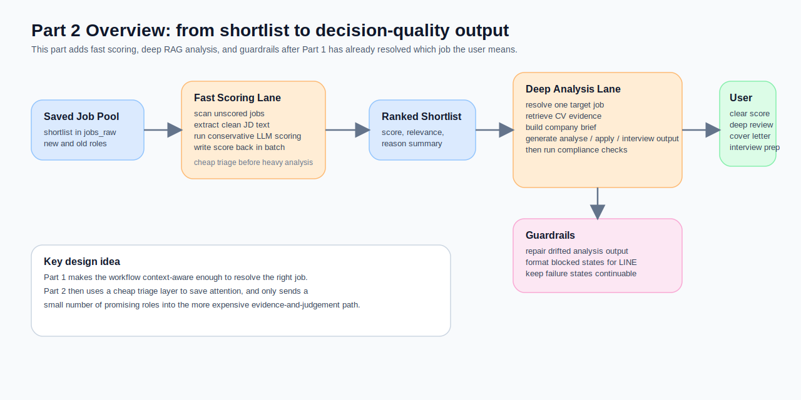
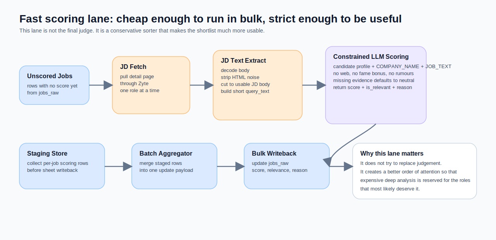
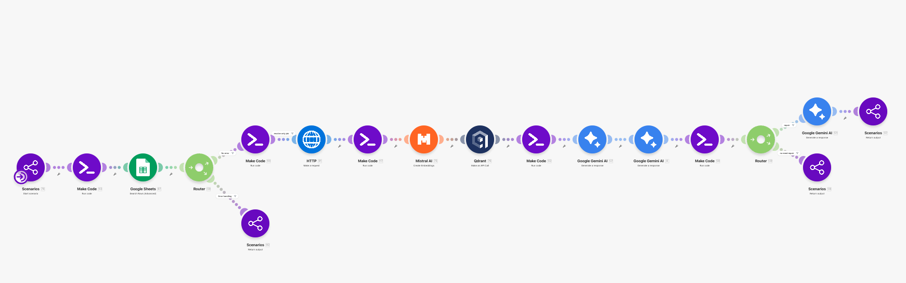
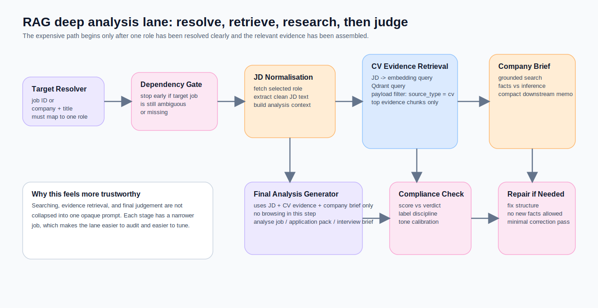

If Part 1 solved **which job the user is actually referring to**, Part 2 solves a different, more practical question: **is this job worth spending time on at all?**

Once I had the front door working properly, a new bottleneck showed up almost immediately.

Even if the system could already handle short follow-ups such as “the second one” or “help me analyse this one”, I still did not want to spend an entire evening on a dozen roles that merely looked plausible. The expensive part of job hunting is not sending the application. It is opening every JD, checking the company, comparing the role against your own trajectory, and deciding whether the opportunity deserves real effort.

That is why this series had to become two parts.

- **Part 1** solves how the workflow figures out which role you mean.
- **Part 2** solves what happens after the target job has already been resolved: how the system triages quickly, then turns a smaller set of promising roles into decision-quality material.

If you have not read Part 1 yet, start there first. Everything in this article assumes that the workflow already knows the `task_type`, the `target_job_id`, the `route_type`, and whether clarification is still pending.

## The workload Part 2 is actually trying to solve

When I started looking for roles again, the thing I most wanted to protect was not five minutes of application time. It was my attention.

A lot of jobs look acceptable at first glance. The title sounds close enough. The domain is interesting enough. Sometimes the brand is even attractive. But the moment you properly read the JD, look into the product, compare your experience, and think through how you would position yourself, you realise that the scarce resource is not information. It is focus.

So Part 2 is not trying to build a black-box agent that fires off applications on my behalf. It does something more useful and much more realistic:

1. **use fast scoring to shrink the sea into a pond**
2. **use RAG-based deep analysis to turn a few shortlisted roles into evidence-led judgement**

There is one principle underneath both steps that I ended up trusting more and more:

> **not every job deserves heavyweight analysis**
>
> If you can use a cheap, conservative, well-bounded triage layer to push obvious mismatches down the queue, you preserve both compute and human attention for the roles that genuinely justify deeper work.

## Part 2 component map

This article continues the series numbering from Part 1 and starts at `JA-22`.

| ID | Component name | What it does |
|---|---|---|
| JA-22 | Unscored Job Scanner | Pulls jobs from `jobs_raw` that still do not have a score. |
| JA-23 | Scoring Batch Gate | Ends cleanly when there is nothing new to score. |
| JA-24 | JD Fetcher | Retrieves each job detail page. |
| JA-25 | JD Text Extractor | Turns raw HTML into clean job-description text and a retrieval-ready summary. |
| JA-26 | Fast Scoring Prompt Runner | Uses a tightly bounded LLM prompt for quick fit scoring. |
| JA-27 | Score Staging Store | Stages per-job scoring outputs before writeback. |
| JA-28 | Bulk Score Sheet Updater | Writes score, relevance, and reason back to `jobs_raw` in batch. |
| JA-29 | Analysis Request Resolver | Resolves which single role should enter the deep-analysis path. |
| JA-30 | Single-Job Dependency Gate | Blocks the lane early if the target job is still ambiguous. |
| JA-31 | Job Detail Fetcher | Pulls the selected role’s detail page for deeper analysis. |
| JA-32 | JD & Context Normaliser | Extracts usable JD text and builds the analysis context. |
| JA-33 | CV Query Embedder | Converts the JD into an embedding query. |
| JA-34 | CV Evidence Retriever | Retrieves the most relevant CV evidence chunks from Qdrant. |
| JA-35 | Analysis Prompt Composer | Assembles JD text, CV evidence, user intent, and task-specific rules. |
| JA-36 | Company Research Briefer | Produces a compact external company brief with strict fact-vs-inference discipline. |
| JA-37 | Final Analysis Generator | Produces `analyze_job`, application-pack, or interview-prep output. |
| JA-38 | Output Compliance Checker | Checks format, evidence labels, and score-to-verdict calibration. |
| JA-39 | Output Repairer | Repairs non-compliant analysis output without inventing new facts. |
| JA-40 | Structured Error Formatter | Converts blocked states into LINE-safe, continuation-friendly messages. |

## Why this is the point where I *do* let the LLM in

In Part 1, I was very deliberate about *not* using an LLM as the main intake layer, because that part of the system needed to be reproducible, inspectable, and easy to patch.

Part 2 is different.

By the time the workflow reaches this stage, it is no longer trying to decide *which role the user means*. It is doing a different kind of job: **judgement and compression inside a clearly bounded evidence set**.

That is exactly why I am comfortable letting the model do more here. The problem is no longer state resolution. It is something closer to this:

- how well does this JD genuinely fit my long-term direction
- is this role attractive in substance, or just attractive in title
- which gaps are learnable, and which ones are real shortlist risks
- if I do apply, how should I position my experience credibly

If you try to force all of that through a purely rule-based flow, the result often becomes brittle and fragmented. A model can do this sort of evaluative work rather naturally, provided the inputs are bounded, the output is disciplined, and the guardrails are explicit.

## Stage one: fast scoring is not the final answer, it is a time-saving triage layer

If I had to summarise `JA-22` to `JA-28` in one line, it would be this:

> **use a cheap, conservative, batchable scoring layer to give the shortlist a useful order before any expensive analysis begins**

The lane starts in a very practical place. It does not begin with a chat message. It begins by scanning `jobs_raw` for roles that still do not have a score. In other words, Part 1 gets recent jobs into the system; Part 2 turns that raw intake into something closer to a usable shortlist.

### The design principles behind the fast scorer

What I like most about this blueprint is that it does not interpret “fast” as “loose”. In fact, the scoring layer is carefully restrained.

First, the evidence boundary is strict.

The scoring prompt in `JA-26` only allows three inputs: a fixed candidate profile, `COMPANY_NAME`, and cleaned `JOB_TEXT`. It cannot browse the web, cannot use company fame, cannot rely on vague prior impressions, and cannot smuggle reputation in through the back door. If the JD does not support a claim, the model is meant to stay conservative.

Secondly, uncertainty defaults to neutral rather than optimistic.

For areas such as company quality, culture, visa support, and compensation, the prompt explicitly tells the model to default to a neutral middle position when the JD does not provide enough evidence. That is a small instruction, but it changes the personality of the system. It stops the scorer from becoming a rationalisation engine.

Thirdly, it scores the role content, not the title.

One of the smartest guardrails in the prompt is this: **a product-sounding title does not automatically make it a product role**. If the work is really sales, business development, or account management with a nicer label, the role should not be rescued by branding. In the job market, titles are often the most misleading part of the entire posting.

Fourthly, the output stays intentionally narrow.

The scorer does not produce an essay. It returns four fields only: `score`, `is_relevant`, `relevant_reason`, and `status`. That is the right design choice. A triage layer is meant to sort, not to debate every role for five paragraphs.

Fifthly, the writeback is batched rather than noisy.

Instead of updating the sheet row by row as soon as each role is scored, the lane stages the results in a datastore first, aggregates them, and then writes them back to `jobs_raw` in one go. That makes the whole lane feel like a proper batch operation rather than a spreadsheet tap-dance.

### Why I only describe the scorer at the principle level

You explicitly asked for the fast-scoring section to stay at the principle layer, and I think that is the right call.

Because the interesting part is not the literal formula. It is the **posture** of the scorer:

- it is conservative rather than enthusiastic
- it optimises for downside protection rather than for finding excuses to apply
- it exists to order attention, not to replace human judgement

The biggest failure mode for a fast scorer is not that it occasionally undersells a decent role. The bigger failure mode is that it pushes too many merely plausible jobs into the expensive downstream path. Once that happens, every later step burns more compute and more human focus than it should.

So from a product point of view, the real value of fast scoring is not that it sounds clever. It is that it helps me **avoid doing deep work on jobs that never deserved it in the first place**.

## Stage two: RAG deep analysis is not “more context”, it is better-shaped evidence

If the fast scorer solves “please do not waste an evening on the wrong role”, the RAG lane solves a more specific question:

> **once a single job actually deserves attention, how do you assemble the evidence into something fit for decision-making?**

This lane is more layered than it first appears. It is not simply a model call with a larger prompt. It is closer to a three-step orchestration.

### Step one: do not analyse anything until the target job is unique

`JA-29` and `JA-30` are easy to underestimate, but they are doing critical work.

They resolve the target role from `jobs_raw` by `target_job_id`, or by `target_company + target_title` when needed. If that resolution fails, or if there is not enough input to identify a single role, the lane blocks early with `missing_job_reference`. The deep-analysis path does not accept a vague target.

This connects directly back to Part 1. Part 1 resolves the conversational context; Part 2 adds a second dependency gate right before the expensive path begins. That may sound repetitive, but it is healthy. The more expensive the lane, the less it should rely on “this is probably the one”.

### Step two: prepare JD evidence and CV evidence before asking for judgement

`JA-31` to `JA-34` are the part of the system that most clearly deserves the RAG label.

The workflow fetches the detail page, converts the HTML into cleaner JD text, compresses that JD into a retrieval query, sends it through an embedding model, and uses the resulting vector to query Qdrant for the most relevant CV chunks. The Qdrant query also applies a payload filter so the retriever only brings back points where `source_type = cv`.

What matters here is not just that there is a vector database in the loop. What matters is the product decision underneath it:

> deep analysis does not need the whole CV. It needs **the parts of the CV that are most relevant to this specific JD**.

That is what makes RAG genuinely useful here. In the original RAG formulation, Lewis et al. argued for explicit retrieval precisely because parametric memory on its own is limited, difficult to update, and weak at grounded provenance. The point is not to stuff more text into the prompt. The point is to retrieve the right external evidence at the right moment.

### Step three: separate company research from final judgement

This is the design choice I most want readers to steal.

`JA-36` does **not** make the final decision. It first produces a compact company-research brief. That step uses grounded search, but the prompt is deliberately strict:

- source priority is explicit
- review evidence must be treated cautiously
- absence of evidence must not be converted into positive evidence
- verified facts and unverified inferences must be separated
- if no reliable review signal exists, the brief must say so plainly

In other words, this stage is not writing a glossy company profile. It is building a downstream evidence memo.

Then `JA-37`, the final analysis generator, is explicitly forbidden from browsing. It can only use three bounded inputs:

- the JD
- CV evidence excerpts
- the company-research brief

That split is elegant because it separates **searching** from **judging**.

If one model does both jobs in one step, it often ends up searching, guessing, and writing all at once. The output may look comprehensive, but it becomes much harder to tell which lines are grounded and which ones are interpretive drift. Splitting the stages creates a cleaner evidence chain.

### What the deep-analysis lane is really buying you

`JA-37` supports three downstream tasks:

- `analyze_job`
- `generate_application_pack`
- `prepare_interview_brief`

I think it makes sense to keep all three on the same RAG backbone. They do not share the same final format, but they *do* share the same upstream asset:

> **one resolved target job, one cleaned JD, one curated set of CV evidence, and one compact set of company signals**

That is why I think of it as an **analysis packet**. For the model, the expensive part is not the final wording. The expensive part is building a trustworthy packet in the first place. Once that packet exists, a go/no-go analysis, an application pack, and an interview brief become different task templates sitting on top of the same preparation layer.

## Why this RAG lane still adds an output checker afterwards

A lot of implementations would stop here. The model produces a structured analysis, it looks sensible, and the system sends it straight back.

This blueprint does not stop there, and I think that extra step matters.

`JA-38` is not judging whether the content sounds polished. It checks something more operational: **does the output actually obey the formatting, evidence-labelling, and calibration rules it was supposed to obey?**

For example:

- does the score align with the verdict
- are evidence labels mixed incorrectly
- is the tone too optimistic for a 55–69 result
- does the company-research section only use the allowed labels

If the answer is no, `JA-39` does not fetch new evidence and does not search again. It runs a narrow repair pass instead. It is allowed to rewrite bullets, tighten wording, fix labels, and repair calibration, but **it is not allowed to invent new facts**.

This effectively treats generation as a step that deserves its own QA fixture afterwards. It acknowledges a very practical truth: even well-prompted model outputs can drift on format and calibration. Rather than pretending that one prompt will always solve this, the workflow places a repair rail behind the generator. In practice, that is often far more robust than endlessly inflating the prompt itself.

## Stage three, deliberately shorter: error handling is not the star, but it decides whether the tool feels usable

You asked Part 2 to focus on fast scoring and deep RAG analysis, and I agree. So the error-handling layer gets one section rather than half the article.

Even so, it is the floorboards of the whole system. You do not notice them when they work. You notice them the second they fail.

`JA-40` does not throw raw exception text back into LINE. It turns `blocked_reason`, `error_message`, and `clarification_context` into messages that a person can actually continue from.

For example:

- `missing_job_reference` → ask the user to reply with a job ID
- `invalid_candidate_selection` → show a candidate list and accept job ID, ordinal, or title keyword
- LINE length overflow → truncate safely and keep a clear notice

That matters because it reframes many “errors” as something more product-like:

in a conversational workflow, a lot of failures are not system failures at all. They are simply **states that still need one more user turn**.

When the error layer communicates that cleanly, the tool feels dramatically more trustworthy.

## One counterexample that matters: not every interesting role deserves RAG

If this article ended here, it would be very easy to flatten it into a slogan:

> score quickly, run RAG, generate a smarter answer

But the more honest version is this: **not every role that looks interesting deserves to enter the heavy lane at all**.

If the fast scorer already shows a clear mismatch, such as:

- the title sounds right but the real job is sales or BD-heavy
- the missing gap is a hard domain requirement rather than something wording can rescue
- visa, location, or eligibility introduces an obvious blocker
- the JD itself is too thin to support a serious read

then the best system behaviour is often not “analyse more deeply”. It is “stop earlier”.

That is why I wanted Part 2 to revolve around this line:

> **Part 1 solves which job the user means. Part 2 solves whether that job deserves the investment.**

The key word there is not *deeper*. It is *better targeted*.

## The one sentence I want this article to leave behind

If I had to compress Part 2 into a single sentence, it would be this:

> **A good job agent does not turn every role into a long report. It uses a cheap, conservative triage layer to earn the right to spend deeper analysis on the few roles that genuinely deserve it.**

Part 1 fixes the front door so the workflow stops treating every message as a fresh webhook event.

Part 2 fixes the back half so the system does not merely collect data. It begins to do something closer to decision support:

- sort first
- organise evidence next
- generate only at the end

For me, that is the point where the whole tool starts to feel agent-like.

Not because it says more, but because it finally helps me **avoid paying the full cost of attention too early, and on the wrong opportunities**.

