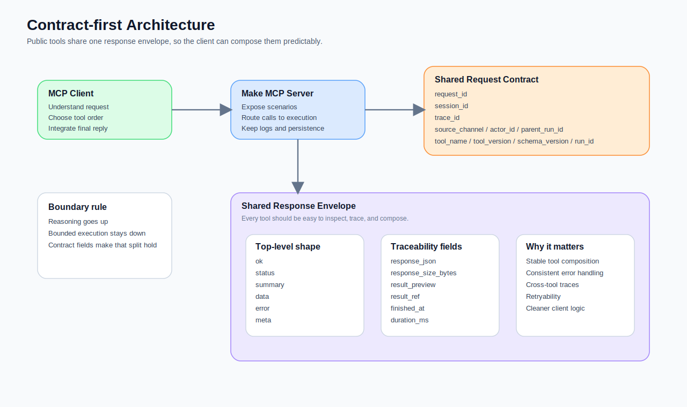
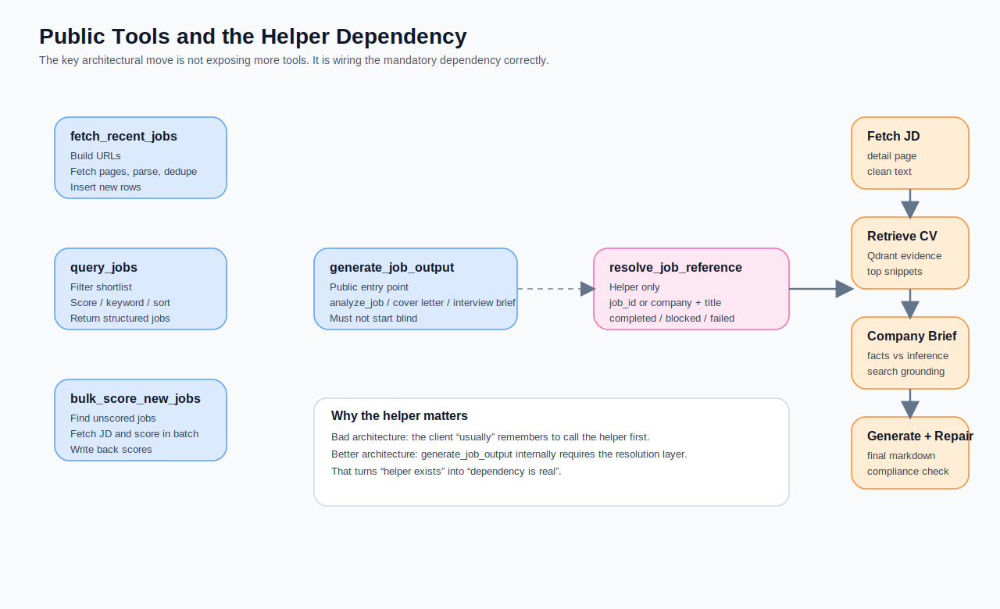
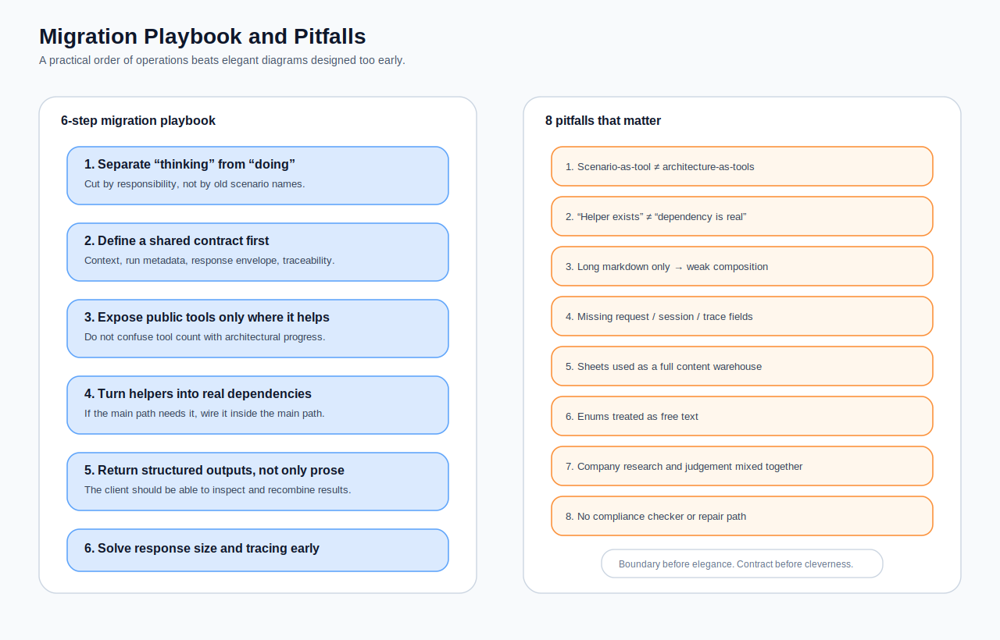

我前面那套 job agent，原本是很典型的 Make-first 設計。

先有一條能跑的 workflow。  
再把 intake 做進去。  
再加 router。  
再補 scoring、RAG、error formatting。  
最後它看起來已經很像 agent，甚至也真的能用。

但做久了，我越來越清楚一件事：**它的問題不是功能不夠，而是腦放錯地方。**

一旦你想把整套系統升級成 **ChatGPT 作為主腦，Make MCP server 作為 execution layer**，舊設計裡那些原本還勉強能忍的模糊地帶，就會一次全部浮上來：

- 誰負責理解使用者在說什麼？
- 誰負責決定先查、先評分、還是先分析？
- 誰負責對使用者說話？
- 誰負責讀寫資料、跑批次、打分、產出結果？
- 哪些欄位是 run log，哪些其實是 planner state？

這篇文章要談的，不是「怎麼把 Make 接上 MCP」而已。  
真正的重點是：**怎麼把一套原本靠流程圖硬撐 orchestration 的系統，重構成一組有明確責任邊界、可被 ChatGPT 穩定調用的 tools。**

如果要把整段遷移濃縮成一句話，那會是：

> **把 scenario 暴露成 tools，不代表你完成了 MCP 化。真正的遷移，是把系統從流程導向，改造成契約導向。**

## 這篇文章到底要解什麼問題

我會做這個 v2，不是因為 v1 不能跑，而是因為 v1 跑到某個階段之後，開始出現一種很明顯的「混種生物感」。

在 v1 裡，Make 同時扮演了太多角色：

- transport adapter  
- intake / semantic parser  
- router / orchestration layer  
- tool executor  
- user-facing reply formatter  
- state machine  
- run logger

這在 workflow 還小的時候很方便。  
但一旦你把 ChatGPT 接進來，這種設計就會開始互相打架。

因為 ChatGPT 天生比較適合做的是：

- 理解使用者的自然語言
- 選工具
- 決定工具呼叫順序
- 在不確定時追問
- 把工具結果整合成自然語言答案

而 Make 比較適合做的是：

- deterministic execution
- 對資料源讀寫
- 批次處理
- 結構化轉換
- logging / persistence
- 背景作業

所以 v2 的核心，其實不是「功能更多」，而是**責任切乾淨**。

## 我這次留下來的原創判準

如果前兩篇比較像「怎麼把 workflow 做得更像 agent」，那這篇我最想留下來的一個原創貢獻，是這條很務實的遷移判準：

> **任何一步，只要它的主要工作是理解使用者語意、決定下一步、或組最終回覆，它就應該往 client side 上移。**  
> **任何一步，只要它能被描述成一個有穩定輸入輸出、可重跑、可觀測的 side-effect 或 bounded transformation，它就應該留在 Make。**

我後來會一直用這條判準來切 v1 和 v2 的邊界。

這也讓我少掉很多不必要的抽象爭論，例如：

- 「這個 scenario 到底算不算 agent？」
- 「要不要把 router 也變成 tool？」
- 「是不是 helper 也都應該公開成 tool？」

很多問題只要改成問：

> 這一步是在做 reasoning，還是在做 bounded execution？

答案就會清楚很多。

## 先看舊世界：v1 到底卡在哪裡

v1 並不差。它甚至已經有不少很好的設計：

- 用 `history_context` 做 continuation resolution
- 把 `result_json` 壓成 compact memory capsule
- 讓 `query_jobs`、`analyze_job`、`generate_application_pack` 這些 lane 各自有清楚職責
- 在 error formatting 裡做 structured clarification，而不是只回 generic fallback

但當你把 ChatGPT 放進來之後，v1 有三個結構性瓶頸會變得非常明顯。

### 1. 推理還是被鎖在流程圖裡

v1 雖然已經很重視 intake，但語意判斷、continuation、route selection、甚至部分 fallback 邏輯，仍然留在 Make 裡。

這代表真正的 planner 其實不是 ChatGPT，而是 scenario filters、task tables 和 router 分支。

這樣的系統可以用，但它有一個很大的代價：  
**你表面上有 LLM 主腦，實際上還是流程圖在偷偷主導決策。**

### 2. user-facing 文案還留在 execution layer

v1 的 error formatter 很有產品感，但它仍然是 Make 在直接對使用者說話。

這會造成一個很尷尬的結果：  
ChatGPT 明明是主腦，最後使用者卻常常看到的是 workflow 節點吐出的句子，而不是模型根據工具結果整合出來的回覆。

### 3. planner state 和 run log 混在一起

v1 的 `agent_tasks` 在那個階段是合理的，因為它既是 task queue，也是下一輪的記憶來源。

但到了 MCP world，這兩件事就該拆開來看了：

- 這次工具執行了什麼
- 下一步應該怎麼做

前者是 **run log**。  
後者是 **client-side reasoning**。

如果這兩者還繼續混在 Make 裡，後面就很容易變成：

- logs 有很多欄位，但對 client 不夠有用
- tools 雖然能跑，但不容易穩定組合
- helper 雖然存在，但主流程不一定真的依賴它

## v2 真正改掉的，不是入口，而是責任模型

v2 我沒有把整套系統重寫成另一種框架。  
我做的是比較克制，但也比較痛的一種重構：**把舊系統裡的腦拆出去，把 execution 留下來。**

現在的分工比較像這樣：

### ChatGPT / MCP client 負責

- 讀懂使用者想做什麼
- 選 public tools
- 決定工具呼叫順序
- 決定是否先 query 再 generate
- 決定是否先 fetch 再 bulk score
- 把 tool results 整合成最後對話

### Make MCP server + scenarios 負責

- 提供 discoverable tools
- 做 deterministic execution
- 跑 scraping / querying / scoring / generation
- 對 Google Sheets、Qdrant、Zyte、Gemini 這些外部系統做 bounded integration
- 回傳有清楚 contract 的 structured result
- 寫 run logs 與 persistence

這裡最重要的一個改變是：

> **Make 不再負責假裝自己是 planner。**  
> **它只負責把每一段能力做成一把 contract 清楚的工具。**

## 這次重構後，我留下來的工具地圖

這次 v2 我沒有沿用舊的 scenario ID，也不直接用 Make 的模組編號。我改成按讀者理解順序整理過的一套命名。

### v2 tool map

| ID | 工具名稱 | 類型 | 作用 |
|---|---|---|---|
| V2-01 | MCP Client Planner | architecture role | 由 ChatGPT 理解需求、選工具、整合結果。 |
| V2-02 | Make MCP Server Bridge | architecture role | 把 active + on-demand scenarios 暴露成 MCP tools。 |
| V2-03 | Recent Job Fetch Tool | public tool | 抓最近職缺、解析、去重、寫回 `jobs_raw`。 |
| V2-04 | Job Query Tool | public tool | 查本地職缺池，支援 days / score / keyword / sorting。 |
| V2-05 | Bulk Scoring Tool | public tool | 對未評分職缺做批次快速評分。 |
| V2-06 | Resolve Job Reference Helper | helper tool | 將 job id / company + title resolve 成唯一 job。 |
| V2-07 | Generate Job Output Tool | public tool | 在 resolve 成功後做深度分析、產出 cover letter 或 interview brief。 |
| V2-08 | Tool Run Logger | internal pattern | 用統一欄位記錄每次 tool run 的輸入、摘要、錯誤與 meta。 |

完整命名表我放在 `./resource/component-index.md`。

## Phase 1：不是先工具化，而是先把 contract 定下來

這次重構最關鍵的一步，不是把 scenario 改名，而是先把它們的共同 contract 做出來。

你如果看這五份 v2 blueprint，會發現它們幾乎都有一層很像的前置 code block：

- 驗證 `request_id`
- 驗證 `session_id`
- 驗證 `trace_id`
- 補 `source_channel`
- 補 `actor_id`
- 補 `parent_run_id`
- 產生 `run_id`
- 設定 `tool_name`
- 設定 `tool_version`
- 設定 `schema_version`
- 存 `started_at`
- 統一處理 `context_error_code` / `context_error_message`。fileciteturn18file1turn18file2turn16file3turn16file10turn16file2

這件事看起來很 boring，但它其實是整次遷移的地基。

因為只要沒有這層 contract，後面就會很容易變成：

- 每把 tool 自己長成不同形狀
- client 很難穩定推斷錯誤類型
- logs 難以串 trace
- helper 和 public tool 的輸出不容易被組合

### 我最後固定下來的最小契約

#### 請求層

- `request_id`
- `session_id`
- `trace_id`
- `source_channel`
- `actor_id`
- `parent_run_id`

#### 執行層

- `tool_name`
- `tool_version`
- `schema_version`
- `run_id`
- `started_at`

#### 回應層

- `ok`
- `status`
- `summary`
- `data`
- `error`
- `meta`

#### 追蹤層

- `response_json`
- `response_size_bytes`
- `result_preview`
- `result_ref`
- `finished_at`
- `duration_ms`

這也是為什麼我後來會把這次重構叫做「從工具化走向契約化」。  
因為只有當每一把工具都先認同同一張契約，MCP client 才真的有機會把它們當作一組可組合的能力，而不是五個各說各話的小流程。

## Phase 2：public tool 和 helper 要分清楚，否則架構會長歪

這次 v2 裡，我刻意把 `v2_helper_resolve_job_reference` 做成 **helper**，而不是 public tool。它會驗證 request context、嘗試從 `target_job_id` 或 `user_message_raw` 抽 job id，或者用 `target_company + target_title` 查 `jobs_raw`，最後回傳 `completed`、`blocked` 或 `failed` 狀態。它本身還標了 `is_public_tool: false`。fileciteturn18file1turn20file0

這個 distinction 很重要，因為它幫我避開了一個很常見的誤區：

> **helper 被暴露成另一把工具，不代表架構已經接好。**

如果 `generate_job_output` 只是「有機會先叫 helper」，那正確性其實還是建立在 client 這次剛好有沒有先選對順序。這不夠穩。

真正重要的是：  
**主工具內部要真的依賴 helper。**

而 v2 的 `v2_tool_generate_job_output` 就是這樣做的。它先正規化 `task_type`，驗證只允許 `analyze_job`、`generate_application_pack`、`prepare_interview_brief` 這幾種任務，再直接 call subscenario 去跑 `v2_helper_resolve_job_reference`。只有 resolve 成功，後面才會繼續往 JD、Qdrant、company research、generation 走。fileciteturn16file2turn19file17turn20file12

這裡我後來留下來的一條踩坑原則是：

> **helper 要嘛是主流程的必要依賴，要嘛就只是 debug tool。**  
> **最糟糕的狀態，是它表面上存在，但主流程其實沒有真正依賴它。**

## 五把主要工具，各自解決什麼

### V2-03 Recent Job Fetch Tool

這把工具的任務是把最近職缺抓進本地池，但它做的不是單純的 scraper。

它會先做參數標準化，例如：

- `source_site`
- `role_keyword`
- `days`
- `page_from`
- `page_to`

接著生成一串 JobStreet search result URLs，再逐頁抓取、抽出 job cards、排掉明顯不合格的 rows、和既有 `jobs_raw` 做 dedup，最後回傳 inserted jobs 與 diagnostic。它還會產出一個 **responseLite**，只保留摘要欄位與少量 preview，避免單一儲存格爆掉。fileciteturn16file10turn20file7turn20file9

這條線很適合留在 Make，因為它本質上就是：

- deterministic scraping
- bounded parsing
- write-side effect
- result summarisation

這種工作很明確，不需要 client 幫它思考。

### V2-04 Job Query Tool

這把工具的價值在於：把「查 shortlist」這件事變成一把真正好用的 MCP tool，而不是一條舊式 router lane。

它支援：

- `days`
- `job_status_filter`
- `min_score`
- `keyword_query`
- `top_k`
- `sort_by`
- `sort_order`

而且它不是只吃一種 rigid naming，還接受 alias，像 `topK`、`sortBy`、`score_threshold` 這些也都能被收斂進同一張 query spec。它還會依查詢條件自動決定比較合理的排序，例如有 ranking signal 時預設偏 `score`，否則偏 `posted_at`。最後回傳的不是人看的大段文字，而是有 `jobs`、`count`、`relevant_count`、`primary_job_id`、`job_ids` 的 structured response。fileciteturn18file2turn19file8

這一點在 MCP world 很重要，因為 query tool 的工作不是「自己講漂亮話」，而是回給 client 一個容易再組合的結果。

### V2-05 Bulk Scoring Tool

這把工具延續了 Part 2 的快速評分邏輯，但它現在不再是 chat workflow 裡的一條隱藏 lane，而是一把清楚的 public tool。

它會先依 `target_job_id` 和 `force_rescore` 組出 Google query，找出要評分的 rows。若沒有目標 job，就預設處理所有尚未評分、且有 `detail_url` 的職缺。fileciteturn16file3turn16file7

接著它逐筆抓 detail page、抽 JD text，還會順手產生一段 retrieval query text，目的是把最相關的 candidate profile / scoring rubric / CV evidence 召回來，讓後面的 scoring prompt 不只是盯著職稱看。fileciteturn20file3

我很喜歡它最後的回應仍然維持很窄：

- `scored_count`
- `primary_job_id`
- `jobs`
- `summary`

這讓它很像一個真正的 execution tool，而不是偷偷想當 decision narrator。

### V2-06 Resolve Job Reference Helper

這把 helper 我前面已經提過，但它的存在其實還有另一個教學價值：

它示範了什麼叫做**把 reference resolution 從聊天邏輯抽成一個獨立能力**。

你不管是給它：

- `target_job_id`
- `user_message_raw`
- `target_company + target_title`

它都會先轉成一張 bounded query，再對 `jobs_raw` 做 resolve。如果 context 不完整，它也不會繼續亂猜，而是回 `INVALID_REQUEST_CONTEXT` 或 `MISSING_JOB_REFERENCE` 這類明確錯誤。fileciteturn18file1turn20file0

這讓 client side 可以清楚知道：這次失敗是因為 reference 沒解開，不是因為 generation 模型失常。

### V2-07 Generate Job Output Tool

這把工具是整個 v2 最有份量的一把。

它不是只做一件事，而是把一整條 expensive pipeline 包成一把高價值工具：

1. 驗證 request context  
2. 正規化 `task_type` alias  
3. 內部呼叫 resolve helper  
4. 若 resolve 失敗，直接回 blocked / failed  
5. 抓單一 job 的 JD  
6. 抽取 JD text  
7. 召回 CV evidence  
8. 生成 company research brief  
9. 組 final analysis prompt  
10. 產出 `analyze_job` / cover letter / interview brief  
11. 檢查格式與 score calibration  
12. 必要時做 repair  
13. 回傳 `output_markdown`、`analysis_structured`、`must_preserve` 與 `final_user_answer_markdown`。fileciteturn20file1turn20file12turn19file12turn20file14turn19file16

我認為它最值得學的，不是「做很多事」，而是它知道**哪些事情必須先後拆開**：

- resolve 和 generation 要拆開
- company research 和 final judgment 要拆開
- raw markdown 和 structured extraction 要同時保留
- final output 和 repair 要拆開

這些拆法都會讓後面的 client 更穩定。

## 這次最值得記下來的 8 個踩坑

這部分我刻意寫得比較直接，因為這些坑如果不記，之後很容易再踩一次。

### 坑 1：scenario-as-tool，不等於 architecture-as-tools

把舊 scenario 改名成 tool，入口換成 MCP，這只是第一步。  
如果背後的責任邏輯沒重切，你得到的只是「MCP 外皮 + 舊 router 腦」。

### 坑 2：helper 被呼叫過，不等於依賴已建立

如果主流程沒有**內建**先 resolve reference 的 dependency，而只是希望 client 先叫 helper，那正確性最後還是在賭模型這次的 tool choice。這很不專業。

### 坑 3：只回長文，不回 structured result

如果 tool 只回一篇長篇 markdown，client 很快就會失去再組合的能力。  
所以我現在會要求重要工具至少回：

- `summary`
- `data`
- `error`
- `meta`

而不只是一坨 body text。`query_jobs`、`bulk_score_new_jobs`、`generate_job_output` 都是這樣做的。fileciteturn19file8turn19file4turn20file13

### 坑 4：上下文字段不統一，trace 很快就斷掉

`request_id`、`session_id`、`trace_id` 這三個欄位一開始看起來很多餘，但只要少一個，後面你要串 run logs、查某次 tool failure、追子流程 call chain，都會很痛。這也是為什麼 v2 幾乎每把工具一開始都先驗這三個欄位。fileciteturn18file1turn18file2turn16file3turn16file10turn16file2

### 坑 5：Google Sheets 很方便，但不是全文倉庫

這一點我在 v1 就踩過，到了 v2 我直接把它制度化了。  
像 `fetch_recent_jobs` 就明確做了 lite response，只保留摘要、diagnostic 和 preview，避免 response 直接塞爆單一儲存格。fileciteturn20file7turn20file9

### 坑 6：enum 不該假裝成自由文字

`task_type`、`status`、`blocked_reason` 這些欄位，只要會被下游狀態機吃，就不應該讓模型自由發明。像 `generate_job_output` 先做 alias normalization，再收斂到允許集合，就是在處理這個問題。fileciteturn16file2turn16file4

### 坑 7：把 company research 和 final judgment 混在同一步，很容易讓證據鏈變髒

如果模型同時做搜尋、做整理、做最後建議，它會很容易在句子層級把 fact 和 inference 混在一起。拆成 research brief → final generator，會乾淨很多。fileciteturn19file18turn20file1

### 坑 8：你不能假設一次生成就會永遠合規

`generate_job_output` 後面再加一條 compliance checker + repair，不是多餘，而是對生成式系統誠實。  
如果分數和 verdict 對不起來、label 用錯、語氣太樂觀，系統就該修，而不是假裝 prompt 寫長一點就不會出事。fileciteturn20file15turn19file16

## 什麼情況下，不要急著做成這種 v2

這裡我也想刻意補一段反例，因為不是所有 Make workflow 都值得升級成這種 MCP execution engine。

### 不一定值得做 v2 的情況

- 你的流程其實只有一條固定 path
- 沒有多工具選擇問題
- 不需要讓模型自己決定先後順序
- 沒有多輪 reference resolution
- 使用者只會按鈕觸發，不會用自然語言來回互動
- 目前最大的瓶頸其實是資料品質，不是 orchestration

在這些情境下，簡單的 Make scenario，甚至加一點 LLM node，就可能已經夠了。  
如果硬做成 MCP，你很容易只是多了更多契約、更多 log、更多 maintenance，而沒有拿到對應價值。

所以我後來對這類遷移有一個比較務實的判斷：

> **先問自己，你缺的是更多工具，還是更清楚的責任邊界。**  
> **如果連邊界都還沒清楚，先不要急著 MCP 化。**

## 如果你也要從 Make-first 遷到 MCP，我建議照這個順序做

### Step 1. 先盤點哪些步驟本質上是在「想」，哪些是在「做」

這一步最重要。  
不要先從 scenario 名稱切，先從責任切。

### Step 2. 先定共用 contract，再切 public tools

沒有統一 contract，後面每一把 tool 都會變成特製接頭。

### Step 3. helper 和 public tool 分離

helper 可以存在，但一定要問自己：  
它是獨立能力，還是主流程必經 dependency？

### Step 4. 讓 public tool 回 structured response，不要只回長文

至少保留 `summary`、`data`、`error`、`meta`。

### Step 5. 把 user-facing reasoning 往 client 上移

Make 負責 execution。  
ChatGPT 負責對人說話、追問、整合與判斷。

### Step 6. 先處理 response size、traceability、retryability 這些 boring 的東西

真的上線後，這些才是每天會咬你的東西。

## 我最後最想留下來的一句話

如果前兩篇是「怎麼讓 Make workflow 長出 agent 感」，那這篇 v2 真正想說的是：

> **當 ChatGPT 成為主腦之後，Make 最有價值的角色，不是繼續假裝自己會想，而是把每一段 execution 能力做成一把契約清楚、邊界穩定、可觀測的工具。**

這也是我認為這次重構最值得記錄的地方。

系統真正變強的，不是因為 scenario 數量變多了。  
而是因為從這一刻開始：

- planner 和 executor 分開了
- helper 和 public tool 分清楚了
- run log 和 user reply 分開了
- 結果開始可以被穩定組合，而不是只能被某一條舊流程吃掉

這時候，整套系統才真的比較像一個可以演進的 execution layer，而不是一座越堆越高的流程迷宮。

---

## Notes

- 本文引用的官方文件、規格與工程文章，整理在 `./resource/references.md`。
- 完整工具命名表整理在 `./resource/component-index.md`。
