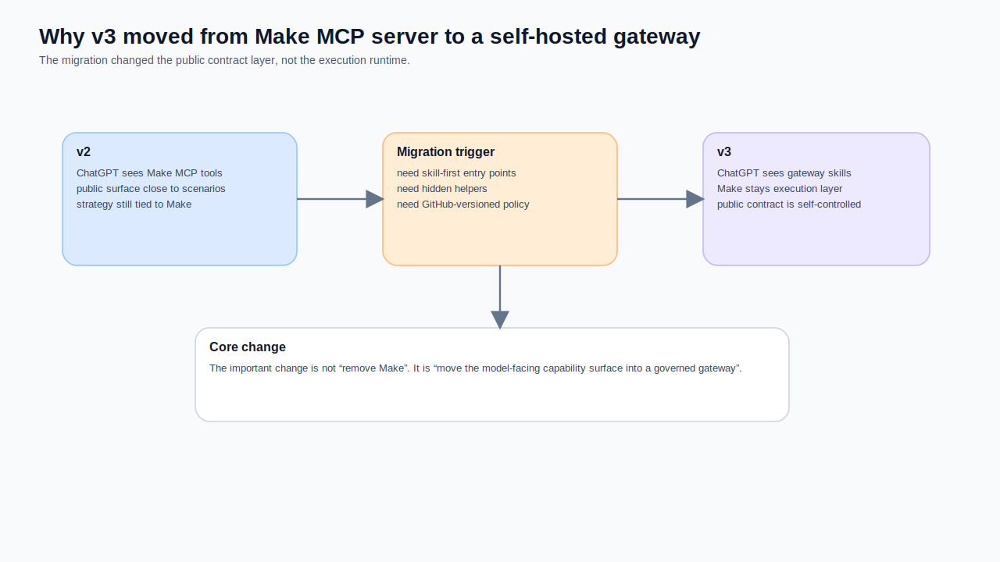
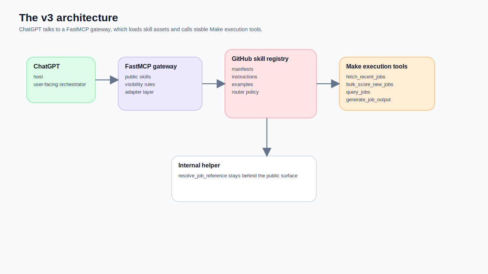
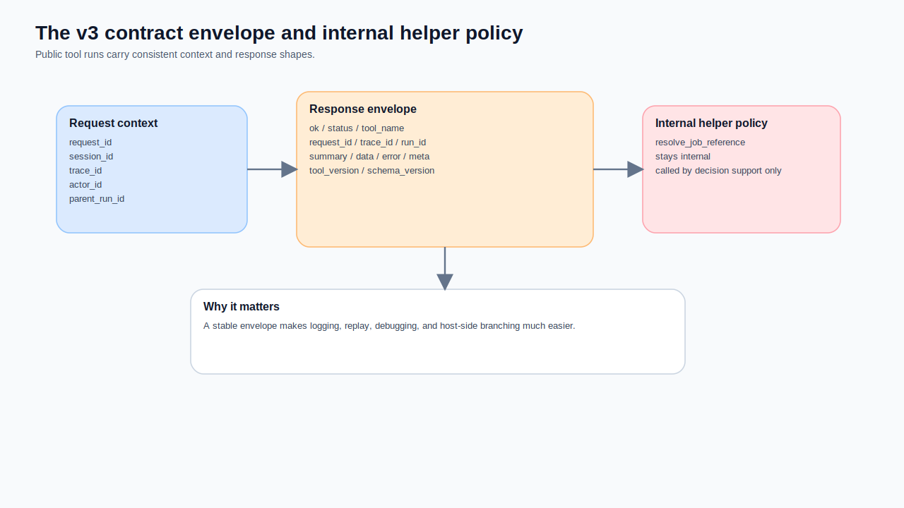
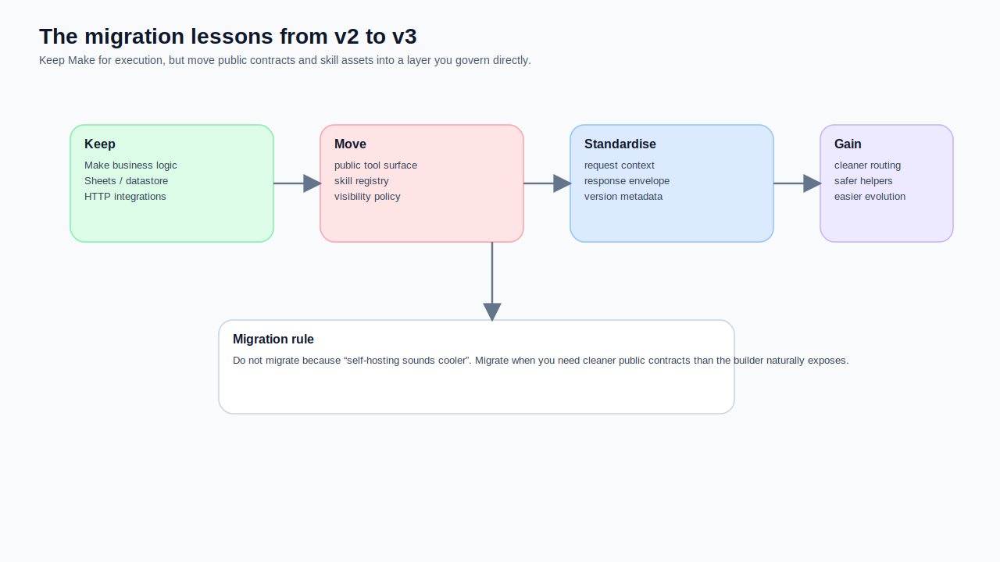

#AI代理工作流系列 5 — 為什麼我最後連 Make MCP server 也換掉，改成自己架 gateway server

**副標：v2 解決的是把 Make-first workflow 整理成比較像 execution engine。v3 則往前再走一步，把模型真正看到的能力表面，從 Make MCP server 換成自己掌控的 FastMCP skill gateway。**

我很喜歡 Make MCP server。

這句話不是客套。

從工程務實角度看，Make MCP server 真的解掉很多早期摩擦：
- 不用自己先養一台 server
- 可以把 scenario 直接變成可呼叫工具
- 有結構化輸入 / 輸出
- transport、token、scenario-as-tool 這些事情都有現成入口

如果你的目標是：
> **先讓既有 workflow 能被外部模型安全呼叫**

那 Make MCP server 很有價值。

但我最後還是把它換掉了。

不是因為 Make 不夠強，而是因為我的下一個問題，已經不是「怎麼把 scenario 變成 tool」，而是：

> **怎麼讓 ChatGPT 看到的是 skill-level capabilities，而不是離 execution layer 太近的工具表面？**

這就是 v3 的起點。



## 先講結論：我換掉的不是 Make，而是 Make 前面的 public contract layer

v3 最重要的變化，不是「Make 沒了」。

其實剛好相反。

Make 在 v3 仍然是執行層，而且還是非常重要的執行層。真正改變的是它前面那一層：

### v2 比較像這樣
```text
ChatGPT / external client
→ Make MCP server
→ Make scenarios
```

### v3 比較像這樣
```text
ChatGPT
→ FastMCP gateway on Oracle VM
→ GitHub skill registry
→ Make webhook tools
→ internal helper flows
```

也就是說，我不是把 Make 拔掉，而是把 **public capability surface** 從 Make MCP server 挪到自己控制的 gateway server。

## 為什麼 v2 不夠了

v2 其實已經把很多事情做對了。

我當時已經在做的事情包括：
- 把 Make blueprints 整理成較穩定的執行契約
- 明確區分查詢、抓取、評分、輸出生成
- 引入 request / session / trace 這種上下文欄位
- 把 helper 與 public tools 逐漸拆開

但當我真的開始把它接到 ChatGPT，問題就開始從「能不能跑」往「能力表面是否合適」移動。

### 問題 1：Make MCP server 暴露的是 scenario surface，不是 skill surface
Make 官方文件講得很清楚：Make MCP server 讓 AI 系統可以跑 scenario，甚至管理 Make 帳號中的元素；scenario inputs / outputs 會幫 AI 理解怎麼呼叫它。這在產品定位上非常合理。

但我的 job agent 並不是單純想把 scenario 暴露出去。

我更想要的是：
- `job_ingestion`
- `job_scoring`
- `job_querying`
- `job_decision_support`

也就是對使用者有語意邊界的 skill-level tools。

這兩者不是一樣的東西。

### 問題 2：我想把 helper、router policy、skill 資產藏在 Make 前面
我的 `job-skills-gateway` repo 本來就不是拿來取代 Make。README 和 architecture 文件都寫得很清楚：這個 repo 定義的是一層很薄的 skill layer，坐在 ChatGPT 和 Make execution flows 中間。它的目的是把原本的 Make blueprints 包成較高層的四個 skills，而不是讓 ChatGPT 直接看見每一條 raw flow。

這件事用 Make MCP server 不是做不到，但不夠自然。

因為我要管理的不只是：
- 哪些 scenario 可以被呼叫

我還要管理：
- 哪些是 public skill
- 哪些是 internal helper
- 哪些 backend tool 只允許某個 skill 使用
- skill 文案、manifest、examples、policy 怎麼跟 runtime 保持一致

### 問題 3：我想把版本化的策略層留在 GitHub，而不是埋在 Make 裡
v3 其中一個最重要的設計選擇，就是把這些東西版本化成 plain files：
- skill manifests
- instructions
- examples
- eval notes
- router policy
- contracts

這些資產非常適合放在 GitHub repo。

它們不適合被藏在一條條 Make scenario 裡，否則你每次改 skill 邊界，都像在 workflow builder 裡拿鑷子修文字與意圖。



## v3 的最終分層

我最後採用的分層非常簡單，但比 v2 乾淨很多。

### 第 1 層：ChatGPT
它是 host，也是對使用者說話的人。

### 第 2 層：FastMCP gateway
這層做的事很薄，但很關鍵：
- 載入 GitHub repo 裡的 skill 資產
- 只暴露 skill-level tools
- 讓 public surface 對模型比較友善
- 透過 adapter 去打 Make webhook tools

### 第 3 層：Make execution tools
在 Make 裡，我把真正穩定的執行入口整理成幾顆工具：
- `v3_tool_fetch_recent_jobs`
- `v3_tool_bulk_score_new_jobs`
- `v3_tool_query_jobs`
- `v3_tool_generate_job_output`
- internal helper: `v3_helper_resolve_job_reference`

### 第 4 層：內部資料與外部整合
- Google Sheets
- datastore
- HTTP 抓取
- LLM scoring / downstream generation
- 其他 integration

這樣切之後，ChatGPT 不再直接面對 Make scenario surface，而是面對一層我能清楚命名、控制、版本化的 gateway contract。

## Make 層在 v3 其實也一起被重構了

這篇如果只講 Oracle VM + FastMCP，是不完整的。

因為 v3 不是只有前面多了一層 gateway，Make 裡面的工具也一起被重構成比較適合被 gateway 呼叫的形狀。

### 1. public tools 改成 webhook 入口
在 v2，你會常看到 `StartSubscenario` 這種進入方式。到了 v3，公開的幾顆工具大多改成 `gateway:CustomWebHook` 當入口。

這個調整非常重要，因為它代表這些工具不再主要服務於「被 Make 內部 scenario 呼叫」，而是開始服務於「被 gateway 透過 HTTP 穩定觸發」。

### 2. request context 被制度化
v3 public tools 幾乎都把這些欄位拉成第一等公民：
- `request_id`
- `session_id`
- `trace_id`
- `source_channel`
- `actor_id`
- `parent_run_id`

這不是欄位潔癖。

這代表 v3 不再把每次呼叫當成一個孤立 webhook，而是把它視為有可追蹤上下文的 tool run。

### 3. response envelope 被標準化
這是 v3 我最喜歡的重構之一。

每顆 public tool 不再只回一坨「有資料就好」的結果，而是逐漸收斂到比較穩的 envelope：

```json
{
  "ok": true,
  "status": "completed",
  "tool_name": "v3_tool_query_jobs",
  "request_id": "...",
  "trace_id": "...",
  "run_id": "...",
  "summary": "...",
  "data": {},
  "error": null,
  "meta": {
    "session_id": "...",
    "source_channel": "chatgpt",
    "actor_id": "...",
    "parent_run_id": "...",
    "tool_version": "3.0.0",
    "schema_version": "2026-03-13.1"
  }
}
```

這種 envelope 的價值很高，因為 gateway 與 host 都更容易做：
- logging
- replay
- error branching
- summary-first UI
- version-aware debugging

### 4. helper 被留在內部，而不是硬公開
`v3_helper_resolve_job_reference` 這顆工具，我反而更確定它不應該直接讓 ChatGPT 看見。

因為它是很重要的**內部能力**，但不是一顆適合公開給使用者意圖層的 skill。



## 這也是我為什麼最後不想停在 Make MCP server

Make MCP server 的優點，其實也正是它對我這個案例的限制。

### 它的優點是什麼
- 快
- 不用自己養 remote server
- scenario 很容易變成 tool
- 對很多 workflow-first 場景超有用

### 但我這個案例真正要的是什麼
- public tools 不要太接近 raw execution
- helper 不要直接外露
- skills、policy、contracts 要在 GitHub 版本化
- gateway 要能自由決定公開哪些能力
- tool descriptions、schema、visibility 要由我這層統一管理

換句話說，我需要的不是「再多一個 MCP 入口」，而是：

> **一個我能把 public contract layer 做薄、做清楚、做可治理的 skill gateway。**

這就是 FastMCP gateway 真正補上的位置。

## 一個很實際的例子：為什麼 `job_scoring` 必須從 `job_ingestion` 裡拆出來

這件事其實很能代表 v3 的精神。

在 skill 層，我後來把能力拆成：
- `job_ingestion`
- `job_scoring`
- `job_querying`
- `job_decision_support`

其中 `job_scoring` 的存在非常關鍵。

因為使用者說：
> 幫我把沒打分的都打分

這件事不是 refresh，也不是 fetch。

如果 public surface 裡沒有一顆乾淨的 `job_scoring`，模型很容易把這個要求塞進 ingestion 路徑。這不是模型壞掉，而是能力表面在誤導它。

所以 v3 真正解的問題，不只是技術遷移，而是：

- skill-first boundary
- public vs internal capability split
- execution contract standardization
- runtime tool selection quality

## 我現在怎麼看 v2 與 v3 的關係

我不會把 v3 寫成「v2 錯了，所以我重做」。

我反而會這樣看：

### v2 解決的是
- 讓 Make-first workflow 長得比較像 execution engine
- 把 scenario 入口與 contract 想得更像 tool
- 開始把 planner 腦從 Make 裡拆出來

### v3 再往前走一步
- 把 public capability surface 從 Make MCP server 移到 self-hosted gateway
- 把 skill 資產放回 GitHub
- 把 helper / public / backend tools 分層做清楚
- 把 Make 留在幕後，專心當 execution runtime

也就是說，v3 不是否定 v2，而是把 v2 的 contract thinking 真正推到底。



## 我會留給自己的幾條遷移準則

### 準則 1：execution runtime 可以留在 Make，但 public contract 最好不要綁死在 Make surface

### 準則 2：先決定使用者該看見哪些能力，再決定 backend 怎麼拼

### 準則 3：helper 不是不能重要，只是重要不代表應該公開

### 準則 4：request context、response envelope、tool versioning，越早制度化越好

### 準則 5：如果你想要 skill-first 行為，strategy assets 就應該有自己的版本控制空間

## 最後一句話

我最後把 Make MCP server 換掉，不是因為它不好。

而是因為當系統進化到某個階段後，我真正需要控制的，已經不是「scenario 能不能被模型叫到」，而是：

> **模型最後到底看見了什麼能力表面，以及那個表面是不是足夠乾淨。**

v3 對我來說真正的改變，不是多了一台 Oracle VM，也不是多了一個 FastMCP server。

而是我終於把：
- **skills**
- **public contracts**
- **internal helpers**
- **Make execution tools**

這四層分乾淨了。

而一旦這四層分開，整個 job agent 才真正長成一套比較能演進的系統，而不是一團會跑、但越長越難管的工作流生物。
