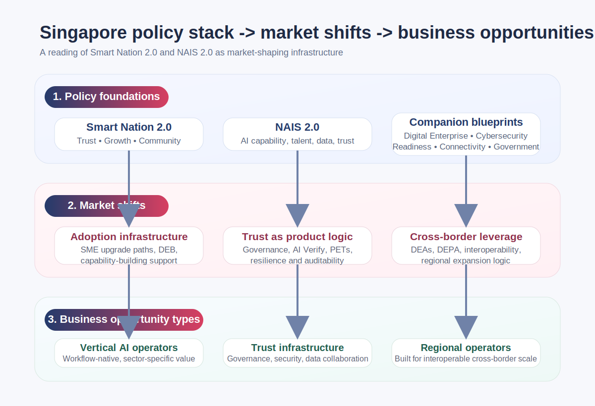

Some time ago, I was trying to do something fairly practical.

I wanted a handful of lines from Singapore’s policy documents that I could drop into a deck. The sort of lines that make the alignment obvious at a glance. Something neat, something usable, something that would save time when speaking to investors or potential partners.

Then I read the Smart Nation 2.0 page, the full Smart Nation 2.0 report, and National AI Strategy 2.0 back to back.

The feeling changed.

These are not just polished policy brochures cheering on the tech sector. They read more like an operating manual for the market. They are not only answering what the government wants to support. They are answering a deeper set of questions: which capabilities Singapore wants to turn into national infrastructure, which kinds of companies are more likely to emerge in that environment, and which business models become more viable once policy, talent, governance and cross-border rules start moving in the same direction.

My working view now is this: the next thing to watch in Singapore is not simply that there will be more AI companies. It is that the market is shifting from basic digitalisation toward AI adoption that is trustworthy, scalable and cross-border by design. That sounds like a semantic upgrade. It is not. It changes how products need to be built, how enterprises buy, and how start-ups should think about their wedge.

## This is not just more tech. It is deeper market design.

If you only skim Smart Nation 2.0, it is easy to file it under a familiar category: another national digital strategy, more investment in AI, more digital government, more support for SMEs.

The more interesting part sits one layer below that.

Smart Nation 2.0 is not framed around digitalisation for its own sake. It is organised around three outcomes: Trust, Growth and Community. National AI Strategy 2.0 then goes further down the stack, translating AI into industry capability, talent capability, infrastructure capability and governance capability.

That combination matters.

Singapore is not merely trying to produce a few flagship winners, nor is it simply encouraging businesses to experiment with new tools. It is trying to turn a set of growth-critical capabilities into things that can be widely adopted by companies, trusted by the market and supported by institutions.

In other words, policy is starting to behave more like infrastructure.

And once policy starts looking like infrastructure, the companies that benefit most are rarely the ones that shout the loudest about AI. They tend to be the ones that naturally fit into that infrastructure as an extension piece.

## The next opportunity is likely to show up first in the adoption layer, not necessarily the frontier layer

When people hear AI policy, the instinct is often to focus on models, compute, research labs, or whichever major firm is about to expand in the country.

All of that matters. NAIS 2.0 clearly talks about AI Centres of Excellence, research priorities, talent, compute and international collaboration.

But when you read it alongside Smart Nation 2.0, another signal becomes just as strong, perhaps stronger: Singapore cares a great deal about whether enterprises can actually use technology well, especially SMEs.

That is why things like SMEs Go Digital, CTO-as-a-Service, GoBusiness and the Digital Enterprise Blueprint matter as a group. On the surface they are separate initiatives. Commercially, they are all trying to solve the same bottleneck: the messy stretch between knowing transformation matters and actually adopting the tools, workflows and capabilities that make it real.

There is a practical lesson here for founders.

If you are building B2B AI or SaaS in Singapore, your edge will not come only from the product. It will also come from whether you can fit into the adoption pipeline. Are you legible to enterprises? Can you slot into the upgrade paths they are already being encouraged to take? Are you selling more than software, namely a package that is easier for an organisation to justify internally?

That is why I do not think the real opportunity is only about building better AI. It is about building AI that organisations can actually absorb.

For many start-ups, the real gap is not the model. It is the distribution layer. Singapore’s current policy direction is, in some cases, helping to build that layer as well.

## Trust is no longer a legal appendix. It is part of the product itself.

Another thing these documents share is a more mature understanding of trust than many markets still have.

Trust here does not just mean teaching citizens to avoid scams. It does not just mean cybersecurity awareness or one more compliance checklist. It is embedded in much more operational concerns: the resilience of critical digital infrastructure, incident response, AI testing and governance tools, privacy-enhancing technologies, and the alignment of cross-border data rules.

That leads to a structural commercial shift.

Products sold into enterprises, especially AI products, can no longer treat trust as a final-layer patch. It is becoming part of the product itself. If you do not have governance, verifiability, clear data boundaries and sufficient operational stability, you are not merely incomplete. You are harder to buy from in the first place.

A lot of teams still think of compliance as a brake. In an environment like Singapore’s, it feels closer to guardrails and load-bearing columns on a motorway. It does not slow you down by default. It makes speed possible.

I increasingly think about this in three layers.

The first is the baseline: security, access control, data governance, incident handling.

The second is the procurement signal: AI Verify, standardised testing, explainability, model processes that can be audited.

The third is the long-term moat: when others are still treating trust as documentation, you have already built it into the product and the day-to-day operation.

Those layers look similar from a distance. They are not the same thing.

## Cross-border data rules may become one of Singapore’s quietest business advantages

One section of Smart Nation 2.0 that I found particularly important was not about domestic digitalisation at all. It was about international interoperability.

Digital Economy Agreements, DEPA, AI governance alignment, baseline standards for cross-border data flows, taken together, point to something quite clear. Singapore does not just want to be a country that runs digital systems well at home. It wants to be a node in the rules of cross-border digital trade.

That matters a lot for regional companies.

Scale is not only a function of market size. It is also a function of institutional compatibility. If your product is designed from the start with credible positions on data access, cross-border movement, AI governance and verifiability, you are in a better place when you expand beyond one market.

I see this as a very Singaporean kind of leverage. It does not rely on a massive domestic market. It does not rely on protecting one national champion industry. It relies on rules, trust and interoperability to turn a relatively small market into a more powerful launchpad.

That also means cross-border compliance should not be treated only as friction. If handled well, it becomes product value.

## The thing worth watching is not subsidy. It is market shape.

If I put these documents together, I think Singapore is more likely to produce three kinds of companies over the next few years.

The first is the vertical company that embeds AI directly into an industry workflow.

Not AI as a demo. Not AI as a side feature. AI that changes how work gets done in a specific operating environment, improving productivity, decisions, service quality or revenue structure. Those companies are the most likely to benefit when policy, enterprise need and talent development start reinforcing one another.

The second is the company that productises trust, governance and data collaboration.

A lot of people still assume governance is mainly a concern for large organisations. These documents suggest otherwise. SMEs are clearly part of the picture. As smaller businesses are encouraged to adopt more digital and AI tools, whoever can make security, permissions, auditability, model risk and data sharing easier becomes more than a vendor. They become part of the trusted infrastructure.

The third is the company that designs regionally from day one.

Singapore is not really signalling, “The home market is large enough, build slowly here first.” It is signalling something closer to, “This is a reliable commercial and institutional starting point.” That is especially useful for teams that already know they are not building for one city or one country alone.

## Hospitality and services may be a more interesting wedge than people assume

If I apply this reading to hospitality and services, the opportunity looks more interesting than it might at first glance.

The reason is simple. Hospitality has always been digital, but often in a fragmented way. PMS in one place, POS somewhere else, marketing elsewhere, loyalty elsewhere again, and the OTAs sitting above or beside all of it. The data is fragmented, the economics are fragmented, and the guest relationship is often fragmented too. Independent operators are not unaware of the need to upgrade. Many simply do not have an upgrade path that is actually workable.

If Singapore is going to push enterprise AI adoption, trusted data use, PETs, cross-border digital rules and sector-level capability building, hospitality starts to look like fertile ground for a new kind of platform infrastructure. Not a single tool, but a layer that gives independent operators access to data collaboration, personalisation, yield improvement, risk controls and loyalty infrastructure that would be difficult to build alone.

From that angle, the opportunity in travel technology is not merely about better software. It is about a reallocation of industry power.

That is why models such as cross-hotel alliances, AI-driven loyalty infrastructure and regional platforms built on trust and data governance look far more aligned with Singapore’s policy direction than a generic reading might suggest.

## But this is not a subsidy fairy tale

That said, the easiest mistake is to read all of this as: if you align with policy, the business will follow.

It will not.

First, not every sector will benefit equally. The documents do encourage sector-specific approaches, but the sectors that receive meaningful amplification tend to be the ones that already have enough demand density, execution capability and usable data foundations.

Second, alignment is not product-market fit. A company can be perfectly aligned with a policy direction and still fail if the product does not solve an urgent buying problem, enter a real procurement flow, or produce measurable economic value.

Third, an environment like this often raises the bar rather than lowering it. Once trust, governance and resilience become part of the market expectation, the problems that teams used to postpone show up much earlier. It is no longer enough to build a convincing demo. You have to build something an organisation is prepared to wire into its actual operation.

So I would not read Singapore’s current direction as a subsidy story. I would read it as a shift in market shape. And when market shape changes, some companies suddenly fit the landscape much better than they used to.

## My conclusion

I started out wanting a few policy lines for a deck.

What I ended up with was a different commercial conclusion altogether.

Singapore is not only writing tech policy. It is designing the infrastructure for the next round of business formation.

For founders, the more useful question is probably not, “Is there policy support?”

It is this.

Is your company the sort of company this system actually welcomes?

Are you building something that fits a real adoption path?

Have you built trust into the skeleton of the product, rather than stapling it to the last page?

Are you merely selling features, or are you quietly becoming a missing piece of industry infrastructure?

If it is the latter, then the changes unfolding in Singapore may not be background noise.

They may be the tailwind.
