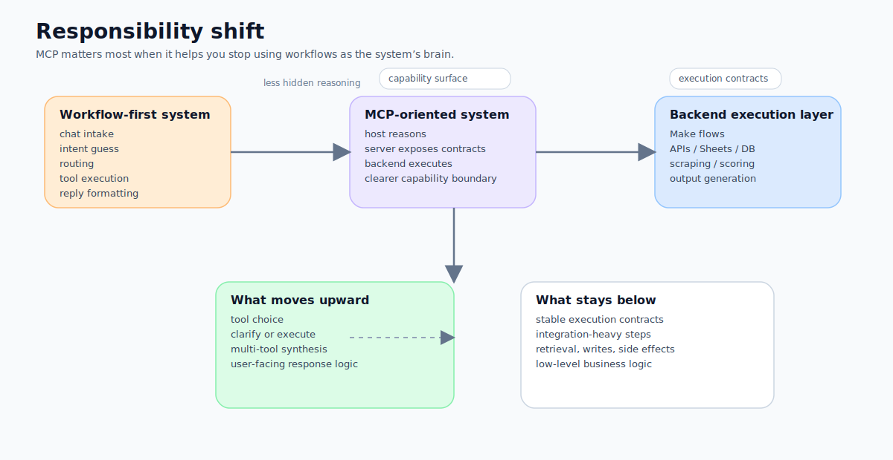
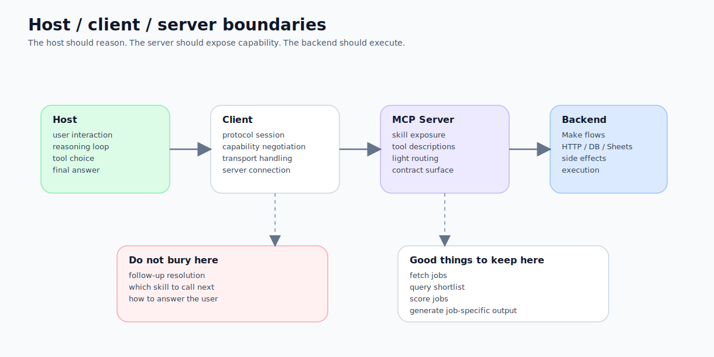
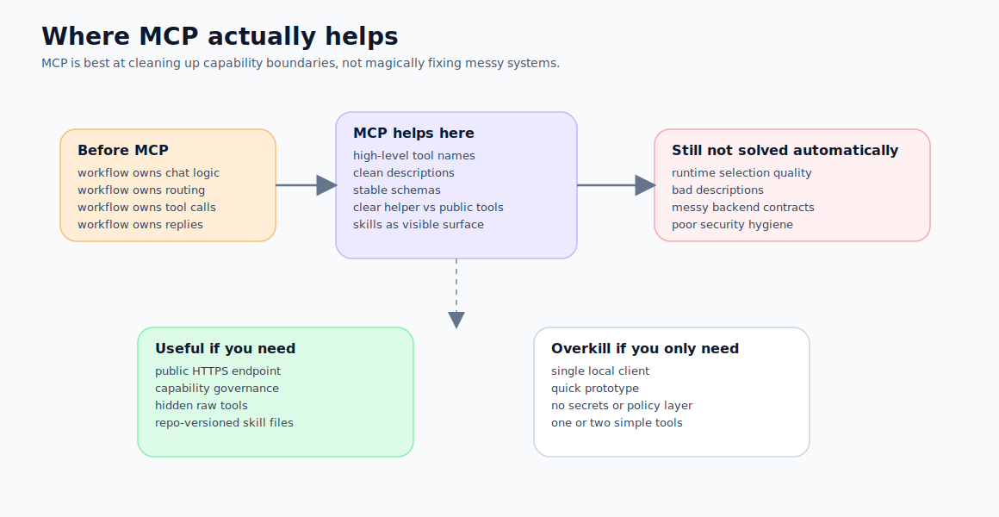
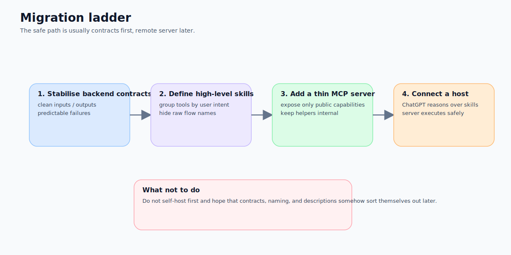

**Subtitle: This is not just about making tools callable. It is about redrawing the line between reasoning, capability exposure, and execution.**

My previous job-agent stack was already working.

Make could fetch jobs, write rows, score them, run deeper analysis, and send the result back to ChatGPT. On paper, it looked almost agentic already. The reason I kept refactoring was not that it lacked features. It was that I slowly realised something more structural:

> **Once a workflow starts acting as intake, planner, router, tool executor, and reply formatter all at once, it becomes a system that can do a lot, but is very hard to evolve.**

That is what pushed me from a Make-first workflow, to a Make MCP server, and then further to a self-hosted FastMCP gateway.

This series is not an anti-Make argument, and it is not an attempt to turn MCP into a miracle cure. What I actually want to write about is something more useful for builders:

> **The real value of MCP is not that it lets an LLM call tools. The real value is that it gives you a cleaner way to decide who should think, who should expose capability, and who should simply execute.**

If you have ever built a bot, an automation-heavy system, or a workflow stack that is slowly pretending to be an agent, this piece is for you.



## First things first: MCP is not just a shinier API wrapper

The official MCP documentation describes the protocol in terms of **tools, resources, prompts**, lifecycle, transport, and HTTP-based authorisation. In other words, MCP is not merely an SDK, and it is not a private integration format belonging to one vendor.

For builders, though, the most important practical implication is simpler:

> **A model should not need to look directly at your internal implementation details. It should interact with the outside world through a capability surface that has a clear contract.**

That is why I no longer think of MCP as “yet another way to wire an API into an LLM”. I think of it as:

- a capability exposure model
- a responsibility-boundary model
- a protocol that makes the host, client, and server roles much clearer

## What MCP really changes for workflow builders

If your existing stack is built with Make, n8n, Zapier, or any workflow-first system, you will probably recognise this general shape:

```text
chat input
→ parse intent
→ route
→ call tools
→ format reply
→ store task state
```

The problem is that, over time, a workflow like this tends to absorb too many jobs at once. It becomes:

1. **a transport adapter**  
   receiving webhooks, chat events, and message payloads

2. **an orchestrator**  
   deciding what runs first, what runs next, and what happens on failure

3. **a reasoning shell**  
   trying to infer what the user means and which sub-flow should be chosen

4. **an execution layer**  
   actually fetching data, writing data, calling APIs, and invoking models

For small systems, that is perfectly reasonable. In fact, it is often the most practical way to get to a working version quickly.

But once you plug in ChatGPT, Claude, or another host that can reason over tools, the weakness becomes obvious:

> **Reasoning and execution are mixed together, so neither side ends up especially clean.**

From that angle, the biggest thing MCP changes is not the registration format for tools. It is that you finally have a strong reason to separate these responsibilities.

## Why the host / client / server split matters more than it first appears

The MCP architecture draws a very explicit line:

- the **host** is the top-level user-facing application, such as ChatGPT
- the **client** is the host-side connection to a given MCP server
- the **server** is the service that exposes tools, resources, prompts, and related capabilities

That may sound abstract, but it has a very practical impact on system design.

### Before MCP
It is tempting to push all sorts of host-like decisions down into the workflow layer:

- talking to the user directly
- choosing the next tool based on context
- deciding whether to clarify or execute
- merging multiple tool outputs into one final response

### With MCP
You are more likely to ask the right question:

- what belongs in the host’s reasoning loop?
- what belongs in the MCP server’s contract surface?
- what should remain a backend execution concern?

This is now one of my working heuristics:

> **If a task is really about deciding the next move on behalf of the model, it probably should not stay buried inside a low-level workflow.**

By contrast, if a task is simply stable business logic, such as fetching recent jobs, querying a shortlist, or producing an interview brief, it often belongs quite happily in the execution layer.



## This is also why I did not stop at “Make with an MCP front door”

In v2, I had already done something important: I reorganised the Make-first setup so that it behaved more like an execution engine.

That was already a meaningful improvement. But there was still a limit:

> **The entrypoint looked more MCP-shaped, but the strategy layer had not really been lifted out of Make yet.**

That is what pushed me towards v3: Oracle VM, FastMCP, a GitHub-hosted `job-skills-gateway` repository, and a server that exposes only skill-level tools.

The README and architecture docs in that repository make the intent quite explicit:

- ChatGPT is the top-level host
- the FastMCP skill server is a thin layer
- Make remains the execution layer
- only four high-level skills are exposed
- raw Make flows are not exposed directly

That distinction matters.

The real gain is not that ChatGPT can call something like `fetch_recent_jobs`.  
The real gain is that the visible capability surface becomes:

- `job_ingestion`
- `job_scoring`
- `job_querying`
- `job_decision_support`

Those names are no longer implementation details. They are product-facing capabilities.

## Toolified is not the same as contractual

This is one of the easiest traps to fall into.

You absolutely can expose a pile of backend flows as MCP tools. Technically, that works. But that does not mean you have achieved a more mature MCP design.

Because “the tool is callable” and “the tool is a stable contract” are different things.

A more mature contract surface should make several things legible to the host:

- what the capability is for
- when it should be used
- what the inputs look like
- what the outputs look like
- how failures are represented
- which helpers should remain internal

That is why I increasingly think of skills and tool surfaces as product design, not wrapper work.

If you skip that design layer, an MCP server can easily collapse into nothing more than another API gateway. It may look newer, but it is still carrying the same old mess.

## Why skills are worth having at all

In my job-agent case, skills are not just documentation.

They function more like:

- a high-level semantic layer over backend execution tools
- a boundary for what the model is allowed to see
- a way to turn skill-first behaviour into an architectural fact rather than a prompt wish

This is also why I strongly prefer the following pattern:

> **Do not rely on the model to politely read repository files and then choose the right low-level tool.**
> **A more reliable design is to expose only the right high-level capabilities from the server in the first place.**

In other words, skills do not replace runtime selection.  
Skills help determine **what may be selected at all**.

Actual runtime selection is still influenced very heavily by:

- tool names
- descriptions
- schemas
- the inventory currently visible to the model

That is exactly why I plan to give that topic its own article in Series B.



## When you probably do *not* need to self-host an MCP server

I do not want this piece to become another sermon about how everyone should self-host MCP infrastructure.

That would be silly.

If you are only:

- building for local use
- validating a prototype
- exposing one or two simple tools
- not serving a public HTTPS endpoint
- not dealing with secrets, policy, or capability governance

then a local stdio server may be enough. If you are just validating the concept, a tunnel or a platform service may be the saner first step.

I only start leaning towards a self-hosted remote MCP server when several conditions show up at once:

- I genuinely need a public HTTPS endpoint
- I do not want the host to see every raw backend tool
- I want secrets, adapters, and routing policy to stay on a server I control
- I want skill definitions to be versioned as repository files
- I want to keep my existing Make investment without letting Make remain the brain of the whole system

If you do not have those constraints yet, do not rush into Oracle VM, Cloudflare, nginx, and operational gravity.

## My current working view: MCP is best for re-cutting responsibility, not polishing chaos

If I had to reduce this article to one sentence I actually use in practice, it would be this:

> **MCP is most valuable not when you already have many tools, but when you need to redefine which tools are visible, who gets to reason over them, and which layer should simply execute.**

That is also why I am structuring this series in three tracks:

- Series A covers understanding and building
- Series B covers transport, security, contracts, and skills
- Series C returns to the concrete `make-job-agent-v3` case study

Because if you only focus on “how do I expose my tool”, you miss the more expensive questions:

- contract design
- capability governance
- responsibility boundaries between host, server, and backend
- and the danger of letting a workflow continue pretending it is the agent’s brain

## The counterexample I want to leave on purpose

I also want to leave one deliberate counterexample here, so this piece does not turn into another technical belief system.

**Not every workflow-heavy system is worth turning into MCP.**

Sometimes the real problem is simply that:

- the flow is messy
- the schema is unstable
- secrets are scattered around
- naming has no layers
- descriptions are poor

If that is the state of the system, adding MCP does not solve the underlying problem. It merely moves the mess to a newer protocol surface.

In those cases, the right first step is usually not self-hosting an MCP server. It is cleaning up your backend execution contracts.

That is why my migration order looks like this:

1. stabilise execution contracts
2. define high-level skills
3. decide how the server should expose them
4. only then connect the host

## In Part 2, I will get to the genuinely muddy part

If Part 1 is about what MCP actually changes, Part 2 will move into the operational ground truth:

- how to prepare Oracle VM
- which networking pieces are non-negotiable
- how Cloudflare, nginx, and FastMCP fit together into a real HTTPS `/mcp` endpoint
- why “it runs on the box” is not the same thing as “the client can reach it”
- and why the real bug is often the network or TLS layer, not FastMCP itself

That is where the bricks and mortar begin.


