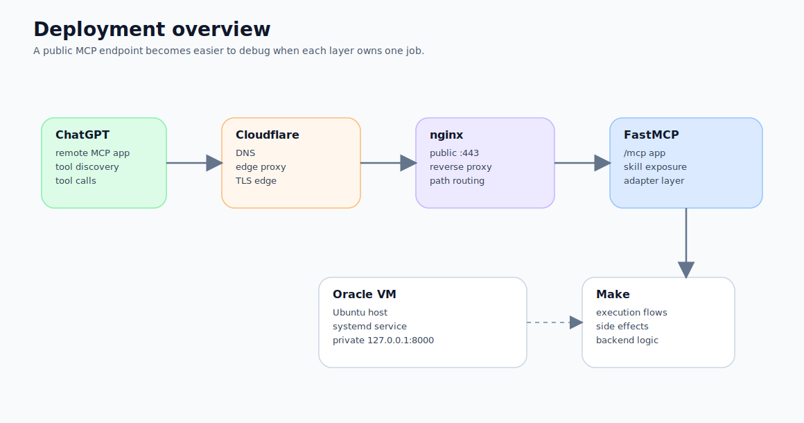
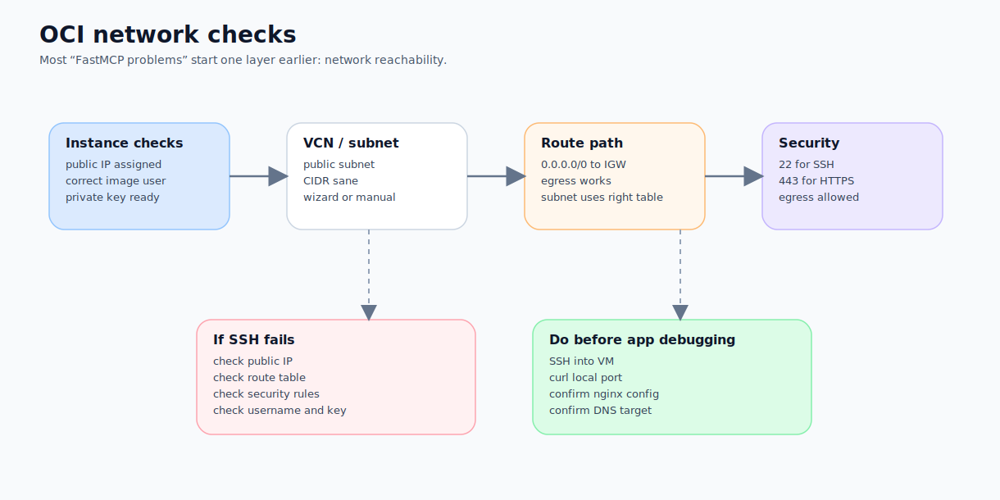
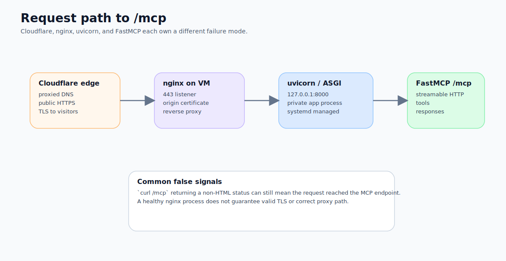
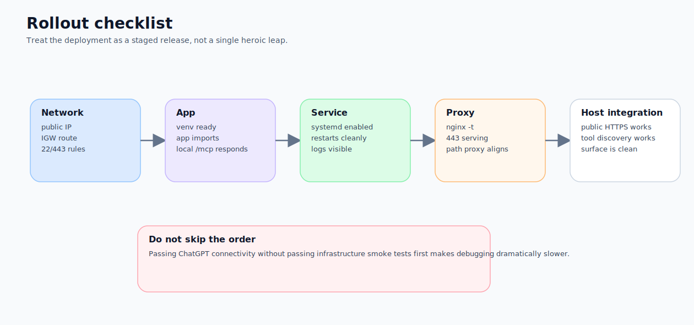

**Subtitle: Using Oracle VM, Cloudflare, nginx, and FastMCP to turn an MCP server that merely runs in a terminal into a public `/mcp` endpoint that ChatGPT can actually reach.**

In Part 1, I focused on the conceptual boundary: MCP changes responsibility lines more than it changes wiring style.

This piece is where the theory stops and the infrastructure starts.

Because the moment you try to self-host a remote MCP server, the annoying problems are usually not about `@mcp.tool`. They are about things like:

- whether the VM is truly reachable from the outside
- which part of public IP, VCN, subnet, Internet Gateway, or security rules is still missing
- why `curl localhost` succeeds on the box while the outside world still cannot reach the service
- why nginx appears healthy but ChatGPT still cannot connect to `/mcp`
- and why TLS, DNS, Cloudflare, and origin configuration can turn a Python problem into a networking problem

My own deployment path is intentionally conservative: keep the FastMCP server thin, let it read skill files from GitHub, and let it call the existing Make execution flows behind the scenes.

The overall route looks like this:

```text
ChatGPT
→ Cloudflare
→ nginx
→ FastMCP
→ skill loader / adapter
→ Make execution flows
```

That is the path I will unpack in this article.



## First, an unglamorous truth: if you are only validating the idea, Oracle VM may be overkill

Let me start with the anti-hype version.

If you are only trying to:

- confirm that a skill is discoverable by the host
- validate what the capability surface should look like
- test a local or internal demo
- avoid touching DNS, TLS, reverse proxies, systemd, and machine operations

then Oracle VM is not necessarily where I would begin.

Because the moment you choose a VM, you are also choosing:

- SSH
- network topology
- firewall rules
- OS patching
- process management
- certificate handling
- public availability concerns

In other words, you are not merely choosing a deployment target. You are choosing a bundle of operational responsibilities.

I use Oracle VM here because this server is meant to become a long-lived public entry point, and I do not want the capability surface to be controlled by the default behaviour of a third-party platform. But if you are still proving the concept, a PaaS or a temporary tunnel may be the saner first move.

## The end state we are aiming for

This article uses a very specific reference shape:

- Oracle VM runs Ubuntu
- the FastMCP app is not exposed directly to the public internet
- nginx owns the public HTTPS entrypoint
- Cloudflare handles DNS and edge-facing proxying
- the actual endpoint exposed to the host is:

```text
https://mcp.example.com/mcp
```

The point of this shape is not to be fancy. It is to keep responsibilities legible:

- **FastMCP** owns the MCP capability surface
- **nginx** owns reverse proxying and the HTTPS entrypoint
- **Cloudflare** owns DNS and the edge-facing request path
- **Oracle VM** gives you a machine you actually control

## The four-stage deployment order I recommend

I do not recommend starting with the server code.

I recommend this order instead:

1. make Oracle VM genuinely reachable
2. make FastMCP work on an internal port
3. add nginx and HTTPS
4. only then connect the endpoint to ChatGPT Developer Mode

This order has one extremely practical benefit:

> **When something breaks, you have a much better chance of knowing which layer you are actually debugging.**

## Stage 1: turn Oracle VM into a real public host

Oracle’s documentation is very clear on this point. For a compute instance to be reachable from the internet, you generally need all of the following together:

- a public IP on the instance
- a subnet and route table that can actually reach an Internet Gateway
- security rules that permit the required ingress and egress
- working SSH access using the correct private key

The most common false assumption here is:

> “I can see a public IP, so surely the machine is reachable.”

Not necessarily.

In OCI, the pieces that really decide whether traffic lives or dies are:

- **VCN and subnet**
- **route table**
- **Internet Gateway**
- **security list or NSG**

### A practical starting point

If you are beginning from scratch, I usually recommend starting with Oracle’s **VCN with Internet Connectivity** wizard. It gives you a safer first version of the public subnet, gateway, route table, and security list setup.

You can always refine the network layout later.

### Pass SSH before you blame anything else

Oracle’s Linux instance documentation is blunt in the right way: you need the correct **public IP**, the correct **username**, and the correct **private key**. A `.pub` file is not your login key; it is the public half of the key pair.

That sounds embarrassingly basic, but it is one of those failures that can cost an hour if you are tired.

A minimum SSH check looks like this:

```bash
ssh -i /path/to/private-key ubuntu@<PUBLIC_IP>
```

If SSH is not working yet, do not start suspecting FastMCP. The odds are very high that your VM networking is not truly open.



## Stage 2: make FastMCP live on an internal port first

I strongly recommend against exposing FastMCP directly on a public port as your first deployment shape.

A more stable pattern is:

- FastMCP listens internally only
- for example on `127.0.0.1:8000`
- nginx then proxies `/mcp` to that internal service

That keeps debugging more structured and reduces the chance of accidentally exposing the app too early.

### A minimum Ubuntu install path

A typical starting point looks like this:

```bash
sudo apt update
sudo apt install -y python3 python3-venv python3-pip git nginx
```

Then pull the repository:

```bash
sudo mkdir -p /opt/job-mcp
sudo chown "$USER":"$USER" /opt/job-mcp
cd /opt/job-mcp
git clone https://github.com/huaihsuanbusiness/job-skills-gateway app
cd app
python3 -m venv .venv
source .venv/bin/activate
pip install -U pip
pip install -r requirements.txt
```

### A thin FastMCP app is the right default

For this kind of skill gateway, my preference is quite strong:

- expose only high-level skills
- load skill files from the repository
- let an adapter call the backend execution layer
- do not expose raw Make flow names to the host

If you want an ASGI app that sits neatly behind nginx and uvicorn, FastMCP’s Python SDK already supports building a streamable HTTP app.

A very small skeleton can look like this:

```python
from fastmcp import FastMCP
from fastmcp.server.http import create_streamable_http_app

mcp = FastMCP("Job Skills Gateway")

@mcp.tool
def healthcheck() -> dict:
    """Return basic liveness for deployment checks."""
    return {"ok": True}

app = create_streamable_http_app(
    server=mcp,
    streamable_http_path="/mcp",
)
```

If all you want is a quick local check, FastMCP’s built-in HTTP transport is simpler. But for the deployment shape I want, **ASGI app + uvicorn + nginx** gives me cleaner operational control.

### Validate locally before exposing anything

On the machine itself, test the app first:

```bash
source /opt/job-mcp/app/.venv/bin/activate
uvicorn mcp_server.app.server:app --host 127.0.0.1 --port 8000
```

Then in another shell:

```bash
curl -i http://127.0.0.1:8000/mcp
```

One detail worth calling out: in some MCP / ASGI configurations, a plain `curl` to `/mcp` may return a 406 or another unfriendly-looking status. That does not automatically mean the endpoint is broken.

In my own deployment, a `406 Not Acceptable` was actually a clue that nginx had reached the real MCP endpoint, rather than a proof that the app was dead. MCP endpoints are not ordinary HTML pages, so “friendly browser behaviour” is not the metric that matters most.

## Stage 3: turn it into a service that can survive

If you are still running uvicorn in a terminal window, you do not have a deployment. You have a momentary coincidence.

For a setup like this, I would hand the process over to `systemd`.

### Reference service unit

```ini
[Unit]
Description=Job MCP Server
After=network.target

[Service]
User=ubuntu
Group=ubuntu
WorkingDirectory=/opt/job-mcp/app
EnvironmentFile=/opt/job-mcp/app/.env
ExecStart=/opt/job-mcp/app/.venv/bin/uvicorn mcp_server.app.server:app --host 127.0.0.1 --port 8000
Restart=always
RestartSec=3

[Install]
WantedBy=multi-user.target
```

Save it as:

```bash
sudo nano /etc/systemd/system/job-mcp.service
```

Then run:

```bash
sudo systemctl daemon-reload
sudo systemctl enable job-mcp.service
sudo systemctl start job-mcp.service
sudo systemctl status job-mcp.service --no-pager
```

And inspect logs with:

```bash
journalctl -u job-mcp.service -n 100 --no-pager
```

At this point, your Python script starts becoming an actual service.

## Stage 4: let nginx own the public `/mcp` entrypoint

Once FastMCP is alive internally, nginx can take over the public-facing layer.

My preferred shape is:

```text
https://mcp.example.com/mcp
→ nginx :443
→ 127.0.0.1:8000/mcp
```

### A readable nginx reference block

```nginx
server {
    listen 443 ssl http2;
    server_name mcp.example.com;

    ssl_certificate     /etc/ssl/certs/cloudflare-origin.crt;
    ssl_certificate_key /etc/ssl/private/cloudflare-origin.key;

    location /mcp {
        proxy_pass http://127.0.0.1:8000/mcp;
        proxy_http_version 1.1;

        proxy_set_header Host $host;
        proxy_set_header X-Forwarded-Proto https;
        proxy_set_header X-Forwarded-For $proxy_add_x_forwarded_for;
    }
}
```

If you also want HTTP-to-HTTPS redirects, add a second server block on port 80.

Test the configuration:

```bash
sudo nginx -t
sudo systemctl reload nginx
```

## What Cloudflare is actually doing here

People often describe Cloudflare as “the place where the domain lives”. That is not wrong, but it is not enough.

In this deployment, Cloudflare is doing at least two important jobs:

1. **DNS**
   - pointing `mcp.example.com` at your Oracle VM

2. **Proxying at the edge**
   - when the DNS record is proxied, HTTP/HTTPS traffic goes through Cloudflare before it reaches your origin

That has a practical consequence:

> Your Oracle origin is no longer facing every visitor directly. It is receiving traffic that has already passed through Cloudflare.

This is why Cloudflare’s documentation keeps returning to ideas such as:

- proxied records
- Origin CA certificates
- Authenticated Origin Pulls
- the distinction between edge TLS and origin TLS

### Cloudflare Origin CA is genuinely convenient here

If your traffic is passing through Cloudflare before reaching your Oracle VM, an extremely practical option is to use a **Cloudflare Origin CA** certificate on the origin.

Why this is useful:

- it is specifically suited to the Cloudflare ↔ origin segment
- it avoids forcing a public CA into your first deployment
- it fits naturally with `Full (strict)` mode

That said, there is an important operational catch: once you move to `Full` or `Full (strict)`, your origin really does need to serve HTTPS correctly on port 443. Otherwise you are inviting 525-style handshake failures.



## Do smoke tests before you open ChatGPT

At this point, resist the temptation to jump straight into ChatGPT.

I would insist on passing a few minimum checks first.

### Smoke test 1: internal app is alive
```bash
curl -i http://127.0.0.1:8000/mcp
```

### Smoke test 2: nginx proxying works
```bash
curl -ik https://mcp.example.com/mcp
```

### Smoke test 3: the service survives restart
```bash
sudo systemctl restart job-mcp.service
sudo systemctl status job-mcp.service --no-pager
```

### Smoke test 4: the service comes back after reboot
```bash
sudo reboot
```

Then reconnect and verify:

```bash
systemctl status job-mcp.service --no-pager
systemctl status nginx --no-pager
```

If those checks are still failing, it is too early to blame ChatGPT or Developer Mode.

## ChatGPT Developer Mode comes last, not first

OpenAI’s current Developer Mode docs are quite explicit: when you create a remote MCP app / connector in ChatGPT, you enter the public MCP endpoint, and the platform supports:

- **SSE and streaming HTTP**
- **OAuth, No Authentication, and Mixed Authentication**

So if you are still on an early internal deployment and the server is not yet using OAuth, **No Authentication** is a perfectly reasonable way to validate connectivity. It is not a long-term security strategy, but it is a valid first-stage deployment decision.

### The three checks I care about before connecting ChatGPT

1. the `/mcp` endpoint is genuinely public and reachable over HTTPS  
2. the host sees the skill-level tools, not the raw backend flows  
3. your logs make it possible to tell whether a failure is in:
   - DNS / TLS / proxying
   - the app itself
   - the backend adapter

## The four pitfalls most worth writing down

If I had to compress the most reusable operational lessons from this build, I would keep these four.

### Pitfall 1: you think FastMCP is broken, but Oracle networking never really opened
A public IP alone proves very little. Route tables, Internet Gateway attachment, security lists, and NSGs still decide whether packets live or die.

### Pitfall 2: you think a running Python process means a usable service
It does not.  
A real service needs restart policy, boot-time start, and logs. `systemd` is not an optional nicety here.

### Pitfall 3: you think nginx is up, so TLS must be fine
Not necessarily.  
Cloudflare mode, origin certificates, 443 ingress, and redirect behaviour can still break the path.

### Pitfall 4: you think ChatGPT failing to connect must be ChatGPT’s fault
Usually it is not.  
The more common causes are:
- the endpoint is not truly public
- the proxy path does not align
- transport or auth assumptions do not match
- the visible tool surface is still messy

## My current deployment heuristic

If I had to reduce this article to one rule I genuinely use, it would be this:

> **For a remote MCP server, the real work is not the decorator. The real work is making the network layer, the process layer, and the capability surface all line up at the same time.**

FastMCP matters, of course.  
But on Oracle VM, it is only one layer in the chain.

What makes the system stable is whether you have clearly decided:

- which layer is public
- which layer only listens internally
- which layer owns TLS
- which layer owns skill exposure
- which layer owns backend execution

## Part 3 will move into framework choice

Once this deployment shape is stable, the next obvious question becomes:

> Why FastMCP, and not a different MCP framework?

That is what Part 3 will cover. I will compare frameworks through the lens that matters in practice:

- how heavy or light the framework is
- how mature the transport, auth, and deployment story is
- whether you are building a quick demo or a server meant to grow
- and whether you are optimising for “fast to finish” or “less painful later”


