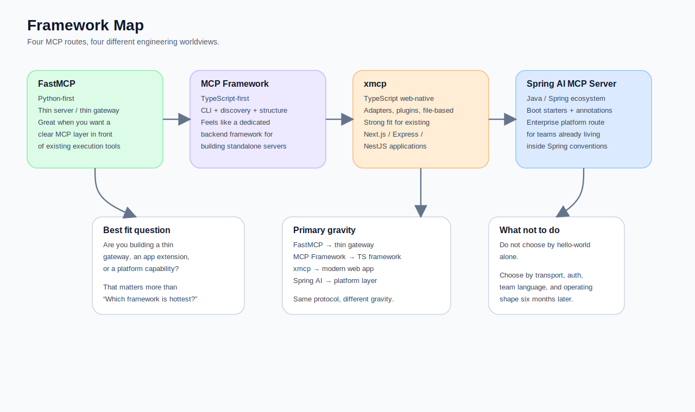
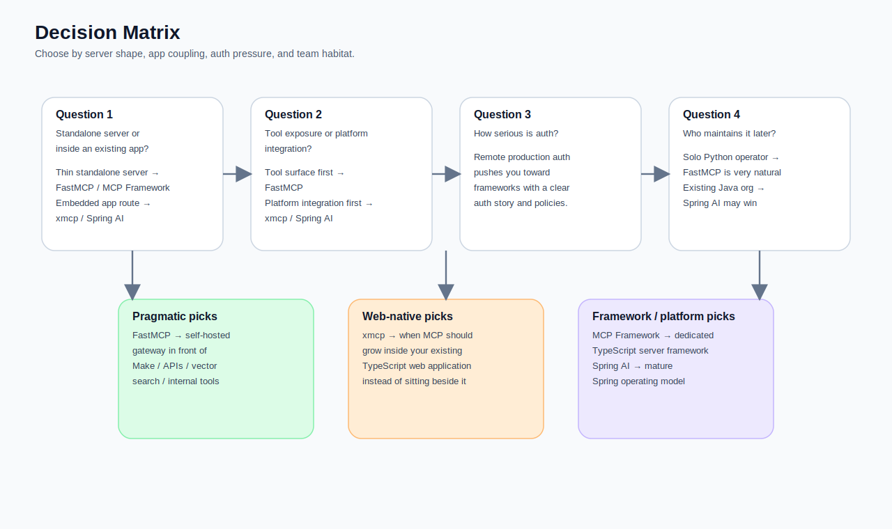
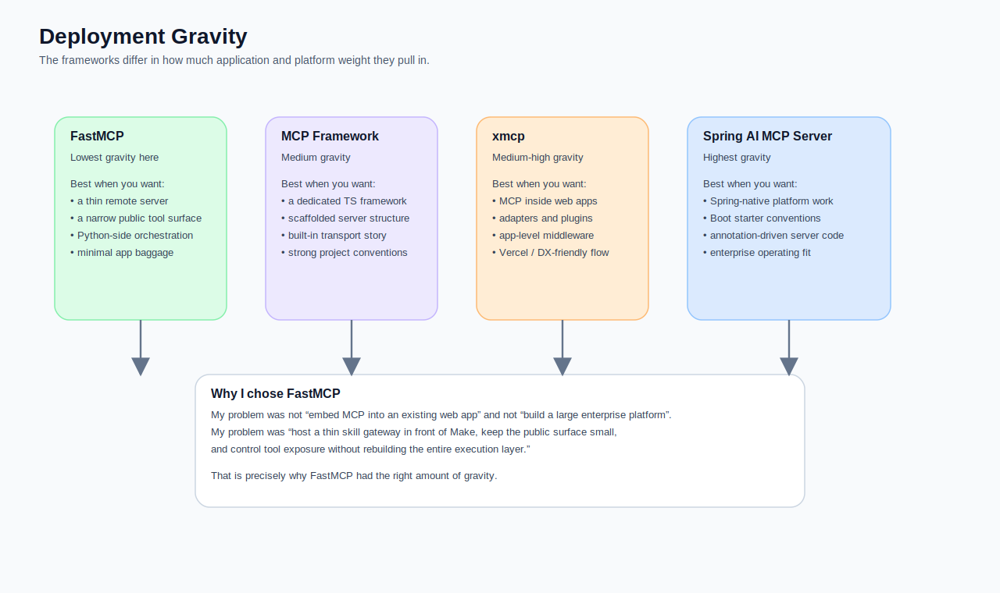
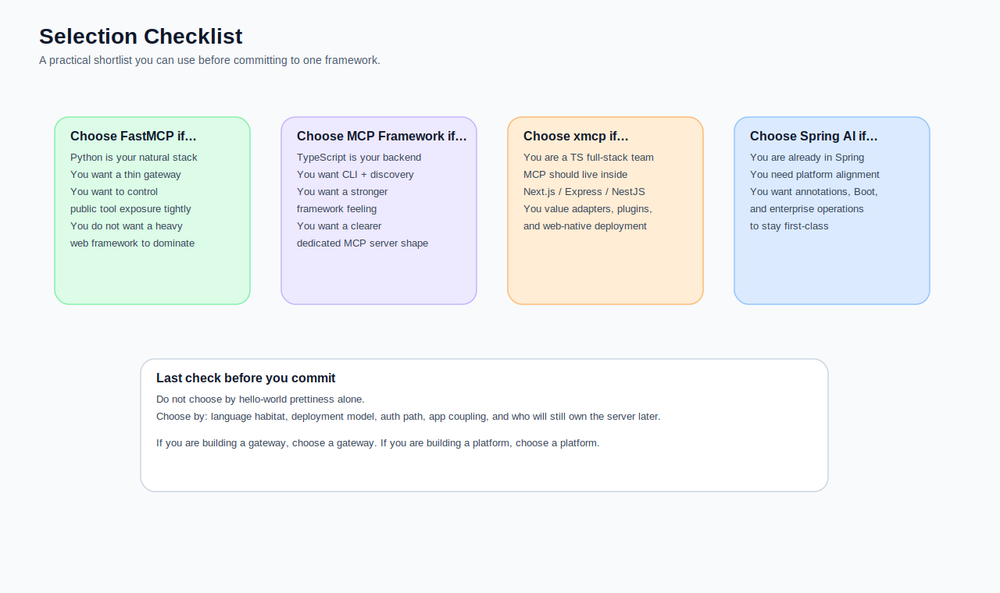

**Subtitle: FastMCP, MCP Framework, xmcp, and Spring AI MCP Server are not four skins over the same idea. The real question is which one fits your language habitat, deployment model, auth pressure, and long-term operating style.**

By this point, the story starts to look less like an MCP introduction and more like an engineering selection problem.

If Part 1 was about what MCP actually changes, and Part 2 was about how to get a real remote MCP server online, Part 3 is about the question that tends to consume the most time and generate the most vague blog posts:

> **Which MCP framework should I use?**

I originally thought this was mostly a Python-versus-TypeScript choice. After reading the official docs, comparing transport models, auth paths, deployment assumptions, and my own job-agent-v3 requirements, I ended up with a more useful conclusion:

> **Picking an MCP framework is not mainly about how pleasant the hello-world feels. It is about deciding whether your server should behave like a thin gateway, a web-native app extension, or a platform layer that will live for years.**

In this article, I put four routes on the same map:

- **FastMCP**
- **MCP Framework**
- **xmcp**
- **Spring AI MCP Server**

This is not a catalogue and it is not a faith-based ranking.  
What I want instead is a practical answer to a more grounded question:

> **If your goal is to expose a public, governable, evolvable MCP server to ChatGPT, which route is least likely to turn into an operating headache six months from now?**



## My short answer first

If you only want the headline, this is my current working view:

- **FastMCP** fits best when you live in Python and want a thin server without re-implementing protocol details yourself.
- **MCP Framework** fits best when you live in TypeScript and want something that feels like a proper framework, not just a helper layer.
- **xmcp** fits best when you want MCP to plug into an existing JS or TS application and you care about adapters, plugins, and modern web ergonomics.
- **Spring AI MCP Server** fits best when you already live in Java and Spring and want MCP to become a first-class platform capability inside that ecosystem.

These are not four colours of the same paint.  
They represent four different engineering worldviews.

## Do not start with language. Start with these four questions.

When I choose a framework now, I do not start with “what is popular this month?”.  
I start with these four questions.

### 1. Is your MCP server a standalone service, or does it need to live inside an existing app?

This question does a lot of work.

If you want a clear, self-contained, thin skill gateway, **FastMCP** and **MCP Framework** are both easy to reason about.  
If you want MCP to live inside an existing Next.js, Express, or NestJS application, **xmcp** becomes much more compelling.  
If your company already runs on Spring Boot and service conventions, **Spring AI MCP Server** stops being an exotic option and starts looking natural.

### 2. Are you solving tool exposure, or platform integration?

Some teams only need to expose a few well-behaved tools.  
Other teams need to wire in:

- authentication
- existing middleware
- observability
- deployment pipelines
- organisational controls

Those are not the same problem.

The first tends to favour something thin and direct.  
The second often benefits from a framework that already thinks in terms of app structure, adapters, and governance.

### 3. Do you need demo-grade auth, or production-grade auth?

The current MCP specification takes HTTP-based authorisation seriously.  
A remote MCP server is not just “a URL that happens to answer tool calls”.  
It has to deal with protected resources, tokens, auth flows, and trust boundaries.

So if your server is going to be publicly reachable, auth is not a garnish you can sprinkle on at the end.  
It should influence the framework choice from day one.

### 4. Are you optimising for development speed now, or operational readability later?

Some frameworks make it incredibly easy to get something working in under an hour.  
Others become more valuable once you come back three weeks later and need to change auth, version tools, or explain the project to a teammate.

There is no universal answer here.  
But there is always a trade-off.

## Putting the four frameworks on one map

| Dimension | FastMCP | MCP Framework | xmcp | Spring AI MCP Server |
|---|---|---|---|---|
| Primary language | Python | TypeScript | TypeScript | Java |
| Mental model | thin server / thin gateway | traditional framework | web-native framework | enterprise platform |
| Good for standalone servers | very good | very good | good | good |
| Good for embedding into existing apps | moderate | moderate | excellent | excellent if you already use Spring |
| Transport posture | local + remote both work well | stdio + HTTP Stream | HTTP / stdio + adapters | stateless / streamable HTTP / annotations |
| Auth posture | framework support keeps improving | explicit auth story in docs | middleware + auth plugins | Spring Security / Spring ecosystem |
| Best fit team | Python / AI tooling | TS backend teams | TS full-stack / platform teams | Java / enterprise teams |
| My shorthand | pragmatic engineering route | framework route | modern DX route | platform route |



## What each route actually feels like

## 1. FastMCP: the best fit when you want a thin, governable Python gateway

FastMCP is attractive for a very plain reason.  
Its core promise is that you write Python functions and it takes care of the MCP-shaped friction around them: schema generation, validation, transport, and protocol lifecycle. The official docs are explicit that the project aims to support the path from prototype to production rather than just local demos.

### The kind of situation it matches well

- You are already comfortable in Python
- You want a thin server, not a large platform
- You want to wrap Make, internal APIs, vector search, or database lookups as higher-level tools
- You want a **thin skill server**, not another workflow engine

### Minimal sketch

```python
from fastmcp import FastMCP

mcp = FastMCP("job-skill-server")

@mcp.tool
def query_jobs(keyword: str, min_score: int = 80) -> dict:
    """Return shortlist-friendly jobs from the stored pool."""
    return {
        "keyword": keyword,
        "min_score": min_score,
        "matched_count": 3
    }

if __name__ == "__main__":
    mcp.run()
```

### Why it made sense for my v3

My problem was not “how do I build an entire application around MCP?”.  
My problem was much narrower:

- load skills from GitHub-backed files
- expose only skill-level tools
- hide internal helpers
- translate skill calls into Make webhooks

That is exactly the sort of shape where FastMCP feels right.  
It does not force you into a heavy application framework, but it also does not leave you alone with the bare SDK and a pile of lifecycle edge cases.

### Install and versioning advice

```bash
uv pip install fastmcp
```

If you are heading towards production, pin exact versions.  
FastMCP’s own documentation recommends that, because the MCP ecosystem is still moving quickly.

## 2. MCP Framework: a TypeScript route for people who want framework structure

MCP Framework has a different personality.

FastMCP feels like “let me get a thin MCP server online cleanly”.  
MCP Framework feels like “let me work inside an opinionated TypeScript framework built specifically for MCP”.

The official documentation emphasises:

- automatic discovery
- CLI scaffolding
- stdio / SSE / HTTP Stream
- built on the official MCP SDK
- auth support for remote endpoints

### Typical bootstrap

```bash
npm install -g mcp-framework
mcp create my-mcp-server
cd my-mcp-server
npm install
```

### Minimal style sketch

```ts
import { MCPServer, MCPTool } from "mcp-framework";
import { z } from "zod";

class QueryJobsTool extends MCPTool {
  name = "query_jobs";
  description = "Return shortlist-friendly jobs from the stored pool.";

  schema = z.object({
    keyword: z.string(),
    min_score: z.number().default(80),
  });

  async execute(args: { keyword: string; min_score: number }) {
    return {
      keyword: args.keyword,
      min_score: args.min_score,
      matched_count: 3,
    };
  }
}

const server = new MCPServer();
server.start();
```

### How I read it

If you are a TypeScript backend team and you want:

- a clear project skeleton
- strong framework conventions
- transport and auth stories that are already documented
- a more formal “MCP server framework” feel

then MCP Framework is worth serious attention.

It also reads more confidently for remote transport than many light wrappers do.

### What you are paying for

You are paying with more framework gravity.  
If your team prefers file-based routing, adapter-first integration, or a development model that feels closer to modern full-stack web frameworks, you may prefer xmcp instead.

## 3. xmcp: the strongest fit when MCP should live inside modern web applications

xmcp is the most web-native of the four.

Its docs consistently highlight:

- quick scaffolding
- file-based development
- transports out of the box
- adapters for Next.js, Express, and NestJS
- auth plugins
- deployment to Vercel and similar environments

That is a very different flavour from MCP Framework.  
MCP Framework says “I am an MCP framework”.  
xmcp says “I make MCP feel native inside the way modern TypeScript teams already build apps”.

### Bootstrap

```bash
npx create-xmcp-app@latest
```

### A very xmcp-flavoured sketch

```ts
// src/tools/query-jobs.ts
import { z } from "zod";

export const schema = z.object({
  keyword: z.string(),
  min_score: z.number().default(80),
});

export default async function queryJobs({
  keyword,
  min_score,
}: {
  keyword: string;
  min_score: number;
}) {
  return {
    keyword,
    min_score,
    matched_count: 3,
  };
}
```

For an existing Express app, the official docs even point you towards a route like this:

```ts
import { xmcpHandler } from "./.xmcp/adapter";

app.get("/mcp", xmcpHandler);
app.post("/mcp", xmcpHandler);
```

### Its biggest strength

It is not only about building a standalone MCP server.  
It is about making MCP a natural extension of an existing application.

So if your environment is:

- Next.js
- Express
- NestJS
- plugin-heavy TypeScript
- a deployment target like Vercel

then xmcp becomes very attractive.

### Its real trade-off

The trade-off is not that it is bad.  
It is that it naturally pulls you towards “MCP as part of the application platform”.  
If you only need a thin remote gateway, that may be more machinery than you actually want.

## 4. Spring AI MCP Server: the right answer when your world is already Spring

If your team already builds and operates Java or Spring Boot systems, Spring AI MCP Server has a very different kind of advantage:

> **You do not need to change your organisational gravity to adopt MCP.**

The official Spring AI docs already cover:

- MCP overview
- streamable HTTP server starters
- stateless server starters
- annotations
- Spring bean conversion into MCP tools

### Annotation-style sketch

```java
@Component
public class JobTools {

    @McpTool(name = "query-jobs", description = "Return shortlist-friendly jobs")
    public String queryJobs(
            @McpToolParam(description = "Keyword", required = true) String keyword,
            @McpToolParam(description = "Minimum score", required = false) Integer minScore) {
        return "keyword=" + keyword + ", minScore=" + minScore;
    }
}
```

### When it makes the most sense

- You already use Spring Security
- You already rely on Boot starters and platform conventions
- You want MCP to become part of an existing service platform
- You care more about operational alignment than minimal surface area

### Why I did not choose it here

Because my use case was narrower.

I was not building a broad enterprise platform.  
I was building a self-hosted skill gateway in front of Make.  
For that, Spring AI would have given me a lot of capability, but also a lot of weight.

## So why did I still choose FastMCP?

Because my problem was not “how do I add MCP to an existing web stack?” and not “how do I turn MCP into a large internal platform?”

My problem was more specific:

- host a remote MCP server on Oracle VM
- load versioned skill files from GitHub
- keep Make as the execution layer
- expose only a small number of public, high-level skill tools
- keep the server thin enough that I would not re-create orchestration chaos in a new place

Under those constraints, FastMCP was the best fit.  
Not because it is the coolest framework, but because it most closely matches the shape of the server I actually needed:

> **a thin, governable, production-minded MCP layer that does not force me into a full application platform too early.**



## A practical selection guide you can borrow

### Choose FastMCP if
- Python is your natural language
- you want a thin gateway
- you need tight control over exposed tools
- you do not want a heavy web framework to dominate the design

### Choose MCP Framework if
- TypeScript is your backend language
- you want a more traditional framework experience
- you want explicit transport and auth pathways
- you value CLI scaffolding and discovery conventions

### Choose xmcp if
- you are a TypeScript full-stack team
- you want to embed MCP into Next.js, Express, or NestJS
- you care deeply about adapters, plugins, and web-native DX
- you do not want MCP to be a totally separate service

### Choose Spring AI MCP Server if
- you are already in the Java / Spring ecosystem
- you have enterprise operating expectations
- you need deep integration with Spring Security and platform conventions
- you are building a durable platform layer, not just a gateway

## A useful counterexample

I want to include one counterexample on purpose.

It is very easy to look at Spring AI or any enterprise-friendly route and assume it must therefore be the “most mature” answer. That is not wrong, but it does not automatically mean it is the right fit for your current problem.

If your MCP server is really just meant to:

- hide a set of backend execution tools
- expose three to five higher-level capabilities
- serve ChatGPT or Claude
- give you a cleaner contract surface

then going for the heaviest framework first often just means paying organisational tax early.

Some systems genuinely need a platform.  
Others simply need a clean boundary.

## My final sentence on framework choice

I no longer believe in the question “which MCP framework is best?”.  
I do believe in this one:

> **Choosing an MCP framework is about choosing which responsibility split best matches the server you are actually trying to build.**

If you are building a platform, choose a platform.  
If you are building a gateway, choose a gateway.  
If you are building an app extension, choose the route that embeds naturally into that app world.

In the next article, I will move one layer higher and tackle the part that is easier to misunderstand than the framework itself:

> **what skills are, and how to design a skill layer that does not drift away from runtime reality.**


