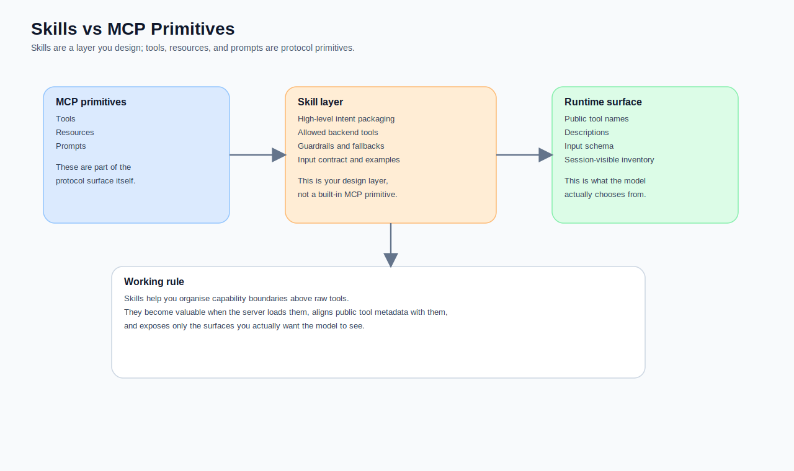
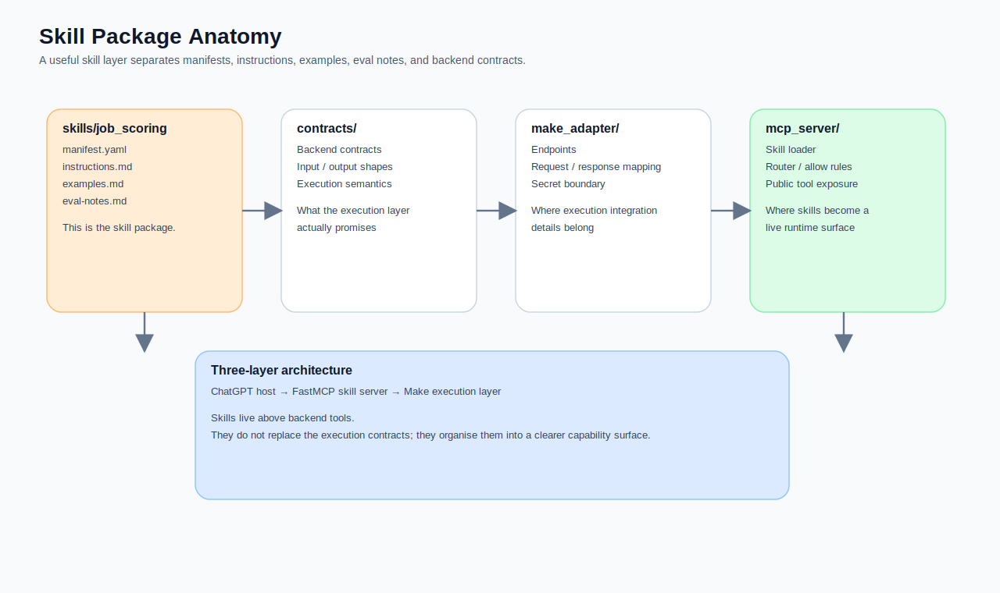
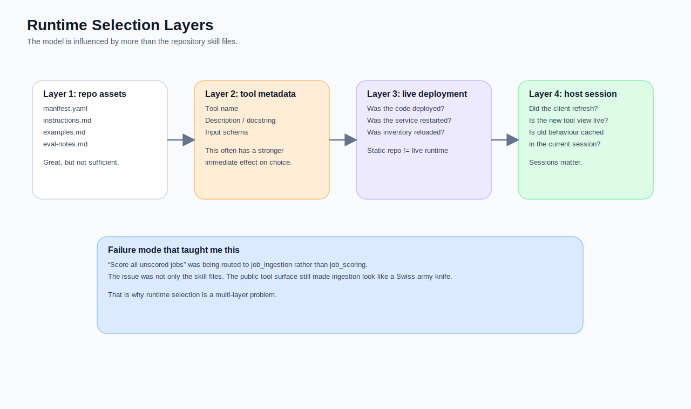
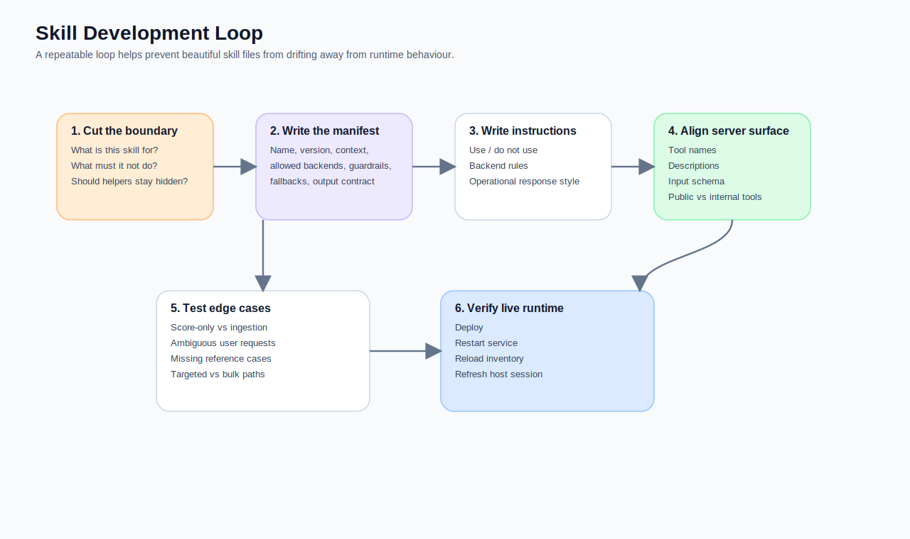

If Part 3 was about framework choice, Part 4 moves to something even easier to misunderstand and much closer to whether the system behaves well in practice:

> **What are skills, really?**

The biggest surprise in my v3 build was not Oracle VM, Cloudflare, or nginx.  
It was how wrong my first instinct about skills turned out to be.

I assumed, quite naturally, that once I had a proper skill package:

- `manifest.yaml`
- `instructions.md`
- `examples.md`
- `eval-notes.md`
- router policy
- intent signals

the model would simply follow that boundary and pick the right tool.

Reality was less tidy.

You can have all of those files and still end up with runtime behaviour that drifts, because what the model actually sees and chooses from in the moment is often shaped more by:

- the tool name
- the tool description
- the input schema
- the currently visible inventory in the session
- whether the server really turned skill policy into a live execution path

That is why I eventually had to split `job_scoring` away from `job_ingestion`.  
Not because it looked cleaner in a diagram, but because I finally understood this:

> **Having skills in a repository is not the same thing as having runtime tool selection governed by those skills.**



## The most important sentence first: skills are not MCP primitives

This has to be said clearly.

In the official MCP specification, the core server-facing capability types are:
- **tools**
- **resources**
- **prompts**

Skills are not one of those primitives.  
In other words, **skills are not a first-class concept in the MCP protocol itself**.

So what are they?

My current answer is:

> **A skill layer is an organising layer that sits between host reasoning and backend execution.**

It does not replace MCP, and it does not replace tools.  
What it does is:

- organise capability boundaries at a higher level
- wrap low-level backend tools in higher-level intent
- define rules, allowed backends, input expectations, guardrails, and fallbacks
- let the server expose **skill-level entry points** instead of a messy list of raw flows

That is exactly why, in my `job-skills-gateway` repository, I did not treat raw Make blueprints as skills. I built a separate skill layer on top of them.

## In my v3, what role do skills actually play?

My goal was never to create a magical system where the model would browse a GitHub repository, read markdown files on its own, and infer the perfect path every time.

What I actually wanted was much more concrete:

1. A versioned skill layer stored in GitHub
2. A FastMCP server that loads that skill layer at startup
3. Only a small number of high-level capabilities exposed to ChatGPT
4. Make retained as the execution layer
5. Internal helpers still available behind the scenes, but not publicly exposed

So in my design:

- **skills are strategy-facing assets**
- **MCP tools are runtime-facing surfaces**
- **Make blueprints are execution contracts**

Those are three separate layers.  
If you blend them together, you very quickly lose control of the system.



## This is the repository shape I ended up liking

This tree is now my preferred baseline for a skill-layer repository:

```text
job-skills-gateway/
├── README.md
├── docs/
│   ├── architecture.md
│   ├── deployment-runbook.md
│   └── make-tool-catalog.md
├── skills/
│   ├── job_ingestion/
│   │   ├── manifest.yaml
│   │   ├── instructions.md
│   │   ├── examples.md
│   │   └── eval-notes.md
│   ├── job_scoring/
│   │   ├── manifest.yaml
│   │   ├── instructions.md
│   │   ├── examples.md
│   │   └── eval-notes.md
│   ├── job_querying/
│   │   ├── manifest.yaml
│   │   ├── instructions.md
│   │   ├── examples.md
│   │   └── eval-notes.md
│   └── job_decision_support/
│       ├── manifest.yaml
│       ├── instructions.md
│       ├── examples.md
│       └── eval-notes.md
├── contracts/
├── make_adapter/
├── mcp_server/
└── router/
```

The value of this structure is not cosmetic tidiness.  
Its value is that it separates document responsibilities.

- `skills/*/manifest.yaml`  
  machine-facing skill contract

- `skills/*/instructions.md`  
  human- and model-facing operating guidance

- `skills/*/examples.md`  
  examples for selection and review

- `skills/*/eval-notes.md`  
  failure modes, acceptance checks, and known edge cases

- `contracts/`  
  the lower-level Make and webhook contracts

- `make_adapter/`  
  the integration layer for secrets, endpoints, and request/response mapping

So skills are not just “some markdown around tools”.  
They are a bundle of assets for capability governance.

## What should a skill manifest contain?

If I had to pick only one file as the most important, I would pick `manifest.yaml`.

That is the closest thing to a real skill contract.  
My current baseline is that it should cover at least:

- `name`
- `version`
- `description`
- `public`
- `intent_signals`
- `allowed_backend_tools`
- `required_context`
- `input_schema`
- `execution_policy`
- `output_contract`
- `guardrails`
- `fallbacks`

For example, my `job_scoring` skill currently looks roughly like this:

```yaml
name: job_scoring
version: 1.0.0
status: draft
description: Score jobs already stored in the system.

public: true

intent_signals:
  - score unscored jobs
  - backfill scores
  - 把沒打分的都打分
  - 補打分

allowed_backend_tools:
  - v2_tool_bulk_score_new_jobs

required_context:
  - request_id
  - session_id
  - trace_id

input_schema:
  type: object
  properties:
    target_job_id:
      type: string
      nullable: true
    force_rescore:
      type: boolean
      default: false

guardrails:
  - Do not fetch recent jobs in this skill.
  - Do not imply that a refresh happened.
```

I like this style because it does not only describe the function.  
It records the **boundary** of the capability.

## `instructions.md` should not read like marketing copy

Another very common mistake is to write `instructions.md` as a polished overview.  
That may be comfortable for humans, but it is often less useful for runtime behaviour.

I now prefer an instructions file that says, very bluntly:

- what the skill is for
- what it is not for
- which backend tools it may use
- the order of execution
- which operational facts must appear in the response
- what it must not guess

For example:

```md
# job_scoring instructions

You are handling score-only maintenance tasks for jobs already stored in the system.

## Use this skill when
- the user wants to score all unscored jobs
- the user wants to re-score a known stored job

## Do not use this skill when
- the user wants to fetch recent jobs
- the user wants shortlist retrieval
- the user wants deep single-job analysis

## Backend tool
- v2_tool_bulk_score_new_jobs

## Important rules
- Do not say that new jobs were fetched in this path.
- Do not imply that a refresh happened.
- Do not invent scored_count.
```

This is less elegant, but much closer to the kind of file a live system can actually benefit from.

## The real point of a skill layer is not only classification. It is boundary design.

The most useful lesson from this build was the difference between `job_ingestion` and `job_scoring`.

At one point, the system sent “please score everything that has not been scored yet” into `job_ingestion`.  
That was not because the skill files were entirely missing. It was because the system as a whole was emitting mixed signals:

- the public `job_ingestion` surface still had `force_rescore`
- the skill documents defined a boundary, but the visible runtime surface still looked like a Swiss army knife
- score-only work and refresh-scope scoring had been blurred together

That forced me to admit something important:

> **The job of skills is not to give prettier names to tools. It is to separate capabilities that would otherwise mislead the model.**

That is why I eventually made `job_scoring` a distinct capability:
- backfill scoring
- score maintenance
- re-scoring a stored job

while `job_ingestion` returned to its real job:
- fetch recent jobs
- insert them
- optionally trigger scoring in the refresh path, but no longer pretend to be a score-only route



## Having skills in the repo does not mean runtime is actually using them

This is the point I most want to emphasise.

Many builders assume that once:
- skill files exist in the repository
- the server loads them
- router policy exists somewhere

the model will naturally behave according to that design.

In practice, runtime behaviour is influenced by at least four layers:

1. **repository skill assets**  
   manifests, instructions, examples, eval notes

2. **the tool metadata the server exposes**  
   tool name, description, input schema, docstring

3. **whether the live deployment is actually current**  
   code deployed, service restarted, inventory reloaded

4. **whether the host session has refreshed**  
   is ChatGPT seeing the new tool surface or the old one?

If any one of these lags behind, your runtime behaviour can easily diverge from the architecture you believe you have already built.

## My current workflow for developing a new skill

This is the process I now trust most.

### Step 1: define the boundary before you write any prompt
Ask:
- what is the primary job of this skill?
- what must it definitely not do?
- where does it overlap with existing skills?
- should internal helpers stay hidden?

### Step 2: create the skeleton

```bash
mkdir -p skills/job_scoring
touch skills/job_scoring/manifest.yaml
touch skills/job_scoring/instructions.md
touch skills/job_scoring/examples.md
touch skills/job_scoring/eval-notes.md
```

### Step 3: write the manifest before the instructions
The reason is simple.  
The manifest behaves more like a contract. The instructions behave more like operational guidance.  
Without the contract first, the instructions tend to drift.

### Step 4: align the public server surface
This is crucial.  
After writing the skill files, I always go back and inspect:

- whether the tool name sends the wrong signal
- whether the description still matches the skill boundary
- whether the schema invites the model down the wrong path
- whether a helper is being exposed when it should remain internal

### Step 5: deliberately test edge cases
I always try prompts like:
- score everything that has not been scored yet
- rescore this one
- fetch the last three days and score them
- analyse whether this job is worth applying for

Skill layers usually fail on ambiguous edges, not on the ideal happy path.

## The diagnostic question I use now

This is the question I reach for most often:

> **If I removed the skill documents entirely and looked only at the runtime tool surface, would the model still be guided towards the right behaviour?**

If the answer is no, then the skill layer has not really landed yet.  
It may still be a lovely repository asset rather than a live part of system behaviour.

## My last sentence on skills

I no longer think of skills as “extra files for the model”.  
I think of them as:

> **a capability design layer that ties together high-level intent, backend contracts, guardrails, fallbacks, and tool exposure.**

When that layer is done well, your MCP server stops looking like a raw tool list and starts behaving more like a governed, legible, evolvable capability surface.

In the next article, I will return to the muddy operational side and write about the deployment and maintenance pitfalls that were actually worth recording on Oracle VM and FastMCP.


