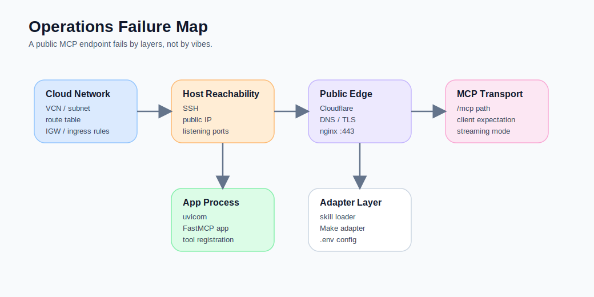
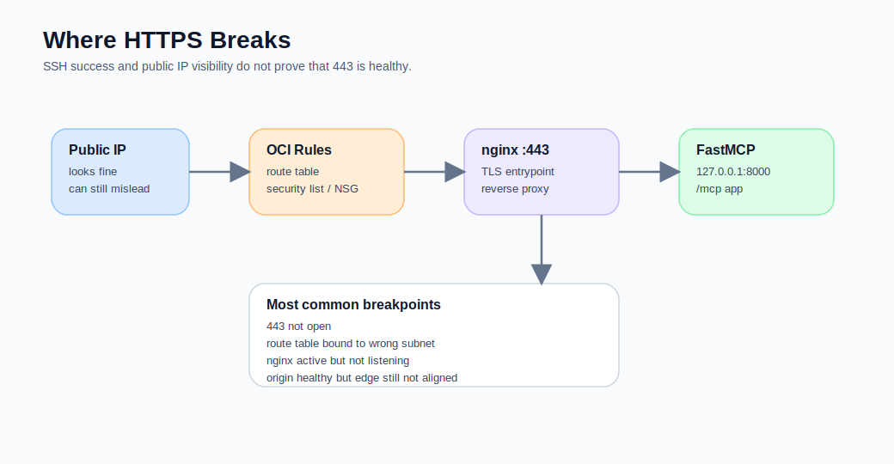
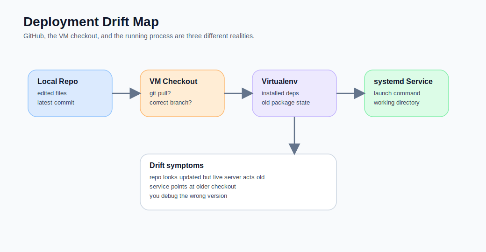
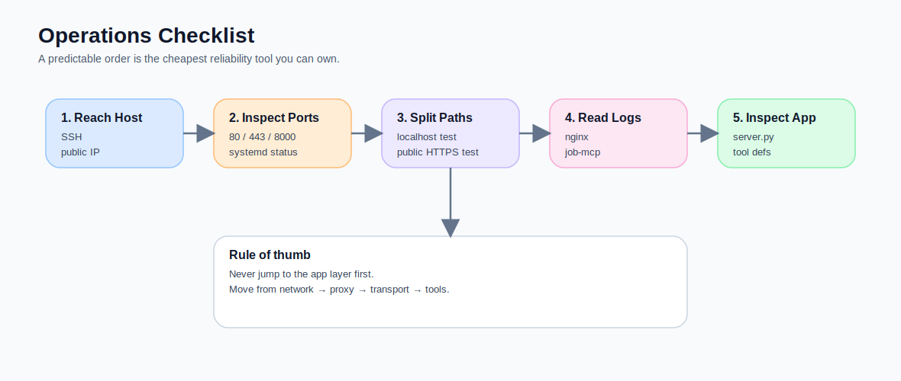

前四篇談的是觀念、部署、框架與 skills。  
這一篇我想把鏡頭拉回比較不浪漫、但實際上最貴的那一段：

> **上線之後，系統不是死在「不會寫 server」，而是死在「你以為這層沒問題」。**

只要你真的在 Oracle VM 上把 FastMCP 接到公開網路，再掛上 Cloudflare、nginx、systemd、`.env`、Make adapter，很快就會碰到幾種非常典型的錯覺：

- VM 已經有 public IP，怎麼還是連不到？
- 本機 `curl localhost` 明明是好的，為什麼外網 443 還是 refused？
- `/mcp` 回 `406 Not Acceptable`，到底是 app 壞了，還是 client 沒講好 transport？
- nginx 已經 active，為什麼 ChatGPT 還是無法列出 tools？
- repo 裡的程式明明更新了，為什麼 live server 還像活在昨天？

這篇不是把坑列成流水帳，而是把它們整理成一份**維運順序表**。  
因為真正有用的坑文，不是告訴你作者曾經崩潰過，而是讓你知道：

> **下次你也遇到時，應該先看哪一層。**



## 先講我現在的總結：不要用「功能視角」排錯，要用「層級視角」排錯

我以前最容易犯的錯，是一看到 ChatGPT 連不上，就直接懷疑：

- FastMCP 配置錯了
- skill loader 壞了
- tool descriptions 沒對齊
- Make adapter timeout

這樣想很自然，但不高效。

因為 remote MCP server 真正上線後，問題通常不是「某個功能失敗」，而是**某一層根本還沒成立**。  
我後來比較穩的排錯順序是：

1. **雲端網路層**  
   VM、public IP、route table、internet gateway、security rules。

2. **主機可達層**  
   SSH、OS、systemd、port listen 狀態。

3. **反向代理層**  
   nginx、TLS、DNS、Cloudflare proxy、origin cert。

4. **MCP transport 層**  
   `/mcp` path、Accept / transport expectation、streaming behavior。

5. **應用與工具層**  
   FastMCP app、tool registration、skill loading、Make adapter、env variables。

這個順序一旦固定，很多本來看起來很神祕的問題，其實都會縮回它原本應該在的位置。

## 坑 1：有 public IP，不代表這台 VM 真的對外

這是 Oracle VM 最常見也最浪費時間的一坑。

Oracle 的 public subnet / internet gateway 文件其實很清楚：  
**public IP 只是其中一塊**，還需要：

- subnet 的 route table 真的把對外流量導到 internet gateway
- security list 或 NSG 允許對應 ingress / egress
- 主機上相關 port 真的在 listen

也就是說，你看到 public IP，不應該直接問「為什麼服務壞了」，而應該先問：

> **這台機器現在到底是不是一台真的能被 internet 觸達的 host？**

### 我現在的第一個驗收順序

先不要急著打 `/mcp`。先驗這三件事：

```bash
ssh -i /path/to/private-key ubuntu@<PUBLIC_IP>
```

```bash
curl -I http://<PUBLIC_IP>
```

```bash
sudo ss -ltnp | grep -E ':22|:80|:443|:8000'
```

如果連 SSH 都不穩，或主機根本沒在 listen 80 / 443，那這不是 FastMCP 題，是網路題。

### 一個特別容易誤判的 Oracle 坑

我在 Oracle networking 上真的踩過一個很怪、但其實很典型的坑：

某些 route table 已經被掛到 **internet gateway ingress routing** 用途。  
這種表的 target 規則就不是你想的那種「對外 route table」，而是只接受 private IP 類型的 ingress target。  
結果就是你明明只是想加：

```text
0.0.0.0/0 -> Internet Gateway
```

卻會得到很不像人話的錯誤。

我後來的做法很簡單，也比較穩：

- 不跟那張表硬拗
- 直接新建一張 public route table
- 明確把 public subnet 指到那張新表

這種做法比較土，但很實際。

## 坑 2：22 通了，不代表 443 也通了

另一個很容易出現的錯覺是：

> **我已經 SSH 進去了，表示主機是通的，那 HTTPS 應該也沒問題吧？**

完全不是。

SSH 用的是 `22/tcp`。  
公開 MCP endpoint 幾乎一定要走 `443/tcp`。  
這兩條路從網路規則到外部體感都不是同一件事。

Oracle 的 security rule 文件也明說，如果沒有明確加入 HTTPS 443 的 ingress 規則，入站 HTTPS 不會被允許。  
所以你很可能會遇到這種狀況：

- 22 通
- 你能 SSH
- nginx 在機器裡是 active
- 但外網打 443 還是 connection refused 或 timeout

### 我的最小檢查手冊

```bash
sudo ss -ltnp | grep ':443'
```

```bash
sudo systemctl status nginx --no-pager
```

```bash
curl -vk https://<DOMAIN>/mcp
```

如果 `ss` 根本看不到 443 在 listen，就先別怪 Cloudflare。  
如果 VM 內部有 443，但外部還是 refused，下一步先看 Oracle 的 ingress rule，不要先看 Python。



## 坑 3：本機 8000 是活的，但外面世界根本不知道

這是我非常推薦保留的一個部署原則：

> **FastMCP 只聽 loopback，公開入口交給 nginx。**

這樣做的好處非常多：

- app 不直接暴露在公網
- TLS 與 path routing 可以由 nginx 處理
- 你可以比較穩地換 uvicorn / app process
- debug 時能把「內部 app 問題」與「外部入口問題」拆開

但這個做法也會帶來一個新坑：

你在機器內測：

```bash
curl http://127.0.0.1:8000/mcp
```

是通的。  
你就很容易以為一切都好了。

其實沒有。  
因為真正對外的是這條：

```text
Internet → Cloudflare → nginx :443 → 127.0.0.1:8000
```

中間任何一層沒接好，外面都看不到你的 app。

### 我現在固定會做的雙邊驗證

在 VM 內：

```bash
curl -i http://127.0.0.1:8000/mcp
```

在 VM 外：

```bash
curl -i https://mcp.example.com/mcp
```

這兩個都過，再往下看 tool listing。  
只過第一個，不代表部署成功，只代表 app process 沒死。

## 坑 4：`406 Not Acceptable` 不一定是 server 掛了

這個坑很適合寫進來，因為它超容易讓人誤判。

我第一次看到普通 `curl` 打 `/mcp` 回 `406 Not Acceptable`，直覺是：

- nginx header 亂了
- FastMCP 沒正確啟動
- app path 設錯了

後來才比較冷靜地接受一件事：

> **MCP endpoint 不是給「任意 HTTP client」隨便戳就能得到漂亮 HTML 的。**

當 client 沒有用對 transport 期待、沒有講對接收格式，或沒有走 MCP 預期的請求流程時，出現 4xx 並不奇怪。  
MCP 在 2025 年已把早期的 HTTP+SSE transport 進一步演進成 Streamable HTTP；FastMCP 也明確建議 production 新部署優先使用 Streamable HTTP，而 SSE 主要作為 backward compatibility 存在。  
所以 `/mcp` 不是首頁，它是協定入口。citeturn677151view5turn677151view4turn677151view3

### 我的實務判準

如果你遇到 `/mcp` 回 406，不要第一時間把它當成「一定壞掉」。

先問三件事：

1. 這是不是一個真的懂 MCP transport 的 client？
2. path 對了嗎？是 `/mcp` 還是 `/mcp/`？
3. 這個請求是不是只是拿普通瀏覽器 / 普通 curl 在敲協定端點？

也就是說，**406 更像 transport 對話沒講好，不一定是 app 已經死了。**

## 坑 5：Cloudflare 讓問題看起來不像 origin 問題

Cloudflare 很方便，真的。  
但它也很會把問題包裝成另外一種問題。

例如：

- DNS 有了，不代表 origin 通了
- SSL mode 不對，外面看起來像 TLS 問題，實際上是 origin 配置沒對齊
- proxy 開著時，你看到的是 edge 行為，不是 VM 原始行為

所以我現在遇到「外部打不通」時，會刻意分兩步：

### 第一步：先看 origin 內部

在 VM 上看：

```bash
sudo systemctl status nginx --no-pager
sudo journalctl -u job-mcp.service -n 50 --no-pager
sudo ss -ltnp | grep -E ':443|:8000'
```

### 第二步：再看經過 Cloudflare 的外部入口

```bash
curl -vk https://mcp.example.com/mcp
```

我會盡量避免一開始就只從 Cloudflare 端猜。  
因為很多時候問題其實還停在 VM 裡。

## 坑 6：`systemctl status` 不是壞掉，是你掉進 pager 了

這個坑很小，但非常真實，也很值得寫進來。

第一次在 VM 上跑：

```bash
systemctl status job-mcp.service
```

如果畫面看起來停住，很多人會有一秒鐘懷疑人生。  
其實你只是掉進 pager。

我現在幾乎一律這樣用：

```bash
systemctl status job-mcp.service --no-pager
systemctl cat job-mcp.service --no-pager
journalctl -u job-mcp.service -n 100 --no-pager
```

這不是技術炫耀，而是很單純的減少誤判。

## 坑 7：repo 更新了，不等於 live server 已經更新

這也是我後來很重視的一個維運心法：

> **GitHub 上的檔案狀態，和 Oracle VM 上正在跑的那一份，不是同一件事。**

你可能在 repo 裡改了：

- server.py
- tool_definitions.py
- skill loader
- `.env.example`
- nginx config 備忘

但 VM 上真正還在跑的，可能還是前一版 checkout、前一版 venv、前一版 systemd 啟動命令。

### 我現在會固定驗這幾件事

```bash
cd /opt/job-mcp/app
git rev-parse --short HEAD
git status
```

```bash
systemctl cat job-mcp.service --no-pager
```

```bash
sed -n '1,220p' /opt/job-mcp/app/mcp_server/app/server.py
```

這些動作看起來笨，但它會直接幫你避免一種最花時間的鬼打牆：

> **你一直在 debug 現在這版的程式，但 live service 根本不是現在這版。**



## 坑 8：`.env` 可以看，但不要用最危險的方式看

上線之後，大家都會有一個衝動：

```bash
cat .env
```

我現在非常不推薦這麼做。

因為一旦這台 VM 真的是 production-ish 環境，`.env` 裡常常已經有：
- API keys
- Make webhook / auth settings
- adapter config
- host-facing secrets

更穩的做法是先看「變數名」，不是先看值。

例如：

```bash
grep -E '^[A-Z0-9_]+=' /opt/job-mcp/app/.env | cut -d= -f1 | sort -u
```

或：

```bash
awk -F= '/^[A-Z0-9_]+=/{print $1"=<hidden>"}' /opt/job-mcp/app/.env
```

這種習慣很 boring，但是真正能減少事故。

## 坑 9：不要讓 FastMCP 一邊當公網入口，一邊直接吃所有底層 execution 複雜度

這個坑比較架構層，但我還是想寫進來。

當一台 FastMCP server 上線後，最容易出現的誘惑是：

- 再多接幾個工具
- 再直接呼叫更多 backend
- 再把更多策略塞到 server 裡

最後它又會慢慢長回一顆 workflow brain。

我現在比較堅持的原則是：

- 對外只暴露高層 skill 或清楚 contract 的 tool
- server 是薄層，不是第二個大腦
- 真正 execution-heavy 的東西，要嘛留在 Make，要嘛留在受控 adapter
- 維運層面先顧穩定入口，再談多能力擴張

也就是說，**上線手冊的本質不是讓你加更多功能，而是讓你不要把剛整理好的責任邊界又弄糊。**

## 我現在的維運順序表

如果今天有一個人接手這台 Oracle VM + FastMCP + Cloudflare 系統，我最想直接丟給他的不是一堆背景故事，而是這張順序表：

### Step 1：先確認主機活著
```bash
ssh -i /path/to/private-key ubuntu@<PUBLIC_IP>
```

### Step 2：先看 port 與 service
```bash
sudo ss -ltnp | grep -E ':80|:443|:8000'
systemctl status nginx --no-pager
systemctl status job-mcp.service --no-pager
```

### Step 3：先分清楚內外兩條路
```bash
curl -i http://127.0.0.1:8000/mcp
curl -vk https://mcp.example.com/mcp
```

### Step 4：再看日誌
```bash
journalctl -u job-mcp.service -n 100 --no-pager
journalctl -u nginx -n 100 --no-pager
```

### Step 5：最後才回到 app / tool / adapter
```bash
sed -n '1,220p' /opt/job-mcp/app/mcp_server/app/server.py
sed -n '1,260p' /opt/job-mcp/app/mcp_server/app/tool_definitions.py
```

這個順序的價值，不在酷，而在於它能阻止你一開始就跳到錯的層。

## 這篇最想留下的反例

我也想留一個反例，避免這篇變成「只要照做就天下太平」的錯覺。

**不是所有問題都值得靠更多 observability 或更多框架功能去解。**

有些問題真的只是：
- 443 沒開
- route table 掛錯
- nginx 沒 reload
- service 跑的不是你以為那個版本
- 你在拿普通 curl 打協定入口

這類問題如果一開始就往「是不是還要再加一個 proxy / monitoring agent / fancy gateway」去想，通常只會把地板擦得更亮，卻沒有先把門打開。

## 最後一句實話：維運不是附錄，它是 self-hosted MCP 的一半工程量

如果 Part 2 講的是「怎麼把 server 架起來」，那 Part 5 真正想說的是：

> **一台自架的 remote MCP server，從來不是 deploy 完就結束。**
> **它真正的成本，有很大一部分在維運與排錯順序。**

你可以把這理解成壞消息。  
也可以把它理解成一個比較成熟的工程現實：

當你不再把入口交給 PaaS 或現成平台，得到的是更多控制力，但也順便得到更多需要自己負責的真相。


