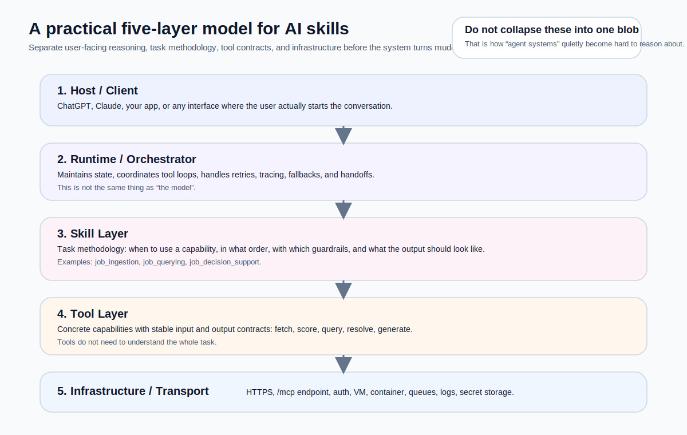

When I first ran into these words, I was properly lost.

Every article seemed to mention agents, tool calling, MCP, skills, runtimes, orchestration, and prompts, often in the same breath. The trouble was not that the concepts were impossible. The trouble was that they were being discussed at different layers, as if they all belonged in the same drawer.

So this piece is for that stage. It is for the version of you, and frankly the version of me, who had already read quite a lot and still felt as though the fog kept getting thicker.

I am not trying to produce another glossary. I want to put these terms back where they actually belong in a system. Once you do that, both other people’s writing and your own architecture diagrams start to make far more sense.

<figure>
  
  <figcaption>Once these five layers are separated, discussions about skill-first design and MCP become much easier to follow.</figcaption>
</figure>

---

## Why these terms get muddled so easily

In AI systems, confusion often starts not because the model is weak, but because the **system boundary is blurry**.

The most common mix-ups look like this:

- treating a **skill** as a prompt file
- treating a **tool** as any vaguely useful thing
- treating **MCP** as if it were a built-in skill router
- treating **runtime** or **orchestrator** as if it simply meant “the model”
- treating a product such as ChatGPT as if it were the entire internal system

On a small demo, you can sometimes get away with that. On a real system, the muddle shows up the moment you need permissions, retries, tracing, side-effect control, observability, or long-term maintenance.

That is why this article is not mainly about definitions. It is about **responsibility boundaries**.

---

## The shortest useful answer

If you want the quick version first, keep these five lines in your head:

> **A tool is a capability.**  
> **A skill is a task method.**  
> **MCP is a standard interface.**  
> **A runtime or orchestrator is the execution and coordination system.**  
> **The LLM is the reasoning core, not the whole application.**

That is the whole shape in miniature. Now let’s unpack it properly.

---

## 1. A tool is an executable capability, not task understanding

The simplest way I remember a tool is this:

> A tool is not there to understand the whole task.  
> A tool is there to execute a bounded capability.

If something talks to the outside world, or packages a repeatable capability into a callable interface, it is probably a tool.

Typical examples include:

- querying a database
- calling an internal API
- scraping a page
- writing into Google Sheets
- running SQL
- doing vector retrieval
- generating structured output
- updating an external system

In MCP terms, tools are capabilities a server exposes to a model. The specification cares about names, descriptions, schemas, and callability. It does not care whether the underlying business meaning feels “high-level”. That is why both a simple query function and a surprisingly elaborate scoring flow can still be tools.[1][2]

### In practice, good tools are judged by things like

- clear input schemas
- stable output shapes
- controlled side effects
- diagnosable errors
- isolatable permissions
- retryability and observability

Notice what is missing from that list: “does it understand the user’s actual task?” It does not need to. A tool only needs to do *its bit* well.

---

## 2. A skill is task methodology, not merely a prompt

This is where many teams wobble.

At first glance, a skill can look like:

- a prompt
- a markdown folder
- a set of instructions
- a bundle of examples

That is not entirely wrong, but it is incomplete.

A better definition is:

> **A skill is a task-level capability wrapper.**  
> It defines when a method should be used, which tools are allowed, how the work should proceed, and what a finished result should look like.

So the essence of a skill is not the file format. The essence is **task methodology**.

A mature skill should answer at least these questions:

1. **Task boundary**  
   What problem does this skill solve, and what does it deliberately not solve?

2. **Routing conditions**  
   What signals suggest this skill should be used?

3. **Allowed tools**  
   Which tools should the model be able to see for this task, and which should it not see?

4. **Execution strategy**  
   Should it fetch before scoring? Resolve the reference before deep analysis? Ask for clarification first?

5. **Output contract**  
   Is the result a short summary, structured JSON, a shortlist, a risk table, or an application pack?

6. **Quality and governance rules**  
   When should the system block, clarify, or refuse to guess?

That is why I do not think “skill” should be reduced to “prompt, but fancier”. YAML, markdown, examples, and tests are only the **expression form**. The actual point is that the task method has been made explicit.

---

## 3. MCP is a standard interface, not your skill policy engine

MCP is extremely useful, but it is also heavily mythologised.

Once people hear “MCP”, they often start to assume:

- tool selection is now solved
- skill routing will happen naturally
- the client will definitely use the right resources first
- a skill-first architecture will emerge by itself

That is not what MCP does.

MCP standardises how hosts, clients, and servers exchange external capabilities and context. The protocol gives you primitives such as tools, resources, and prompts. That is very powerful, because it gives you a common capability surface. What it does *not* give you is a built-in strategy engine for skill selection, tool exposure policy, or risk gating.[1][3][4]

A less romantic but more accurate summary would be:

> MCP solves **capability transport**.  
> It does not automatically solve **task policy**.

This matters enormously.

If you expose raw tools alongside a pile of documents, MCP does not guarantee that the model will read the right thing first, follow your intended decision order, or respect your desired skill boundaries. It gives you standardisation, not obedience.

That is why many systems can be “MCP-enabled” and still remain stubbornly tool-first.

---

## 4. Runtime and orchestrator are execution layers, not synonyms for “the model”

This is another subtle but important distinction.

People often say things like:
- the model is the orchestrator
- the runtime is just the agent loop
- if the LLM chooses the tools, that means it *is* the orchestration layer

Again, only partly true.

A model can certainly participate in orchestration. But orchestration is broader than selecting a next step.

A production-minded runtime or orchestrator usually has to deal with:

- receiving requests
- maintaining state
- controlling the tool loop
- restricting visible tools
- handling retries, fallbacks, and timeouts
- tracing and logging
- human-in-the-loop checkpoints
- persistence and recovery

LangGraph describes itself as a low-level orchestration framework and runtime focused on durable execution, streaming, and human-in-the-loop flows. OpenAI’s Agents SDK likewise places tools, handoffs, and traces in the runtime layer rather than pretending a prompt alone should handle them.[8][9]

### What the LLM is genuinely good at

An LLM is excellent at:

- intent classification
- route suggestion
- next-step planning
- tool selection
- explanation synthesis

But it is not automatically your:

- state store
- retry manager
- policy engine
- observability layer
- execution scheduler

That difference matters more and more as a system grows.

---

## 5. So what is ChatGPT in this picture?

From a systems perspective, ChatGPT is best understood as a **host or client-side entry point**.

OpenAI’s MCP-related materials are quite clear here. ChatGPT developer mode and the Apps SDK are about how ChatGPT can connect to remote MCP servers, discover capabilities, and bring those capabilities into user conversations. In other words, ChatGPT is the **upstream product surface**, not your internal skill registry or your execution backend.[5][6][7]

A more accurate split looks like this:

- **ChatGPT**: the host or client-facing interaction surface
- **your skill layer or skill gateway**: the task and governance layer
- **your tools, Make flows, or APIs**: the execution layer

Once that split is stable in your head, you stop expecting “ChatGPT can call tools” to magically solve all your design problems.

---

## 6. What goes wrong when the layers are collapsed

This is not merely terminological fussiness. There are engineering consequences.

When skills, tools, MCP, runtime, and host are blurred together, a few recurring failure modes show up.

### Tool-first systems pretending to be skill-first

This is the most common one. Teams expose lots of raw tools to the model, attach some documents, and hope the model will behave as though a proper skill boundary exists.

In truth, they have put the instruction manual into the toolbox. They have not actually enforced the boundary.

### Strategy hard-coded into tools

Another common mistake is stuffing routing logic, business rules, and prompting policy into a low-level tool. It feels fast at first, but it welds strategy to execution. Later, changing hosts, runtimes, or backends becomes needlessly painful.

### Treating MCP as an orchestration engine

MCP gives you standardised exposure of capabilities. It does not choose task boundaries, do clarification policy, or decide risk levels on your behalf.

### Treating the LLM as the entire application

This one is seductive because early prototypes often feel magical. But the moment you need tracing, retries, permission boundaries, deterministic side effects, or postmortems, the fantasy starts to crack.

---

## 7. A five-layer mental model that is actually useful

If you are trying to reason about a real system, I strongly recommend this five-layer model.

### Layer 1: Host / Client
ChatGPT, your app, your interface, or whatever the user actually talks to.

### Layer 2: Runtime / Orchestrator
The system that manages state, tool loops, retries, handoffs, tracing, and fallbacks.

### Layer 3: Skill Layer
The place where task methodology lives: boundaries, guardrails, allowed tools, and output expectations.

### Layer 4: Tool Layer
Concrete capabilities: fetch, query, write, score, generate, resolve.

### Layer 5: Infrastructure / Transport
HTTPS, auth, the `/mcp` endpoint, VMs, containers, queues, logs, and secret storage.

Once you use this model, many questions become much easier to place:

- Is this a prompting issue or a routing issue?
- Is this a tool contract problem or a skill-boundary problem?
- Is this an MCP transport issue or a TLS and hosting issue?
- Is this ChatGPT behaviour or server-side policy?

---

## 8. A practical review checklist for people already building systems

If you are beyond the beginner stage and reviewing an actual architecture, I would ask these questions.

### Tool review
- Are the input and output contracts stable?
- Are errors structured?
- Are side effects controlled?
- Is too much task meaning being hidden inside a capability?

### Skill review
- Are skills defined in user-task language rather than implementation language?
- Are allowed tools explicit?
- Is the output contract consistent?
- Are clarification and blocked states defined?

### MCP review
- Are the right capabilities exposed?
- Has policy accidentally been outsourced to the protocol?
- Are tools, resources, and prompts being used intentionally rather than decoratively?

### Runtime review
- Which parts are deterministic?
- Which parts are delegated to model reasoning?
- Where do state and logs live?
- Are tracing, retries, and fallbacks real or merely hoped for?

If you can answer those cleanly, the system usually has proper bones.

---

## 9. Final thought: get the words right, and the system starts growing in the right direction

I genuinely sympathise with the “I have read quite a lot and I am somehow more confused now” stage, because I have been there myself.

What eventually helped was not memorising more jargon. It was accepting that these words are **not peers**. They do not sit at the same layer, and they are not trying to answer the same question.

If I had to close with one compact rule, it would be this:

- use **tools** to package executable capabilities
- use **skills** to package task methods
- use **MCP** as the standard capability interface
- use **runtime / orchestration** to manage flow and governance
- treat **ChatGPT** as a host or client, not as your internal architecture

Once that clicks, the rest of the conversation around skill-first design, FastMCP, Make, or gateway servers becomes much less muddy.

---

## Further reading

The official docs and tutorial references I used are collected in:

`./resource/references.md`

---
