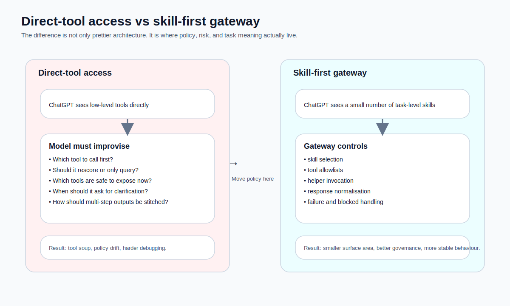

If you already have a handful of working tools, the first instinct is perfectly understandable:

> If ChatGPT can call tools over MCP anyway, why not just wire the tools in directly?

I understand that instinct completely.  
It is fast, intuitive, and in early prototypes it often appears to work.

The problem is that **working once** and **growing safely** are not the same thing.

Once your tools involve multi-step flows, writes, permissions, accounts, external side effects, and quality governance, letting ChatGPT see the raw tool layer usually stops being a shortcut. It becomes a way of outsourcing system policy to a probabilistic model that was never meant to carry it all alone.

So this article is not saying direct tool access is always wrong. It is making a narrower point:

> For systems with task semantics, governance needs, and meaningful risk,  
> **ChatGPT usually should not connect directly to low-level tools.**  
> A skill-first gateway or thin skill server is often the healthier middle layer.

<figure>
  
  <figcaption>This is not merely an aesthetic difference. It changes where policy, risk, and task meaning actually live.</figcaption>
</figure>

---

## First, a fair caveat: direct tool access is not always a bad idea

I do not want to turn this into dogma.

### When direct tool access is often fine

If your setup looks like this:

- very few tools
- almost no side effects
- no sensitive writes
- thin task logic
- prototyping or internal experimentation
- little dependency between tools

then letting ChatGPT call the raw tools may be completely sensible.

Examples:
- a weather lookup
- read-only knowledge retrieval
- light search and summarisation
- small utility tools with no risky consequences

In those cases, direct exposure can genuinely be the fastest path.

But the moment your system starts to involve things like:

- fetch, then score, then query, then generate
- helper tools that should not be public
- task-specific tool visibility
- blocked, clarification, or not-found behaviour
- writes to storage or external systems

the trade-offs change quickly.

---

## 1. Direct-tool access looks simple because it pushes the hard decisions elsewhere

Without a skill-first layer, the pattern often looks like this:

1. expose several low-level tools over MCP
2. attach a prompt or some markdown rules
3. hope the model reconstructs the intended task logic from the available descriptions

That approach hides a powerful assumption:

> the model will reliably infer your intended task method  
> from tool descriptions and supporting documents alone

That is precisely where things become fragile.

Tools are for callable capabilities. Resources provide readable context. Prompts are discoverable templates. All of these are valuable MCP primitives. None of them, by themselves, are a guaranteed skill-first policy mechanism. If every raw tool is visible, the model is theoretically free to choose any of them. Your intended skill boundary is not structurally enforced.[1][2][3][4]

So the issue is not that the model is “bad at tools”.  
The issue is that the **wrong layer has been asked to shoulder policy**.

---

## 2. MCP matters a great deal, but it is not a skill policy engine

This is the point that most often gets romanticised.

People see MCP and start to assume:
- tool selection is now “handled”
- skill routing will emerge naturally
- exposing documents as resources will guarantee correct behaviour
- the existence of prompts means the model will follow your preferred order

MCP does something different, and still extremely important: it standardises capability exposure across hosts, clients, and servers. That is a big architectural win. But standardised capability transport is not the same thing as task policy, risk gating, or enforced tool boundaries.[1][3][4]

A blunter but more accurate line would be:

> MCP solves **capability transport**.  
> It does not automatically solve **task policy**.

That is why many systems can be properly “MCP-enabled” and still behave in a completely tool-first way.

---

## 3. A skill-first architecture reduces the number of things the model must improvise

This is one of the most practical reasons to adopt it.

Without a skill-first layer, the model has to improvise answers to questions such as:

- What task type is this really?
- Should it fetch first or query first?
- Is re-scoring necessary?
- Which tools should be visible right now?
- Does the user need to clarify the target?
- How should a helper tool be invoked?
- How should multi-step results be stitched together?

In genuinely open-ended research work, that kind of improvisation can be useful. In bounded domains with known side effects and clearer operating rules, it often becomes a governance liability.

So skill-first design is not mainly about restricting the model. It is about this:

> Make deterministic things deterministic.  
> Make policy explicit.  
> Save the model’s reasoning budget for the parts that are genuinely worth reasoning about.

That tends to produce systems which are both steadier and easier to evolve.

---

## 4. What a thin skill server actually does

Hearing “skill server” can make people imagine another giant platform. That is not what I mean.

A good **thin skill server** should stay deliberately lean. It should not replace your backend, and it should not absorb all execution complexity. Its main jobs are usually these four:

1. **load skill definitions**
2. **perform minimal routing**
3. **control tool exposure policy**
4. **translate high-level skill calls into low-level tool sequences**

The word **thin** matters here.

It is not meant to rewrite Make flows, become your data plane, or turn into a second orchestration monolith. Its purpose is to separate **task semantics** from **execution mechanics**.

---

## 5. A concrete example: why direct-tool access starts to wobble

Imagine you expose the following tools directly to ChatGPT:

- `fetch_recent_jobs`
- `bulk_score_new_jobs`
- `query_jobs`
- `generate_job_output`

Now imagine the user says:

> Find PM jobs from the last three days on JobStreet, shortlist the ones above 80, and tell me which ones are worth applying to.

From a human point of view, that sounds like one natural request. From a systems point of view, it already contains at least three task-level goals:

1. refresh the pool
2. retrieve a shortlist
3. generate decision support for that shortlist

If there is no skill-first layer, the model must decide for itself:

- fetch first or query first?
- rescore or not?
- how to turn natural language into a query spec?
- analyse every result or only top N?
- whether clarification is needed?
- whether a helper should be invoked before the main output flow?

Sometimes that may work beautifully. Sometimes it will work slightly differently each time. Once side effects enter the picture, “slightly differently each time” stops being charming and starts becoming a systems problem.

---

## 6. Skill-first changes the world the model is allowed to see

A steadier pattern is to let ChatGPT see only a small set of **task-level skills**, rather than the entire raw tool layer.

For a job-search system, that may look like:

- `job_ingestion`
- `job_querying`
- `job_decision_support`

From ChatGPT’s perspective, those are task-level entry points.  
Inside the server, those skills can then map to concrete tools such as:

- `job_ingestion` → `fetch_recent_jobs`, optionally followed by `bulk_score_new_jobs`
- `job_querying` → `query_jobs`
- `job_decision_support` → `generate_job_output`, optionally preceded by `resolve_job_reference`

That one move changes several things at once.

### User language and system language line up

Users never ask to “run `query_jobs`”. They ask for a shortlist, a refresh, or an analysis. Skills are a much better place to align user language with system intent.

### The visible tool surface becomes smaller

A skill typically needs far fewer tools than a raw execution layer might expose. A smaller visible set reduces misuse and lowers the model’s selection burden. OpenAI’s MCP guidance also makes it clear that careful tool exposure and descriptions matter a great deal.[5][6]

### Quality governance finally gets a stable target

Without a skill layer, evaluating “decision support quality” is slippery, because the model may take different tool paths each time. With a skill layer, you can define entry conditions, allowed tools, blocked states, clarification rules, and output contracts much more cleanly.

---

## 7. What role should ChatGPT play here?

My answer is this:

> **ChatGPT should usually be the upstream host and conversational surface,**  
> **not the sole owner of your internal orchestration policy.**

OpenAI’s Apps SDK and developer mode material essentially describe this shape already: ChatGPT can connect to a remote MCP server and use the capabilities it exposes. That means you are perfectly free to place your own skill gateway between ChatGPT and the raw execution layer.[6][7]

A healthy division of labour often looks like this:

- **ChatGPT**: user interaction, context handling, final natural-language response
- **skill gateway / thin skill server**: skill routing, tool exposure, request and response normalisation
- **Make / APIs / databases / crawlers**: deterministic execution

That is not bureaucracy for its own sake. It is each layer doing the job it is actually good at.

---

## 8. What a skill-first server should not become

There is a danger at the other end as well.

Some teams create this middle layer and then slowly let it grow into a second monolith. That is not the goal.

A thin skill server should not:

- rewrite all underlying Make flows
- become the data layer
- absorb every business rule
- replace your secret manager or deployment stack
- mutate into a full workflow engine

It should remain focused on:

- skill loading
- request normalisation
- minimal routing
- allowed-tool policies
- adapter invocation
- response normalisation

If it starts swallowing too much execution logic, it loses the very advantage that made it useful.

---

## 9. For serious teams, skill-first is not aesthetic. It is governance.

I want to emphasise this because it is easy to make skill-first sound like architecture fashion.

It is not mainly about having a prettier diagram. It directly affects things you will eventually care about:

### Permission and risk isolation
If some tools write data, operate accounts, trigger services, or consume quotas, you should be able to decide which tasks are even allowed to see them.

### Observability
When somebody says “the system behaved strangely today”, you need to know:
- which skill was selected
- which tools were visible
- which adapter path was taken
- which step blocked or failed

### Evolvability
If you later replace a backend, switch runtime, split a generation flow, or change hosts, a skill-first layer gives you a much cleaner seam.

### Evaluability
A skill-first architecture gives you concrete things to evaluate. You can assess `job_ingestion`, `job_querying`, and `job_decision_support` rather than one opaque heap of tool calls.

---

## 10. A practical rule of thumb: when should you move beyond direct-tool access?

I would start taking skill-first design seriously if three or more of these are true:

- your number of tools is growing
- tools have meaningful side effects
- some helper tools should not be public
- requests are naturally multi-step
- you need permission or risk tiers
- you need structured blocked and error states
- you want stable evaluation targets
- you may swap backends or runtimes later
- the model feels clever but difficult to govern

At that point, direct low-level access often enters diminishing returns territory.

---

## 11. Final thought: direct tool access is fast, but skill-first lasts longer

I completely understand why teams begin with direct tool access. It is quick, it is satisfying, and it is often the right way to prototype.

But once the system has:

- a stable domain
- multi-step task structure
- meaningful side effects
- governance needs
- long-term evolution pressure

the cost of staying fully tool-first rises sharply.

The path I trust more is:

- keep low-level tools as the execution layer
- place a thin skill server above them
- expose high-level skills to ChatGPT
- let the server control routing, visibility, and adapter invocation

That is not extra bureaucracy. It is what turns “the model improvises over tools” into “the system exposes governed task capabilities”.

---

## Further reading

The official docs and tutorial references I used are collected in:

`./resource/references.md`

---
