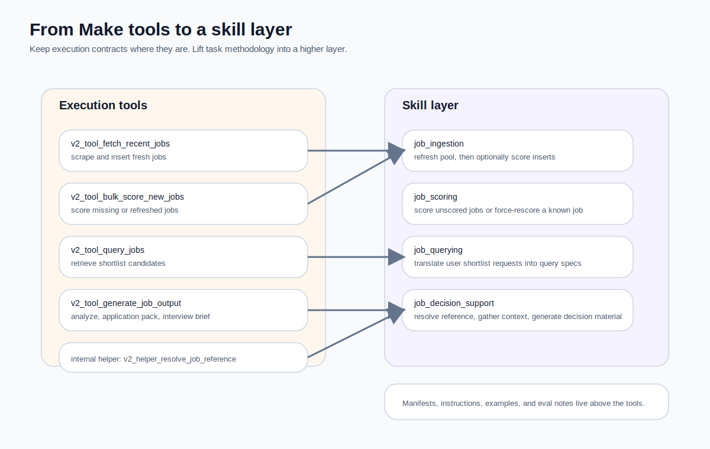

When teams start talking about skills, the first practical question is usually this:

> If I already have working flows, APIs, automations, and sheets,  
> what value is the skill layer supposed to add?

That is a fair question, because most teams do not start from a blank page. They start from a pile of living execution flows.

That was my situation as well with this Make-based job system:

- the low-level tools already existed
- the I/O contracts were beginning to stabilise
- there was no formal skill registry yet
- there was no proper skill-first gateway yet
- the upstream host could be ChatGPT, or something else later

In that middle stage, I think there are two dangerous shortcuts:

1. expose every low-level tool to the model
2. rename a complex workflow as a “skill” without changing the responsibility split

The healthier third path is this:

> **Do not throw the tools away and rewrite everything as skills.**  
> **Accept the tools as the execution layer, then build a skill layer above them.**

That is what this article is about.

<figure>
  
  <figcaption>The real move is not renaming tools. It is lifting task methodology above the execution layer.</figcaption>
</figure>

---

## First, what tools actually exist in this case?

Based on the current v2 Make blueprints and the public `job-skills-gateway` repository, the execution layer here is mainly made of four public tools and one internal helper:

- `v2_tool_fetch_recent_jobs`
- `v2_tool_bulk_score_new_jobs`
- `v2_tool_query_jobs`
- `v2_tool_generate_job_output`
- `v2_helper_resolve_job_reference`

The repository README is also explicit about the intended split: a thin skill layer sits between ChatGPT and the Make execution flows, while Make remains the execution backend rather than becoming the skill system itself.[1]

That distinction matters. It means we are not inventing skills from scratch. We are extracting task-level meaning from an existing execution substrate.

---

## 1. The first step is not naming skills. It is understanding tool responsibility.

This is the part many teams skip, and I think it is the most important part.

If you do not first understand what each tool is actually responsible for, you will end up promoting implementation details into skill names.

### 1. `v2_tool_fetch_recent_jobs`
This tool is responsible for:

- receiving parameters such as `source_site`, `role_keyword`, `days`, `page_from`, and `page_to`
- normalising role keywords
- generating search URLs
- fetching recent jobs
- inserting or returning them in a usable format

Its boundary is clear:

> **refresh or ingest recent job data**

That gives it strong task flavour, but it is still an execution tool. It does not answer “which jobs are worth applying to?” and it does not define the broader task method.

### 2. `v2_tool_bulk_score_new_jobs`
This tool is responsible for:

- finding unscored jobs, or a specific job to rescore
- producing score, relevance, and reasons
- writing those outcomes back into storage

It is easy to mistake this for a skill because it sounds intelligent. But from a systems perspective it still performs a bounded capability:

> **score existing jobs in batch or by explicit target**

### 3. `v2_tool_query_jobs`
This one exposes a fairly rich query surface, including things like:

- `days`
- `job_status_filter`
- `min_score`
- `keyword_query`
- `top_k`
- `sort_by`
- `sort_order`

It returns structured shortlist data such as jobs, matched counts, relevant counts, and a primary job id. This is a mature retrieval tool. Yet its job is still simply:

> **retrieve a result set from the job pool**

That is not yet a skill boundary, because it does not decide how natural-language intent should become a query spec, or how no-result behaviour should be handled.

### 4. `v2_tool_generate_job_output`
This is the one people most often hesitate over, because it already touches task semantics.

It handles modes such as:

- `analyze_job`
- `generate_application_pack`
- `prepare_interview_brief`

and it can involve reference resolution, job-description context, and generation.

Even so, I would still treat it first as a **high-level execution tool**, not as the skill itself. Why? Because it is still mainly a multi-mode capability. A skill should decide *when* to enter which mode, whether reference resolution is required first, which supporting tools are allowed, and how failure states should be handled.

### 5. `v2_helper_resolve_job_reference`
This helper matters a great deal, but I would deliberately keep it internal.

Its role is to:
- resolve a target job via job id, company/title, or message clues
- return blocked or not-found states when appropriate
- prepare later flows with a concrete job reference

This is the sort of thing I think of as an orchestration organ rather than a public skill.

---

## 2. Existing tools are not skills, but they are excellent material for designing one

This is the sentence I most want people to remember:

> **Existing tools are not the skill layer.**  
> **But existing tools are often the best raw material for building one.**

A skill layer is not there to deny the tools. It is there to reorganise, govern, constrain, and contextualise them.

That is why I dislike the lazy pattern of simply creating:

- `fetch_recent_jobs` skill
- `bulk_score_new_jobs` skill
- `query_jobs` skill
- `generate_job_output` skill

That may be technically tidy, but it exposes implementation language as though it were task language.

Users do not really ask for “run `query_jobs`”.  
They ask to refresh the pool, fill in scores, retrieve a shortlist, or decide whether a role is worth pursuing.

The skill layer exists to separate those languages.

---

## 3. Design skills from user tasks, not from tool names

If you cut your skill system from the tool side, you often end up with a diagram that engineers understand and users would never naturally speak.

A better question sequence is:

1. What task is the user actually asking for?
2. Does that task span more than one execution capability?
3. Which tools should be visible for it?
4. Which tools are helper-only?
5. What should “done” look like for this task?

Viewed this way, the skill map for this Make-based job system becomes much more stable.

### Skill A: `job_ingestion`
Its responsibility is refreshing the job pool.

This is not one tiny step. It is a task capability:
- fetch fresh jobs
- update the candidate pool
- optionally score the newly inserted items

Internally it would mainly use:
- `v2_tool_fetch_recent_jobs`
- then `v2_tool_bulk_score_new_jobs` when appropriate

### Skill B: `job_scoring`
The repo explicitly separates this skill, and I think that is a sensible choice.[1]

It answers questions such as:
- score all currently unscored stored jobs
- backfill missing scores
- rescore a known job

It maps mainly to:
- `v2_tool_bulk_score_new_jobs`

The value here is that “curate and complete the job pool” becomes its own task capability, rather than being permanently glued to ingestion.

### Skill C: `job_querying`
Its responsibility is retrieving shortlists from the stored pool.

That is not the same as the query tool itself, because the skill should also define:
- how natural language becomes a query spec
- which defaults should be applied automatically
- how score and relevance are prioritised
- what to do when nothing matches

It maps mainly to:
- `v2_tool_query_jobs`

### Skill D: `job_decision_support`
Its responsibility is generating higher-value decision material for one job or a small set of candidate jobs, such as:
- whether the role is worth applying to
- an application pack
- an interview brief

It maps mainly to:
- `v2_tool_generate_job_output`
- with `v2_helper_resolve_job_reference` used internally beforehand

This is the skill that most clearly shows the value of a proper skill layer. It is not merely “call the biggest tool”. It is a task method with boundaries.

---

## 4. A skill should not just be a prompt. It should be a packet of definitions.

Another thing teams often underestimate is how much better a skill becomes when it is treated as more than one instruction file.

A mature skill should usually have several kinds of assets.

### 1. Manifest
A manifest is for systems and routers.

It should record things like:
- skill name
- description
- applicable request types
- allowed tools
- expected inputs
- output contract
- boundaries and constraints
- version information

Its value is not prettiness. Its value is that it becomes **routeable, governable, comparable, and testable**.

### 2. Instructions
Instructions are for the model and the system designer.

They should describe:
- processing order
- clarification rules
- failure conditions
- things the skill should not do
- principles for presenting results

This is not merely a prompt. It is more like an operating manual for a task method.

### 3. Examples
Many teams treat examples as decoration. I think examples are behaviour assets.

Without them, it becomes much harder to calibrate:
- what sorts of requests should enter the skill
- what counts as a successful result for that skill

### 4. Eval notes
This layer is often omitted, but it matters if you care about iteration.

Sooner or later you will need to answer:
- where does this skill commonly fail?
- what requests confuse routing?
- what outputs require human review?
- what are the acceptance checks?

If those answers do not live anywhere explicit, the skill slowly becomes folklore.

---

## 5. What this can look like in practice

Here is a simplified example of what a `job_querying` manifest might look like.

```yaml
name: job_querying
description: Retrieve shortlist candidates from the stored job pool.
allowed_tools:
  - v2_tool_query_jobs
inputs:
  - days
  - min_score
  - keyword_query
  - top_k
  - sort_by
  - sort_order
output_contract:
  type: shortlist
  fields:
    - jobs
    - matched_count
    - relevant_count
    - primary_job_id
boundaries:
  do_not_score_new_jobs: true
  do_not_generate_application_pack: true
```

And the accompanying instructions might look like this:

```md
# job_querying instructions

Use this skill when the user wants a shortlist from the stored job pool.

Rules:
1. Translate natural-language filters into a structured query spec.
2. Prefer stable defaults over unnecessary clarifying questions.
3. If the request is actually about analysing a single job, route away from this skill.
4. If no jobs match, return a clear no-result response rather than inventing candidates.
```

What matters is not the exact syntax. What matters is that:
- tool contracts stay below
- task methodology stays above
- the two are related, but not collapsed into one file

---

## 6. Why the skill layer should not simply be hard-coded into Make

This is the trap I most want to warn people about.

A very tempting thought is:
> The Make flow is already rich. Why not add more prompts, rules, and branches there and call it a skill?

That may feel efficient at first. Over time, it tends to make the system sticky in the wrong places.

### Problem 1: strategy gets welded to execution
Once skill policy lives inside a Make tool, changing orchestrators, hosts, exposure policy, or runtime design becomes far more painful.

### Problem 2: you have not truly become skill-first
If the raw tools are still directly visible to the host, the model can still bypass the logic you hid inside one tool and call the lower-level layer anyway.

### Problem 3: skills usually evolve faster than tools
Tool contracts, once stable, should ideally stay fairly steady. Skills often change more quickly: routing signals, examples, instructions, fallback policy, and evaluation rules evolve. Separating them keeps iteration cleaner.

That is why I prefer this split:

- **Make remains the tool layer**
- **skills live in an external repo**
- **a router or gateway loads the skill files**
- **the skill layer determines what tools are visible for a given task**

That is also the direction the `job-skills-gateway` repo is already taking: Make flows remain execution contracts, skill assets stay as versioned plain files, and a thin FastMCP server is expected to load and expose the higher-level skill surface.[1]

---

## 7. A practical test: is this thing a tool or a skill?

Here is a very usable heuristic.

If a module mainly answers:
- what parameters does it take?
- what structure does it return?
- what external action does it perform?

it is probably a **tool**.

If a module mainly answers:
- when should this be used?
- what comes first and what comes next?
- which tools should be visible now?
- when should the system clarify or block?
- what counts as a completed task?

it is probably a **skill**.

I often compress that into one line:

> **tools solve capabilities**  
> **skills solve task methodology**

That single line is surprisingly useful during architecture review.

---

## 8. What value does the skill layer actually add in this case?

If you look only at raw functionality, someone might reasonably say:
> The tools already work. Why add another layer at all?

My answer is that the real value is not “one more folder”. It is **semantic order**.

### 1. It controls the visible tool surface
Different skills should expose different tool sets. That lowers misuse and reduces the model’s decision burden.

### 2. It makes task boundaries maintainable
When product meaning changes, you can adjust the skill layer before rewriting all your execution flows.

### 3. It gives evaluation a concrete target
You can evaluate:
- `job_ingestion`
- `job_scoring`
- `job_querying`
- `job_decision_support`

rather than some opaque pile of tool calls.

### 4. It creates a seam for future evolution
Once the skill layer exists, swapping hosts, runtimes, or even execution backends becomes easier to localise.

---

## 9. The most pragmatic path if you already have working tools

If you are in the same middle stage, I would not start with beautiful abstractions. I would start with this sequence.

### Step 1: freeze the tool contracts
Stabilise:
- inputs
- outputs
- error envelopes
- meta fields

### Step 2: create a skill registry above the tools
A repo of plain files is perfectly fine. The important part is that the skill assets are separate.

### Step 3: define only a small number of high-level skills
Do not start with fifteen. Start with three or four durable task categories.

### Step 4: add an external router or gateway
Let that layer load the skill assets and decide tool visibility and adapter invocation.

### Step 5: only then expose the skill layer over MCP
Get the task method right before getting dazzled by transport.

That path is less glamorous than a fresh rewrite, but usually much more sustainable.

---

## 10. Final thought: skills do not replace tools. They give tools semantic order.

When you design a skill layer from existing tools, the main benefit is not that you have created another file hierarchy. The benefit is that you have upgraded the system from:

> a collection of executable flows

into:

> a routeable, governable, extensible task-capability system

For this Make-based job case, my conclusion is not to rename four tools as four skills. It is to:

- keep them as execution tools
- use them as the raw material for high-level task skills
- lift routing, instructions, examples, and evals above the tool layer
- let FastMCP and ChatGPT interact with skills rather than raw implementation details

Short term, that makes the system clearer.  
Long term, it makes the system freer.

---

## Further reading

The repo, project files, official docs, and tutorial references used in this article are collected in:

`./resource/references.md`

---
