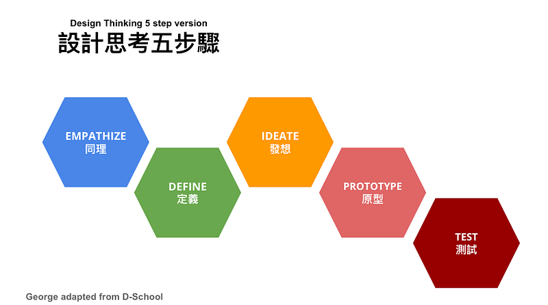
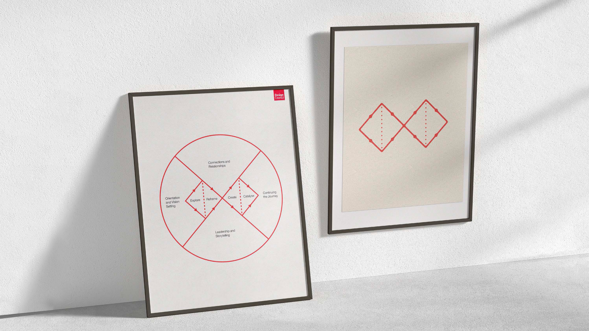
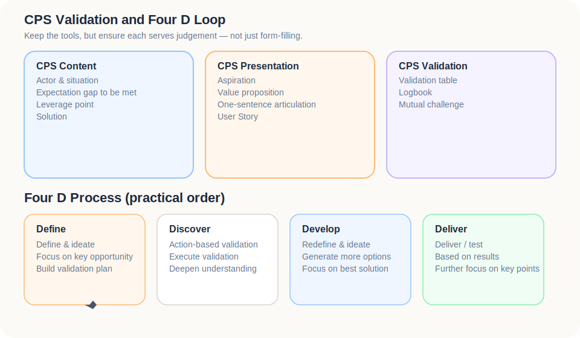
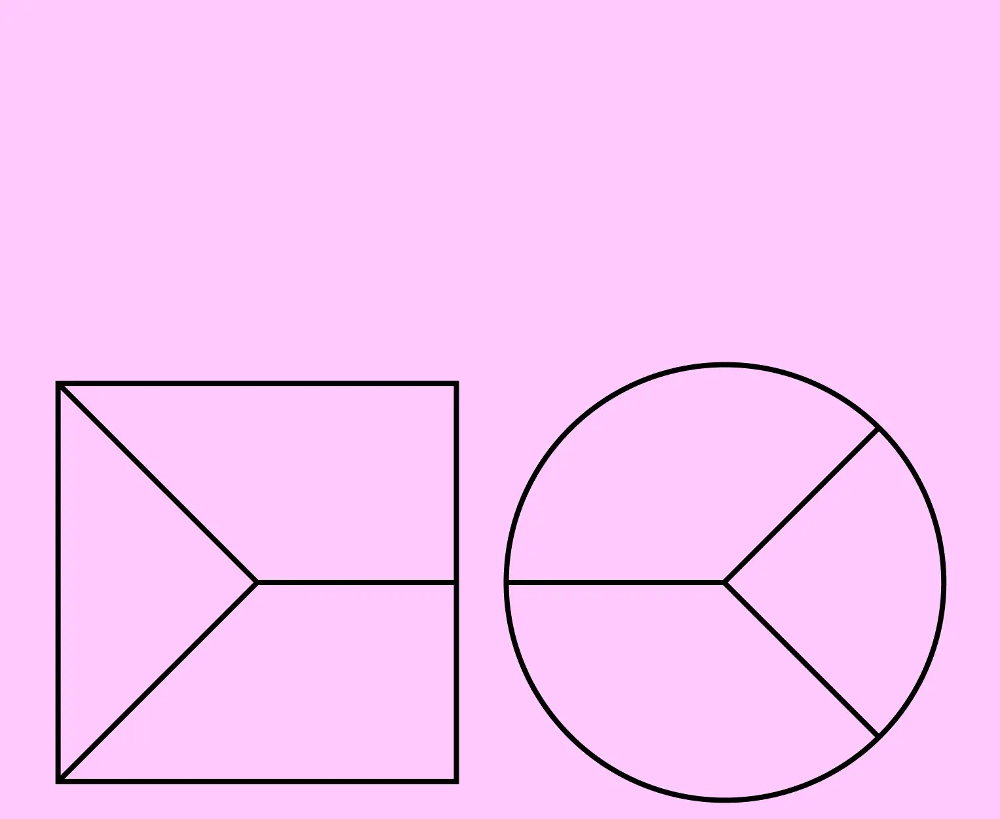

The most dangerous thing about tools is not that they are useless.

It is that they can make a team look as though it is making progress.

The wall has sticky notes.  
The table has columns.  
The meeting has Design Thinking, Double Diamond, Value Proposition Canvas, Empathy Map, Customer Journey Map, Stakeholder Map, 5 Whys, Assumption Map, Logbook.

Every term sounds sensible.

But if the problem has not been properly understood, these tools may only make the existing bias look more organised.

So this part is not a tool encyclopaedia.

The real question is: when you use a tool, are you clarifying uncertainty, or are you finding better-looking reasons to build the solution you already wanted?

---

## Different tools deal with different unknowns.

Tools do not all operate on the same layer.

Some bring you closer to people.  
Some reveal the flow.  
Some align value.  
Some expose assumptions.  
Some force the team to challenge itself.

If you do not know which unknown you are dealing with, it is easy to bring every tool to the table and end up with a beautiful diagram but no judgement.

A useful starting map looks like this:

| Tool | Unknown it helps with |
|---|---|
| Design Thinking | Moving from empathy and definition to ideation, prototype, and test without jumping too quickly to solution |
| Double Diamond | Diverging and converging in both problem space and solution space |
| Value Proposition Canvas | Aligning Customer Jobs, Pains, Gains with Pain Relievers and Gain Creators |
| Empathy Map | Seeing what users say, do, think, and feel |
| Customer Journey Map | Locating where pain happens in the flow |
| Stakeholder Map | Separating user, payer, decision-maker, influencer, and blocker |
| 5 Whys | Digging beneath the first plausible explanation |
| Assumption Map | Identifying high-importance, high-uncertainty assumptions |
| Logbook | Recording observations, decisions, corrections, and moments of being wrong |

You do not need every tool at once.

You need to know which layer of uncertainty you are currently facing.

---

## Design Thinking: not brainstorming, but delayed certainty.

Design Thinking is often described through five stages:

1. Empathise
2. Define
3. Ideate
4. Prototype
5. Test

Most people have seen these words.

The hard part is accepting the uncomfortable premise behind them:

> Your first understanding of the problem is probably incomplete.

The value of Design Thinking is not that it makes you more creative.

It slows down premature certainty.

*Reference image from Coach Chiao’s article on common Design Thinking stage variants.*

### Empathise: not collecting emotions, but understanding situations.

Empathy is not finished when someone says, “This is annoying.”

You need to understand the situation: what they were trying to do, where it broke down, why it broke down, and what they did next.

That means looking for:

- felt phenomenon
- actor
- JTBD
- Outcome Expectation
- Important Unfulfilled
- Aspiration

Without these, ideation may only become polished guessing.

### Define: turning messy observations into a usable problem.

Definition is not giving the problem an elegant name.

It is choosing which Gap deserves attention, understanding how demand and supply created that Gap, and locating the Bottleneck.

Define is the step where a mess of observations becomes a problem worth acting on.

### Ideate: bounded divergence, not fantasy.

I do not trust the mythology of completely free ideation.

Real problems come with cost, timing, behaviour, technology, distribution, and trust constraints.

Useful ideation starts with the Bottleneck and explores different solution types:

- extreme solutions
- low-cost solutions
- manual solutions
- process changes
- product solutions

Diverge, yes.

But keep your feet on the ground.

### Prototype: making assumptions touchable.

A prototype is not the finished product.

It is a way for an assumption to become visible enough for people to react to.

It can be rough.

The key questions are:

- can people understand what problem it is addressing?
- would it make them change what they currently do?

### Test: not approval, but correction.

Testing goes wrong when a team wants proof that it was right.

The point of testing is correction.

It should help answer:

- Did we misunderstand the problem?
- Does this value actually matter?
- Does the solution reduce the Gap?
- Which assumption is still unsupported?

---

## Double Diamond: enter the problem space before the solution space.

If Design Thinking is a set of moves, the Double Diamond is a rhythm.

The Design Council version is commonly described as:

1. Discover
2. Define
3. Develop
4. Deliver

Its power is not in the four words.

*Source image: Design Council — The Double Diamond (CC BY 4.0).* 

It is in the two diamonds:

- **First diamond: problem space**  
  Diverge to understand context, then converge on the real problem.

- **Second diamond: solution space**  
  Diverge around possible solutions, then converge on something testable and deliverable.

Many teams do something else entirely:

> notice a phenomenon → jump to a familiar solution → spend a lot of energy building it

They never really pass through the first diamond.

That is why many products feel busy but strangely beside the point.

---

## Four D Process: a field version of the workflow.

The Double Diamond is a clean map.

Early venture work is rarely that clean.

Often you do not begin with a blank page. You begin with a rough problem definition, take it into the market, and then let reality correct you.

In that setting, a practical Four D Process can look like this:

1. **Define**: write the initial problem and assumptions
2. **Discover**: interview, observe, and gather evidence
3. **Develop**: shape solutions and MVPs from the evidence
4. **Deliver**: run a small test, observe signals, and learn

This is not a replacement for the original Double Diamond.

It is a field workflow for venture validation.

In practice, Define and Discover often loop.

You define roughly.  
The market pushes back.  
You redefine.

That is not failure.

That is the work.

---

## Iteration: not rework, but sharper judgement each round.

Design Thinking should not be treated as a linear five-step sequence.

The real process loops.

After testing, you may discover that the prototype is wrong. More often, the prototype is wrong because the problem definition was too thin.

Iteration is not simply “doing another version”.

Each loop should sharpen judgement:

- interviews correct situation understanding;
- tests correct the problem statement;
- prototypes correct the solution hypothesis;
- MVPs correct the ICP or early adopter assumption;
- delivery corrects the value proposition and business model.

Iteration should not be a circle.

It should be a spiral: similar questions returning at a higher level of evidence.

---

## Value Proposition Canvas: pull your imagined value back into the user’s world.

The Value Proposition Canvas is easy to turn into a tidy writing exercise.

Customer Jobs, Pains, Gains. Filled.  
Products & Services, Pain Relievers, Gain Creators. Filled.

But a full canvas is not the same as fit.

The tool matters because it forces the customer side and the offer side to meet.

*Source image: Strategyzer — The Value Proposition Canvas.*

### Customer Profile

| Area | Question |
|---|---|
| Customer Jobs | What is the customer trying to get done? |
| Pains | What obstacles, risks, or frustrations appear? |
| Gains | What outcomes, benefits, or states do they hope for? |

### Value Map

| Area | Question |
|---|---|
| Products & Services | What do you provide? |
| Pain Relievers | How do you reduce pain? |
| Gain Creators | How do you create desired outcomes? |

I would not start with Products & Services.

I would start by forcing Customer Jobs into concrete situation sentences.

If the job only says “increase efficiency”, “gain exposure”, or “improve experience”, the canvas is not ready.

Those are not jobs.

They are wishes dressed in business language.

### How VPC connects to C-P-S Fit

| C-P-S context | VPC equivalent |
|---|---|
| Actor and JTBD | Customer Jobs |
| Outcome Expectation | Gains |
| Important Unfulfilled | Pains / unmet gains |
| Aspiration | Deeper Gains |
| Solution | Products & Services |
| How the solution closes the Gap | Pain Relievers / Gain Creators |

Used this way, VPC becomes less of a business-school template and more of a focusing device.

For each value claim, ask:

- Which job does it serve?
- Which pain does it relieve?
- Which gain does it create?
- Does that gain really matter?
- Is it still Important Unfulfilled?

If you cannot answer, the value proposition is still too thin.

---

## Empathy Map, Journey Map, Stakeholder Map: understand the person inside the system.

Some problems are not created by a single user.

In B2B, this is especially true.

In a hotel, the owner, GM, front desk, marketing person, guest, OTA, booking engine, and CRM vendor may all shape the problem.

So VPC is not enough on its own.

### Empathy Map

An Empathy Map asks:

- What do they see?
- What do they hear?
- What do they say?
- What do they do?
- What do they think?
- What do they feel?

It is not for writing sentimental user descriptions.

It is for spotting the distance between what someone says and what they actually do.

### Customer Journey Map

A Journey Map locates where the problem appears in the flow.

For an independent hotel:

- guest discovers the property
- compares options
- books
- checks in
- stays
- checks out
- returns home
- plans the next trip

If the relationship disappears after checkout, do not only optimise the booking page.

If trust breaks during comparison, membership points may not be the first answer.

### Stakeholder Map

A Stakeholder Map separates the roles:

- Who uses it?
- Who pays?
- Who decides?
- Who influences?
- Who blocks?
- Who benefits?

Many B2B products fail not because they lack value, but because they persuade the wrong person.

---

## 5 Whys and Assumption Map: stop the team believing itself too quickly.

5 Whys is simple.

You see a problem and keep asking why.

Its value is not in reaching the fifth why.

It is in not stopping at the first plausible explanation.

For example:

> The hotel’s direct-booking ratio is low.

Why?

Because guests come through OTAs.

Why?

Because OTAs have traffic and trust.

Why do guests not go directly to the hotel website?

Because there is no strong incentive, and guests may not trust that the website gives better value or service.

Why does the hotel not create an incentive?

Because a single-property membership is often too weak, and the team has limited capacity.

At this point, the problem may no longer be “the website is not good enough”.

It may be:

> A single independent hotel lacks a light, incentive-rich way to make guests enter a durable relationship.

That leads naturally to Assumption Mapping.

Ask:

- Which assumptions matter most?
- Which assumptions are most uncertain?
- Which assumptions would collapse the whole solution if wrong?

The first thing to test is not the easiest thing.

It is the high-importance, high-uncertainty assumption.

---

## C-P-S Fit cannot remain a slogan.

“Customer, Problem, Solution must align” is true.

It is also too vague to help on its own.

C-P-S Fit needs to land in three places:

1. how it is articulated;
2. how it is validated;
3. how the team challenges it.

### How C-P-S Fit appears

| Form | Purpose |
|---|---|
| Aspiration | Clarifies where the actor is trying to go |
| Value proposition | Explains why the offer deserves adoption |
| One-sentence articulation | Compresses context, gap, and solution into a testable statement |
| User Story | Connects role, situation, action, and expected result |

### How C-P-S Fit is validated

| Method | Purpose |
|---|---|
| Validation table | Makes assumptions explicit |
| Logbook | Records observation, judgement, correction, and next step |
| Mutual challenge | Forces counter-arguments into the room |

That last one matters.

The greatest danger in early venture work is not that outsiders doubt you.

It is that the team believes itself too quickly.

Ask deliberately uncomfortable questions:

- Is this Gap really large enough?
- Is this only felt by a tiny group?
- Are existing alternatives truly that poor?
- Might our Bottleneck diagnosis be wrong?
- If half the features were removed, would the core value survive?

Annoying questions can be expensive to ignore.

---

## MVP belongs after hypotheses, not after excitement.

An MVP is not a smaller version of the dream product.

It is:

> the smallest necessary experiment to test the most important assumption.

If the biggest uncertainty is whether the Gap is painful enough, the MVP may not be a product. It may be interviews and a problem test.

If the uncertainty is whether the value proposition drives action, the MVP may be a landing page, waitlist, or manual concierge flow.

If the uncertainty is whether the solution improves the Bottleneck, the MVP may be a low-fidelity prototype, Wizard-of-Oz test, or manual simulation.

The form of the MVP should follow the hypothesis.

Not the other way round.

---

## Tools do not make the judgement for you. They make it harder to avoid judgement.

Tools do not find the right answer.

They do not turn an ordinary idea into a good market.

But good tools help you avoid some large mistakes:

- turning a phenomenon into a solution too quickly;
- falling in love with the first approach;
- assuming users care about what you care about;
- missing the Important Unfulfilled;
- misreading the Bottleneck;
- forgetting the Context;
- failing to write assumptions down;
- failing to record how your judgement changed.

If a tool helps you avoid those mistakes, it is already doing useful work.

From pain to venture was never going to be a straight line.

You will loop back.  
You will revise.  
You will discover that something you thought was clear was not clear at all.

That is normal.

The real problem is not changing your mind.

The real problem is never truly knowing what problem you were solving.

---

## References and image notes

### Design Thinking / Double Diamond

- Design Council｜The Double Diamond  
  https://www.designcouncil.org.uk/our-resources/the-double-diamond/  
  The official page marks the Double Diamond diagram as CC BY 4.0.

- Coach Chiao｜雙菱型、發散、收斂、同理、定義、發想、雛形、測試五階段  
  https://coach-chiao.medium.com/%E9%9B%99%E8%8F%B1%E5%9E%8B-%E7%99%BC%E6%95%A3-%E6%94%B6%E6%96%82-%E5%90%8C%E7%90%86-%E5%AE%9A%E7%BE%A9-%E7%99%BC%E6%83%B3-%E9%9B%9B%E5%BD%A2-%E6%B8%AC%E8%A9%A6%E4%BA%94%E9%9A%8E%E6%AE%B5-%E5%93%AA%E4%B8%80%E5%80%8B%E6%89%8D%E6%98%AF%E8%83%BD%E6%9C%89%E5%B9%AB%E5%8A%A9%E7%9A%84-%E8%A8%AD%E8%A8%88%E6%80%9D%E8%80%83-6bb12043b4e4

### Value Proposition Canvas

- Strategyzer｜The Value Proposition Canvas  
  https://www.strategyzer.com/library/the-value-proposition-canvas  
  This article now includes a local reference image for commentary context, while the official source remains the best place to inspect the original framework in full.
