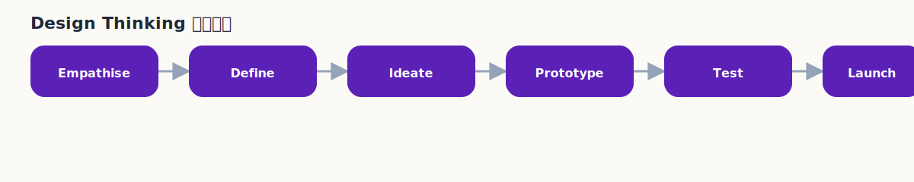
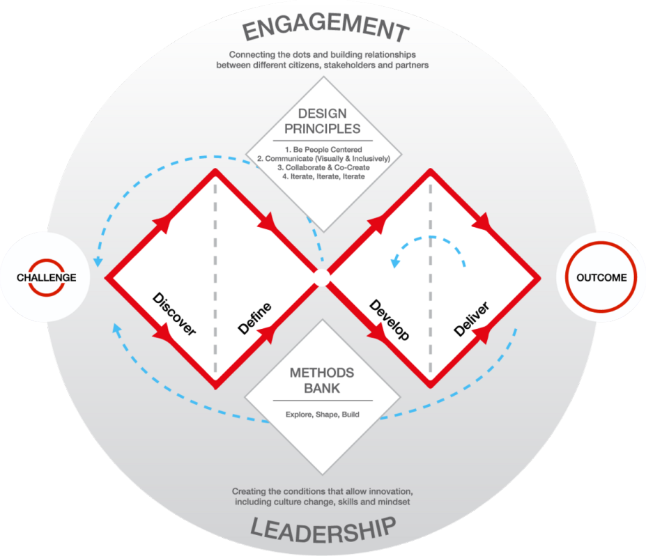
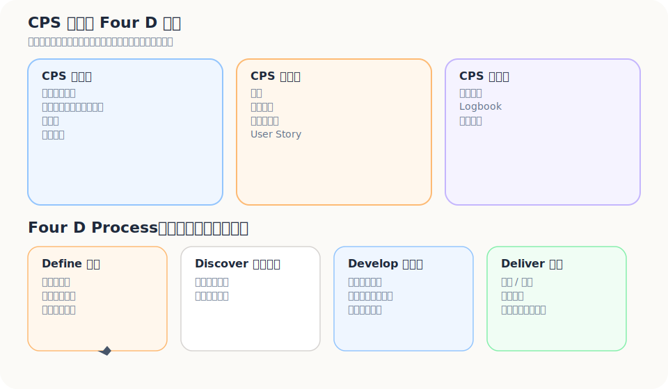
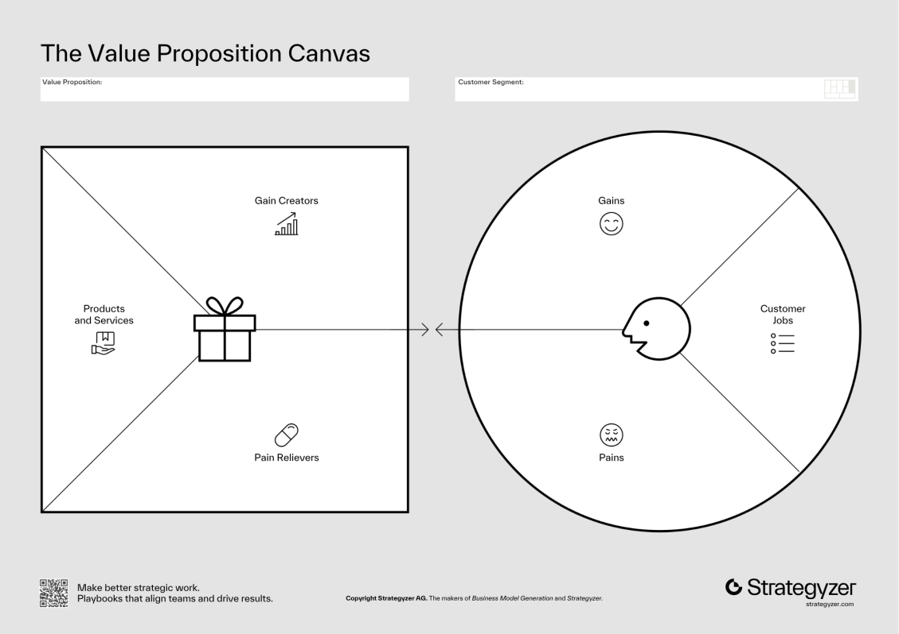

工具最危險的地方，不是它沒用。

而是它會讓團隊看起來很有進度。

白板上有便利貼。  
表格裡有欄位。  
會議裡有 Design Thinking、Double Diamond、Value Proposition Canvas、Empathy Map、Customer Journey Map、Stakeholder Map、5 Whys、Assumption Map、Logbook。

每個詞都很合理。

但如果問題還沒被看清楚，這些工具只會把原本的偏見排版得更漂亮。

所以這一篇不是要做工具百科。

而是要問：當你開始用工具時，到底是在釐清未知，還是在替原本就想做的 solution 找理由？

---

## 每個工具都在處理不同層次的未知

工具不是同一層的東西。

有些工具幫你靠近人。  
有些工具幫你看流程。  
有些工具幫你對齊價值。  
有些工具幫你拆假設。  
有些工具幫你逼團隊互相挑戰。

如果不知道自己卡在哪一層未知，就很容易把所有工具都搬上桌，最後只得到一張很漂亮、但沒有判斷力的圖。

可以先這樣理解：

| 工具 | 主要處理的未知 |
|---|---|
| Design Thinking | 從同理、定義、發想到原型與測試，避免太快跳 solution |
| Double Diamond | 在問題空間與解法空間，各自經歷發散與收斂 |
| Value Proposition Canvas | 對齊 Customer Jobs、Pains、Gains 與 Pain Relievers、Gain Creators |
| Empathy Map | 看見使用者說什麼、做什麼、想什麼、感受什麼 |
| Customer Journey Map | 找出痛點發生在哪個流程節點 |
| Stakeholder Map | 拆開使用者、付錢者、決策者、影響者、阻礙者 |
| 5 Whys | 往下追問表層問題背後的原因 |
| Assumption Map | 找出高重要、高不確定、需要優先驗證的假設 |
| Logbook | 記錄每次觀察、判斷、修正與被打臉的地方 |

不需要一次把所有工具都搬上桌。

更好的做法，是先知道自己現在卡在哪一層未知。

---

## Design Thinking：不是腦力激盪，而是延後武斷

設計思考最常被講成五個階段：

1. Empathize｜同理
2. Define｜定義
3. Ideate｜發想
4. Prototype｜原型
5. Test｜測試

這五個字很多人都看過。

真正難的不是背出來，而是接受它背後那個不舒服的前提：

> 你一開始對問題的理解，大概率是不完整的。

所以設計思考最有價值的地方，不是讓你更有創意。

而是逼你先不要太快武斷。

### Empathize：不是蒐集心情，是理解情境

同理不是聽對方說「我覺得很麻煩」就收工。

同理要看的，是他在什麼情境下，試著完成什麼事，哪裡不順，為什麼不順。

也就是：

- 有感的現象
- 當事人
- JTBD
- Outcome Expectation
- Important Unfulfilled
- Aspiration

如果這些沒摸出來，後面做再多 ideation，也可能只是在腦補。

### Define：把混亂現象定義成可處理的問題

定義不是幫問題取一個漂亮名字。

它比較像是：

- 在一堆觀察中，決定現在先聚焦哪一個 Gap
- 把需求面與供給面造成的落差辯證清楚
- 確認 Bottleneck 到底落在哪一段

Define 這一步，其實就是從一團現象裡面，抓出真正值得先處理的主問題。

### Ideate：不是自由發散，而是帶著邊界發散

我不太相信那種「先什麼都不要管，盡量發想」的神話。

真實世界的題目，都有成本、時間、行為慣性、技術、通路、信任門檻。

所以 ideate 真正有用的方式，是：

- 先確認問題與 bottleneck
- 再用多種 solution type 去試
- 刻意拉出極端方案、低成本方案、人工方案、流程方案、產品方案來比較

還是可以發散。

但不要脫離地面。

### Prototype：讓想法變得可碰觸

Prototype 不是把產品做完。

它是讓假設可以被人碰到、理解、反應。

原型可以很粗。重點不是美不美，而是：

- 對方能不能理解你在解什麼問題
- 對方會不會因為這個方案改變原本做事的方式

### Test：不是驗收，而是修正

測試最常被做錯的地方，是大家太想證明自己是對的。

但測試真正的任務不是證明，而是修正。

它應該幫你回答的是：

- 我們是不是看錯問題了？
- 這個價值對對方真的重要嗎？
- 這個解法真的有減少那個 Gap 嗎？
- 哪一個假設還沒成立？

---

## Double Diamond：先鑽進問題空間，再談解法空間

如果設計思考像一組動作，Double Diamond 比較像整體節奏。

Design Council 的 Double Diamond 常見四段是：

1. Discover｜發掘
2. Define｜定義
3. Develop｜發展
4. Deliver｜交付

它最有力的地方，不是四個英文字本身。

而是它把整件事切成兩個菱形：

- **第一個菱形：問題空間**  
  先發散看現象與脈絡，再收斂定義真正的問題。

- **第二個菱形：解法空間**  
  再發散思考可能方案，再收斂成可執行、可測試的解法。

很多團隊平常真正做的，其實是：

> 看到一個現象 → 馬上跳到熟悉解法 → 用很多力氣把它做完

也就是根本沒有完整走過第一個菱形。

這也是為什麼很多產品做得很辛苦，卻老是有一種「功能很多，但說不上打到點」的感覺。

---

## Four D Process：創業驗證現場的工作流變體

Double Diamond 是比較乾淨的流程地圖。

但創業現場常常沒有那麼乾淨。

很多時候，你不是從完全空白開始。你會先有一個粗略問題定義，然後拿出去撞市場，撞完再回來修正。

所以可以把實務上的 Four D Process 看成一個工作流變體：

1. **Define**：先寫出初步問題與假設
2. **Discover**：拿去訪談、觀察、找證據
3. **Develop**：根據證據發展 solution 與 MVP
4. **Deliver**：小規模交付、測試、回收訊號

它不是要取代 Design Council 的原版 Double Diamond。

而是提醒你：在創業驗證裡，Define 和 Discover 很常來回發生。

你先有一個粗略定義。  
然後被市場修正。  
再回來重新定義。

這不是失敗。

這才是正常。

---

## Iteration：不是重做，是每一輪都把判斷變得更準

Design Thinking 不應該被理解成線性五步驟。

真正的過程比較像反覆來回。

測試後，你可能會發現 prototype 不行。  
但更常見的是：prototype 不行，是因為前面的 problem definition 就錯了。

所以 iteration 不是「多改幾版」。

它應該是每一輪都讓判斷變得更準：

- 訪談後，修正情境理解
- 測試後，修正 problem statement
- 原型後，修正 solution hypothesis
- MVP 後，修正 ICP 或 early adopter 假設
- 交付後，修正價值主張與商業模式

迭代不是在原地繞圈。

它應該像螺旋。每一圈都回到類似問題，但視野更高一點，證據更多一點，判斷更少一點自我催眠。

---

## Value Proposition Canvas：把你以為的價值，拉回使用者現場

Value Proposition Canvas 很容易被填成漂亮作文。

Customer Jobs、Pains、Gains，看起來都寫了。  
Products & Services、Pain Relievers、Gain Creators，也都填滿了。

但填滿不代表對齊。

這個工具真正要做的是：把顧客那一側的任務、痛苦、期待，對到你這一側的產品、減痛、創造收益。

### Customer Profile

| 區塊 | 要問什麼 |
|---|---|
| Customer Jobs | 顧客想完成什麼任務？ |
| Pains | 過程中有什麼痛苦、阻礙、風險？ |
| Gains | 顧客期待什麼成果、好處、狀態？ |

### Value Map

| 區塊 | 要問什麼 |
|---|---|
| Products & Services | 你提供什麼產品或服務？ |
| Pain Relievers | 你如何減少痛苦？ |
| Gain Creators | 你如何創造收益或理想結果？ |

我現在用 VPC 時，不會先填 Products & Services。

會先逼自己把 Customer Jobs 寫成具體情境句。

如果 Jobs 只寫得出「提升效率」「增加曝光」「改善體驗」，那這張畫布還不能用。

因為那不是 job。

那只是願望被包裝成商業詞。

### VPC 和 C-P-S Fit 怎麼接

| C-P-S 脈絡 | VPC 對應 |
|---|---|
| 當事人與 JTBD | Customer Jobs |
| 期望結果 Outcome Expectation | Gains |
| 重要且未被滿足 Important Unfulfilled | Pains / unmet gains |
| 價值 / 意義 / 期許 Aspiration | 深層 Gains |
| Solution | Products & Services |
| 解法如何補 Gap | Pain Relievers / Gain Creators |

這樣接起來後，VPC 就不只是商業課工具。

它變成一個對焦器。

每寫一條 value，都要問：

- 它對應哪個 job？
- 它緩解哪個 pain？
- 它創造哪個 gain？
- 這個 gain 對對方真的重要嗎？
- 這件事現在是否仍是 Important Unfulfilled？

答不出來，就代表 value proposition 還很虛。

---

## Empathy Map、Journey Map、Stakeholder Map：不要只理解一個人，要理解他在系統裡怎麼動

有些問題，不是使用者一個人造成的。

尤其 B2B 更明顯。

一間旅宿裡，老闆、GM、前台、行銷、旅客、OTA、booking engine、CRM vendor，都可能影響問題。

所以除了 VPC，還需要幾個輔助工具。

### Empathy Map

Empathy Map 幫你看：

- 他看見什麼？
- 聽見什麼？
- 說什麼？
- 做什麼？
- 想什麼？
- 感受什麼？

它不是拿來寫漂亮同理心語句。

它是用來找出「說的」和「做的」之間有沒有落差。

### Customer Journey Map

Journey Map 幫你看問題在哪個流程節點發生。

例如獨立旅宿：

- 旅客發現旅宿
- 比較選項
- 完成訂房
- check-in
- 住宿中
- check-out
- 旅程結束後
- 下一次旅行前

如果旅客是在 check-out 後消失，那你就不該只盯著訂房頁。

如果旅客是在比較階段不信任官網，那你也不該只做會員點數。

### Stakeholder Map

Stakeholder Map 幫你拆開角色。

- 誰使用？
- 誰付錢？
- 誰決策？
- 誰影響？
- 誰阻擋？
- 誰受益？

很多 B2B 產品不是沒價值，而是搞錯要說服誰。

---

## 5 Whys 與 Assumption Map：不要讓團隊太快相信自己

5 Whys 的用法很簡單。

看到一個問題，連續問為什麼。

但它的價值不是問滿五次。

而是逼你不要停在第一個看起來合理的解釋。

例如：

> 旅宿直訂比例低。

為什麼？

因為旅客都從 OTA 來。

為什麼？

因為 OTA 有流量和信任。

為什麼旅客不直接去官網？

因為旅客沒有明顯誘因，也不一定相信官網價格與服務更好。

為什麼旅宿不創造誘因？

因為單店會員價值太弱，人力也不足。

到這裡，問題可能就不再是「官網不夠好」。

而是「單一旅宿缺少足夠輕、足夠有誘因的方式，讓旅客願意建立後續關係」。

這就接到 Assumption Map。

Assumption Map 要問：

- 哪些假設最重要？
- 哪些假設最不確定？
- 哪些假設如果錯了，整個解法就會垮？

優先測的，不是最好測的。

而是高重要、高不確定的。

---

## C-P-S Fit 不能只停在口號

C-P-S Fit 如果只停在一句「Customer、Problem、Solution 要對齊」，沒有太大用。

它至少要落到三件事：

1. 怎麼表述
2. 怎麼驗證
3. 怎麼被團隊互相挑戰

### C-P-S Fit 的呈現

| 呈現方式 | 作用 |
|---|---|
| 期許 | 說清楚當事人真正想去的地方 |
| 價值主張 | 說清楚你為什麼值得被採用 |
| 一句話表述 | 把 context、gap、solution 壓成可檢查的句子 |
| User Story | 把角色、情境、行動、期待結果串起來 |

### C-P-S Fit 的驗證

| 驗證方式 | 作用 |
|---|---|
| 驗證表格 | 把假設寫出來，不讓團隊只靠感覺 |
| Logbook | 記錄觀察、判斷、修正、下一步 |
| 相互挑戰 | 刻意問反方問題，避免團隊互相附和 |

相互挑戰很重要。

創業早期最危險的，不是外面的人不相信你。

而是團隊內部太快互相信了。

可以刻意問：

- 這個 Gap 真的夠大嗎？
- 這是不是只有少數人有感？
- 現有替代方案真的有這麼爛嗎？
- 我們的 Bottleneck 判斷會不會錯？
- 如果 solution 拿掉一半功能，核心價值還成立嗎？

這些問題很煩。

但很值錢。

---

## MVP 要接在假設後面，不要接在熱血後面

MVP 不是「先做一個陽春版產品」。

MVP 是：

> 為了驗證目前最關鍵的假設，最小必要的實驗是什麼？

如果你最不確定的是 Gap 到底夠不夠痛，那 MVP 可能不是產品，而是訪談與 problem test。

如果你最不確定的是 value proposition 會不會驅動行動，那 MVP 可能是 landing page、waitlist、manual concierge service。

如果你最不確定的是 solution 能不能真的改善 bottleneck，那 MVP 可能是低保真 prototype、Wizard-of-Oz 測試、手動流程模擬。

MVP 的型態，應該跟你要驗證的假設綁在一起。

不是大家都先做 App。

---

## 工具不會替你判斷，但會讓你比較難逃避判斷

工具不會找出正解。

它也不會讓一個普通 idea 變成好市場。

但好的工具會幫你少犯幾個大錯：

- 太快把現象翻成 solution
- 太早愛上某個做法
- 以為對方在意的跟你以為的一樣
- 沒看見 Important Unfulfilled
- 沒抓到真正 Bottleneck
- 沒有把 Context 放回來看
- 沒有把假設寫下來
- 沒有記錄自己是怎麼修正判斷的

如果一套工具能幫你少犯這些錯，它就已經很有用了。

從痛點到事業，本來就不是一條直線。

你會一直來回。  
一直修正。  
一直推翻自己原本以為已經想清楚的東西。

這很正常。

真正麻煩的不是改來改去。

真正麻煩的是，從頭到尾都沒真的看清楚自己在解什麼。

---

## 參考圖與說明

### Design Thinking / Double Diamond

- Design Council｜The Double Diamond  
  https://www.designcouncil.org.uk/our-resources/the-double-diamond/  
  官方頁面標示 Double Diamond 圖示為 CC BY 4.0。

- Coach Chiao｜雙菱型、發散、收斂、同理、定義、發想、雛形、測試五階段  
  https://coach-chiao.medium.com/%E9%9B%99%E8%8F%B1%E5%9E%8B-%E7%99%BC%E6%95%A3-%E6%94%B6%E6%96%82-%E5%90%8C%E7%90%86-%E5%AE%9A%E7%BE%A9-%E7%99%BC%E6%83%B3-%E9%9B%9B%E5%BD%A2-%E6%B8%AC%E8%A9%A6%E4%BA%94%E9%9A%8E%E6%AE%B5-%E5%93%AA%E4%B8%80%E5%80%8B%E6%89%8D%E6%98%AF%E8%83%BD%E6%9C%89%E5%B9%AB%E5%8A%A9%E7%9A%84-%E8%A8%AD%E8%A8%88%E6%80%9D%E8%80%83-6bb12043b4e4

### Value Proposition Canvas

- Strategyzer｜The Value Proposition Canvas  
  https://www.strategyzer.com/library/the-value-proposition-canvas  
  本文現在已放入一張本地參考圖供解說使用，但若要看完整原始框架，仍建議回到官方來源。
