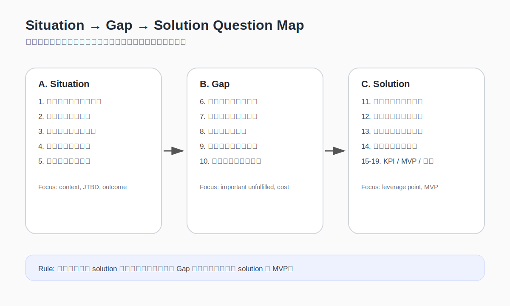

There is a kind of customer interview that goes wrong from the first sentence.

You ask a hotel owner:

> If there were a system that could help you increase direct bookings, would you use it?

They usually will not say no.

They may nod. They may say it sounds useful. If they are being kind, they may even help design the thing for you: it should send vouchers, manage members, connect to LINE, show reports.

It all feels encouraging.

It is also dangerous.

Because what looks like demand may only be your solution being politely decorated by the person across the table. You are not yet hearing their reality. You are hearing your own idea reflected back.

A lot of early discovery breaks here. Not because people do too few interviews, and not because they are lazy. It breaks because the first question is already too late in the chain:

> What do you want?

A better starting point is:

> **In what situation are they trying to make progress, and where exactly do they get stuck?**

That is what this part is really about: JTBD, situation analysis, Outcome Expectation, interview questions, and the normal / abnormal system view. These are not just tool names. They are ways of slowing down before we convince ourselves we already understand the need.

---

## People do not buy products. They hire a way through.

Jobs to Be Done is often reduced to a neat line: people do not buy products, they hire products to get a job done.

The line is useful. It is just not enough.

The hard part is describing the job with enough precision that it can be tested.

Take independent hotels. Ask an owner what they need and you will often hear:

- more bookings
- more exposure
- more direct bookings
- less dependence on OTAs
- a membership or repeat-guest programme

None of these answers is wrong.

They are just still too close to wishes. They are not yet jobs.

Go one level deeper and the real job may sound more like this:

- getting guests to leave contactable details without adding too much work for the front desk
- building a pool of guests who are more likely to return or refer others before low season arrives
- making booking sources a little more controllable, rather than relying almost entirely on OTA traffic
- giving guests a reason to remember the property after checkout, without the budget of a large hotel brand

Now the problem starts to carry weight.

You are no longer looking at a hotel that “needs a system”. You are looking at a person, in a constrained situation, trying to complete a job that matters.

A product is only one possible thing they might hire.

---

## Situation comes before persona, and is harder to fake.

Many discovery documents begin with a persona.

A 35-year-old operator of a small boutique property. Values brand experience. Moderately digital. Short on staff.

That can be useful background. It is not the problem.

The same person will need different things in different situations.

An independent hotel owner in peak season may care most about operational efficiency and avoiding bad reviews. Before low season, the concern may shift to cash flow, promotions, returning guests, and direct-booking ratio. If an OTA changes its rules, raises pressure, or the platform algorithm reduces visibility, the problem changes again.

The same person does not have one fixed need.

Different situations wake up different jobs.

So do not rush to write the persona. Write the situation first:

> When【situation】happens,  
> 【actor】wants to complete【job】,  
> but because of【obstacle】,  
> they cannot achieve【expected outcome】.

For example:

> When an independent hotel is approaching low season and wants to reduce vacancy risk, the owner wants to build a steadier source of returning guests and direct bookings. But because guest data is mostly held by OTAs, front-desk conversion is high-friction, and guests lack a reason to stay connected, the hotel struggles to turn one-off stays into an ongoing guest relationship.

It is not a beautiful sentence.

It is useful.

Because it points to a specific stuck situation, not an abstract customer group.

---

## Outcome Expectation: the job is not just the action, but the desired result.

Knowing the job is not enough.

When people try to get something done, they usually carry a standard for what “done well” means. That is the **Outcome Expectation**.

The same phrase, “increase direct bookings”, may hide very different expectations:

- lower platform commission
- more control over guest data
- less anxiety before low season
- stronger brand recognition
- less need to buy traffic every time
- no extra burden on the front desk

So do not merely record “they want more direct bookings”.

Ask:

- When you say increase, which metric do you mean?
- What would feel different if this improved?
- How would you know it had genuinely become better?
- Do you care most about cost, stability, control, efficiency, or guest relationships?

Much of the real need is hidden here.

On the surface, everyone says they want direct bookings. Underneath, they may want very different future states.

---

## Before moving on, check whether the six-part chain is complete.

Before thinking about the product, test whether the problem has enough weight.

The chain looks like this:

1. 當事人在特定情境下
2. 意圖完成某件重大事情（JTBD）
3. 抱著某重大期許（Outcome Expectation）
4. 就其重大未滿足的期許落差（Gap）
5. 採取許多作為卻沒有效果
6. 因而付出代價、承擔後果

It is a plain filter, but a useful one.

If all you can say is “someone finds this annoying”, and you cannot describe the actor, the situation, the job, the expectation, the gap, and the cost, the issue is probably not yet ready for validation.

It may be an observation.

Not yet a thesis.

---

## Users are often poor at designing solutions, but very good at revealing reality.

This is another common misunderstanding in interviews.

Ask users what they want and they may give you a feature list. That list is rarely the real solution.

A hotel owner might say, “I need a membership system.”

But the actual problem may be that:

- guests have no reason to join
- the front desk has no time to explain it
- membership has no clear value after a single stay
- the hotel lacks the capacity to maintain offers and content
- even collected guest data does not become a usable relationship

If you build the membership system directly, you may only have wrapped the problem in something that looks like a product.

A better interview asks what happened last time:

| Question that pushes towards your solution | Question that reveals reality |
|---|---|
| Would you use this product? | The last time this happened, how did you deal with it? |
| What features do you want? | What were you trying to get done? |
| Would you pay for this? | What have you already spent in time, money, or labour to handle this? |
| Do you like this feature? | Would this actually change your current workflow? |
| Is this problem important? | If it were solved tomorrow, what cost or risk would disappear? |
| Is this idea good? | What workaround do you use now, and where does it fail? |

These questions are slower.

They are less exciting.

They are closer to the truth.

---

## Situation & Gap & Solution Pre-planned Questions: map the route before the interview.

An interview is not a questionnaire to be read aloud.

But without a map, it is too easy to drift back towards your own solution. A sequence that moves from situation, to Gap, to solution can keep the conversation honest.

### A. Start with situation and job.

1. What is the actor’s situation?
2. In this situation, what matters to them? What expectations and tensions are involved?
3. What job are they trying to complete? (JTBD)
4. Given that job, what is the ideal state? What is the expected outcome?
5. Which important expectation remains unmet?
6. What have they tried, but without effect?

### B. Then examine existing solutions and consequences.

7. What cost or consequence appears because the job cannot be completed?
8. How do people talk about this issue?
9. What current solutions exist? What is unsatisfactory about them? Why do they still fail?
10. What has been tried before? If solved, what meaningful result could appear?

### C. Only then move towards possible solutions.

11. What challenges must be faced for this problem to be solved?
12. What must be provided to move them towards the desired future state?
13. Given the job they want to complete, what fundamental change could the offer create?
14. What is the key breakthrough?
15. What challenges must be overcome to achieve that breakthrough?
16. Why would this fundamental change move them towards the desired future state?
17. Why can what is being provided create that fundamental change?
18. How should success and value be defined? What concrete, testable indicators can be seen? (KPI)
19. What is the MVP? Why is this MVP the lowest-cost way to fail?

The order matters.

Situation first. Gap second. Solution third.

Not the other way round.

---

## Normal and abnormal systems: understand how things are supposed to work.

Before diagnosing abnormality, you need to know what normal should look like.

This step can be treated as a simple version of **Situations Confirmation & Basic Knowledge**. The point is not to research the background until it becomes perfect. It is to clarify two things first: how the system should work in a healthy state, and where the current abnormal state has drifted away from that.

For direct booking in independent hospitality, a healthy system might look like this:

1. A traveller discovers the property through some channel.
2. The traveller understands its difference and value.
3. The traveller has a reason to leave contactable details.
4. The property can maintain the relationship without disrupting operations.
5. The next time the traveller plans a trip, the property has a chance to re-enter the choice set.
6. Some guests become repeat bookings, direct bookings, referrals, or longer-term relationships.

The abnormal system may look like this:

1. The traveller only sees the property on an OTA.
2. The hotel does not own a durable contact point.
3. The front desk has no time to convert the guest into an ongoing relationship.
4. The guest has no reason to join a membership or leave data.
5. After checkout, the relationship disappears.
6. The hotel must buy attention from the platform again next time.

The question is not only “what is broken?”

It is:

- What is the normal system?
- What is its function?
- What is the abnormal system?
- Where did the abnormal system come from?
- What effects, consequences, and costs does it create?
- What is wrong with the current solutions and mechanisms?
- What is the biggest challenge if we want to break the current mechanism?

This turns a complaint into a process.

Once you see the process, the leverage point becomes easier to find.

---

## What this part should leave behind

The point is not to make interviews longer.

It is to stop interviews from becoming polite opinion collection.

Useful discovery should reveal:

- who the actor is
- what situation they are in
- what job they are trying to complete
- what Outcome Expectation they carry
- which Gap keeps them stuck
- what they have tried without success
- what cost they are paying
- where the system has become abnormal
- where the leverage point might be

By the end, three working outputs should be clear.

### 1. Three JTBD statements

Do not stop at “the hotel wants more direct bookings”. Write the situation clearly:

> When an independent hotel approaches low season and wants to reduce vacancy risk, it wants to build a steadier source of returning guests and direct bookings, so it does not need to buy attention from platforms every time.

### 2. A situation analysis table

At minimum, it should cover:

| Field | Question |
|---|---|
| Situation | When and where does the problem appear? |
| Actor | Who is actually stuck? |
| JTBD | What important job are they trying to complete? |
| Outcome Expectation | What result are they hoping for? |
| Gap | Where does reality fall short of expectation? |
| Current actions | What have they already tried, and why has it failed? |
| Cost and consequence | What are they paying because of this? |
| System drift | How should the normal system work, and where has it become abnormal? |

### 3. A pre-interview question list

Do not only prepare feature questions. Prepare questions that reveal situation, job, gap, cost, current workaround, and system failure.

If these three outputs cannot be produced yet, do not ask users what they want.

Their answer may only be the echo of your own solution.

---
