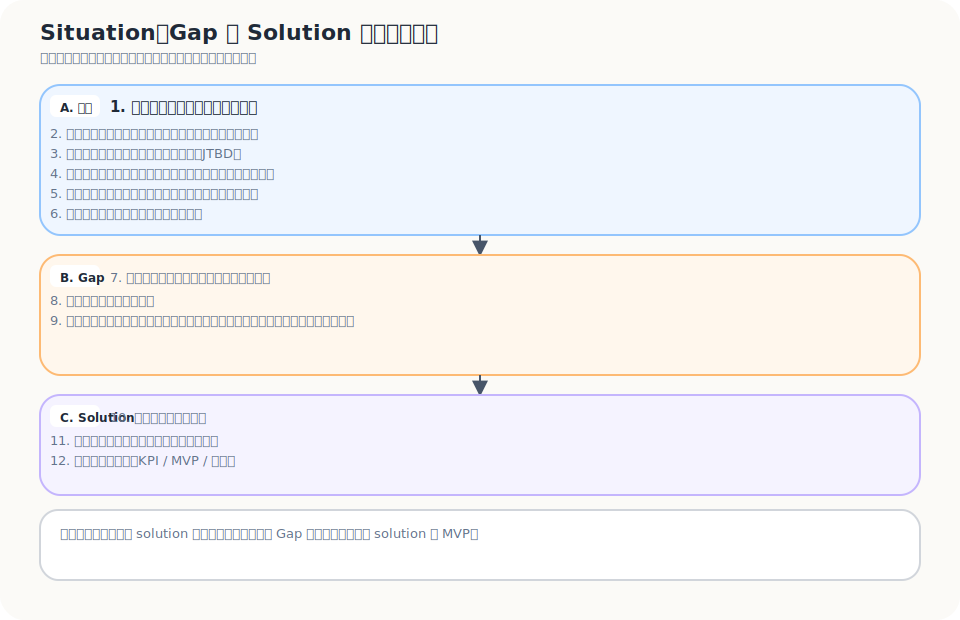
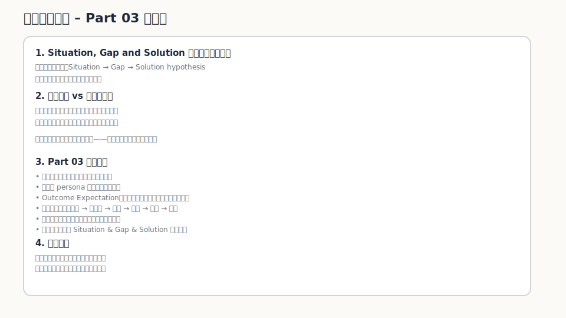

有一種訪談，第一句就已經把路帶歪了。

你問一位旅宿老闆：

> 如果有一套系統可以幫你提高直訂，你會不會想用？

對方通常不會直接說不。

他可能會點頭，說聽起來不錯。更友善一點的，還會順手幫你想功能：最好可以發優惠券、可以管理會員、可以串 LINE、可以看報表。

聽起來很順。

也很危險。

因為你以為自己聽到了需求，其實只是把對方推進你的解法裡，請他幫忙裝潢。你問的不是他的現實，而是你的想像。

早期 discovery 最容易壞在這裡。不是訪談不夠多，也不是大家不努力，而是太早問了那句最容易得到漂亮答案的問題：

> 你想要什麼？

更好的起點應該是：

> **他在什麼情境下，想完成什麼事，卻被什麼東西卡住？**

這才是 Part03 真正要挖的地方：JTBD、情境分析、Outcome Expectation、訪談問題、正常與不正常系統。它們不是一堆工具名，而是在提醒你，不要太早相信自己已經懂了需求。

---

## 人不是在買產品，而是在雇用一個解法

Jobs to Be Done 常被講成一句很漂亮的話：人們不是買產品，而是雇用產品完成一件事。

這句話對，但只背這句沒有用。

真正難的是：你能不能把「完成一件事」寫到夠具體，具體到它開始能被驗證。

以獨立旅宿為例。你如果問旅宿經營者需要什麼，常會聽到這些答案：

- 想要更多訂單
- 想要更多曝光
- 想提高 direct booking
- 想降低 OTA 依賴
- 想做會員或回訪

這些都不是錯。

但它們還太像願望，不像任務。

再往下挖，真正的 job 可能是：

- 在不增加太多前台負擔的情況下，讓旅客願意留下後續可以互動的資料
- 在淡季前，建立一批比較可能回訪或轉介紹的旅客關係
- 在不完全依賴 OTA 流量的情況下，讓訂房來源變得比較可控
- 在沒有大型品牌預算的條件下，讓旅客有理由記得這間旅宿，而不是退房後就消失

到這裡，問題才開始有重量。

因為你看到的不是「旅宿想要一個系統」。你看到的是一個當事人，在一個限制很多的情境裡，想完成一件對他有意義的工作。

產品只是其中一種可能被雇用的解法。

---

## 情境比 persona 更早，也更難造假

很多需求整理會從 persona 開始。

三十五歲，經營小型旅宿，重視品牌感，數位能力中等。

這種描述可以當背景，但不能當問題本身。

因為同一個人，在不同情境下，會需要完全不同的東西。

一位獨立旅宿老闆，在旺季滿房時，最在意的可能是營運效率和評價不要出錯。到了淡季，他在意的可能變成現金流、促銷、回訪客和直訂比例。當 OTA 改規則、抽成壓力變大，或平台演算法讓曝光下降，他的問題又會變成另一種樣子。

同一個人，沒有同一種需求。

只有不同情境下，被喚起的不同任務。

所以不要太急著寫 persona。先寫出一條完整的情境句：

> 當【情境】發生時，  
> 【當事人】想完成【任務】，  
> 但因為【阻礙】，  
> 導致他無法達成【期待結果】。

例如：

> 當一間獨立旅宿在淡季前想降低空房風險時，經營者想建立更穩定的回訪與直訂來源，但因為旅客資料多半掌握在 OTA、前台導流摩擦高、旅客缺少再次互動誘因，導致他難以把一次性住宿轉成可持續的顧客關係。

這句話不漂亮。

但它有用。

因為它不是在描繪一個抽象客群，而是在指出一個具體卡住的場景。

---

## Outcome Expectation：他想完成的不是動作，而是某個結果

知道任務還不夠。

人們要完成一件事時，心裡通常還抱著某個結果標準。這就是 **Outcome Expectation**。

同樣是「提高 direct booking」，不同旅宿真正期待的結果可能完全不同：

- 有人要的是降低平台抽成
- 有人要的是掌握旅客資料
- 有人要的是淡季不要太焦慮
- 有人要的是建立品牌感
- 有人要的是不用每次都重新買流量
- 有人要的是讓前台不要多做一堆麻煩事

所以訪談時，不能只記下「他想提高直訂」。

還要繼續問：

- 你說提高，是想提高哪一個指標？
- 這件事如果改善，對你最大的差別是什麼？
- 你會怎麼判斷它真的變好了？
- 你最在意的是成本、穩定性、控制權、效率，還是旅客關係？

很多需求的差異，就藏在這一層。

表面上大家都說想要 direct booking。真正想要的，可能是完全不同的未來狀態。

---

## 一個問題有沒有重量，先看這六句跑不跑得完

在真正進入解法前，我會先看一條鏈有沒有跑完。

不是一開始就問產品怎麼做，而是先問這六件事是否都說得清楚：

1. 當事人在特定情境下
2. 意圖完成某件重大事情（JTBD）
3. 抱著某重大期許（Outcome Expectation）
4. 就其重大未滿足的期許落差（Gap）
5. 採取許多作為卻沒有效果
6. 因而付出代價、承擔後果

這六句像一張樸素的篩網。

如果你只能說出「有人覺得麻煩」，但說不出當事人是誰、情境在哪、他要完成什麼、期待什麼、落差在哪、代價是什麼，那這件事多半還不是一個能往下驗證的問題。

它可能只是觀察。

還不是題目。

---

## 使用者通常不擅長設計解法，但很擅長暴露現實

這也是訪談最容易誤會的地方。

你問使用者想要什麼，他可能會給你一張功能清單。可是那份功能清單通常不等於真正的 solution。

旅宿老闆可能會說：「我需要一套會員系統。」

但真正問題可能不是缺會員系統，而是：

- 旅客沒有動機加入
- 前台沒有時間說明
- 加入後沒有跨次住宿的明確好處
- 旅宿沒有能力長期維護內容與優惠
- 旅客資料即使收到了，也沒有被轉成可用的關係

如果你直接做會員系統，很可能只是把問題包成一個比較像產品的東西。

更好的訪談，不是問他要什麼功能，而是問他上一次怎麼處理：

| 容易把人推進解法的問法 | 比較能看見現實的問法 |
|---|---|
| 你會用這個產品嗎？ | 你上一次遇到這個問題時，是怎麼處理的？ |
| 你想要什麼功能？ | 當時你原本想完成什麼？ |
| 你願意付錢嗎？ | 你現在為了解決這件事，已經付出了多少時間、金錢或人力？ |
| 你喜歡這個功能嗎？ | 這個做法真的會讓你改變原本流程嗎？ |
| 你覺得這問題重要嗎？ | 如果這個問題明天被解決，你會少掉什麼成本或風險？ |
| 你覺得這個 idea 好不好？ | 你現在最常用什麼方式繞過這個問題？它哪裡不夠好？ |

這些問法比較慢。

也比較不容易讓人興奮。

但它們比較接近真相。

---

## Situation & Gap & Solution Pre-planned Questions：訪談前先把路線想清楚

訪談不是照表逐題問完。

但如果完全沒有地圖，很容易問到一半又滑回自己的 solution。這時候，一組從情境、Gap 到 solution 的預備問題就很有用。

### A. 先確認情境與任務

1. 當事人（顧客）的情境是什麼？
2. 情境下當事人關切的事情，涉及的期待與糾結是什麼？
3. 在這個情境下，他要完成什麼工作？（JTBD）
4. 就他想完成的事，他的理想狀況是什麼？期待結果是什麼？
5. 在這些期待的結果裡，有什麼重要且未被滿足的落差？
6. 針對這個落差，他做了什麼卻沒有效？

### B. 再看現有解法與結果

7. 因無法完成而付出的後果與代價是什麼？
8. 人們都怎麼談論這件事？
9. 目前現有的解決方案是什麼？令人不滿意的地方是什麼？為什麼仍無法解決問題？
10. 有什麼過往解法？被解決？可以帶來什麼震撼性的結果？

### C. 最後才進入可能的 solution

11. 這個問題要解決，必須面對哪些挑戰？
12. 我要提供什麼，讓他走向未來理想狀況？
13. 我提供的東西，就他想完成的工作，可以帶來什麼根本改變？
14. 關鍵突破是什麼？
15. 要達成關鍵突破的挑戰是什麼？
16. 這個根本改變，為什麼可以帶他走向未來理想狀況？
17. 我所提供的東西，為什麼可以帶來這個根本改變？
18. 如何定義成功與價值？可以看到什麼具體、可經檢驗的指標？（KPI）
19. MVP 是什麼？為什麼此 MVP 是失敗成本最低的方法？

這組問題真正重要的地方，是順序。

先情境，再 Gap，再 solution。  
不要倒過來。

---

## 正常系統與不正常系統：先搞懂原本應該怎麼運作

很多人一看到問題，就急著找異常。

但在判斷異常之前，得先知道正常系統應該長什麼樣。

這一步可以看成一張簡化版的 **Situations Confirmation & Basic Knowledge**。它不是要把背景資料查到完美，而是先確認兩件事：第一，這個系統在正常狀態下應該怎麼運作；第二，現在的不正常狀態到底偏離在哪裡。

在獨立旅宿 direct booking 的題目裡，正常系統可能是：

1. 旅客透過某個渠道認識旅宿
2. 旅客能理解旅宿的差異與價值
3. 旅客願意留下後續可互動的資料
4. 旅宿能在不打擾營運的情況下維持關係
5. 旅客未來再次旅行時，旅宿有機會重新進入他的選擇集合
6. 一部分旅客轉成回訪、直訂、推薦或長期關係

不正常系統則可能是：

1. 旅客只在 OTA 上看到旅宿
2. 旅宿沒有掌握可持續互動的資料
3. 前台沒有時間導流
4. 旅客沒有誘因加入會員或留下資料
5. 退房後關係斷掉
6. 旅宿下次仍要重新向平台買流量

這裡要問的不是「哪裡壞了」而已。  
還要問：

- 正常系統是什麼？
- 正常系統的功用是什麼？
- 不正常系統是什麼？
- 不正常系統怎麼來的？
- 不正常系統造成什麼影響、後果與代價？
- 現在的解法和機制有什麼問題？
- 如果要突破目前機制，最大的挑戰是什麼？

這種拆法會把問題從「一個抱怨」變成「一個系統偏離正常運作的過程」。

一旦看成過程，你就比較容易找到真正的施力點。

---

## 這一篇真正要留下來的東西

Part03 的重點不是讓訪談變得更長。

而是讓訪談不再只是禮貌地收集意見。

真正有用的 discovery，應該讓你看見：

- 當事人是誰
- 情境是什麼
- 他想完成什麼 job
- 他抱著什麼 Outcome Expectation
- 哪個 Gap 讓他一直卡住
- 他做了什麼但沒有效
- 他付出了什麼代價
- 現有系統哪裡變得不正常
- 可能的施力點在哪裡

最後至少要留下三個工作成果。

### 1. 三條 JTBD statement

不要只寫「旅宿想提高直訂」。要寫成具體情境：

> 當一間獨立旅宿在淡季前想降低空房風險時，它想建立更穩定的回訪與直訂來源，這樣就不用每次都重新向平台買流量。

### 2. 一張情境分析表

至少要包含：

| 欄位 | 要回答的問題 |
|---|---|
| 情境 | 問題在什麼時候、什麼場景下發生？ |
| 當事人 | 誰真正被這件事卡住？ |
| JTBD | 他想完成什麼重要事情？ |
| Outcome Expectation | 他期待什麼結果？ |
| Gap | 期待與現實差在哪裡？ |
| 現有作為 | 他已經做了什麼？為什麼沒有效？ |
| 代價與後果 | 他因此付出了什麼？ |
| 系統偏離 | 原本正常系統應該怎麼運作？現在哪裡不正常？ |

### 3. 一份訪談前問題清單

訪談前不要只準備功能問題。至少要準備能問出情境、任務、落差、代價與現有作為的問題。

如果這三個成果還做不出來，就先不要問使用者想要什麼。

他給你的答案，很可能只是你自己 solution 的回音。

---

