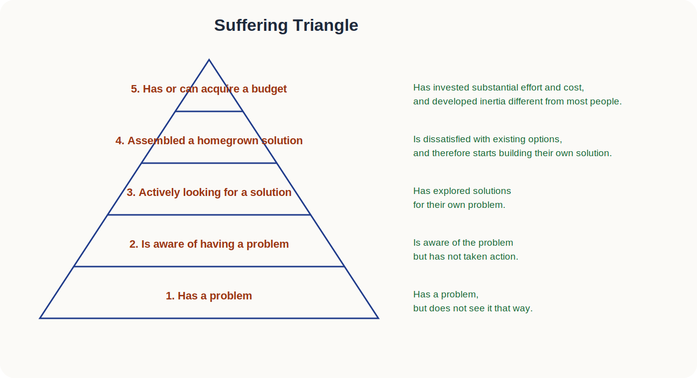
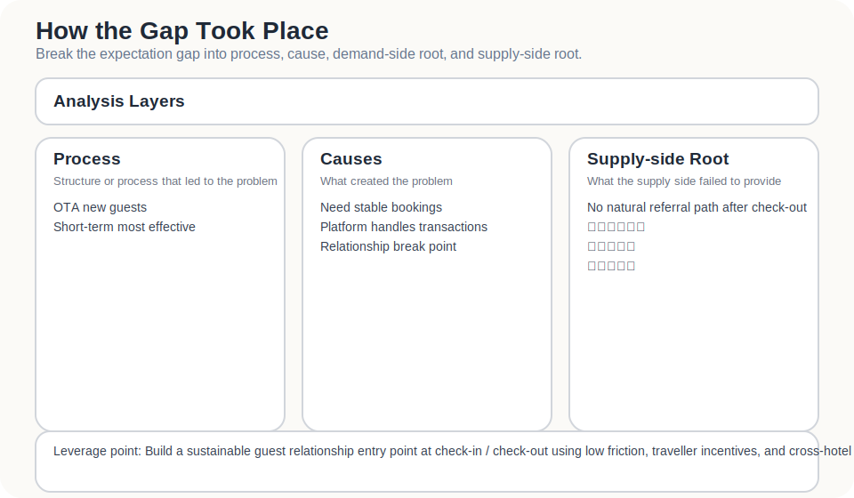
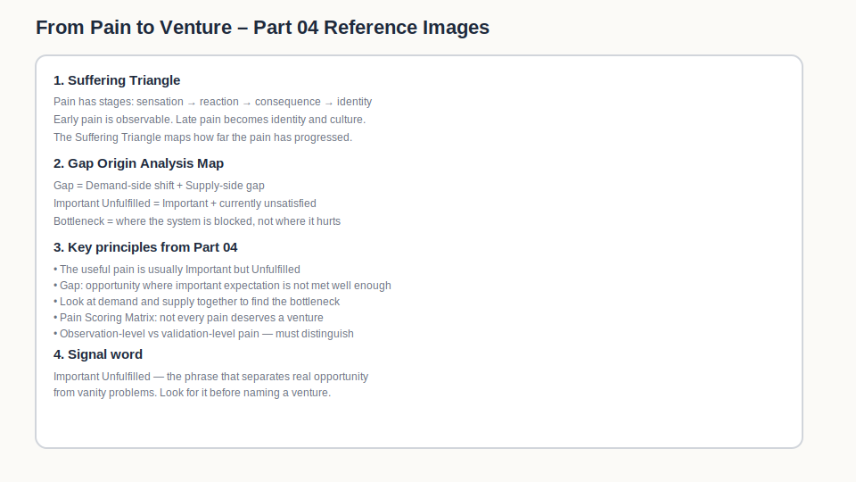

Founders are easily drawn towards complaints.

Someone says a workflow is painful, a tool is clumsy, a process is broken, an industry is outdated. It all sounds like opportunity. If the person says it with enough frustration, it is tempting to believe you have found the gap in the market.

But a complaint is not a need.

More precisely: a complaint is a signal, not evidence.

Some people complain but do not change. Some find something annoying but can live with it. Some say they want a better solution, yet will not pay, will not alter their process, and will not spend any real effort on it.

The question is not how to collect more complaints.

It is harder than that:

> Which kinds of pain are actually worth validating as a venture opportunity?

---

## The useful pain is usually important but unfulfilled.

I would start with four conditions.

| Condition | Question to ask |
|---|---|
| Important | Does this really matter? Does it affect a key job? |
| Underserved / Unfulfilled | Are current solutions genuinely failing to satisfy it? |
| Frequent / Urgent | Does it happen often, or is it painful enough when it happens? |
| Monetisable | Is the actor willing to spend money, time, attention or organisational effort to solve it? |

Not every condition needs to score perfectly.

But if a problem is not important, not clearly unmet, rare, and attracts no willingness to invest, it is usually an observation. Not yet a venture thesis.

Take independent hotels. “OTA commissions are too high” sounds like a pain point.

But you cannot stop there.

You need to ask:

- What actual damage does the commission pressure create?
- Is this painful occasionally, or every month?
- Has the hotel tried to build more direct bookings?
- If so, why did those attempts fail?
- Is the hotel willing to change processes, spend budget, train the front desk, or adopt a new mechanism?

If the answers remain vague, it may only be a complaint.

If the answers become specific, it may become a subject worth validating.

---

## Gap: opportunity often appears where an important expectation is not being met well enough.

Many venture opportunities do not come from completely empty markets.

They come from markets where solutions already exist, but fail to satisfy an important expectation well enough.

That unmet distance is the **Gap**.

For independent hotels, the Gap may not be “there are no tools”.

There are plenty of tools.

Booking engines, websites, CRMs, LINE, email, social media, ads, memberships. All of these already exist.

The real Gap may be that:

- tools exist, but the hotel lacks the staff to maintain them
- guest data is collected, but does not become a usable relationship
- the hotel has a website, but guests have no reason to visit it before an OTA
- CRM can send messages, but guests have no reason to leave contactable details
- membership can be built, but one small property cannot make the value strong enough
- remarketing can be bought, but it becomes another way of buying attention

So the real questions are:

> What result is expected?  
> What result is happening?  
> Is the distance between the two worth solving?

---

## Bottleneck: do not only look at where it hurts. Look at where the system is blocked.

Some pain points are surface friction.

Some are bottlenecks.

A bottleneck is the point where, if nothing changes, most downstream effort remains trapped.

An independent hotel may say it wants more direct bookings. At first glance, that sounds like a traffic problem.

But the bottleneck may not be traffic.

It may be:

- guests have no reason to leave the OTA and book direct
- the front desk has no light way to convert guests into an ongoing relationship
- the hotel has no strong incentive for guests to leave details
- a single-property membership feels too thin to matter
- even when data is collected, there is no durable communication and return-visit mechanism

If the bottleneck is guest incentive, buying more ads may only be a more expensive detour.

If the bottleneck is front-desk friction, building a heavy CRM may only give staff another reason not to use it.

The point is not to make the pain sound worse.

It is to make the problem more precise.

---

## The Suffering Triangle: pain has stages.

The Suffering Triangle is useful because it does not ask only whether someone has a problem.

It asks:

> How far has the pain progressed?

The original English levels are worth keeping because the order matters.

| Level | Original wording | Explanation |
|---|---|---|
| 1 | Has a problem | There is a problem, but they may not yet recognise it as such |
| 2 | Is aware of having a problem | They know the problem exists, but have not acted |
| 3 | Actively looking for a solution | They are actively looking for ways to solve it |
| 4 | Assembled a homegrown solution | They have patched together their own workaround |
| 5 | Has or can acquire a budget | They have budget, or can find resources |

Put back into independent hospitality:

### 1. Has a problem

The property is highly dependent on OTAs, but sees it as simply how the industry works.

### 2. Is aware of having a problem

The operator knows the lack of guest data is risky, and that direct booking is weak, but has not yet acted.

### 3. Actively looking for a solution

They start researching websites, booking engines, memberships, LINE, CRM, remarketing tools, or asking other hotels how they handle it.

### 4. Assembled a homegrown solution

They use Google Sheets to track repeat guests, manually send offers, broadcast through LINE, tidy up stay lists by hand, or track sources in a fragile way.

This is a strong signal.

People only build ugly workarounds when the problem has become annoying enough.

### 5. Has or can acquire a budget

They have budget, or can create access to budget.

Budget does not only mean money. It can mean time, staff attention, workflow change, or decision authority.

When a property is ready to put resources into the problem, it has moved beyond “this is irritating”. It has become operationally important.

### Applied to independent hotels

| Pain level | Independent hotel behaviour |
|---|---|
| 1 | Thinks OTA commission is high, but does not seriously treat it as a problem |
| 2 | Realises lack of guest data and repeat-guest mechanism creates long-term risk |
| 3 | Researches websites, CRM, memberships, LINE, remarketing and direct-booking strategy |
| 4 | Uses forms, LINE, Google Sheets or manual voucher codes as a temporary workaround |
| 5 | Will spend budget, change front-desk process, or seek outside help to build direct-booking capability |

The tool helps separate:

- people who merely have a problem
- people who know they have a problem
- people actively looking
- people already patching something together
- people ready to commit resources

For early ventures, the last two layers are usually the most useful.

They will not just talk.

They may move.

---

## How does the important expectation gap happen?

Some problems look like static outcomes.

For example: independent hotels struggle with direct booking.

But the real work is to understand how that expectation gap forms over time.

I would break it into four layers:

1. the structure or process by which it happens
2. the causes that produce the problem
3. the root problem on the demand side
4. the root problem on the supply side

Applied to independent hospitality:

| Analysis layer | Stage 1: guest source | Stage 2: stay and checkout | Stage 3: trying to reconnect | Stage 4: patching the hole | Stage 5: dependency deepens |
|---|---|---|---|---|---|
| Structure or process | Most new guests come from OTAs | Guests stay and leave without naturally entering an ongoing relationship | The hotel wants repeat visits and remarketing | It patches things together with fragmented tools | Low season arrives and the hotel returns to platforms and promotions |
| Cause | OTA controls the traffic entrance | The hotel has no low-friction way to collect durable contact data | Guests lack a reason to stay connected | Tools are scattered, staffing is thin, execution is inconsistent | Platform traffic is still the fastest route, while direct capability has not accumulated |
| Root problem: demand side | The hotel wants stable demand, but guests may not know or remember the property | After checkout, guests have no natural reason to remain connected | The hotel wants relationship, but guests see little reason to interact | The hotel wants to act, but lacks sustained execution capacity | The hotel needs direct capability, but short-term demand still pulls it back to OTAs |
| Root problem: supply side | Current tools focus on completing transactions more than extending relationships | Websites, CRM and membership tools exist, but are not linked into a low-friction flow | A single property’s membership value is often too weak | Available solutions are too heavy, fragmented, or labour-intensive | The market lacks a light, incentive-rich, executable solution for small properties |

The point is not to make the problem more complicated.

It is to explain where the gap comes from.

If you do not understand how the Gap forms, you are likely to place the solution in the wrong part of the system.

---

## Find the bottleneck by looking at demand and supply together.

You cannot understand the bottleneck by looking only at demand.

Nor can you understand it by looking only at supply.

Demand tells you why the actor is stuck.  
Supply tells you why the market has not solved it yet.

These six questions are worth returning to:

> 需求面：當事人的期待為什麼無法滿足？當事人為什麼無法自行解決問題？  
>
> 供給面：能夠 / 必須解決問題的人，為何無法解決？為何不出手解決？  
>
> 辯證需求面與供給面的罩門所造成當事人的期許落差所在。  
>
> 什麼根本的驅動力導致問題的發生？  
>
> 針對罩門、判讀罩門的時空環境及本質，提出可化解罩門的途徑。  
>
> 為什麼這樣做可以化解罩門？

For independent hotels:

### 1. Demand side

The hotel wants a steadier guest relationship, but cannot solve it alone because it lacks guest data, incentive design, remarketing capability, and sustained execution capacity.

### 2. Supply side

Potential solvers include booking engines, CRM tools, marketing consultants, OTAs, hotel alliances, and technology providers.

But they may not act, or may act ineffectively, because existing solutions are too heavy, too fragmented, too expensive, or solve transactions rather than relationships.

### 3. Demand–supply bottleneck

The real bottleneck may be this: guests lack a strong enough reason to enter a single property’s relationship pool, and the hotel lacks a light enough way to maintain that relationship.

### 4. Root driving force

Traffic concentration on platforms, weak single-property brand power, low repeat-stay frequency, and high tool-adoption cost all push the hotel back towards OTAs.

### 5. Pathway to dissolve the bottleneck

The answer may not be another standard membership system. It may be reducing entry friction, increasing guest incentive, allowing multiple properties to strengthen the benefit pool, and testing the behaviour through a lightweight MVP.

### 6. Why this can dissolve the bottleneck

Because it works on both sides at once: guests have a reason to join, hotels have a way to execute, and data can become a basis for future interaction.

---

## Pain Scoring Matrix: not every pain deserves a venture.

The pain still needs a practical score.

| Criterion | 1 | 3 | 5 |
|---|---|---|---|
| Importance | Nice to have | Meaningful impact | Key job |
| Frequency / urgency | Occasional | Regular | Frequent, or severe when it happens |
| Dissatisfaction with current solutions | Acceptable | Clear complaint | Actively looking for alternatives |
| Willingness to pay or invest | Unwilling | Willing to try | Already spending or willing to change workflow |
| Willingness to act | Talk only | Willing to trial | Has built a workaround |

If a hotel only says “OTA commission is high” but has taken no action and will not change workflow, it may be a low-scoring pain.

But if it has already:

- manually listed returning guests
- used LINE, email, or Google Sheets to patch the process
- researched membership and direct-booking incentives
- shown willingness to spend or alter workflow

then it deserves priority.

Not because it complains loudly.

Because it has shown, through action, that the issue has operational weight.

---

## Observation-level pain and validation-level pain

Pain points fall into two broad types.

The first is **observation-level pain**.

There is complaint, friction, inconvenience. But it may not be important enough, or active enough.

The second is **validation-level pain**.

It is:

- important
- unmet
- frequent or urgent
- tied to willingness to invest
- already producing search behaviour or workarounds

A founder’s job is not to find the place with the most complaints.

It is to find the place where someone has already paid a cost, tried to solve the problem, and still remains stuck.

That is where opportunity is more likely to form.

---

