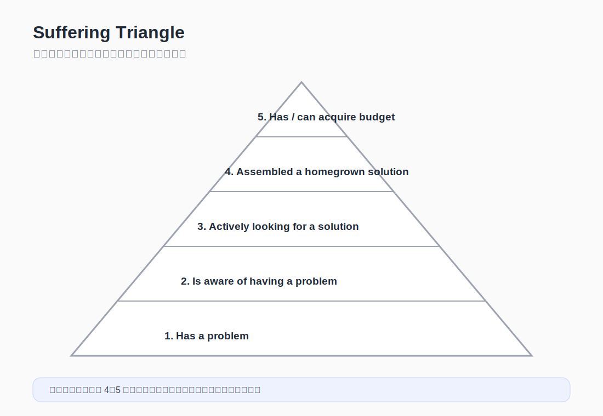
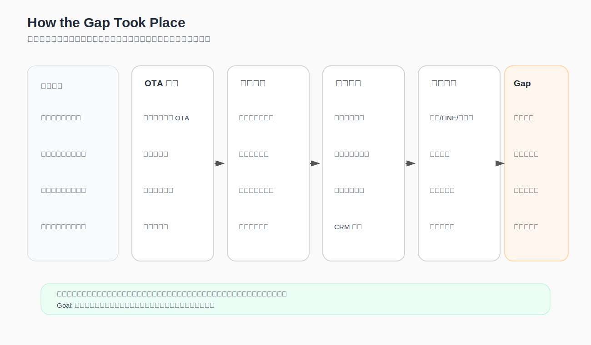

創業者很容易被抱怨吸引。

有人說這很麻煩，那很不方便，某個流程很爛，某個產業很落後。聽起來都像機會。尤其當對方講得很激動時，你甚至會覺得自己已經抓到市場缺口了。

但抱怨不是需求。

更準確一點說：抱怨只是訊號，不是證據。

有些人會抱怨，但不會改變。有些人覺得麻煩，但還能忍。有些人說想要，卻不願意付錢、不願意換流程，也不願意投入任何成本。

所以問題不是怎麼收集更多抱怨。

而是更難的一件事：

> 哪一種痛點，真的值得拿去創業驗證？

---

## 真正有價值的痛點，通常是 Important but Unfulfilled

一個痛點值不值得往下走，我會先看四個條件。

| 條件 | 要問的問題 |
|---|---|
| Important | 這件事真的重要嗎？會不會影響關鍵任務？ |
| Underserved / Unfulfilled | 現有解法真的沒有把它滿足好嗎？ |
| Frequent / Urgent | 它是經常發生，還是一發生就很急、很痛？ |
| Monetizable | 當事人願不願意付出成本去解？ |

這四個條件不一定每個都要滿分。

但如果一個問題不重要、沒有明顯未滿足、發生頻率低、也沒有人願意投入成本，那它大多只能當觀察，不適合直接當創業題目。

以獨立旅宿來說，「OTA 抽成高」聽起來像痛點。

但不能停在這句。

你要繼續問：

- 抽成高對它造成什麼實際影響？
- 這件事是偶爾痛，還是每個月都痛？
- 它有沒有試過自己做 direct booking？
- 試過之後為什麼沒有效？
- 它願不願意改流程、投入預算、訓練前台，或導入新機制？

如果答案都很弱，那它可能只是抱怨。

如果答案開始變具體，才有機會變成題目。

---

## Gap：機會常常不是「沒人做」，而是「重要期待沒有被滿足好」

很多創業機會不是來自完全空白的市場。

更常見的是：市場上已經有一些解法，但它們沒有把某個重要期待滿足好。

這個落差，就是 **Gap**。

對獨立旅宿來說，Gap 可能不是「沒有工具」。

工具很多。

訂房引擎、官網、CRM、LINE、Email、社群、廣告、會員系統，全部都有。

真正的 Gap 可能是：

- 工具存在，但旅宿沒有人力長期維護
- 旅客資料有收集，但沒有變成可用的關係
- 官網可以訂房，但旅客沒有理由先去官網
- CRM 可以發信，但旅客沒有足夠誘因留下資料
- 會員可以做，但單一旅宿的會員價值太薄
- 再行銷可以投，但每次都變成另一種買流量

所以要看的是：

> 期待結果是什麼？  
> 現實結果是什麼？  
> 中間那段沒有被滿足好的落差，值不值得解？

---

## Bottleneck：別只看哪裡痛，要看哪裡卡住整個系統

有些痛點只是表面摩擦。

有些痛點才是瓶頸。

瓶頸的意思是：只要這個地方不動，後面的努力大多會被卡住。

例如旅宿想提高 direct booking，表面看起來像是缺流量。

但真正的 bottleneck 可能不是流量，而是：

- 旅客沒有理由離開 OTA 去官網訂
- 前台沒有低摩擦方式讓旅客加入後續關係
- 旅宿沒有足夠誘因讓旅客願意留下資料
- 單一旅宿的會員價值太薄，旅客不覺得值得
- 即使收了資料，也沒有可持續溝通與回訪機制

如果 bottleneck 在旅客誘因，你去買更多廣告，可能只是更貴地繞過問題。

如果 bottleneck 在前台摩擦，你做一個複雜 CRM，可能只是讓員工更不想用。

這裡真正要做的，不是把問題講得更痛，而是把問題講得更準。

---

## Suffering Triangle：痛苦不是有或沒有，而是有層次

痛苦指數三角形很好用，因為它不只問「這個人有沒有問題」，而是問：

> 他痛到哪一層了？

先保留這個工具原本的中英文層級，因為它的判斷順序本身就很重要。

| 層級 | Original wording | 中文說明 |
|---|---|---|
| 1 | Has a problem | 有問題，但自己不一定這麼認為 |
| 2 | Is aware of having a problem | 意識到有問題，但還沒有採取作為 |
| 3 | Actively looking for a solution | 正在主動尋找解法 |
| 4 | Assembled a homegrown solution | 已經自己拼湊出土法煉鋼的解法 |
| 5 | Has or can acquire a budget | 有預算，或有能力取得預算 |

套回獨立旅宿，可以這樣看：

### 1. Has a problem

有問題，但自己不一定這麼認為。

例如旅宿高度依賴 OTA，但覺得反正大家都這樣，也沒什麼。

### 2. Is aware of having a problem

意識到有問題，但還沒有採取作為。

例如旅宿知道自己沒有客戶資料很危險，也知道直訂比例太低，但還沒開始找方法。

### 3. Actively looking for a solution

開始主動尋找解法。

例如研究官網、訂房引擎、會員、LINE、CRM、再行銷工具，或開始問其他旅宿怎麼做。

### 4. Assembled a homegrown solution

已經自己拼湊出土法煉鋼的解法。

例如用 Google Sheet 記回訪客、手動發優惠碼、用 LINE 群發訊息、自己整理入住名單、用很不穩的方式追蹤旅客來源。

這通常是很強的訊號。

因為人只有在問題真的夠煩時，才會自己拼一套醜但能用的東西。

### 5. Has or can acquire a budget

有預算，或有能力取得預算。

這裡的預算不一定只是錢，也可能是時間、人力、流程調整、決策權。

如果一間旅宿已經願意投入資源，代表這個問題不只是「我覺得有點煩」。它已經進入經營優先級。

### 套到獨立旅宿

| 痛苦層級 | 獨立旅宿的表現 |
|---|---|
| 1 | 覺得 OTA 抽成高，但沒有認真把它當問題處理 |
| 2 | 意識到沒有顧客資料、沒有回訪機制會造成長期風險 |
| 3 | 主動研究官網、CRM、會員、LINE、再行銷與直訂策略 |
| 4 | 自己用表單、LINE、Google Sheet、手動優惠碼拼出臨時解法 |
| 5 | 願意投入預算、調整前台流程，或找外部合作來建立直訂能力 |

這個工具的價值在於，它會幫你區分：

- 誰只是有問題
- 誰知道自己有問題
- 誰已經開始找解法
- 誰已經痛到自己拼東西
- 誰已經準備好投入資源

早期創業，最好先找後面兩層的人。

因為他們不只會跟你聊天。

他們可能真的會動。

---

## 重大期許落差是怎麼發生的

有些問題乍看是一個靜態結果。

例如：獨立旅宿 direct booking 做不起來。

但真正要看的，是這個重大期許落差怎麼一步一步發生。

我會把它拆成四層：

1. 發生的結構或過程
2. 導致問題發生的原因
3. 根本問題（需求面）
4. 根本問題（供給面）

套到獨立旅宿，可以這樣看：

| 分析層次 | 階段 1：新客來源 | 階段 2：入住與退房 | 階段 3：想做回訪 | 階段 4：臨時補洞 | 階段 5：依賴加深 |
|---|---|---|---|---|---|
| 發生的結構或過程 | 多數新客來自 OTA | 旅客完成入住與退房，但沒有被自然導入後續關係 | 旅宿想做回訪與再行銷 | 開始用零散工具補洞 | 淡季來時，又回到平台與促銷 |
| 導致問題發生的原因 | OTA 掌握流量入口 | 旅宿沒有低摩擦資料收集入口 | 旅客缺少留下資料與再次互動的誘因 | 工具分散、人力不足、流程不穩 | 平台流量仍然最立即，直訂能力沒有累積 |
| 根本問題（需求面） | 旅宿想要穩定客源，但旅客不一定認識或記得它 | 旅客完成住宿後，沒有自然理由留下來 | 旅宿想維持關係，但旅客不覺得有必要互動 | 旅宿想做，但缺乏持續執行的能力 | 旅宿需要直訂能力，但短期仍依賴 OTA |
| 根本問題（供給面） | 現有工具偏向交易完成，而不是關係延續 | 官網、CRM、會員工具各自存在，但沒有低摩擦串起來 | 單一旅宿的會員價值太弱 | 市場上的方案太重、太碎，或太依賴人力 | 供給端沒有提供足夠輕、足夠有誘因、可被小型旅宿執行的方案 |

這張表的目的，不是把問題寫得更複雜。

而是把「落差怎麼來」講清楚。

因為如果你不知道 Gap 是怎麼形成的，就很容易把解法放錯地方。

---

## 從需求面與供給面一起找罩門

要找到真正的罩門，不能只看需求，也不能只看供給。

需求面會告訴你：當事人為什麼卡住。  
供給面會告訴你：為什麼市場上有那麼多工具，問題還是沒有被解好。

這裡有六組問題很值得反覆問：

> 需求面：當事人的期待為什麼無法滿足？當事人為什麼無法自行解決問題？  
>
> 供給面：能夠 / 必須解決問題的人，為何無法解決？為何不出手解決？  
>
> 辯證需求面與供給面的罩門所造成當事人的期許落差所在。  
>
> 什麼根本的驅動力導致問題的發生？  
>
> 針對罩門、判讀罩門的時空環境及本質，提出可化解罩門的途徑。  
>
> 為什麼這樣做可以化解罩門？

套回獨立旅宿：

### 1. 需求面

旅宿期待建立更穩定的顧客關係，但無法自行解決，因為它缺少旅客資料、誘因設計、再行銷能力與長期執行人力。

### 2. 供給面

能夠解決問題的人，可能是訂房引擎、CRM 工具、行銷顧問、OTA、旅宿聯盟或技術服務商。

但他們不一定出手，或出手後不一定有效，因為現有方案常常太重、太碎、太貴，或者只解決交易，不解決關係。

### 3. 需求面與供給面的罩門

真正的罩門可能是：旅客沒有足夠理由進入單一旅宿的關係池，而旅宿也沒有足夠輕的方式持續經營這段關係。

### 4. 根本驅動力

平台流量集中、單一旅宿品牌弱、旅客住宿頻率低、工具導入成本高，這些力量一起把旅宿推回 OTA。

### 5. 化解罩門的途徑

可能的途徑不是再做一個普通會員系統，而是降低加入摩擦、提高旅客誘因、讓多間旅宿共同放大 benefits，並用輕量 MVP 測試旅客是否願意進入這個關係池。

### 6. 為什麼這樣做可以化解罩門

因為它不是單純增加工具，而是同時處理需求面與供給面的卡點：旅客有理由加入，旅宿有能力執行，資料有機會變成後續互動。

---

## Pain Scoring Matrix：不是每個痛點都值得創業

最後，還是要把痛點放回一張簡單的評分表。

| 指標 | 1 分 | 3 分 | 5 分 |
|---|---|---|---|
| 重要性 | 可有可無 | 有影響 | 關鍵任務 |
| 頻率 / 急迫性 | 偶爾 | 固定發生 | 經常發生或一發生就很痛 |
| 現有不滿 | 還可以 | 有明顯抱怨 | 正在找替代方案 |
| 付費 / 投入意願 | 不願意 | 願意試 | 已經在花錢或願意改流程 |
| 行動意願 | 只說說 | 願意試用 | 已經自己拼湊解法 |

如果某家旅宿只是口頭說「OTA 抽很高」，但沒有採取任何動作，也不願意改變流程，那可能只是低分痛點。

但如果它已經：

- 手動整理回訪客名單
- 自己搞 LINE / Email / Google Sheet
- 開始研究會員與直訂誘因
- 願意投入預算或調整流程

那就值得優先驗證。

這不是因為它講得比較激動。

而是因為它已經用行動證明：這件事不是抱怨，是經營上的重量。

---

## 觀察級痛點，和驗證級痛點

痛點最後可以分成兩種。

第一種是**觀察級痛點**。

有抱怨、有摩擦、有不順，但未必夠重要，也未必有行動力。

第二種是**驗證級痛點**。

它同時具備：

- 重要
- 未被滿足
- 有頻率或急迫性
- 願意投入成本
- 已經開始尋找或拼裝解法

創業者真正要找的，不是最多人抱怨的地方。

而是那個有人已經開始付出代價、卻仍然沒能解好的地方。

那裡才比較可能長出機會。

---
