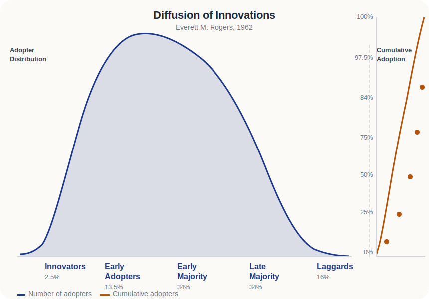
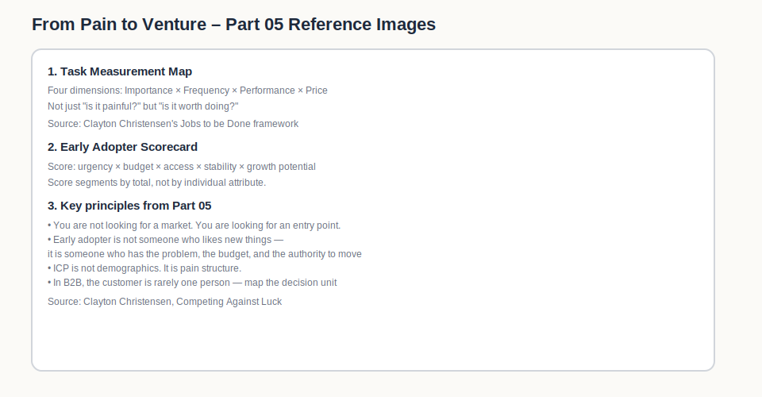
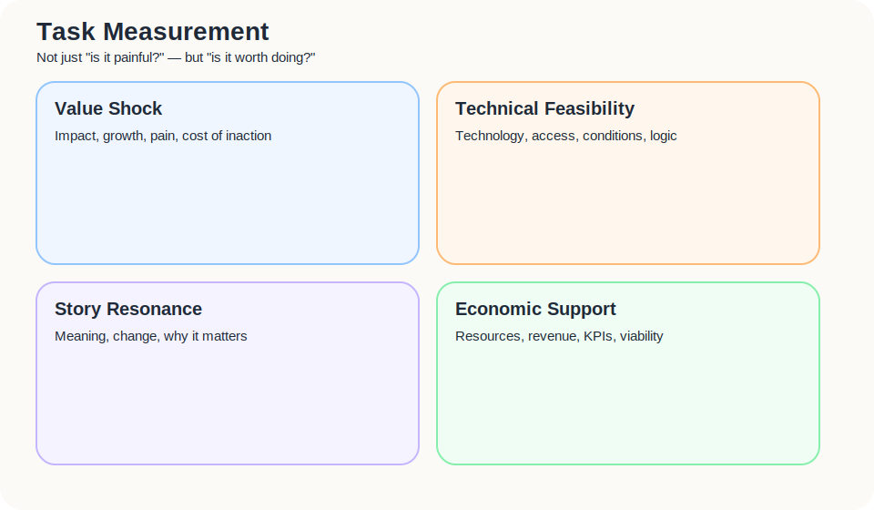

I used to describe markets too broadly.

Independent hotels want to rely less on OTAs.  
Small properties need more direct bookings.  
Every operator wants to own their guest data.

None of this is necessarily wrong.

But once you try to find your first partners, the difference becomes obvious. A large market is not the same thing as an early market. Plenty of people will agree with the problem. Far fewer will change what they do this month.

So this part is not asking, “Who might benefit from this?”

It asks something less polished, and much more useful:

> Who is already in enough pain to move?

That group may not be the largest.  
But it will give you the earliest real signal.

---

## You are not looking for the market. You are looking for the entry point.

Early founders often get tricked by size.

A big market looks good in a deck. On the ground, it can be uselessly vague.

Take independent hospitality. “We want to reduce OTA dependency” sounds broadly true. But once you speak to actual properties, the differences appear quickly.

Some complain about commission, but can live with it.  
Some know direct booking matters, but have no time to work on it.  
Some are already using LINE, email, and Google Sheets to keep track of returning guests.  
Some will try a pilot and share data.  
Some owners are keen, but the front desk hears “one more check-in step” and immediately resists.

These are not the same customer.

The early-market task is not to make the segment look neat. It is to find the entry point where learning is most likely to happen.

That entry point usually has three things: pain, urgency, and action.

Miss one, and be careful.

---

## An early adopter is not just someone who likes new things

I have never liked reducing early adopters to “people who like trying new tools”.

It creates the wrong instinct. You start looking for novelty-seekers, when what you really need are people whose old way of working has become painful enough.

A useful early adopter may not fully understand your product yet.

But they understand their own mess.

The signals I would look for are these:

| Signal | What it tells you |
|---|---|
| Clear pain | They can describe the problem in concrete terms |
| Problem awareness | You do not need to spend forever convincing them the problem exists |
| Active search | They have started asking, comparing, testing |
| Homegrown workaround | They have built an ugly process because the issue matters |
| Tolerance for imperfection | They want progress, not a polished product |
| Willingness to give feedback | They will help you understand the problem properly |
| Budget or influence | They may not sign the cheque, but they can move resources |
| Lower adoption friction | Their environment allows a small experiment |

The strongest signal is rarely what someone says. It is what they have already done.

A polite “interesting idea” is cheap.  
A broken Google Sheet that keeps the business alive is much more valuable.

Action leaks pain.

---

## The Diffusion Curve: this is related, but it is not the same thing

Everett Rogers published *Diffusion of Innovations* in 1962.  
The model divides adopters into five groups:

| Category | Share | Behaviour |
|---|---|---|
| Innovators | 2.5% | Will try anything early, regardless of pain |
| Early Adopters | 13.5% | Move ahead of the crowd, often driven by a specific problem they want solved |
| Early Majority | 34% | Follow once evidence is visible |
| Late Majority | 34% | Resistant until peer pressure is strong |
| Laggards | 16% | Last to move, if ever |

Here is the important distinction for early-market work:

The Rogers model is descriptive. It tells you what happened across the full adoption curve in retrospect.

The suffering triangle is diagnostic. It tells you who among the people in front of you right now is most likely to move first.

You are not trying to predict which category someone falls into over the full product lifecycle.

You are trying to answer a simpler, more urgent question:

> Given this person's current pain, workaround, and urgency — will they move before I run out of resources?

The Rogers early adopter and the suffering-triangle stage-4 actor are not the same person.

A Rogers early adopter may move because they like novelty.

A stage-4 actor moves because the old way has already become unsustainable.

For venture validation, you want the second type.  
The first type can mislead you into chasing enthusiasm instead of real pain.

## The Suffering Triangle: how far has the pain progressed?

Pain is not binary. It has stages.

Some people have a problem.  
Some know they have a problem.  
Some are already looking for a solution.  
Some have built an ugly workaround.  
At the top, some have budget, or at least access to resources.

| Level | Original wording | What it means in practice |
|---|---|---|
| 1 | Has a problem | Has a problem, but does not see it that way |
| 2 | Is aware of having a problem | Is aware of the problem but has not taken action |
| 3 | Actively looking for a solution | Has explored solutions for their own problem |
| 4 | Assembled a homegrown solution | Is dissatisfied with existing options, and therefore starts building their own solution |
| 5 | Has or can acquire a budget | Has invested substantial effort and cost, and developed inertia different from most people |

### Applied to independent hotels

| Level | Independent hotel signal | Why it matters |
|---|---|---|
| 1 | Complains that OTA commissions are high, but treats it as normal industry reality | Pain exists, but behaviour has not changed |
| 2 | Knows weak direct booking and weak guest data are dangerous, but still has no active response | Awareness exists, but not yet commitment |
| 3 | Starts comparing websites, booking engines, CRM, LINE, memberships, and remarketing options | The problem has become active enough to search for alternatives |
| 4 | Uses Google Sheets, LINE broadcasts, manual guest tags, voucher codes, or patched flows | This is a strong signal: they are already paying the pain with labour |
| 5 | Is willing to spend money, time, workflow change, staff attention, or decision authority | The pain has become operationally important enough to deserve resources |

The most useful early-adopter layers are usually 4 and 5.

Stage 4 tells you the actor is no longer satisfied with existing options and has already started building something of their own.  
Stage 5 tells you the actor has already paid substantial effort and cost, and now behaves with a very different kind of inertia from ordinary users.

That is why the triangle is useful.

It does not only tell you who hurts.

It tells you whose pain has already become costly enough to reshape behaviour.

---

## ICP is not demographics. It is pain structure.

Many ICPs read like LinkedIn filters.

Independent hotel.  
20 to 80 rooms.  
Located in an Asian travel city.  
Interested in direct booking.

That is fine as a first sketch. It is not enough for early-market work.

A useful ICP describes why this group is more likely to move now.

| Dimension | Question |
|---|---|
| Industry / role | Who is this? Owner, GM, marketer, front desk, group operator? |
| Situation | When does the problem become visible? Before low season, after checkout, during remarketing? |
| Pain intensity | Are they complaining, or already acting? |
| Current workaround | What are they using now? |
| Decision power | Who can approve a test or partnership? |
| Budget | Is there budget? Where does it come from? |
| Adoption friction | Will systems, staff, workflow, or platform politics block it? |
| Reachability | Can you actually reach this group? |
| Case value | If this works, will it convince the next group? |

A strong early ICP is not impressive because it is large.

It is useful because you can see why it might move first.

---

## In B2B, the customer is rarely one person

One of the easiest mistakes in B2B is treating the user as the customer.

In hospitality, the person using the workflow, the person paying for it, the person fearing extra work, and the person willing to push internally may all be different.

| Role | Question |
|---|---|
| User | Who uses it every day? Front desk, marketing, operations? |
| Buyer | Who pays? Owner, GM, head office? |
| Decision maker | Who can approve it? |
| Influencer | Who shapes the decision? |
| Champion | Who will push for it internally? |
| Blocker | Who might stop it, and why? |

An owner may want more direct bookings. The front desk may worry about slowing down check-in. A marketer may want a membership layer. The owner may not want another fixed cost. A guest may scan a QR code, but only if the reason is clear.

So an early adopter is not always a single persona.

Often, it is a structure of roles where movement is possible.

If that structure is not there, even a real pain can stay still.

---

## Task Measurement: not just “is it painful?”, but “is it worth doing?”

Once you have found people in pain, do not rush.

A task is worth pursuing only if it matters, can be executed, carries meaning, and has some economic support.

I would assess it through four lenses:

| Lens | Questions |
|---|---|
| Value shock | Does it affect many people? Is there a growth trend? Does inaction create pain or meaningful cost? Is the money, time, or opportunity cost large enough? |
| Technical feasibility | What technology is involved? Does it already exist? Can it be accessed? What conditions are required? Is it logically feasible? |
| Story resonance | Does the change matter? Is there a meaningful before and after? Why should anyone care? |
| Economic support | Are resources available? Can they be obtained? Will anyone contribute? Can the model move towards balance? What measurable numbers prove value? |

These four need to be held together.

A story without economic support becomes a nice vision.  
A technically feasible idea without value shock becomes an engineering exercise.  
A painful problem without accessible resources is hard to start.

For independent hospitality:

| Lens | Example |
|---|---|
| Value shock | OTA dependency affects margin, guest relationships, and long-term brand assets |
| Technical feasibility | Early validation can avoid PMS integration and use QR registration, manual tagging, and simple CRM flows |
| Story resonance | Small properties regain a route towards owning their guest relationships |
| Economic support | Paid pilots, founding partner plans, and low-cost MVPs can test willingness to pay |

This is not a scoring exercise for making the idea look good.

It is a cold basin of water. It checks whether the story, the market, the technology, and the economics can sit in the same room.

---

## Early Adopter Scorecard

The early segment can then be scored more honestly.

| Criterion | 1 | 3 | 5 |
|---|---|---|---|
| Pain clarity | Vague | Clear complaint | Concrete context and cost |
| Evidence of action | None | Occasional attempts | Actively looking |
| Workaround | None | Fragmented method | Homegrown process |
| Budget / resources | None | Possible | Available or obtainable |
| Decision access | No decision-maker | Influencer reachable | Decision-maker or champion reachable |
| Adoption friction | High | Small test possible | Willing to pilot |
| Case value | Not representative | Some reference value | Could convince the next group |

I would prioritise the highest-scoring prospects, not the largest-sounding segment.

---

## What this part should leave behind

This part is not meant to produce a tidy market map.

It should leave behind three working outputs:

1. **An ICP draft**  
   Built around pain structure, not demographics.

2. **An Early Adopter Scorecard**  
   To decide who deserves interviews, prototypes, and pilots first.

3. **A Stakeholder Map**  
   Separating User, Buyer, Decision maker, Influencer, Champion, and Blocker.

The early market is not the prettiest customer group in your imagination.

It is the group already in enough pain to help you uncover the truth.

---

