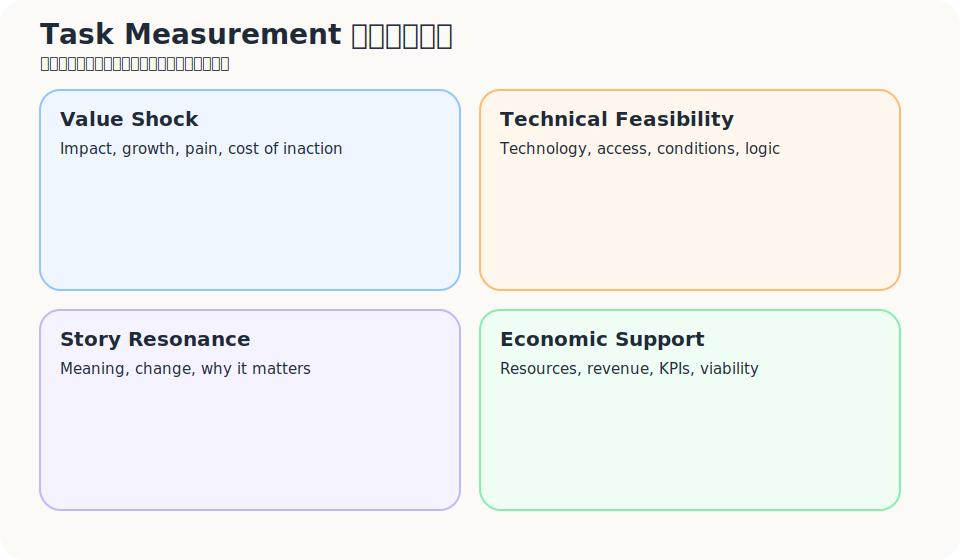
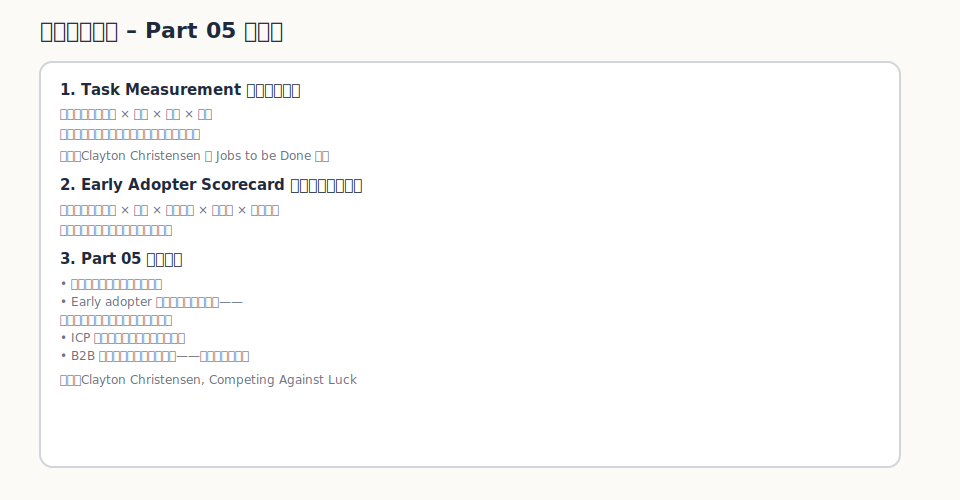

我以前也會把市場講得很大。

獨立旅宿都想降低 OTA 依賴。  
小型飯店都想要更多 direct booking。  
每個經營者都想掌握自己的顧客資料。

這些話聽起來都成立。

但真的拿去找第一批合作對象時，你會很快發現，大市場是一回事，早期市場是另一回事。很多人同意你的問題，卻不一定願意現在動。有些人會點頭，會說這很重要，會說「之後可以聊聊」，但你一離開，他的生活照舊，流程照舊，預算照舊。

所以這一篇不是在問「誰可能需要」。  
而是問一個更不浪漫、但更有用的問題：

> 誰已經痛到願意改變？

這群人不一定最大。  
但他們會給你最早的真實訊號。

---

## 你要找的不是市場，而是入口

早期創業很容易被一個念頭騙：市場越大越好。

簡報上可以這樣寫。  
真的做事時，市場太大反而會讓你抓不到人。

拿獨立旅宿來說，同樣都說自己想降低 OTA 依賴，每一間旅宿背後的狀態其實很不一樣。

有些只是覺得抽成高，但還能忍。  
有些知道 direct booking 重要，卻沒有人力處理。  
有些已經開始用 LINE、Email、Google Sheet 手動整理回訪客。  
有些願意試一個小 pilot，也願意把資料拿出來一起看。  
有些老闆很想做，但前台一聽到 check-in 多一道流程，臉就先沉下來。

這些都不能叫同一種客戶。

早期市場不是把人群切得漂亮，而是找到那個最容易產生學習的入口。  
那裡通常有三個東西：痛、急、行動。

少一個，都要小心。

---

## Early adopter 不是喜歡新東西的人

我不太喜歡把 early adopter 翻成「愛嘗鮮的人」。

這樣會讓人誤會，以為早期市場就是找那些願意試新工具、喜歡新概念、對創新比較開放的人。這當然有幫助，但不是最關鍵的。

真正值得找的 early adopter，通常不是因為他喜歡新東西。  
是因為舊方法已經讓他受不了。

他可能沒有很懂你的產品。  
但他很懂自己的麻煩。

我會看幾個訊號：

| 訊號 | 代表什麼 |
|---|---|
| 痛點明確 | 他能具體說出問題，不只是泛泛抱怨 |
| 已經知道自己有問題 | 不需要你花很久說服他承認問題存在 |
| 正在找解法 | 他已經在問人、比較工具、測方法 |
| 已經用土法煉鋼處理 | 他願意自己拼流程，代表問題真的痛 |
| 願意忍受不完美 | 他要的是進展，不是完整包裝 |
| 願意提供回饋 | 他會一起幫你把問題挖清楚 |
| 有預算或能影響預算 | 他不一定拍板，但能讓事情往前 |
| 採用阻力較低 | 他所在的環境允許小規模試驗 |

最值得留意的不是他說了什麼，而是他已經做了什麼。

有人說這個 idea 很好，價值不高。  
有人已經自己用 Google Sheet 拼了一套爛流程，價值高很多。

因為行動會漏出真正的痛。

---

## Suffering Triangle：痛苦走到哪一層了？

痛苦不是有或沒有。痛苦有層次。

有些人只是有問題。  
有些人知道自己有問題。  
有些人已經開始找解法。  
再往上，有些人已經自己拼了一個很醜、但勉強能活的替代方案。  
最上面那群人，已經有預算，或至少能拿到資源。

| Level | Original wording | 中文說明 |
|---|---|---|
| 1 | Has a problem | 有問題，但自己不一定這麼認為 |
| 2 | Is aware of having a problem | 意識到有問題，但還沒有採取作為 |
| 3 | Actively looking for a solution | 正在主動尋找解法 |
| 4 | Assembled a homegrown solution | 已經自己拼湊出土法煉鋼的解法 |
| 5 | Has or can acquire a budget | 有預算，或有能力取得預算 |

早期驗證最值得找的，通常是 Level 3 到 Level 5。

Level 1 和 Level 2 不是沒有價值，但你會花很多力氣教育市場。  
Level 3 開始有真實需求。  
Level 4 會暴露 workaround 的結構。  
Level 5 才開始靠近商業可行性。

套到獨立旅宿：

| 層級 | 旅宿狀態 | 適合怎麼互動 |
|---|---|---|
| Level 1 | 覺得 OTA 抽成高，但還能接受 | 不急著賣，先觀察問題是否真的有重量 |
| Level 2 | 意識到沒有顧客資料很危險 | 用案例教育，確認痛點是否升級 |
| Level 3 | 主動研究官網、會員、LINE、CRM | 適合訪談與 problem test |
| Level 4 | 自己用 Google Sheet、LINE 群發、手動標記回訪客 | 非常適合 prototype / concierge MVP |
| Level 5 | 願意投入預算或調整流程 | 適合 paid pilot / partnership test |

這個三角形最有用的地方，是它會提醒你：  
不要把還在第一層的人，當成第五層的人來賣。

那會很累。

而且很容易誤判市場。

---

## ICP 不是人口統計，而是痛點結構

很多 ICP 寫得很像 LinkedIn filter。

獨立旅宿。  
20 到 80 間房。  
位於亞洲旅遊城市。  
重視 direct booking。

這可以當初稿，但還不夠。

因為它只描述了「像誰」，沒有描述「為什麼現在會動」。

真正有用的 ICP，要把痛點結構寫出來：

| 維度 | 要問什麼 |
|---|---|
| 行業 / 身分 | 他是誰？旅宿老闆、GM、行銷、前台，還是集團營運？ |
| 情境 | 他在哪個時刻最感覺到問題？淡季前、退房後、回訪率低時？ |
| 痛點強度 | 他是抱怨，還是已經行動？ |
| 現有替代方案 | 他現在用什麼 workaround？ |
| 決策權 | 誰能批准試用或合作？ |
| 預算 | 有沒有預算？預算從哪裡來？ |
| 採用阻力 | 系統、人力、流程、平台關係會不會卡住？ |
| 可觸達性 | 你找得到這群人嗎？ |
| 案例價值 | 如果成功，這個案例能不能說服下一批人？ |

一個好的早期 ICP，不是看起來很大。  
而是你一看就知道：這群人為什麼比別人更可能先動。

---

## B2B 裡，客戶通常不是一個人

B2B 題目最容易犯的錯，是把「使用者」當成「客戶」。

在旅宿場景裡，真正用工具的人、付錢的人、害怕流程變麻煩的人、願意在內部幫你推的人，常常不是同一個人。

| 角色 | 你要問的問題 |
|---|---|
| User | 誰每天使用？前台、行銷、營運？ |
| Buyer | 誰付錢？老闆、GM、集團總部？ |
| Decision maker | 誰拍板？ |
| Influencer | 誰會影響決策？ |
| Champion | 誰會在內部幫你推？ |
| Blocker | 誰會阻止，為什麼？ |

旅宿老闆可能很想做 direct booking，但前台擔心 check-in 多一道流程。  
行銷人員可能想導入會員機制，但老闆不想增加固定成本。  
旅客可能願意掃 QR code，但如果沒有明確誘因，他不會完成註冊。

所以 early adopter 不是一張人像。  
它常常是一組角色之間，剛好出現了可以推動的結構。

如果這個結構不存在，痛點再真，也很難動。

---

## Task Measurement：不是只問痛不痛，也要問值不值得做

找到痛的人之後，還不能立刻衝。

一個任務要不要往下做，至少要看四件事：它的價值是否夠大、技術是否可行、故事是否有共鳴、經濟上是否撐得起來。

| 面向 | 要問的問題 |
|---|---|
| 價值震撼性 | 是否對很多人有影響？是否有明顯成長趨勢？問題沒解，是否會造成痛苦或重大代價？付出的金錢、時間、機會成本是否夠大？ |
| 技術可行性 | 涉及什麼技術？技術是否已存在？如何取得？需要什麼條件？邏輯上的可能性有多高？ |
| 故事感動性 | 是否有共鳴？改變的可能性有多高？為什麼有意義？ |
| 經濟支持性 | 是否有足夠資源？如何取得這些資源？有沒有人願意提供資源？能否達成收支平衡？衡量指標與量化經濟數字是什麼？ |

這四件事要一起看。

有故事，但沒有經濟支持，容易變成漂亮願景。  
有技術，但沒有價值震撼性，容易變成工程練習。  
有痛點，但沒有可取得資源，也很難啟動。

套到獨立旅宿：

| 面向 | 旅宿案例 |
|---|---|
| 價值震撼性 | OTA 依賴影響利潤、顧客關係與長期品牌資產 |
| 技術可行性 | 初期可不用 PMS integration，用 QR registration、manual tagging、簡單 CRM flow 驗證 |
| 故事感動性 | 讓小型旅宿不只被平台抽走流量，也能慢慢建立自己的客戶關係 |
| 經濟支持性 | 可用 paid pilot、founding partner plan、低成本 MVP 測試願付意願 |

這張表不是為了替 idea 打漂亮分數。  
它比較像一個冷水盆：確認你不是只被故事感動，也不是只被技術可能性推著走。

---

## Early Adopter Scorecard

到最後，可以把早期客群放進一張 scorecard。

| 指標 | 1 分 | 3 分 | 5 分 |
|---|---|---|---|
| 痛點清晰度 | 說不清楚 | 有明顯抱怨 | 能具體描述情境與代價 |
| 行動證據 | 沒有動作 | 偶爾嘗試 | 已經主動找解法 |
| Workaround | 沒有 | 有零散方法 | 已經拼出土法煉鋼流程 |
| 預算 / 資源 | 沒有 | 有可能 | 已有預算或能取得預算 |
| 決策可達性 | 找不到決策者 | 可接觸影響者 | 可接觸決策者或 champion |
| 採用阻力 | 高度阻力 | 可小規模測 | 願意試 pilot |
| 案例價值 | 不具代表性 | 有一定參考性 | 成功後能說服下一批客戶 |

我會優先找總分高的人，而不是看起來市場最大的群體。

---

## 這一篇真正要留下來的東西

讀完這篇，不是要得到一張漂亮的市場分類圖。

真正要留下來的是三個工作成果：

1. **一份 ICP 草稿**  
   不是人口統計，而是痛點結構。

2. **一張 Early Adopter Scorecard**  
   判斷誰值得優先訪談、prototype、pilot。

3. **一張 Stakeholder Map**  
   把 User、Buyer、Decision maker、Influencer、Champion、Blocker 分清楚。

早期市場不是你想像中最完美的客群。  
而是那群已經痛到願意跟你一起把問題挖出來的人。

---

