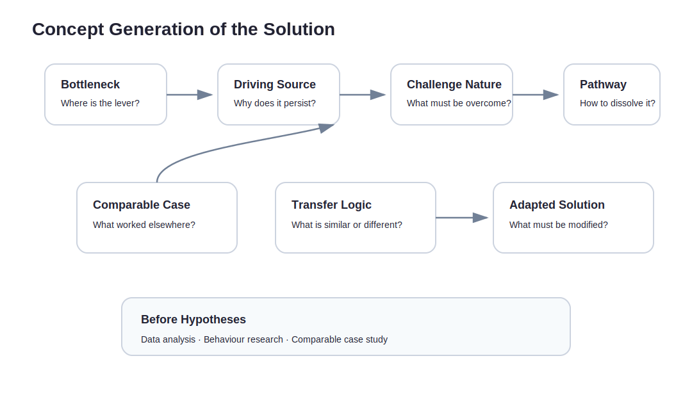

Once a problem has been found, it is tempting to relax.

Good. The problem is clear.  
Now we can build.

This is exactly where I would slow down.

The path from problem to solution is not a bridge. It is fog. What looks like a solution is often a bundle of assumptions that has not yet earned the right to be built.

This part sits in that fog.

It does not start with:

> What feature should we build?

It starts with:

> Which bottleneck, if removed, would make the customer’s important expectation gap disappear?

Longer sentence.  
Less self-deception.

---

## A solution is not inspiration. It is a bundle of assumptions.

A solution usually carries more assumptions than it first admits.

Suppose you want to build a loyalty alliance for independent hotels, helping them reduce OTA dependency. On the surface, that sounds like a solution. Underneath, it contains at least these assumptions:

- Hotels see OTA dependency as an important problem.
- They are not merely complaining. They are willing to change workflow.
- Guests will leave contactable data during or after a stay.
- Cross-property points or benefits are attractive enough to matter.
- Front-desk teams can absorb the flow, or the flow can be made light enough.
- Hotels will pay, pilot, or contribute resources.
- The core value can be tested before PMS integration.
- The model can produce measurable signals around direct booking, repeat visits, or guest-data growth.

If any of these fails, the solution may need to change.

So the first principle is simple:

> Do not treat the solution as the answer. Break it into hypotheses first.

---

## Work backwards from the bottleneck

Do not begin with:

> What product can I build?

Begin with:

> Where is the bottleneck behind this expectation gap?

If the important expectation for an independent hotel is to build a steadier, more durable direct guest relationship, the gap may not simply be “we lack a system”.

The real bottleneck might be:

- Guests have no strong reason to join the hotel’s relationship pool.
- The front desk has no time for a heavy onboarding flow.
- The hotel lacks a compelling reason for guests to return.
- A single property’s membership value is too weak to change guest behaviour.
- The hotel does not know how to turn guest data into repeat bookings or remarketing.

If the bottleneck is that a single property’s loyalty offer is too weak, the answer is probably not just a CRM. It may require an alliance, cross-property benefits, shared points, travel routes, or portable guest identity.

If the bottleneck is front-desk friction, the solution cannot rely on a three-minute explanation at check-in. It may need QR, a sharper incentive, post-checkout completion, or a concierge MVP.

The solution should grow out of the bottleneck.

Not out of the founder’s favourite product shape.

---

## Seven questions that pull a solution back towards fundamental change

The easiest shortcut is to describe the offer as a feature without explaining why it changes the situation.

These questions force the harder work:

> What challenges must be faced for this problem to be solved?  
> What do I need to provide to move the customer towards the desired future state?  
> Given the job they want to complete, what fundamental change can my offer create?  
> What is the key breakthrough?  
> What challenges must be overcome to achieve that breakthrough?  
> Why would this fundamental change move them towards the desired future state?  
> Why can what I provide create that fundamental change?

The value of this set is that it refuses to stop at “we provide a feature”.

It makes you explain:

- the challenge,
- the offer,
- the fundamental change,
- and why that change moves the customer towards a better future state.

If you cannot explain that, the solution is probably still too thin.

---

## Concept generation: borrow from successful cases, but do not copy them

Solution generation often goes wrong because we move too quickly from analogy to imitation.

Starbucks has membership, so hotels need membership.  
Airlines have miles, so hotels need points.  
Platforms use referrals, so hotels need referrals.

Maybe. Maybe not.

The better question is: what essential challenge did those models solve? Does the same challenge exist here? Are the conditions similar? If not, what must be changed?

A useful sequence looks like this:

1. In the structure that created the new expectation gap, which part is the bottleneck or lever?
2. What is the driving source behind that bottleneck?
3. What is the nature of the challenge behind dissolving it?
4. Which comparable successful cases have solved a similar challenge? What worked? How?
5. Why can the logic transfer to this case? What must be modified?
6. What pathway can be applied to this case?

This is not about making creativity academic.

It is about avoiding the wrong comparison.

Similarity is not permission to copy.  
Sometimes the most important insight lies in what is not similar.

---

## Before hypotheses, do three kinds of research

After solution generation, do not jump straight to hypotheses.

There is a step that often gets skipped: put the proposed solution back into data, behaviour, and comparable cases.

### 1. Database analysis, data analysis, and segment analysis

First, check whether the market and the segment support the direction.

For independent hospitality, this might include:

- direct-booking ratio versus OTA share;
- low-season and high-season occupancy patterns;
- repeat guest rate;
- repeat-stay behaviour across traveller segments;
- QR registration, email, LINE, and voucher conversion data;
- differences by property size, geography, room type, and source market.

This is not to prove the idea is good.

It is to find where it has the best chance of being true.

### 2. Consumer behaviour research and reactions to existing market supply

Next, look at how users respond to what already exists.

Do guests actually care about points?  
Or do they mostly care about immediate price?

Would they leave data for cross-property benefits?  
Or would another registration feel like clutter?

The hotel side matters too.

Do operators truly care about direct booking, or do they only dislike OTA commission in principle?  
Will they change the check-in flow?  
Will they contribute benefits, discounts, or resources?  
Do they value CRM, memberships, LINE official accounts, or email marketing? Or do they ignore them?

If users do not respond to existing supply, the question is not only whether they need the thing.

It is whether the existing supply has failed to hit the real bottleneck.

### 3. Successful case research, and comparison with existing supply

Finally, study comparable success cases, and compare your proposed venture with current alternatives.

For example:

- What made airline miles work?
- What made credit-card points work?
- What makes hotel-chain membership work?
- Why is it difficult for a small independent property to copy that alone?
- Why can OTA loyalty work when single-property loyalty struggles?
- Could a cross-property alliance solve the weakness of single-property incentives?

Do not stop at “someone has done this before”.

Ask whether the core challenge is similar, where the conditions differ, and what must be adapted.

---

## From research to hypotheses: write the case for and against

Many hypothesis tables only write the supporting argument.

That is dangerous.

A useful table needs both:

- the case for the hypothesis;
- the case against it.

The goal is not to convince yourself.  
The goal is to know what to test next.

| Key issue / hypothesis question | View | Hypothesis argument | Evidence that would make it credible | Next action |
|---|---|---|---|---|
| Will guests leave contactable data? | For | Cross-property benefits, points, or future offers may justify leaving email, LINE, or preference data. | QR scan rate, completion rate, profile completion rate, offer claim rate. | Run a fake-door QR registration test across 3 properties. |
| Will guests leave contactable data? | Against | Guests may see registration as annoying, or may not believe they will use the benefits later. | High drop-off after scan, incomplete forms, interview feedback that incentives are weak. | Reduce fields and test different incentives: discount, upgrade, cross-property points, local recommendations. |
| Will hotels add an entry point to check-in? | For | If the flow is short and produces trackable guest data, hotels may cooperate. | Front-desk task under 30 seconds, staff willingness, owner agrees to place QR. | Run a concierge pilot and observe actual front-desk friction. |
| Will hotels add an entry point to check-in? | Against | Front-desk teams are already busy; extra steps may be ignored. | Low QR display rate, staff do not mention it, high staff friction. | Test room-card sleeves, table stands, post-checkout messages, or Wi-Fi login entry. |
| Are cross-property benefits more attractive than single-property offers? | For | Single-property repeat frequency is low; cross-property use gives benefits more occasions to matter. | Higher response to cross-city or cross-property benefits; redemption intent. | A/B landing pages: single-property offer versus cross-property benefits. |
| Are cross-property benefits more attractive than single-property offers? | Against | Guests may care only about immediate price; the early network may be too small. | Interviews favour instant discount; low click-through on cross-property benefits. | Test immediate benefits first, and revisit alliance value once supply grows. |
| Can the core value be tested without PMS integration? | For | Early validation is about guest action, hotel cooperation, and remarketing value, not automation. | Manual Google Sheet / CRM flow can complete registration, tracking, and offer delivery. | Build a no-code / manual MVP. |
| Can the core value be tested without PMS integration? | Against | Hotels may not trust the value without connection to bookings and stay records. | Hotels request PMS integration before judging results; manual data error rate is high. | Limit MVP to a few manually cooperative hotels and define simplified KPIs. |
| Will hotels pay or commit resources? | For | If they see contactable guest data, return-visit leads, or direct-booking improvement, they may pay for a pilot. | Renewal intent, paid pilot, willingness to provide benefits or staff time. | Create a founding partner pilot and test paid commitment. |
| Will hotels pay or commit resources? | Against | They may support the idea verbally, but still treat it as nice-to-have. | Positive interviews but no payment; no renewal after pilot; only willing to use it free. | Rework the value proposition, or test success-fee, usage-based, or alliance co-creation models. |

The point is to let each key issue hold two possibilities at once.

Only then does the experiment stop being a search for compliments.

---

## Solution ideation tools

There are many tools. Use them where they actually help.

| Tool | Use | When to use it |
|---|---|---|
| How Might We | Turn a problem into an ideation prompt | Once the bottleneck is defined |
| SCAMPER | Modify an existing solution | When there is something to adapt |
| Analogy Thinking | Learn from similar industries | When the challenge resembles another field |
| Constraint Removal | Ask what changes if a constraint disappears | When the current frame feels too tight |
| Concierge MVP Thinking | Deliver value manually first | Before you know whether software is worth building |
| Opportunity Solution Tree | Connect outcome, opportunity, solution, and experiment | When you need traceability from outcome to test |
| Assumption Mapping | Prioritise high-importance, high-uncertainty assumptions | When choosing what to test first |

For example, do not ask:

> How do we build a hotel membership system?

Ask:

> How might we help guests leave contactable data without adding burden to the front desk?

That question keeps the real constraint alive.

---

## Test the most dangerous assumption first

Not all assumptions deserve equal attention.

Use two axes:

- How important is this assumption?
- How uncertain is it?

Prioritise:

> High importance + high uncertainty

Do not start with the easiest thing to build.

Start with the test that can most clearly support or kill the core idea.

---

## Do not productise too early

This sentence should stay blunt:

> Before you know whether customers will change behaviour, writing code may only make the mistake more expensive.

Early solutions can be:

- manual service;
- Figma demo;
- landing page;
- QR + Google Sheet;
- manually tracked points;
- small cross-property pilot;
- concierge MVP;
- Wizard-of-Oz flow.

First, prove people will move.  
Then, prove you can deliver.  
Only then decide whether the system deserves to be productised.

Reverse the order, and it gets expensive quickly.

---

## What this part should leave behind

Moving from problem to solution is not about walking from whiteboard to product.

It is about turning an important expectation gap into testable hypotheses.

This part should leave behind three outputs:

1. **A Solution Hypothesis Map**  
   Breaking the idea into problem, customer, bottleneck, solution, behaviour, business, and delivery hypotheses.

2. **A for-and-against hypothesis table**  
   Each key issue should include the supporting case and the opposing case.

3. **Three testable solution directions**  
   For example:
   - Concierge MVP: 3 properties + QR registration + manual guest tracking.
   - Fake-door test: test whether guests respond to a benefits network at check-in or by email.
   - Paid pilot: find a Level 4 suffering property and test willingness to pay for a direct guest relationship pilot.

If these outputs cannot be produced, the solution is still mostly imagination.

It is not yet something you can test.

---
