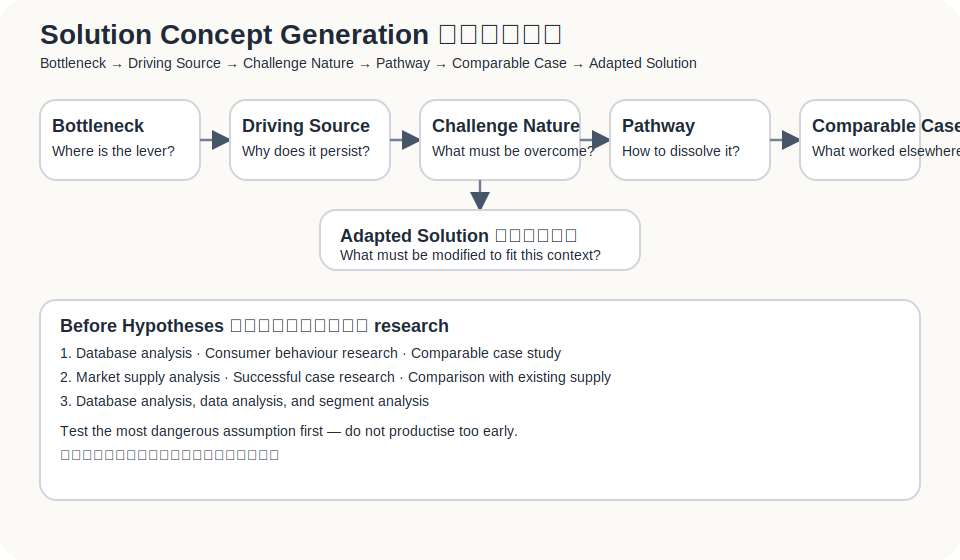
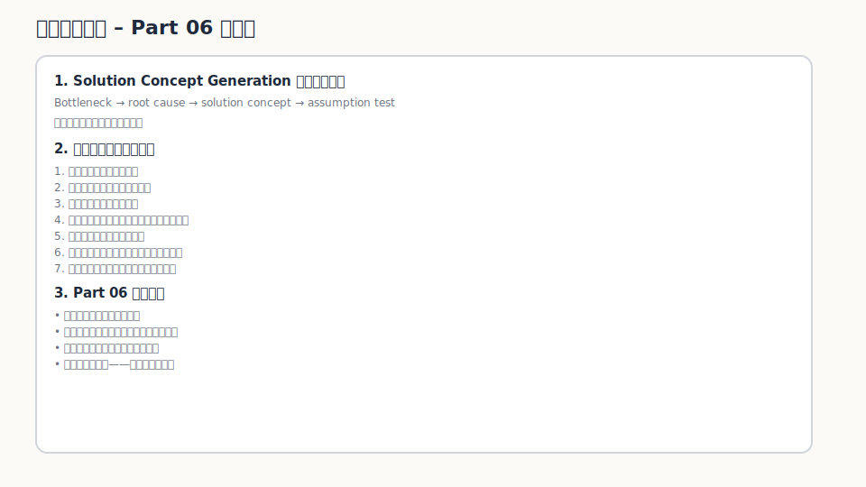

找到問題之後，人很容易鬆一口氣。

好，問題找到了。  
那我們可以開始做產品了。

我現在反而會在這裡停一下。

因為從問題走到解法，中間不是一座橋，而是一片霧。你以為自己在設計 solution，其實常常只是在堆一組還沒被驗證的假設。

這一篇要處理的，就是這一段。

不是問：

> 我要做什麼功能？

而是問：

> 哪個 bottleneck 如果被化解，會讓當事人的重大期許落差不再存在？

這句話比較長。  
但比較不會騙自己。

---

## 解法不是靈感，是假設組合

一個 solution 背後通常藏著很多假設。

例如你想幫獨立旅宿做一套 loyalty alliance，協助降低 OTA 依賴。這看起來是一個解法，但裡面至少有這些假設：

- 旅宿真的把 OTA 依賴視為重要問題
- 旅宿不只是抱怨，而是願意改變流程
- 旅客願意在 check-in 或住宿後留下可持續互動的資料
- 跨旅宿點數或 benefits 對旅客有吸引力
- 前台可以承受額外流程，或流程可以被設計得足夠輕
- 旅宿願意為這件事付費、試點或提供資源
- 初期不用 PMS integration 也能驗證核心價值
- 這套做法能帶來可衡量的 direct booking、回訪或資料累積指標

其中任何一條不成立，解法都可能要改。

所以這一篇的第一個原則是：

> 不要把 solution 當成答案。先把它拆成假設。

---

## 從 bottleneck 反推 solution

不要先問：

> 我可以做什麼產品？

先問：

> 這個重大期許落差，是卡在哪個罩門？

如果獨立旅宿的重大期許是「建立更穩定、可持續的直接客戶關係」，那 gap 可能不是「沒有系統」而已。

真正的 bottleneck 可能是：

- 旅客沒有理由主動加入旅宿自己的關係池
- 前台沒有時間做複雜導流
- 旅宿沒有足夠誘因讓旅客回訪
- 單一旅宿的會員價值太弱，不足以驅動旅客行動
- 旅宿不知道怎麼把顧客資料轉成實際回訪與再行銷

如果 bottleneck 是「單一旅宿的會員誘因太弱」，那 solution 就不該只是做一個 CRM。可能要思考聯盟、跨店 benefits、共同點數、旅遊路線、旅客身份延續。

如果 bottleneck 是「前台流程承受不了」，那 solution 就不能設計成需要前台花三分鐘解釋。可能要改成 QR、簡短誘因、退房後補完資料、或 concierge MVP。

解法要從瓶頸長出來。  
不要從創辦人的產品想像長出來。

---

## 七個問題，把解法從功能拉回根本改變

從問題走到解法時，最容易偷懶的地方，就是把「我要提供什麼」說成一個功能，卻沒有說清楚它為什麼能改變現況。

這組問題可以把解法拉回根本改變：

> 這個問題要解決，必需面對哪些挑戰？  
> 我要提供什麼，讓他走向未來理想狀況？  
> 我提供的東西，就他想完成的工作，可以帶來什麼根本改變？  
> 關鍵突破是什麼？  
> 要達成關鍵突破的挑戰是什麼？  
> 這個根本改變，為什麼可以帶他走向未來理想狀況？  
> 我所提供的東西，為什麼可以帶來這個根本改變？

這組問題不讓你停在「做一個功能」。它逼你說清楚：

- 你面對的是什麼挑戰
- 你提供的是什麼
- 它為什麼能帶來根本改變
- 那個改變為什麼能把人帶向未來理想狀況

如果講不清楚，通常代表 solution 還太薄。

---

## 解法發想不是照抄成功案例

解法發想最容易犯的錯，是看到別人做過什麼，就急著搬過來。

Starbucks 做會員，所以旅宿也做會員。  
航空公司做 miles，所以旅宿也做 points。  
平台做 referral，所以旅宿也做 referral。

這種想法不一定錯，但太快了。

真正要問的是：那些成功案例到底化解了什麼本質挑戰？那個挑戰，在我的題目裡是否真的存在？條件是否相似？如果不相似，要修正什麼？

可以用六個問題來走：

1. 新重大期許落差怎麼來的結構中，哪一個是罩門 / 施力點？
2. 轉換罩門的驅動來源是什麼？
3. 化解此罩門背後形成力量的挑戰本質是什麼？
4. 曾經化解過本質相似的成功案例是什麼？成效如何？做法是什麼？
5. 為什麼可以移轉至本案例？要做什麼修正？
6. 提出應用於本案例的化解途徑。

這不是要把創意變得很學術。  
而是避免你拿錯案例，抄錯地方。

相似，不代表可以照搬。  
有時候最重要的，剛好是那些不相似的條件。

---

## 在假設之前，先做三種研究

解法發想完，還不要急著寫假設。

中間有一段很容易被跳過，但很重要的工作：把建議案或解決方案放回資料、消費者行為與成功案例裡檢查。

### 1. 資料庫分析、數據分析、族群分析

先看市場與族群是否真的支撐這個方向。

在獨立旅宿案例裡，可以看：

- 直訂比例與 OTA 訂單占比
- 淡旺季入住率差異
- 回訪客比例
- 不同旅客族群的重複住宿行為
- QR 註冊、email、LINE、優惠碼等轉換資料
- 旅宿規模、地區、房型、客源國的差異

這一步不是為了證明 idea 很棒，而是先看它比較可能落在哪一群人身上。

### 2. 消費者行為研究、使用者對現有市場供應的反應（重視 / 輕視）

再看使用者怎麼對待現有供應。

旅客真的在意點數嗎？  
還是只在意價格？

旅客會不會為了跨旅宿 benefits 留資料？  
還是覺得每家旅宿都要註冊很煩？

旅宿端也是一樣。

他們是真的重視 direct booking，還是只是口頭上不喜歡 OTA？  
他們願意改 check-in 流程嗎？  
他們願意提供優惠、benefits 或資源嗎？  
他們目前對 CRM、會員、LINE 官方帳號、Email marketing 的態度是重視還是輕視？

如果使用者對現有供應完全無感，你要理解的是：  
他們真的不需要，還是現有供應沒有打到真正罩門。

### 3. 成功案例研究、該事業與現有供應的比較（強・中・弱）

最後，看有沒有相似的成功案例，以及本案和現有供應相比強在哪裡、弱在哪裡。

例如：

- 航空 miles 成功在哪裡？
- 信用卡點數成功在哪裡？
- 連鎖飯店會員成功在哪裡？
- 小型旅宿為什麼很難單獨複製？
- OTA loyalty 為什麼能做，而單店旅宿做不起來？
- 跨旅宿 alliance 是否能補上單店誘因不足？

這裡不能只看「別人做過」。  
要看的是：本質挑戰是否相似，條件差異在哪裡，移轉到本案時要怎麼修正。

---

## 從研究走向假設：不要只寫支持，也要寫反對

很多假設表只寫支持論述。這很危險。

真正有用的假設表，至少要同時放進兩列：

- 支持假設
- 反對假設

因為你要找的不是自我說服，而是接下來該怎麼驗證。

| 關鍵議題（假設問題） | 判斷 | 假設支持論述 | 使論述成立的證據 | 未來行動 |
|---|---|---|---|---|
| 旅客是否願意留下可持續互動的資料？ | 是 | 如果有跨旅宿 benefits、點數或未來優惠，旅客可能願意留下 email / LINE / 偏好資料。 | QR 掃碼率、註冊完成率、資料補完率、優惠領取率。 | 在 3 間旅宿做 fake-door / QR registration test。 |
| 旅客是否願意留下可持續互動的資料？ | 否 | 旅客可能覺得註冊麻煩，或不相信單次住宿後還會用到這些 benefits。 | 掃碼後跳出率高、表單未完成、旅客訪談中表示誘因不足。 | 降低欄位數，測不同誘因：折扣、升等、跨店點數、在地推薦。 |
| 旅宿是否願意在 check-in 流程放入入口？ | 是 | 如果流程足夠短，且能帶來可追蹤旅客資料，旅宿可能願意配合。 | 前台操作時間低於 30 秒、員工願意執行、旅宿主願意放 QR。 | 做 concierge pilot，觀察前台實際執行摩擦。 |
| 旅宿是否願意在 check-in 流程放入入口？ | 否 | 前台已經很忙，任何額外動作都可能被忽略；員工也可能不願多解釋。 | QR 展示率低、前台未主動提醒、員工回饋負擔高。 | 改成房卡套、桌牌、退房後訊息或 Wi-Fi 登入入口。 |
| 跨旅宿 benefits 是否比單店優惠更有吸引力？ | 是 | 單店旅宿回訪頻率低，跨店 benefits 可能讓點數更有使用場景。 | 旅客對跨城市 / 跨旅宿使用權益反應較高；點數兌換意願高。 | 做兩組 landing page：單店優惠 vs 跨旅宿 benefits。 |
| 跨旅宿 benefits 是否比單店優惠更有吸引力？ | 否 | 旅客可能只在意當下價格，不在意未來跨店權益；跨店網絡初期也太小。 | 旅客訪談中偏好即時折扣；跨店 benefits 點擊率低。 | 初期改測即時 benefits，等供給端變大後再測 alliance value。 |
| 不接 PMS 是否仍能驗證核心價值？ | 是 | 初期核心不是自動化，而是驗證旅客是否願意加入、旅宿是否願意配合、是否能產生再接觸價值。 | 手動 Google Sheet / CRM flow 仍能跑完註冊、追蹤、優惠發送。 | 用 no-code / manual workflow 做 MVP。 |
| 不接 PMS 是否仍能驗證核心價值？ | 否 | 若資料無法接回實際訂房與入住紀錄，旅宿可能覺得價值太模糊。 | 旅宿要求 PMS integration 才願意判斷成效；手動資料錯誤率高。 | 將 MVP 限定在少數願意手動配合的旅宿，並定義簡化 KPI。 |
| 旅宿是否願意付費或投入資源？ | 是 | 如果能看到可觸達旅客資料、回訪線索或直訂改善，旅宿可能願意付 pilot fee。 | 續約意願、付費 pilot、願意提供優惠或人力。 | 設計 founding partner pilot，測付費與資源投入。 |
| 旅宿是否願意付費或投入資源？ | 否 | 旅宿可能口頭支持，但仍把它視為 nice-to-have，不願付錢。 | 訪談支持但拒絕付費；pilot 後無續約；只願免費使用。 | 重新測價值主張，或改以成功費 / usage-based / 聯盟共創模式。 |

這張表的重點，是讓每個關鍵議題都同時承認兩種可能。

只有這樣，後面的實驗才不會變成替自己找證據。

---

## 解法發想工具箱

工具可以很多，但不要每個都拿來亂用。這幾個工具剛好對應不同階段。

| 工具 | 用途 | 用在什麼時候 |
|---|---|---|
| How Might We | 把問題改寫成可發想的提問 | 已經定義 bottleneck，但還沒開始想解法 |
| SCAMPER | 改造既有解法 | 有現成替代方案可改造 |
| Analogy Thinking | 從相似產業找做法 | 看到類似挑戰，但不能照抄 |
| Constraint Removal | 假設限制消失後會怎樣 | 想突破既有框架 |
| Concierge MVP Thinking | 先用人工交付價值 | 還不確定是否值得寫系統 |
| Opportunity Solution Tree | 從 outcome 拆 opportunity、solution、experiment | 需要把解法與實驗接回成果 |
| Assumption Mapping | 排出高重要、高不確定假設 | 決定先測什麼 |

例如，不要問：

> 怎麼做旅宿會員系統？

可以改成：

> 我們如何讓旅客在不增加前台負擔的情況下，願意留下可持續互動的資料？

這句話好很多。  
因為它保留了真正限制條件。

---

## 先測最危險的，不是最好做的

所有假設都要測，但不是同時測。

我會用兩個軸：

- 這個假設有多重要？
- 這個假設有多不確定？

優先驗證：

> 高重要性 + 高不確定性

不要先做最好做的東西。  
先做最能殺死或支持核心假設的測試。

---

## 不要太早產品化

這句話要保留得很硬：

> 在你還不知道顧客願不願意改變之前，寫程式可能只是把錯誤變得更貴。

早期解法可以是：

- 手動服務
- Figma demo
- Landing page
- QR + Google Sheet
- 人工點數紀錄
- 小規模旅宿聯盟 pilot
- Concierge MVP
- Wizard-of-Oz flow

先證明人願意動。  
再證明你能交付。  
最後才證明它值得產品化。

順序反了，會很貴。

---

## 這一篇真正要留下來的東西

從問題到解法，不是從白板走向產品，而是從重大期許落差走向一組可以被驗證的假設。

讀到這裡，至少要留下三個成果：

1. **一張 Solution Hypothesis Map**  
   把 solution 拆成 problem、customer、bottleneck、solution、behaviour、business、delivery 假設。

2. **一張支持 / 反對假設表**  
   每個關鍵議題都同時列出支持與反對，避免只替自己的想法找證據。

3. **三個可驗證的解法方向**  
   例如：
   - Concierge MVP：3 間旅宿 + QR registration + 手動追蹤旅客回訪
   - Fake Door Test：在旅宿 check-in / email 裡測試旅客是否願意加入 benefits network
   - Paid Pilot：找已經有 Level 4 suffering 的旅宿，測試是否願意為 direct guest relationship pilot 付費

如果這三個成果都做不出來，代表 solution 還太像想像，還沒變成可以驗證的東西。

---

