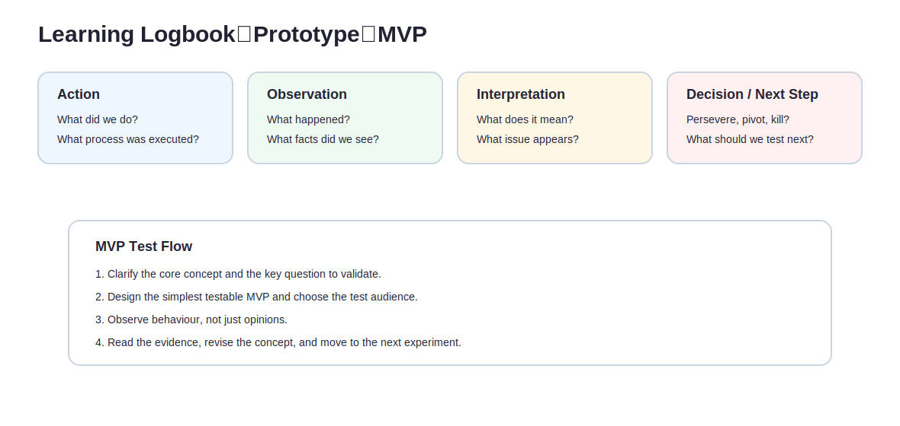
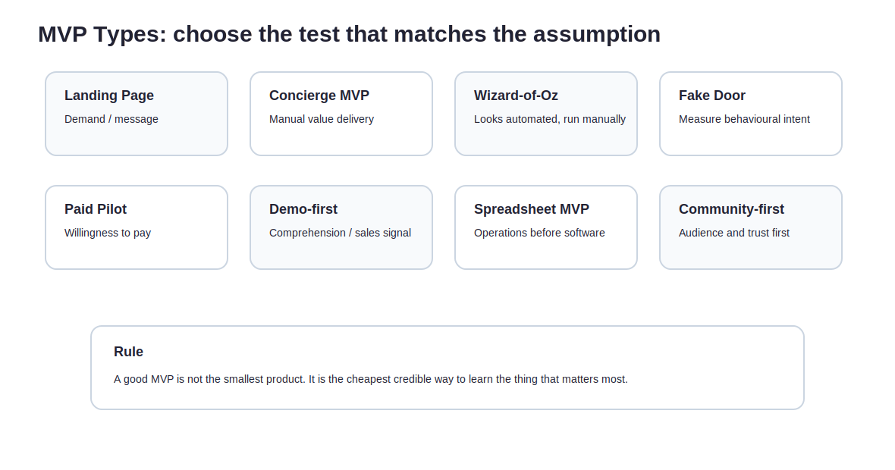

When people say MVP, they often mean “a cheaper version of the product”.

Fewer features.  
Rougher interface.  
Faster launch.  
Enough to use, at least.

That is not always wrong. But it is a very easy way to misunderstand MVP.

The point of an MVP is not to publish a small product.  
The point is:

> to learn the most important thing at the lowest credible cost.

If it does not help you test whether the key assumption is true, it is not really an MVP. It may be small. It may be cheap. It may even look impressively lean. But it is still just a small product.

The Lean Startup loop, Build-Measure-Learn, is not about throwing things into the world and hoping the market says something useful. It is about shortening the learning cycle and reducing uncertainty. An MVP is not the first thin slice of your dream product. It is the simplest test that can teach you the most important thing right now.

That line is easy to repeat.

It is much harder to build accordingly.

---

## The purpose of an MVP is not launch. It is learning.

Before building an MVP, five questions should already be clear:

1. What do we most need to learn?
2. Which assumption is the most dangerous?
3. What is the smallest credible way to test it?
4. What would count as a success signal?
5. What would count as a failure signal?

If these cannot be answered, the team is probably not building an MVP. It is building “a first version to see what happens”.

That phrase is a trap.

A first version can become a black hole. Login, admin panel, notifications, reports, permissions, nicer UI. Every addition sounds reasonable. Very few may bring you closer to the answer.

A real MVP asks the question backwards:

> If this assumption turns out to be wrong, would we need to rethink the direction?

That is the thing to test first.

---

## Prototype, MVP, Product, and Business are not the same thing.

Teams often blur Prototype, MVP, and Product together.

They operate on different levels.

| Type | Purpose | Core question |
|---|---|---|
| Prototype | Make the concept visible and discussable | Does the other person understand it? How do they react? |
| MVP | Test a key assumption | Is the riskiest assumption initially supported? |
| Product | Deliver value reliably | Can the value be delivered repeatedly and consistently? |
| Business | Create, deliver, and capture value sustainably | Can this work in a durable and financially viable way? |

A Prototype may be a Figma screen, a paper flow, a rough demo.

An MVP must be tied to a hypothesis.

A Product has to deliver value reliably.

A Business has to explain how value is created, delivered, charged for, expanded, and sustained.

If you treat a Prototype like a Product, you chase completeness too early.  
If you treat a Product like an MVP, you spend too much before learning enough.  
If you treat an MVP like a Business, you forget that the model itself is still untested.

---

## Logbook: do not only run experiments. Preserve the learning.

The most dangerous MVP is the one that produces activity but leaves no judgement behind.

Why did we run this test?  
What did we see?  
How did we interpret it?  
Why did the next step change?  
Which assumption was supported? Which one weakened?

If those are not recorded, a few weeks later everything turns into vague memory.

A Learning Logbook can stay very simple:

| Field | What to record |
|---|---|
| Action taken | What did we do? How did the process run? |
| Discovery / observed facts | What actually happened? What did users do? |
| Interpretation | What might this mean? What issue is appearing? |
| Decision / next step | Persevere, Pivot, Kill, or what to test next? |

A Logbook is not a weekly report.

It is a way to keep the learning from evaporating.

Especially the uncomfortable learning: no one clicked, no one replied, people said they liked it but did nothing, hotels were happy to chat but not to pay, the front desk said yes and then never executed.

All of that belongs in the Logbook.

Because the signal that changes your direction is often not the beautiful metric. It is the thing you did not want to admit.

---

## Before the MVP test, prepare the test.

Do not start by making things.

Start by writing down what the test is actually for.

### 1. Make the core concept communicable.

You need a sentence that explains what the MVP is meant to make visible.

In an independent hospitality case, do not simply say:

> We are building a loyalty platform.

Say something testable:

> We want to test whether travellers are more willing to leave contactable details after a stay if they can earn and use benefits across multiple independent hotels.

That sentence is much more useful.

Because it can be tested.

### 2. Confirm the key question to validate.

Do not test ten things at once.

Choose the most dangerous one.

For example:

- Will travellers leave an email or LINE contact?
- Will hotels place a QR entry point into the check-in flow?
- Can front-desk staff actually execute the flow?
- Are cross-hotel benefits more attractive than single-property offers?
- Will hotels pay for a pilot?

An MVP does not remove all uncertainty at once.

It starts with the uncertainty most capable of killing the idea.

### 3. Design the test flow and choose the right test audience.

Who you test with matters.

If you choose hotels with Level 1 pain, everything may feel unimportant.  
If you test with hotels already using Google Sheets, LINE broadcasts, and manual vouchers to manage returning guests, the signal will be much more real.

The same applies to travellers.

A guest at check-in, a guest after checkout, and a traveller planning the next trip may all respond differently.

Keep the test small.

Do not let it become vague.

---

## During the test, watch behaviour rather than compliments.

The easiest thing for an MVP to collect is nice words.

People may say:

- Cool.
- I would use this.
- That is interesting.
- Let me know when it is ready.
- I can see the need.

Listen to these, but do not trust them too much.

Behaviour matters more.

| Weak signal | Strong signal |
|---|---|
| Cool | Leaves an email |
| I would use it | Books a demo |
| I am interested | Agrees to trial |
| Let me know when ready | Provides data |
| This probably has a market | Pays |
| Sounds good | Introduces someone |
| Let’s chat again | Changes workflow |

In the independent hospitality case, stronger signals might include:

- guests actually scan the QR code;
- guests complete registration;
- guests leave preference data;
- front desk teams actually place the QR into the check-in flow;
- hotels provide benefits or offers;
- hotels pay a pilot fee;
- hotels introduce other properties.

These behaviours matter far more than “sounds interesting”.

---

## MVP types: different assumptions need different tests.

Not every MVP should look like a product.

The shape of the MVP should follow the assumption being tested.

| MVP type | Best for testing | Independent hospitality example |
|---|---|---|
| Landing Page MVP | Whether the value proposition attracts interest | A page explaining cross-hotel benefits and measuring whether travellers leave an email |
| Concierge MVP | Whether manually delivered value matters | Manually helping three hotels track guests, send offers, and prompt return visits |
| Wizard-of-Oz MVP | Whether a seemingly automated experience works | Guests believe points are calculated automatically, while the back end is manually operated |
| Manual Service MVP | Whether the process works end to end | Google Sheet + LINE used to run the first version of member tracking |
| Fake Door Test | Whether behavioural intent exists | A check-in QR offering “join independent hotel alliance benefits” and measuring clicks and registrations |
| Pre-order / Paid Pilot | Willingness to pay | A 30-day pilot paid by a small group of hotels |
| Demo-first MVP | Whether people understand and want the idea | Running 10 hotel calls with a demo deck and tracking who agrees to a next step |
| Spreadsheet MVP | Whether the data process is viable | Tracking registrations, offers, return visits, and direct-booking leads in a spreadsheet |
| Community-first MVP | Whether trust and audience must come first | Starting a small direct-booking learning circle for independent hotels |

MVPs are not high-status or low-status.

There is only one useful question:

> Does this test the most important uncertainty at the lowest credible cost?

---

## Read the evidence and revise the direction.

After an MVP, do not look only at whether the numbers are “good”.

Ask:

- What did the test audience really feel or do?
- What possible direction does this open?
- Does the evidence match the original concept and value proposition?
- Which parts are feasible, and which remain uncertain?
- What revised solution or partnership path follows from this?
- Which bottleneck has been accepted by the actor and may actually be dissolved?

For example, a high QR scan rate but low registration completion may mean that the value proposition is interesting but the form is too heavy.

If hotels place the QR code but the front desk never mentions it, the owner may support the idea while the execution context fails.

If guests join but hotels refuse to provide benefits, demand-side response may exist while supply-side incentive remains weak.

An MVP does not hand you a grade.

It reveals the next problem.

---

## Success and failure criteria must be written before the test.

Before the MVP runs, define success and failure.

Otherwise, once the results arrive, everyone will choose the evidence that flatters their original opinion.

For an independent hotel QR MVP:

| Assumption | Success signal | Failure signal | Next step |
|---|---|---|---|
| Travellers are willing to join cross-hotel benefits | Over 30% scan rate and over 15% completed registration | Scan rate below 5%, or extremely low completion | Rewrite value proposition or change the entry point |
| Front desk can support the flow | QR shown in over 80% of relevant shifts | Staff find it annoying or do not mention it | Test table stands, keycard sleeves, post-checkout messages |
| Hotels will provide benefits | At least 3 hotels provide usable offers | Most only want free trial and offer no resources | Redesign hotel-side value |
| Core value can be tested without PMS integration | Manual tracking supports basic follow-up | Data errors are too high and hotels distrust results | Narrow the MVP or create a semi-automated tool |

The thresholds can change.

Having no threshold is the problem.

---

## Build-Measure-Learn: not a loop, but less self-deception each time.

Lean Startup is often reduced to Build-Measure-Learn.

Done badly, it becomes:

> Build something, look at some numbers, find reasons to keep going.

A useful loop is stricter:

1. **Build**: create only what is needed to test the key assumption.
2. **Measure**: measure behaviour, not only opinions.
3. **Learn**: choose Persevere, Pivot, or Kill.

The hardest part is Learn.

Learning is not collecting data.

Learning means admitting what the data changed in your judgement.

If every MVP ends and the team believes exactly what it believed before, the experiment probably did not challenge the hypothesis.

It merely produced activity.

---

## What this part should leave behind

By the end, three outputs should be clear:

1. **An MVP experiment design**  
   Including the assumption, test audience, test method, success criteria, and failure criteria.

2. **A Learning Logbook**  
   Recording action, observation, interpretation, decision, and next step.

3. **A success / failure standard**  
   So the team does not reinterpret the results after the fact.

An MVP is not a miniature product.

It is a small, cheap, honest learning machine.

If it does not move you closer to the truth, it is not MVP enough.

---
