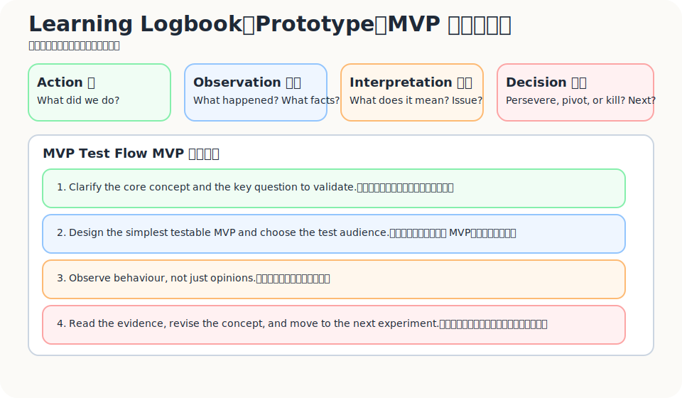
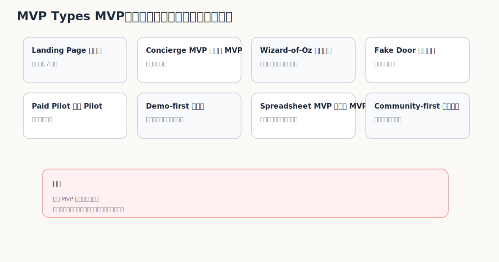

很多人說 MVP，其實心裡想的是「低配版產品」。

少一點功能。  
醜一點介面。  
快一點上線。  
先能用就好。

這種想法不一定完全錯，但很容易把 MVP 做歪。

因為 MVP 的重點不是「發布一個小產品」。  
MVP 的重點是：

> 用最低成本，學到最重要的東西。

如果這個東西沒有幫你學到關鍵假設是否成立，那它再小、再便宜，也只是小型產品，不是 MVP。

Lean Startup 裡的 Build-Measure-Learn，重點不是盲目把東西丟出去，而是用最短的學習迴圈去減少不確定性。MVP 也不是少功能版本，而是當下能帶來最多學習的最簡單測試。這點常被講爛，但真的做的時候，還是很容易忘。  

---

## MVP 的目的不是發布，而是學習

一個好的 MVP，開始前就應該回答五個問題：

1. 我們最想學到什麼？
2. 哪個假設最危險？
3. 最小驗證方式是什麼？
4. 成功訊號是什麼？
5. 失敗訊號是什麼？

如果這五個問題答不出來，通常代表你其實不是在做 MVP，而是在做「先做一版看看」。

「先做一版看看」很容易變成黑洞。

因為你會開始補登入、補後台、補通知、補報表、補權限、補漂亮一點的 UI。每一個都看起來合理，但它們未必讓你更接近答案。

真正的 MVP 應該反過來問：

> 哪一件事如果被證明是錯的，這個方向就要重想？

那件事，才是最先要測的。

---

## Prototype、MVP、Product、Business 不是同一件事

很多團隊把 Prototype、MVP、Product 混在一起。

它們其實是不同層次的東西。

| 類型 | 目的 | 問題 |
|---|---|---|
| Prototype | 讓概念可被看見、可被討論 | 對方看得懂嗎？會怎麼反應？ |
| MVP | 驗證關鍵假設 | 最危險的假設是否初步成立？ |
| Product | 穩定交付價值 | 能否可靠、持續地解決問題？ |
| Business | 可持續創造、交付、捕獲價值 | 這件事能不能以可獲利或可持續方式運作？ |

Prototype 可以只是 Figma、紙上流程、簡單 demo。  
MVP 必須回到假設驗證。  
Product 要開始穩定交付。  
Business 則要回答價值如何被創造、交付、收費、擴張與維持。

如果把 Prototype 當 Product，就會太早追求完整。  
如果把 Product 當 MVP，就會太早花太多錢。  
如果把 MVP 當 Business，就會忽略商業模式還沒有被驗證。

---

## Logbook：不要只做實驗，要留下學習紀錄

MVP 最怕的是做了很多，但沒留下判斷。

當時為什麼這樣做？  
看到什麼？  
解讀是什麼？  
下一步為什麼改？  
哪個假設被支持？哪個被推翻？

如果這些沒有記下來，幾週後很容易變成一團模糊印象。

你的 Logbook 可以長得很簡單：

| 欄位 | 要記什麼 |
|---|---|
| 已執行的行動 | 做了什麼？流程怎麼跑？ |
| 發現 / 觀察到的事實 | 實際發生什麼？使用者做了什麼？ |
| 解讀 | 這代表什麼？背後可能是什麼問題？ |
| 決策 / 下一步 | Persevere、Pivot、Kill，或下一輪要驗證什麼？ |

注意，Logbook 不是寫週報。

它是把「學習」留下來。

尤其是那些會讓你不舒服的東西：沒人點、沒人回、有人說喜歡但不行動、旅宿願意聊但不願付費、前台說可以但現場根本沒做。

這些都要記。

因為真正改變方向的，通常不是漂亮數據，而是那些你本來不想承認的訊號。

---

## MVP 測試前，先做準備

在開始 MVP 測試前，先不要急著做東西。

先把這幾件事寫清楚：

### 1. 為進一步修正解決方案，建立可傳達的核心概念

你要能用一句話說清楚：

> 這個 MVP 要讓對方理解什麼？

例如獨立旅宿的題目，不是說「我們要做一個 loyalty platform」。

而是：

> 我們想測試：如果旅客能在多間獨立旅宿累積與使用 benefits，他是否更願意在住宿後留下可持續互動的資料？

這句話比「做平台」有用。

因為它能被測。

### 2. 確認要驗證的關鍵題目

不要一次測十件事。

先選一件最危險的。

例如：

- 旅客是否願意留下 email / LINE？
- 旅宿是否願意在 check-in 流程放 QR？
- 前台是否真的能執行？
- 跨旅宿 benefits 是否比單店優惠更有吸引力？
- 旅宿是否願意為 pilot 付費？

MVP 不是把所有不確定性一次解完。  
它是先挑最會殺死這個方向的那一個。

### 3. 設計測試流程，確認可受測對象

測誰，很重要。

如果你找的是 Level 1 痛苦程度的旅宿，它可能什麼都覺得不急。  
如果你找的是已經用 Google Sheet、LINE、手動優惠碼在做回訪的旅宿，訊號就會真很多。

同樣，旅客也要分情境。

剛 check-in 的旅客、退房後的旅客、計畫下一趟旅行的旅客，反應會不一樣。

測試流程要盡量小，但不能含糊。

---

## 執行測試：看行為，不要只聽意見

MVP 執行時，最容易被「好聽的話」騙。

對方說：

- 好酷
- 我會用
- 這很有趣
- 你做好通知我
- 感覺有需要

這些都可以聽，但不要太相信。

比較有價值的是行為。

| 弱訊號 | 強訊號 |
|---|---|
| 好酷 | 留 email |
| 我會用 | 預約 demo |
| 我有興趣 | 願意試用 |
| 你做好通知我 | 願意提供資料 |
| 這應該有市場 | 願意付費 |
| 聽起來不錯 | 願意介紹別人 |
| 可以再聊 | 願意改變流程 |

獨立旅宿案例裡，強訊號可能是：

- 旅客真的掃 QR
- 旅客真的完成註冊
- 旅客願意留下偏好資料
- 前台真的把 QR 放到 check-in 流程
- 旅宿願意提供優惠或 benefits
- 旅宿願意付 pilot fee
- 旅宿願意介紹其他旅宿加入

這些行為比「聽起來不錯」重要太多。

---

## MVP 類型：不同假設，要用不同測法

不是每個 MVP 都該長得像產品。

MVP 的形狀，應該由你要測的假設決定。

| MVP 類型 | 適合驗證什麼 | 獨立旅宿例子 |
|---|---|---|
| Landing Page MVP | 價值主張是否吸引人 | 放一頁「跨旅宿 benefits」介紹，看旅客是否留下 email |
| Concierge MVP | 人工交付是否有價值 | 手動幫 3 間旅宿追蹤旅客、發送優惠與回訪提醒 |
| Wizard-of-Oz MVP | 看似自動，背後人工 | 旅客以為點數自動計算，實際由後台手動整理 |
| Manual Service MVP | 流程是否跑得通 | 用 Google Sheet + LINE 手動完成第一版會員追蹤 |
| Fake Door Test | 行為意圖是否存在 | 在 check-in QR 裡放「加入旅宿聯盟 benefits」入口，看點擊與註冊率 |
| Pre-order / Paid Pilot | 付費意願 | 找願意付小額 pilot fee 的旅宿測 30 天 |
| Demo-first MVP | 對方是否理解與想要 | 用 demo deck 跑 10 場旅宿訪談，看是否願意約下一步 |
| Spreadsheet MVP | 資料流程是否成立 | 用試算表記錄註冊、優惠、回訪、直訂線索 |
| Community-first MVP | 需求是否需要先建立信任 | 先建立獨立旅宿 direct booking 共學小圈，測合作意願 |

MVP 沒有高級或低級。

只有一個問題：

> 它是不是用最低成本，測到了最關鍵的不確定性？

---

## 判讀與修正：不要只看數字，要看數字背後的行為

MVP 跑完後，不能只看「數字好不好」。

還要問：

- 受測者真正的感覺是什麼？
- 可能的發展方向是什麼？
- 判讀與原本的概念、價值主張是否一致？
- 可行性與不確定性分別在哪裡？
- 修正後的下一個合作解決方案是什麼？
- 哪個罩門被當事人接受，也可能化解他原本無力解決的問題？

例如 QR 掃碼率高，但註冊完成率低，可能代表價值主張有興趣，但表單太重。

如果旅宿願意放 QR，但前台不會主動提醒，可能代表老闆支持，但執行場景錯了。

如果旅客願意加入，但旅宿不願提供 benefits，可能代表需求端有反應，供給端誘因不足。

MVP 不是給你一個分數。

它是讓你看見下一個問題。

---

## 成功與失敗標準要先寫

MVP 之前，先寫成功 / 失敗標準。

不然測完之後，很容易每個人都挑自己想看的證據。

以獨立旅宿 QR MVP 為例：

| 假設 | 成功訊號 | 失敗訊號 | 下一步 |
|---|---|---|---|
| 旅客願意加入跨旅宿 benefits | 30% 以上掃碼、15% 以上完成註冊 | 掃碼低於 5%，或完成率極低 | 重寫價值主張或換入口 |
| 前台願意配合流程 | 80% 班次有展示 QR | 前台覺得麻煩、不願提 | 改成桌牌、房卡套、退房後訊息 |
| 旅宿願意提供 benefits | 至少 3 間願意提供可用優惠 | 多數只願免費試用，不願提供資源 | 重新設計旅宿端價值 |
| 初期不用 PMS 也能驗證 | 手動紀錄可完成基本追蹤 | 資料錯漏太高，旅宿不信任結果 | 限縮 MVP 或設計半自動化工具 |

標準可以調整。

但不能沒有。

---

## Build-Measure-Learn：不是繞圈，是每次都少一點自我催眠

Lean Startup 常被簡化成 Build-Measure-Learn。

但這三個字如果做錯，就會變成：

> 做一點東西，看一些數字，找理由繼續做。

真正有用的循環應該是：

1. **Build**：只做能測關鍵假設的最小東西
2. **Measure**：量行為，不只量意見
3. **Learn**：決定 Persevere、Pivot 或 Kill

這裡最難的是 Learn。

因為學習不是收集資料。

學習是承認資料讓你改變了什麼判斷。

如果每次 MVP 結束後，團隊的想法都沒有變，那通常不是實驗太成功，而是實驗沒有真正被拿來挑戰假設。

---

## 這一篇真正要留下來的東西

讀到這裡，至少要留下三個成果：

1. **一個 MVP 實驗設計**  
   包含要驗證的假設、受測對象、測試方式、成功 / 失敗標準。

2. **一張 Learning Logbook**  
   記錄行動、觀察、解讀、決策與下一步。

3. **一組成功 / 失敗標準**  
   讓團隊不要在結果出來後才各自解讀。

MVP 不是迷你產品。

它是一台很小、很便宜，但必須誠實的學習機器。

如果它沒有讓你更接近真相，它就不夠 MVP。
