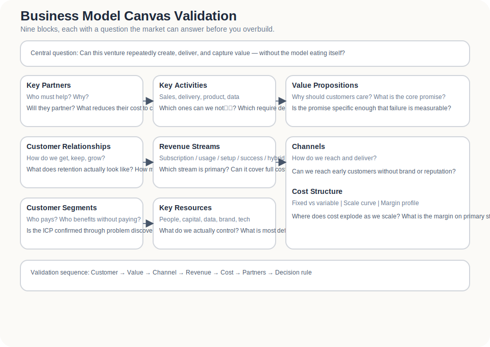
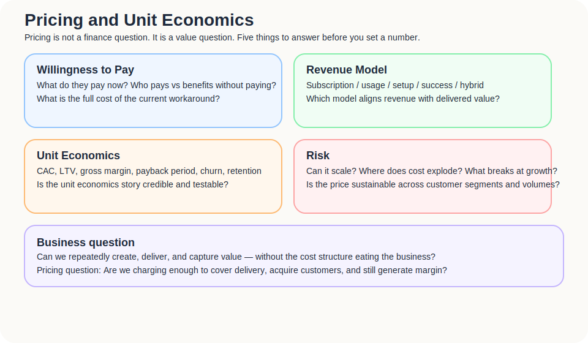

The earlier parts dealt with problems, pain, early markets, and MVPs.

At this point, a tempting thought appears:

> If people have the need, and some are willing to try, surely this is already a business?

Not necessarily.

Demand means someone wants a result.  
A business means you can repeatedly, efficiently, and sustainably create, deliver, and capture value from that result.

There is a large distance between the two.

Many products do not die because nobody wants them.

They die because people want them but do not pay enough; or they pay, but delivery costs too much; or they try it, but the channel does not scale; or customers like it, but do not stay; or revenue exists, but every sale becomes operationally heavier.

So this part moves from product validation to business model validation.

The question is no longer only whether the product creates value.

The question is whether the value can become a durable business.

---

## Solving a problem is not the same as making money.

A business has to answer more than “does this solve a problem?”

It has to answer:

- Who pays?
- Why do they pay now?
- How much do they pay?
- How often do they pay?
- Where do costs appear?
- How does the channel open?
- Can delivery repeat?
- Will customers stay?
- Will partners cooperate?
- As the business grows, does the margin improve or deteriorate?

These questions are less romantic than discovery.

They decide whether a product can become a venture.

Take an independent hotel loyalty alliance. The demand is easy to understand.

Hotels want to reduce OTA dependency.  
Travellers may like cross-property benefits.  
Both sides may prefer the relationship not to disappear after checkout.

But the business model asks another set of questions:

- Will hotels pay a subscription?
- Or only a success fee?
- If pricing is usage-based, what counts as usage?
- Should the traveller side be free?
- Who funds the benefits?
- Who handles onboarding, support, content, and hotel quality control?
- If the hotel network is still small, is there enough value for travellers?
- If traveller-side value is weak, why would hotels join?

Without answers, real demand may still fail to become a business.

---

## Start with industry and market background, not only your own product.

A business model should not begin with the way you would like to charge.

It begins with the structure of the industry.

The handwritten notes break this down well: industry, product, end market, competitors, success factors, and competitive strategy. These are not classroom boxes. They stop you from building a model on the wrong market assumption.

### Industry level

Start with:

1. Which industry are we in?
2. Who are the competitors?
3. What do the competitors actually do?
4. Which companies are worth learning from?
5. What are the key success factors?
6. What competitive strategies do competitors use?

For independent hospitality, this is not only “hotel tech”.

You may need to look at:

- OTAs;
- booking engines;
- PMS and channel managers;
- CRM and email marketing;
- loyalty programmes;
- travel memberships;
- destination marketing;
- local experience marketplaces.

Your competitor may not look like another startup.

Sometimes the competitor is simply “the hotel continues doing nothing”.

### Product level

Then ask:

1. What is the current end-market size for this product or bundle? Annual sales, usage, adoption?
2. How has the overall market evolved, and how far might it grow?
3. What forces are driving that growth?
4. What does this imply? Why is this market worth entering?

For independent hotels, this might mean asking:

- Are there enough independent properties in Asia?
- Is OTA dependency widespread?
- Is direct booking growing in importance?
- Are hotels paying more attention to first-party data?
- Can small properties adopt lightweight tools?
- Do travellers accept cross-brand loyalty or benefit networks?

This is not about writing “the market is huge”.

It is about checking whether the market has enough structure for a business model to emerge.

---

## End market: large, reachable, and movable are three different things.

The notes contain a very useful set of end-market questions:

> Is the market attractive enough?  
> Are there many people?  
> Is usage volume large?  
> Is there a channel to access the market?  
> Can the market be identified clearly?  
> Can the market be reached and interacted with?  
> Can demand be created?  
> Is it easy to change usage behaviour?  
> Is consumer conversion easy?  
> Can execution be delivered?  
> Can resource use exceed the required return on investment?  
> Can a highly committed execution team be found?  
> Is there a clear training plan for people?

This list is a cold basin of water.

It reminds you that a large market is not necessarily an accessible market.

Many independent hotels may exist. That does not mean you can reach the decision-makers.  
Reaching the decision-makers does not mean they will try.  
Trying does not mean the front desk can execute.  
Front-desk execution does not mean travellers will act.  
Traveller action does not mean you can capture revenue.

A business model has to consider the whole chain.

---

## Business Model Canvas: not nine boxes, but nine assumptions.

Strategyzer describes the Business Model Canvas as a strategic management and entrepreneurial tool used to describe, design, challenge, invent, and pivot a business model. That is a good way to treat it: not as a pretty poster, but as nine building blocks that expose the logic of a business.

The nine blocks can be asked this way:

| Block | Question |
|---|---|
| Customer Segments | Who is the customer? Who pays? Who benefits? |
| Value Propositions | What value do you provide? Which important Gap does it address? |
| Channels | How do you reach and deliver? |
| Customer Relationships | How do you create, maintain, and deepen relationships? |
| Revenue Streams | How does money come in? How much, how often, and by what mechanism? |
| Key Resources | What resources must you control? |
| Key Activities | What activities must you perform well? |
| Key Partnerships | Who must cooperate, and why would they? |
| Cost Structure | How do costs form? What is fixed, what is variable? |

The important part is that every block is an assumption.

Filling the canvas is not the finish line.

It is how you find what must be tested.

---

## Four confirmation questions

Before making the business model look complete, answer four harder questions:

1. Have we identified the problem customers truly want solved?
2. Can our product solve these customer problems?
3. If so, do we have a viable and profitable operating model?
4. Is validation sufficient for launch?

Each question can block the business.

Some teams are still stuck at the first: the problem sounds real, but customers may not actually seek a solution.  
Some are stuck at the second: the product exists, but does not solve the core Gap.  
Some are stuck at the third: value exists, but the monetisation mechanism is weak.  
Some are stuck at the fourth: early signals exist, but not enough to scale.

The route looks more like:

> customer → problem → solution concept → scalable, measurable, sustainable operating model

Miss a step and “ready to launch” becomes wishful thinking.

---

## BMC applied to an independent hotel loyalty alliance

Using the independent hotel case, the first canvas might look like this:

| Block | Initial assumption |
|---|---|
| Customer Segments | Independent hotels with OTA dependency, interest in direct guest relationships, and basic digital readiness |
| Value Propositions | Help hotels collect contactable guest data with low friction, and increase guest incentive through cross-property benefits |
| Channels | Hotel communities, travel-startup networks, accelerators, BD introductions, content marketing, partner referrals |
| Customer Relationships | Founding partner pilots, co-created onboarding, regular performance reviews, joint case marketing |
| Revenue Streams | Subscription, setup fee, usage-based fee, success fee, hybrid model |
| Key Resources | Hotel supply, guest-consent mechanism, benefits network, brand trust, lightweight CRM / tracking tools |
| Key Activities | Hotel recruitment, benefit design, QR / registration flow, data organisation, guest communication, performance reporting |
| Key Partnerships | Independent hotels, travel communities, local experience providers, booking engine / CRM vendors, accelerators and associations |
| Cost Structure | BD, onboarding, support, technical maintenance, data processing, content and marketing, partner management |

This table is not the answer.

It simply exposes the assumptions that are easiest to hide.

---

## Every block needs validation.

The Business Model Canvas is often misused as a business-plan summary.

In early-stage work, it is better understood as an assumption map.

| BMC block | Validation question |
|---|---|
| Customer Segments | Do these customers exist? Are they reachable? Is the pain strong enough? |
| Value Propositions | Is the value important? Is it better than current alternatives? |
| Channels | Can the channel open? Is CAC tolerable? |
| Customer Relationships | Can relationships be created and maintained? Can churn be reduced? |
| Revenue Streams | Is the pricing mechanism acceptable? Can revenue repeat? |
| Key Resources | Can the key resources be obtained? Are they defensible? |
| Key Activities | Can key activities be repeated, standardised, and scaled? |
| Key Partnerships | Will partners cooperate? Is the incentive strong enough? |
| Cost Structure | Are costs controllable? Do they improve or worsen with scale? |

If every block says only “we will”, it is not a business model.

It is a wish list.

---

## Pricing and willingness to pay: value does not mean they will pay your way.

Pricing should not be left too late.

It is not just the number placed at the end. It is part of the business model itself.

Ask:

- What cost does the customer already pay because of this problem?
- What alternatives do they currently pay for?
- How much money does your solution save or create?
- Is pricing subscription, usage-based, commission, setup fee, success fee, or hybrid?
- Is the payer the same person as the beneficiary?

For independent hotels, possible models include:

| Model | Suitable when | Risk |
|---|---|---|
| Subscription | Value is ongoing and hotels accept fixed payment | If early value is unclear, fixed fees feel risky |
| Setup fee | Onboarding cost is high and must be partly recovered | Raises the entry barrier |
| Usage-based | Value relates to list size, engagement, or activity | Usage must be clearly defined |
| Success fee | Revenue tied to direct bookings, repeat visits, or results | Attribution can be difficult |
| Commission | Fee per transaction | May look like another OTA |
| Hybrid | Low base fee + usage / success layer | More complex, but spreads risk |

The point is not to choose the most elegant pricing model.

It is to choose the model closest to how the customer perceives value.

---

## Unit economics: do not discover too late that growth loses money.

This does not need to become a finance lecture.

But the basic concepts matter.

| Metric | Meaning | Early question |
|---|---|---|
| CAC | Cost to acquire a customer | How much time and money does it take to land one paying hotel? |
| LTV | Lifetime value | How long might a hotel stay, and how much gross profit can it contribute? |
| Gross Margin | Revenue after direct delivery cost | How much is left after serving the customer? |
| Payback Period | Time to recover acquisition cost | How long before acquisition cost is recovered? |
| Contribution Margin | Incremental margin per customer | Does one more hotel actually add profit? |
| Churn | Customer loss | Why do hotels stop paying? When do they leave? |
| Retention | Customer staying power | Which hotels stay, and why? |

Early numbers will not be precise.

But direction matters.

If every hotel requires heavy manual onboarding and the monthly fee is low, scaling will hurt.  
If retention is weak, BD becomes endless replacement work.  
If gross margin is eaten by manual service, the business may be closer to consulting than SaaS or platform.

That may be fine.

But you need to know which business you are in.

---

## Cost and key risk table

A business model must survive its costs and risks, not only imagine its revenue.

| Cost / risk | How it appears | What to validate |
|---|---|---|
| BD cost | Finding, meeting, and signing hotels takes time | Is there a repeatable channel? |
| Onboarding cost | Every hotel needs education, setup, and communication | Can onboarding be standardised? |
| Front-desk friction | Heavy workflows are ignored in the field | Can the task stay below an acceptable operation time? |
| Benefits cost | Who provides discounts or perks? Who absorbs the cost? | Will hotels provide meaningful benefits? |
| Technical maintenance | CRM, tracking, registration, data security | Can a lightweight tool validate enough early on? |
| Attribution | Was a direct booking or return visit caused by the product? | Can KPIs be tracked reasonably? |
| Two-sided cold start | Few hotels weaken traveller value; few travellers weaken hotel interest | Can one-sided value be created first? |
| OTA relationship risk | Hotels fear platform retaliation or conflict | Can the positioning be complementary rather than threatening? |

This table is uncomfortable.

Good.

A business model is not only revenue streams.

It is cost structure, execution risk, partner risk, and adoption risk.

## What this part should leave behind

By the end, three outputs should be clear:

1. **A Business Model Canvas**  
   Not as a form, but as nine business model assumptions.

2. **A revenue model hypothesis table**  
   Including payer, beneficiary, pricing mechanism, willingness to pay, and cost of alternatives.

3. **A cost and key risk table**  
   Showing where the model may be blocked by cost, execution, channel, or partner dependency.

Demand is a good beginning.

But a business must also work through delivery, pricing, cost, retention, channel, and partnerships.

That is what makes business models painful.

And interesting.
