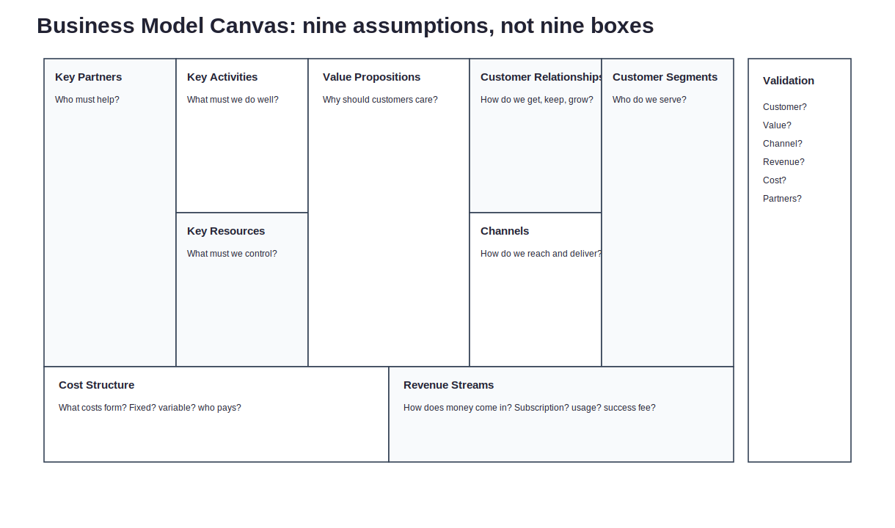
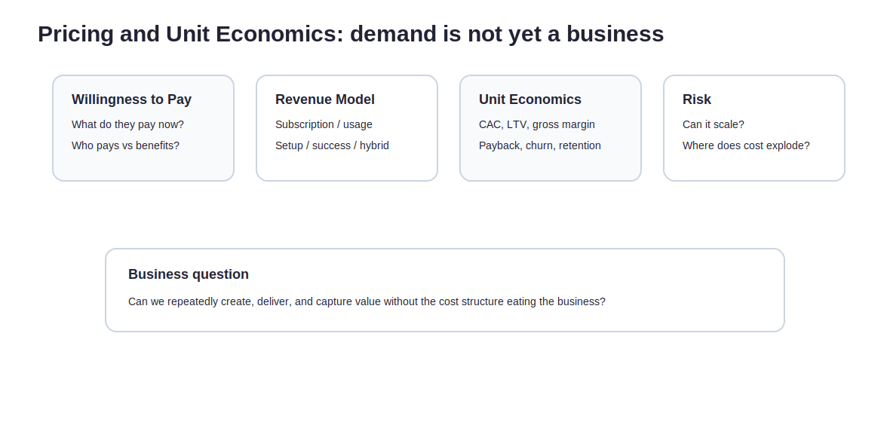

前面幾篇都在談問題、痛點、早期市場、MVP。

走到這裡，很容易出現一個錯覺：

> 既然有人有需求，也有人願意試，那這應該就是生意了吧？

還不一定。

有需求，只代表有人想要某個結果。  
有生意，代表你能持續、有效率、可獲利地創造、交付並捕獲這個結果的價值。

這兩件事中間隔著很大一段。

很多產品不是死在沒需求。

它們死在：有人想要，但沒有人付足夠的錢；有人願意付錢，但交付成本太高；有人願意試用，但通路打不開；顧客很喜歡，但留不住；收入看起來有了，但每一筆都越做越累。

所以 Part08 要把問題從「產品是否有價值」推到「這件事能不能形成可持續的商業模式」。

---

## 解決問題，不等於能賺錢

一件事要變成生意，不只要回答「能不能解決問題」。

還要回答：

- 誰付錢？
- 為什麼現在付？
- 付多少？
- 多久付一次？
- 成本怎麼形成？
- 通路怎麼打開？
- 交付能不能重複？
- 顧客會不會留下來？
- 夥伴會不會一起做？
- 規模變大後，毛利會變好還是變爛？

這些問題聽起來沒有 discovery 那麼浪漫。

但它們決定一個題目能不能從產品走向事業。

以獨立旅宿 loyalty alliance 來說，有需求不難理解。

旅宿想降低 OTA 依賴。  
旅客可能喜歡跨旅宿 benefits。  
大家都希望住宿後的關係不要直接斷掉。

但商業模式要問的是另一組問題：

- 旅宿願意付 subscription 嗎？
- 還是只願意 success fee？
- 如果以 usage-based 收費，usage 怎麼定義？
- 旅客端需要免費嗎？
- benefits 成本由誰出？
- onboarding、客服、內容維護、旅宿審核誰負責？
- 如果旅宿數量還少，旅客端價值夠嗎？
- 如果旅客端價值不夠，旅宿為什麼要加入？

這些問題不處理，需求再真也可能長不成生意。

---

## 先補產業與市場背景，不要只看自己的產品

商業模式不能只從自己想收什麼錢開始。

要先看產業結構。

你的筆記裡把它拆得很清楚：產業、產品、終端市場、競爭者、成功關鍵因素、競爭策略。這些不是商學作業，而是避免自己在錯的市場假設上建模型。

### 產業層面

先問：

1. 位在什麼產業？
2. 競爭對手是誰？
3. 競爭對手都做些什麼？
4. 產業裡有什麼學習榜樣？
5. 成功關鍵因素是什麼？
6. 競爭者的競爭策略是什麼？

套到獨立旅宿，你看的不只是「旅宿科技」。

你要同時看：

- OTA
- booking engine
- PMS / channel manager
- CRM / email marketing
- loyalty programme
- travel membership
- destination marketing
- local experience marketplace

因為你的競爭者不一定長得像你。

有時候你的競爭者不是另一個 startup，而是「旅宿繼續什麼都不做」。

### 產品層面

再問：

1. 此產品 / 組合目前的終端市場規模？年銷售額、使用量等？
2. 從過去推演整體終端市場，能成長到什麼程度？
3. 這股成長背後的驅動力量是怎麼來的？
4. 所以這代表什麼意思？結論是什麼？為什麼此市場值得進入？

這裡很適合接到獨立旅宿：

- 亞洲獨立旅宿數量是否夠大？
- OTA 依賴是否是普遍現象？
- direct booking 是否在成長？
- 旅宿是否越來越重視 first-party data？
- 小型旅宿是否有能力導入輕量工具？
- 旅客是否接受跨品牌 loyalty / benefits？

這些問題不是為了寫市場很大。

而是確認：這個市場是否有足夠空間，讓商業模式長出來。

---

## 終端市場：大不大、可不可接觸、會不會動

你的圖裡有一組很關鍵的終端市場問題：

> 是否市場吸引力很大？  
> 是否人數很多？  
> 是否使用量很大？  
> 是否有接觸市場的管道？  
> 是否能辨識市場在哪裡？  
> 是否能接觸市場產生實際互動？  
> 是否能創造需求？  
> 是否很容易變動他的使用？  
> 是否消費轉換容易？  
> 是否能執行到位？  
> 資源使用是否能超越投資報酬目標的要求？  
> 是否能找到有高承諾感的執行團隊？  
> 是否有明確的人員培訓計劃？

這組問題很像一盆冷水。

因為它提醒你：市場大，不代表市場可進入。

獨立旅宿很多，不代表你找得到決策者。  
找得到決策者，不代表他願意試。  
願意試，不代表前台做得到。  
前台做得到，不代表旅客會動。  
旅客會動，也不代表你收得到錢。

商業模式要看的是整條鏈。

---

## Business Model Canvas：九格不是填空，而是九組假設

Strategyzer 把 Business Model Canvas 定義為一個可以描述、設計、挑戰、發明與 pivot 商業模式的策略管理與創業工具。它不是一張漂亮海報，而是一組幫你把商業模式拆成九個 building blocks 的方法。

九格可以這樣問：

| 區塊 | 問題 |
|---|---|
| Customer Segments | 誰是顧客？誰付錢？誰受益？ |
| Value Propositions | 你提供什麼價值？解了哪個重要 Gap？ |
| Channels | 你怎麼觸達與交付？ |
| Customer Relationships | 你如何建立、維持、深化關係？ |
| Revenue Streams | 錢怎麼進來？怎麼收？收多少？ |
| Key Resources | 需要什麼核心資源？ |
| Key Activities | 必須做好哪些活動？ |
| Key Partnerships | 需要誰合作？他為什麼合作？ |
| Cost Structure | 成本怎麼形成？固定成本、變動成本在哪裡？ |

真正重要的是：每一格都是假設。

不是填完就完成，而是填完才知道要驗證什麼。

---

## 四個關鍵問題確認

在把商業模式畫得很完整之前，先回答四個更硬的問題：

1. 我們已經辨識了顧客希望解決的問題了嗎？
2. 我的產品能解決這些顧客的問題了嗎？
3. 如果是，我們有可行、可獲利的經營模式了嗎？
4. 是否驗證充足，可以上市了？

這四題看似簡單，其實每一題都可能卡住。

很多團隊停在第 1 題：問題聽起來有，但沒有確認顧客真的想解。  
有些停在第 2 題：產品有做出來，但沒有解到核心 Gap。  
有些停在第 3 題：有價值，但賺錢方式很弱。  
有些停在第 4 題：早期訊號有了，但還沒到能擴張的程度。

可以把它畫成一條路：

> 顧客 → 問題 → 解決方案構思 → 有規模、可量化、可持續的經營模式

這條路中間少一段，都還不能太早說「可以上市」。

---

## BMC 套到獨立旅宿 loyalty alliance

用獨立旅宿案例來看，BMC 可以先寫成這樣。

| 區塊 | 初步假設 |
|---|---|
| Customer Segments | 有 OTA 依賴、想建立 direct guest relationship、已有基本數位能力的獨立旅宿 |
| Value Propositions | 幫助旅宿用低摩擦方式累積可觸達旅客資料，並透過跨旅宿 benefits 提高旅客互動誘因 |
| Channels | 旅宿社群、旅遊創業社群、加速器、BD 介紹、內容行銷、partner referral |
| Customer Relationships | Founding partner pilot、共創式 onboarding、定期成效回顧、案例共同行銷 |
| Revenue Streams | Subscription、setup fee、usage-based fee、success fee、hybrid model |
| Key Resources | 旅宿供給、旅客資料同意機制、benefits network、品牌信任、輕量 CRM / tracking 工具 |
| Key Activities | 旅宿招募、benefits 設計、QR / 註冊流程、資料整理、旅客溝通、成效報告 |
| Key Partnerships | 獨立旅宿、旅遊社群、在地體驗商家、booking engine / CRM vendor、加速器與協會 |
| Cost Structure | BD 成本、onboarding、客服、技術維護、資料處理、內容與行銷、合作夥伴管理 |

這張表不是答案。

它只是把商業模式裡最容易被忽略的假設攤開。

---

## 每一格都要被驗證

Business Model Canvas 最常被誤用的方式，是把它當成商業計畫摘要。

但對早期創業來說，它更像假設地圖。

| BMC 區塊 | 要驗證的問題 |
|---|---|
| Customer Segments | 顧客是否真的存在？是否可觸達？是否夠痛？ |
| Value Propositions | 價值是否重要？是否比現有替代方案更好？ |
| Channels | 通路是否打得開？CAC 是否可承受？ |
| Customer Relationships | 關係是否能建立與維持？是否能降低 churn？ |
| Revenue Streams | 收費方式是否被接受？是否能穩定收錢？ |
| Key Resources | 核心資源是否拿得到？是否可防守？ |
| Key Activities | 關鍵活動是否能重複、標準化、規模化？ |
| Key Partnerships | 夥伴是否願意合作？合作誘因是否足夠？ |
| Cost Structure | 成本是否可控？規模變大後會變好還是變差？ |

如果每一格都只是「我們會」，那它就不是商業模式。

它只是願望清單。

---

## Pricing / Willingness to Pay：有價值，不代表有人願意照你的方式付錢

定價不能太晚想。

因為定價不是最後把價格貼上去，而是商業模式本身的一部分。

要問：

- 顧客現在為這問題付出什麼成本？
- 他們目前花錢買什麼替代方案？
- 你的方案節省多少錢，或創造多少收益？
- 定價是 subscription、usage-based、commission、setup fee、success fee，還是 hybrid？
- 付費方和受益方是不是同一個人？

以獨立旅宿來說，可能的定價方式有：

| 模式 | 適合情境 | 風險 |
|---|---|---|
| Subscription | 價值穩定、旅宿願意固定付費 | 初期若成效不明，旅宿不願承擔固定費 |
| Setup fee | onboarding 成本高，需要先回收導入成本 | 容易提高進入門檻 |
| Usage-based | 價值跟使用量或名單量相關 | 指標定義要清楚，否則容易爭議 |
| Success fee | 跟直訂、回訪、成交結果綁定 | 追蹤歸因困難 |
| Commission | 每筆交易抽成 | 容易被視為另一種 OTA |
| Hybrid | 低月費 + usage / success | 複雜度較高，但可分散風險 |

重點不是選一個最漂亮的。

而是看哪一種收費方式，和顧客感受到的價值最接近。

---

## Unit Economics：不要太晚才發現越做越虧

這篇不需要把財務課搬進來。

但至少要知道幾個基本概念：

| 指標 | 意思 | 早期要問什麼 |
|---|---|---|
| CAC | 取得一個顧客的成本 | 找到一間願意付費的旅宿要花多少時間與錢？ |
| LTV | 顧客生命週期價值 | 一間旅宿可能持續付多久？總共貢獻多少毛利？ |
| Gross Margin | 毛利率 | 每收一塊錢，扣掉直接交付成本後剩多少？ |
| Payback Period | 回本期 | 花在取得顧客的成本，多久能回來？ |
| Contribution Margin | 單位貢獻毛利 | 多服務一間旅宿，是否真的多賺？ |
| Churn | 流失率 | 旅宿為什麼不續？何時會流失？ |
| Retention | 留存 | 哪些旅宿會留下？留下的理由是什麼？ |

這些數字早期不會很準。

但方向要看。

如果每 onboard 一間旅宿都要大量人工，月費又收不高，那規模化會很痛。  
如果旅宿留存低，再多 BD 也只是一直補洞。  
如果毛利被人工服務吃掉，那你做的可能比較像顧問服務，不是 SaaS 或平台。

沒有對錯。

但要知道自己是哪一種生意。

---

## 成本與關鍵風險表

商業模式要能活下去，不能只看收入。

也要看成本與風險。

| 成本 / 風險 | 會怎麼出現 | 需要驗證什麼 |
|---|---|---|
| BD 成本 | 找旅宿、約訪、簽合作都耗時 | 是否有可重複通路？ |
| Onboarding 成本 | 每間旅宿都要教學、設定、溝通 | 是否能標準化？ |
| 前台執行摩擦 | 流程若太重，現場不做 | 是否能低於可接受操作時間？ |
| Benefits 成本 | 誰提供優惠？誰吸收成本？ | 旅宿是否願意提供有感利益？ |
| 技術維護 | CRM、tracking、註冊、資料安全 | 初期能否用輕量工具驗證？ |
| 歸因問題 | 直訂或回訪是否由你造成 | KPI 是否能被合理追蹤？ |
| 雙邊冷啟動 | 旅宿少，旅客價值低；旅客少，旅宿意願低 | 是否能先從單邊價值切入？ |
| OTA 關係風險 | 旅宿擔心平台反應 | 是否能定位成補充而非替代？ |

這張表會讓人有點不舒服。

但它很必要。

因為商業模式不是只有 revenue stream。  
它還有 cost structure、execution risk、partner risk 和 adoption risk。

---

## 這一篇真正要留下來的東西

讀到這裡，至少要留下三個成果：

1. **一張 Business Model Canvas**  
   不是填空，而是九組商業模式假設。

2. **一張 revenue model 假設表**  
   包含付費方、受益方、定價方式、願付意願、替代方案成本。

3. **一張成本與關鍵風險表**  
   看清楚這個模式哪裡最容易被成本、執行或通路卡住。

有需求，是一個好的開始。

但生意不只是在需求上成立。

它還要在交付、收費、成本、留存、通路與夥伴關係上成立。

這才是商業模式真正殘酷，也真正有趣的地方。

---
