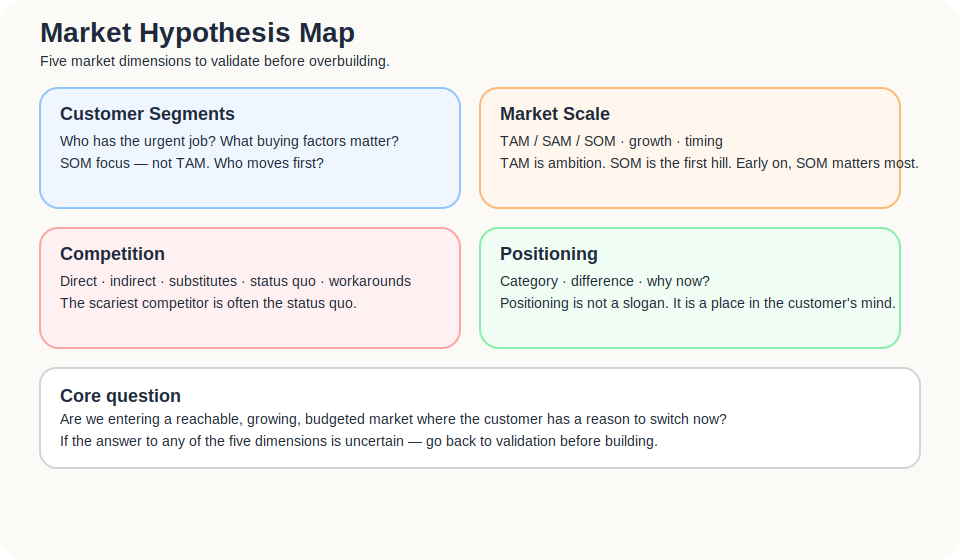
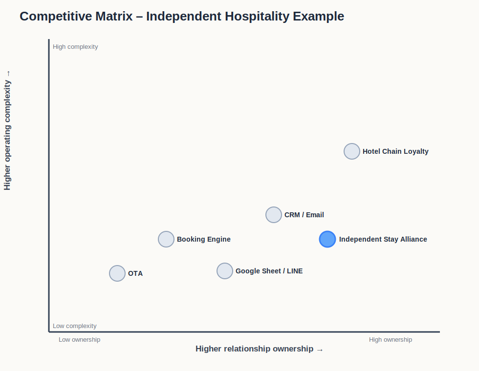
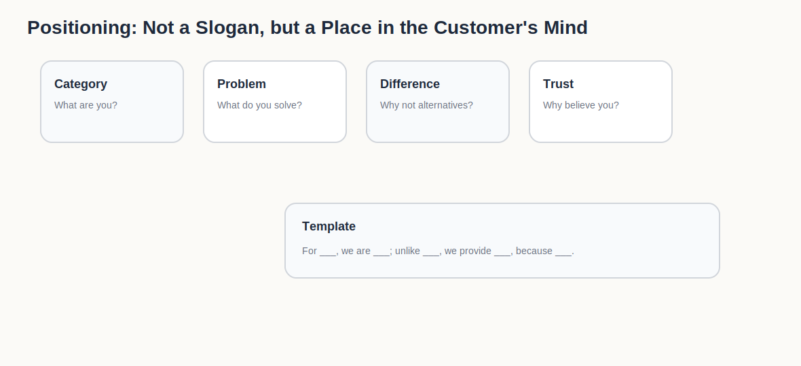

The earlier parts looked at problems, customers, MVPs, and business models.

At this point, it is easy to fall into a comforting mistake: if the customer pain is real and the MVP shows signal, the next step is simply to build the product better.

But a product does not live in a vacuum.

It enters a world that already has suppliers, habits, substitutes, budget cycles, buying logic, trust barriers, industry rules, and one competitor that is harder to defeat than almost anything else:

> the customer carrying on as before.

So this part is not only about whether the product is good.

It asks:

> Where do you stand inside the market structure?  
> Why should customers place you inside their set of options?  
> Compared with what they already use, why are you worth moving for?

Strategy is not making the slide look bigger. Strategy is admitting that the market already has gravity, terrain, enemies, and habits.

---

## A market is not “lots of people might use this”.

Market analysis often inflates too early.

“The global travel market is huge.”  
“There are many independent hotels in Asia.”  
“Everyone wants more direct bookings.”  
“All hotels want to reduce OTA dependency.”

These statements may not be false. They are simply not enough for strategy.

A market is not the number of people who might theoretically use the thing. A useful market analysis should answer:

- How large is the market?
- Is it growing?
- Do customers have budget?
- Does buying or adoption behaviour already exist?
- What substitutes are already being used?
- Why is now a good time?
- What blocks market entry?
- Who can reach these customers?
- Are customers likely to change behaviour?

A point that is often missed: **a market is not only large. It must also be reachable, identifiable, interactive, and convertible.**

Many independent hotels may exist. That does not mean you can reach the owner.  
Reaching the owner does not mean they have budget.  
Having budget does not mean they will change workflow.  
Changing workflow does not mean the front desk can execute.  
Front-desk execution does not mean travellers will act.

Market analysis has to examine whether the whole chain can move.

---

## Start with current behaviour: how do customers solve this now, and why have they not switched?

The first layer of market analysis is not size. It is behaviour.

Start with customer classification:

1. What solution does the customer currently use to address their important expectation gap? What cost do they pay?
2. What matters in the buying decision?
3. Given those factors, what customer segments already exist in the market?
4. Do different segments care differently about price, brand, service, convenience, warranty, trust, or integration?

These questions are more useful than “who is my target audience?”

For an independent hotel trying to reduce OTA dependency, the current alternatives are not only software products:

- continue using OTAs;
- build a direct booking website;
- use a booking engine;
- use LINE or email;
- run ads;
- hire a consultant;
- keep a manual list of returning guests;
- let the front desk maintain regular-guest relationships informally;
- do nothing.

If these substitutes are invisible to you, your competition analysis will be misleading.

The customer may not be choosing between you and another SaaS product.

They may be choosing between you and “let’s not touch this for now”.

---

## Product design is not feature design. It is purchase-reason design.

When entering a market, product design cannot begin only with features.

The earlier question is:

> Why would the customer place this in their buying options at all?

A practical checklist can pull the product back from feature lists into market reality.

| Topic | Question |
|---|---|
| Current solution | What does the customer use now to address the expectation gap? What cost do they pay? |
| Buying factors | Do they care most about price, brand, service, convenience, trust, warranty, or integration? |
| Product issue | Is there a critical problem with this product, service, or internet service? |
| Reason to use | Why would customers buy or use what you provide? |
| Ease of use | Does the customer find it easy to adopt and operate? |
| Market demand | Does this product truly satisfy a market need, or only the founder’s imagination? |
| Preference formation | Can it create a new customer preference for this way of doing things? |

These questions look basic. That is why they are easy to skip.

For independent hotels, the features could include points, QR registration, CRM, email, benefits, and guest preference data. But the market will ask:

- Why should I do this now?
- Will it add burden to the front desk?
- Will guests actually use it?
- How is this different from LINE, Google Sheets, or the OTA dashboard?
- Will it produce a visible improvement in direct booking, returning guests, or guest relationships?

The first layer of product design is not a tidy feature set.

It is a clear reason to buy.

---

## Market sizing: TAM / SAM / SOM should shrink fantasy, not inflate it.

Market size can be separated into TAM, SAM, and SOM.

| Type | Question |
|---|---|
| TAM | How large is the total theoretical market? What is the opportunity if no constraint existed? |
| SAM | How much of that market can you realistically serve, given your geography, product, and model? |
| SOM | How much can you actually capture in the short term, given resources, channels, and credibility? |

Many teams use TAM to make the market look impressive.

The more useful role of TAM / SAM / SOM is to prevent self-deception.

For an independent hotel loyalty alliance:

- **TAM**: all accommodation businesses that could benefit from reduced OTA dependency and stronger direct guest relationships.
- **SAM**: independent hotels in Asia with basic digital readiness and some willingness to experiment with direct booking, loyalty, or CRM.
- **SOM**: the first set of hotels reachable and convertible within the next 12 to 18 months through existing communities, relationships, partners, and founder-led sales.

TAM is ambition.  
SAM is the serviceable field.  
SOM is the first hill.

Early on, SOM matters most.

You do not survive on TAM.

You survive on the first people who actually move.

---

## Effective segmentation: do not only look at attributes. Look at jobs and circumstances.

Effective segmentation is not merely cutting a large market into smaller groups. It is finding people who share similar jobs, circumstances, needs, and buying reasons.

Traditional segmentation may cut by product type, price, geography, consumer versus company, or demographic traits.

Those can be useful. They are not enough.

A better cut starts with **Job** and **Circumstance**:

- In what situation does the need appear?
- What job are they trying to complete?
- What substitute do they use now?
- Why would they buy?
- What cost are they willing to pay?
- What proof do they need before trusting the offer?

For independent hotels, do not only segment by:

> boutique hotels, small hotels, guesthouses, resorts.

A more useful early segment may be:

- hotels with a website but weak direct-booking ratio;
- hotels already using LINE or email manually for returning guests;
- hotels facing visible low-season pressure;
- hotels with foreign guest segments but poor cross-language remarketing capability;
- hotels whose owners are motivated, but whose front-desk flow cannot become heavy.

These segments are not based on appearance.

They are based on how customers act, buy, and get stuck.

Good segmentation is not making the customer group more detailed. It is seeing more clearly **when a customer hires a solution for a specific job**. Characteristics tell you who they are. Circumstances explain why they might move now.

---

## There is often a gap between the early market and the mainstream market.

Technology products often face a classic split: early market, chasm, mainstream market.

This is commonly discussed through the idea of *crossing the chasm*. Early adopters will tolerate incompleteness if a key pain is addressed. Mainstream buyers care more about complete solutions, references, lower risk, and stable delivery.

This matters because you cannot sell to both groups with the same message.

Early hotels may care about:

- can we try first?
- can we co-create it?
- can we test signal with little cost?
- is this better than our current workaround?

Mainstream hotels may care about:

- are there case studies?
- is the process stable?
- is ROI predictable?
- is there support and training?
- are similar hotels already using it?

The early market buys possibility and relief from pain.

The mainstream market buys credibility and reduced risk.

If you force yourself to satisfy mainstream-market expectations too early, you move too slowly.  
If you use early-market excitement to sell to the mainstream market, the offer feels too light.

---

## Competitors are not only similar products.

Competition analysis should not only list products that look like yours.

Your competitors include:

- direct competitors;
- indirect competitors;
- substitutes;
- manual work;
- Excel or Google Sheets;
- consultants;
- friend referrals;
- Google search;
- existing platforms;
- internal labour;
- doing nothing.

The scariest competitor is often not the product most similar to yours.

It is the status quo.

In the independent hotel case:

| Type | Example | Why it competes |
|---|---|---|
| Direct competitor | Hotel CRM, loyalty SaaS | Solves a similar problem |
| Indirect competitor | Booking engine, email marketing, LINE OA | Solves part of the problem |
| Substitute | OTA loyalty, single-hotel membership | Already acceptable enough |
| Manual work | Google Sheet, front desk tracking regular guests | Cheap, familiar, controllable |
| Consulting service | Marketing or direct-booking consultant | Provides strategy and execution |
| Status quo | Continue relying on OTAs | No adoption cost, no organisational friction |

So a Competitive Matrix is not only a feature comparison.

It should compare:

- price;
- brand;
- service;
- guarantee or commitment;
- integration ability;
- execution difficulty;
- learning cost;
- customer trust;
- geographic coverage;
- ability to cross the adoption chasm.

---

## Competitors are not just names. They are evidence of why a model survives.

A thin competition analysis lists product names.

A useful one asks: why does this competitor survive in the market? What resources, cost structure, customer base, and channels keep it alive?

| Dimension | Question |
|---|---|
| Capital and resources | How much resource can they use to wait for the market to mature? |
| Cost structure | Are their costs lower or higher than yours? Where are fixed and variable costs? |
| Margin and profitability | Is the profit structure healthy, or is growth being subsidised by capital? |
| Customer base | Do they already control customers, data, partners, or supply? |
| Channel | Do they control a key channel, or have they become the default choice? |
| Trust | Do customers already believe them? Is their brand promise easier to accept than yours? |
| Retaliation ability | If you enter, can they copy, discount, bundle, or raise switching costs quickly? |

This makes the analysis more brutal.

An OTA’s strength is not only that it has many properties. It has traffic, trust, payments, reviews, advertising capacity, membership, supply-side relationships, and years of customer search habits.

Google Sheets is strong not because it has better features. It is free, familiar, immediate, and carries almost no adoption risk.

If you see competitors only as “worse features” or “clumsy experience”, you will underestimate their real market position.

---

## Competitive Matrix: the axes matter more than the boxes.

Competition maps are often drawn as four quadrants.

The real work is choosing the right axes.

Different topics need different axes:

- low cost vs high value;
- automated vs human service;
- standardised vs customised;
- platform vs tool;
- high-trust need vs low-trust need;
- high integration vs low integration;
- high relationship ownership vs low relationship ownership.

For an independent hotel loyalty alliance, two axes matter a lot:

1. **how much guest relationship ownership the hotel gains;**
2. **how complex implementation and operation become.**

The core question is not feature count. It is whether the hotel can regain some guest-relationship ownership with low enough friction.

Choose the wrong axes and the competition matrix becomes self-comforting.

You will place yourself in the top-right corner and feel clever.

The customer may not be using those axes at all.

---

## Competitive advantage: not “we are better”, but why others struggle to follow.

Competitive advantage can be viewed from three directions: How, Where, and Competitiveness Max.

### How: how do you achieve it?

- KSF, Key Success Factors;
- tools;
- configuration and integration of the business;
- system and capability.

In other words: what capability makes this possible?

### Where: where does the advantage appear?

- industry;
- geographic coverage;
- role in business networks;
- market sector;
- product category.

In other words: in what arena does the advantage matter?

### Competitiveness Max: what maximises the advantage?

- output and impact;
- responsiveness;
- flexibility;
- learning, innovation, and diffusion.

In other words: is the advantage only a feature, or does the organisation learn, adapt, and spread faster?

For independent hotels, the advantage may not be “we have a points feature”.

It may be:

- connecting multiple independent hotels into an understandable benefits network;
- reducing guest sign-up friction;
- allowing small hotels to test direct guest relationships without a heavy system;
- using cross-property value to make up for the weakness of single-hotel membership;
- building trust gradually through case studies, data, and shared brand value.

Competitive advantage is not “we work harder”.

It is doing something that others cannot easily copy in full, even after seeing it.

---

## Positioning: not a slogan, but a place in the customer’s mind.

Positioning is not a beautiful slogan.

Positioning means that when customers hear about you, they can quickly understand:

- what category you belong to;
- what problem you solve;
- how you differ from substitutes;
- why you are believable;
- why adoption should happen now.

A classic view of positioning is that it is about occupying a place in the prospect’s mind. It is not what you do to the product. It is what you do to the mind of the customer.

More plainly:

> Positioning is not how you describe yourself. It is how customers place you inside their own understanding of the world.

Positioning can be split into two layers: what you do, and what result you want to create in the customer’s mind.

| What positioning needs to do | What it should produce |
|---|---|
| Find the right place in the customer’s mind | Occupy a clear, valued, memorable position |
| Design the offer and image | Help the customer understand what the brand is and stands for |
| Clarify category and difference | Show what you are similar to, and where you differ |
| Provide a reason to buy | Explain why adoption is worth considering now |
| Guide marketing and product activities | Keep messaging, channels, and product decisions consistent |

A useful template:

> For ___, we are ___; unlike ___, we provide ___, because ___.

Independent hospitality example:

> For independent hotels that want to reduce OTA dependency but lack the capacity to run a large-scale membership system, we are a lightweight cross-property guest relationship and benefits alliance. Unlike single-hotel membership or traditional CRM, we provide cross-hotel incentives and a low-friction guest sign-up flow, because a single independent property often cannot create enough reason for guests to return or stay connected on its own.

This is not the final slogan.

It is a positioning judgement.

It helps clarify that you are not simply a CRM, OTA, membership system, or marketing consultant.

You are trying to become a new option the customer can understand.

---

## Category / Narrative: sometimes you have to teach the market how to understand the problem.

If the market already has a mature category, your work is comparative:

> We are better than whom? In what way? Why should customers switch?

If the category is not yet mature, your work is educational:

> How should this problem be understood?  
> Why are old categories inadequate?  
> Why does a new category explain the pain better?

Category design could easily be its own essay. Here, one point is enough: positioning is not only competing within an existing category. Sometimes it is renaming the problem.

For independent hotels, if you say you are a CRM, hotels will judge you as a CRM.  
If you say you are a loyalty programme, they will compare you with hotel-chain membership.  
If you say you are an OTA alternative, they may worry about platform relationships and supply pressure.

But if you frame the problem as:

> independent hotels lack a shared direct guest relationship infrastructure that can make customer value larger than any single property can create alone,

the market understands the issue differently.

That sentence may not be the best final wording.

The direction matters: you are not only selling features.

You are teaching the customer a new way to understand the problem.

## What this part should leave behind

By the end, three outputs should be clear.

### 1. A market hypothesis table

| Question | Initial answer | What needs validation |
|---|---|---|
| How large is the market? | Independent and boutique accommodation in Asia | How much is reachable and willing to pay? |
| Is it growing? | Direct booking, first-party data, and hotel digitalisation needs are rising | Does this translate into budget and adoption? |
| Do customers have budget? | Some hotels have marketing, CRM, or direct-booking budgets | Will they shift spend to a new solution? |
| What are the alternatives? | OTA, CRM, LINE, Google Sheets, consultants, status quo | What does the customer truly compare against? |
| Why now? | OTA cost, data ownership, independent-brand pressure | Is the timing strong enough? |
| What blocks entry? | Hard-to-reach decision makers, front-desk friction, low trust, two-sided cold start | Which barrier is most serious? |

### 2. A competitive map

Do not only include similar products.

Include direct competitors, substitutes, manual work, and doing nothing. Then choose the two axes that actually shape customer choice.

### 3. A positioning statement

> For ___, we are ___; unlike ___, we provide ___, because ___.

If this sentence is not clear, do not rush into marketing.

The market may not yet know how to understand you.
