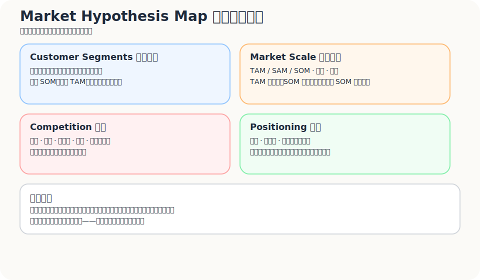
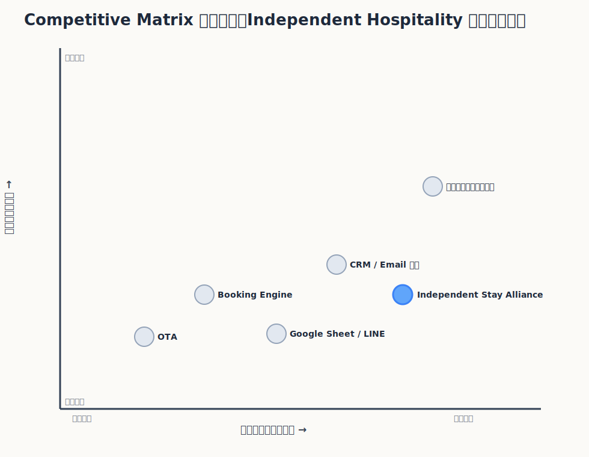
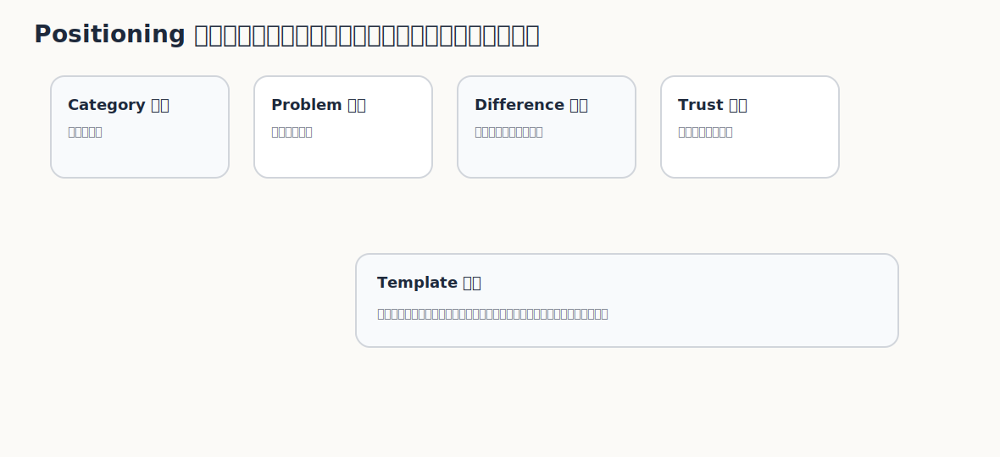

前面幾篇一直在看問題、顧客、MVP、商業模式。

走到這裡，很容易出現一個錯覺：只要我把顧客痛點看清楚，把 MVP 跑出訊號，接下來就是把產品做好。

但產品不是活在真空裡。

它會進入一個已經存在的世界。那裡有既有供應商、顧客習慣、替代方案、預算週期、採購邏輯、信任門檻、產業規則，還有一個最難打敗的對手：

> 顧客繼續照舊。

所以 Part09 要處理的不是「產品本身好不好」，而是：

> 在這個市場結構裡，你到底站在哪裡？  
> 顧客為什麼要把你放進他的選項裡？  
> 你和既有選擇相比，憑什麼值得他動？

策略不是把簡報寫得比較大。策略是承認自己進入的是一片已經有重力、有地形、有敵人、有習慣的市場。

---

## 市場不是「很多人可能會用」

很多市場分析一開始就膨脹。

「全球旅遊市場很大。」  
「亞洲獨立旅宿很多。」  
「大家都想要直訂。」  
「所有飯店都想降低 OTA 依賴。」

這些話不一定錯，但拿來做策略，還不夠。

市場不是很多人理論上可能會用。市場至少要回答幾件事：

- 市場有多大？
- 是否正在成長？
- 顧客是否有預算？
- 採購或採用行為是否存在？
- 現有替代方案是什麼？
- 為什麼現在是好時機？
- 進入市場的阻力是什麼？
- 誰能接觸這些顧客？
- 顧客是否容易改變原本做法？

市場分析有一個很容易被忽略的重點：**市場不只是龐大，還必須可接觸、可辨識、可互動、可轉換。**

獨立旅宿很多，不代表你能找到老闆。  
找到老闆，不代表他有預算。  
有預算，不代表他願意改流程。  
願意改流程，不代表前台真的做得到。  
前台做得到，不代表旅客會配合。

市場分析要看的，是整條鏈是否有可能動起來。

---

## 先問：顧客現在怎麼解？他為什麼還沒換？

市場的第一層不是規模，而是現有行為。

從顧客分類開始，可以先問：

1. 顧客為了解決他的重大期許，用什麼解決方案？付出什麼代價？
2. 顧客在購買時，重要購買因素是什麼？
3. 依照這些考量點，目前市場上的顧客區隔是什麼？
4. 不同區隔的顧客，對價格、品牌、服務、便利、保固、信任、整合度的重視程度是否不同？

這些問題比「我的客群是誰」更有用。

例如獨立旅宿想要降低 OTA 依賴，目前可能的解法不是只有軟體：

- 繼續使用 OTA
- 自己做官網
- 使用 booking engine
- 經營 LINE / Email
- 投廣告
- 找顧問
- 手動整理回訪客名單
- 讓前台靠熟客關係維持回訪
- 乾脆不改變現狀

如果你沒有看見這些替代方案，就很容易誤判競爭。

顧客不一定是在你和另一個 SaaS 之間選。  
他可能是在你和「反正先不要動」之間選。

---

## 產品設計不是功能設計，而是購買理由設計

進入市場時，產品設計不能只問「要做哪些功能」。更早要問的是：

> 顧客為什麼會把這個東西放進購買選項裡？

這裡可以用一組很實用的問題，把產品從功能清單拉回市場現實。

| 題目 | 要問什麼 |
|---|---|
| 顧客目前怎麼解 | 顧客為了解決重大期許，用什麼解決方案？付出什麼代價？ |
| 購買因素 | 他在意價格、品牌、服務、便利、信任、保固，還是整合度？ |
| 產品關鍵問題 | 此產品 / 服務 / 網路服務是否有什麼關鍵問題？ |
| 使用理由 | 為什麼顧客會想買你提供的產品或服務？ |
| 使用難度 | 顧客是否覺得你的產品或服務容易使用？ |
| 市場需求 | 這個產品是否能滿足市場需求？還是只滿足創辦人的想像？ |
| 偏好形成 | 是否能引發市場中的消費者偏好，讓他開始偏向這種新做法？ |

這些問題看起來很基礎，但很容易被跳過。

以獨立旅宿為例，功能可以有很多：點數、QR registration、CRM、email、benefits、旅客偏好資料。但市場真正會問的不是功能數量，而是：

- 我為什麼要現在做？
- 這會不會增加前台負擔？
- 旅客真的會用嗎？
- 它和我現在用 LINE / Google Sheet / OTA 後台差在哪？
- 它會不會帶來可感知的直訂、回訪或顧客關係累積？

所以產品設計的第一層，不是把功能排漂亮。

而是把購買理由說清楚。

---

## 市場規模：TAM / SAM / SOM 不是拿來吹大，而是拿來收斂

市場規模可以用 TAM / SAM / SOM 來拆。

| 類型 | 問題 |
|---|---|
| TAM | 理論上整個市場有多大？如果沒有任何限制，總機會是多少？ |
| SAM | 在你的商業模式、地區、產品能力下，你實際能服務的市場有多大？ |
| SOM | 短期內，以你的資源、通路、可信度，你真正能拿下多少？ |

很多人寫 TAM，是為了讓市場看起來很大。

但真正有用的 TAM / SAM / SOM，是為了避免自欺。

獨立旅宿 loyalty alliance 可以這樣拆：

- **TAM**：所有可能需要降低 OTA 依賴、建立直接顧客關係的住宿業者。
- **SAM**：亞洲市場裡，有基本數位能力、願意嘗試 direct booking / loyalty / CRM 的獨立旅宿。
- **SOM**：未來 12 到 18 個月內，透過現有社群、人脈、合作夥伴與 founder-led sales 能觸達並轉換的首批旅宿。

TAM 是野心。  
SAM 是可服務範圍。  
SOM 是現實中的第一個山頭。

早期真正要緊的是 SOM。

因為你不是靠 TAM 活下來。

你是靠第一批真的會動的人活下來。

---

## 有效市場區隔：不要只看顧客屬性，要看任務與情境

有效的 segmentation，不只是把大市場切成更小的人群，而是找出那些在特定情境中有相似任務、需求與購買理由的人。

傳統 segmentation 常會按產品種類、價格、地理、個人 / 公司、客群屬性切。

這些可以用，但不夠。

更好的切法，是從 **Job** 和 **Circumstance** 下手：

- 他在什麼情境下產生需求？
- 他要完成什麼 job？
- 他現在用什麼替代方案？
- 他因為什麼原因購買？
- 他願意付出的代價是什麼？
- 他需要什麼證據才會相信？

套到獨立旅宿，不要只切成：

> 精品旅館、小型飯店、民宿、度假村。

更有用的 early segment 可能是：

- 已經有官網，但直訂比例很低的旅宿
- 已經在用 LINE / Email 手動做回訪的旅宿
- 淡季壓力明顯、願意找新方法的旅宿
- 有一定外國旅客比例，但缺少跨語言再行銷能力的旅宿
- 老闆願意推，但前台流程不能太重的旅宿

這些區隔不是依照樣子切。

是依照它們如何行動、如何購買、如何卡住來切。

好的 segmentation 不是把人切得更細，而是把「人在哪個情境下雇用某個解法」看得更準。顧客特徵會描述他是誰，但情境會解釋他為什麼現在要動。

---

## Early market 和 mainstream market 中間，常常有一條溝

科技產品常遇到一個典型斷層：早期市場、鴻溝、主流市場。

這個概念常被稱為 crossing the chasm，特別常用在科技產品與 B2B 市場：早期採用者願意忍受不完整，只要能解決關鍵痛點；主流市場則更在意完整方案、可參考案例、低風險、穩定交付。

這很重要。

因為你不能用同一套訊息賣給兩群人。

早期旅宿可能在意：

- 有沒有機會先試？
- 能不能一起共創？
- 能不能用很低成本測出訊號？
- 能不能比現有 workaround 好一點？

主流旅宿可能在意：

- 有沒有案例？
- 有沒有穩定流程？
- 有沒有可預測 ROI？
- 有沒有客服與教學？
- 其他同類旅宿是否已經使用？

早期市場買的是可能性和痛點解除。

主流市場買的是可信度和風險降低。

如果你太早用主流市場的完整方案要求自己，會太慢。  
如果你用早期市場的熱血去說服主流市場，會太輕。

---

## 競爭者不只同類產品

競爭分析不能只列出長得像你的產品。

你的競爭者包括：

- 直接競品
- 間接競品
- 替代方案
- 人工作業
- Excel / Google Sheet
- 顧問
- 朋友介紹
- Google 搜尋
- 既有平台
- 內部人力
- 不改變現狀

其中最可怕的競爭者，通常不是最像你的產品。

而是「照舊」。

在獨立旅宿案例裡，競爭者可能是：

| 類型 | 例子 | 為什麼構成競爭 |
|---|---|---|
| 直接競品 | 旅宿 CRM、loyalty SaaS | 解相似問題 |
| 間接競品 | booking engine、email marketing、LINE OA | 解部分問題 |
| 替代方案 | OTA loyalty、旅宿自己做會員 | 顧客已有可接受替代 |
| 人工作業 | Google Sheet、前台手動記熟客 | 便宜、熟悉、可控 |
| 顧問服務 | 行銷顧問、直訂顧問 | 提供策略與代執行 |
| 不改變現狀 | 繼續依賴 OTA | 無導入成本、無組織阻力 |

所以 Competitive Matrix 不只是比功能。

還要比：

- 價格
- 品牌
- 服務
- 保固 / 承諾
- 整合能力
- 執行難度
- 學習成本
- 客戶信任
- 可覆蓋區域
- 能否跨過 adoption chasm

---

## 競爭者不是拿來列名字，是拿來判斷他為什麼能活著

競爭分析如果只列產品名稱，會太薄。

真正要看的是：競爭者為什麼能活在市場裡？他靠什麼資源、成本結構、顧客基礎和通路維持？

| 維度 | 要問什麼 |
|---|---|
| 資金與資源 | 他有多少資源可以撐到市場成熟？ |
| 成本結構 | 他的成本比你低還是高？固定成本和變動成本在哪裡？ |
| 毛利與獲利 | 他是否已經有健康的利潤結構？還是在用資本補貼成長？ |
| 顧客基礎 | 他是否已經握有大量顧客、資料、合作夥伴或供給端？ |
| 通路 | 他是否控制關鍵通路，或已經成為顧客的預設選項？ |
| 信任 | 顧客是否已經相信他？他的品牌承諾是否比你更容易被接受？ |
| 反擊能力 | 如果你切進市場，他能否快速模仿、降價、綁約或提高轉換成本？ |

這些問題會讓競爭分析變得比較殘酷。

例如 OTA 的競爭力不只是「有很多房源」。它還有流量、信任、付款、評論、廣告資源、會員系統、供給端綁定，以及顧客長期形成的搜尋習慣。

Google Sheet 的競爭力也不是功能強，而是零成本、熟悉、立即可用、沒有導入風險。

如果你只把競爭者看成「功能比我少」或「體驗比我差」，很容易低估它真正的市場位置。

## Competitive Matrix：選軸比填格子更重要

競爭圖常常被畫成四象限。

但真正重要的不是畫出四象限，而是選對軸。

不同題目要選不同軸：

- 低成本 vs 高價值
- 自動化 vs 人工服務
- 標準化 vs 客製化
- 平台型 vs 工具型
- 高信任需求 vs 低信任需求
- 高整合度 vs 低整合度
- 高關係 ownership vs 低關係 ownership

對獨立旅宿 loyalty alliance，我會很在意兩個軸：

1. **旅宿是否擁有顧客關係**
2. **導入與執行複雜度**

因為這個題目的核心不是功能多寡，而是：旅宿能不能用夠低摩擦的方式，換回一點顧客關係 ownership。

如果你選錯軸，競爭分析會變成自我安慰。

你會把自己放在最右上角，看起來最好。

但顧客真正比較的，可能根本不是那些軸。

---

## 競爭優勢：不是你比較好，而是為什麼別人難以跟上

競爭優勢可以從三個方向看：How、Where、Competitiveness Max。

競爭優勢可以從三個方向看：

### How：你怎麼做到

- KSF（Key Success Factors）
- Tools
- Configuration and integration of business
- System and capability

也就是：你靠什麼能力做到這件事？

### Where：你在哪裡形成優勢

- Industry
- Geographic coverage
- Role in business networks
- Market sector
- Product category

也就是：你在哪個場域裡形成優勢？

### Competitiveness Max：優勢最大化來自什麼

- Output / impact
- Responsiveness
- Flexibility
- Learning, innovation and diffusing

也就是：你的優勢不只是一次性的功能，而是能不能回應、學習、調整、擴散。

對獨立旅宿來說，真正的優勢也許不是「我們有點數功能」。

而是：

- 能把多間獨立旅宿串成可理解的 benefits network
- 能降低旅客加入摩擦
- 能讓小型旅宿不必導入重系統，也能測 direct guest relationship
- 能用跨旅宿價值彌補單店會員吸引力不足
- 能透過案例、資料、共同品牌逐步建立信任

競爭優勢不是「我們比別人努力」。

競爭優勢是：你做的事情，別人即使看到，也不容易完整複製。

---

## Positioning：定位不是 slogan，而是顧客腦中的位置

定位不是一句漂亮 slogan。

定位是顧客聽到你時，能不能快速理解：

- 你屬於哪個品類？
- 你解決哪個問題？
- 你和替代方案差在哪？
- 為什麼你值得相信？
- 為什麼現在要採用？

你的筆記裡有一段英文很直接：

> Position the product in prospects’ mind.  
> Positioning is owning a price of customer’s mind.  
> Positioning is not what you do to the product. It is what you do to the mind of the prospect.  
> You need to give your compelling reason to buy.

我會把它翻成更直白的說法：

> 定位不是你怎麼描述自己，而是顧客怎麼把你放進他的理解框架。

定位可以拆成兩層來看：你要做什麼，以及你希望在顧客心中產生什麼結果。

| 定位要做的事 | 定位要產生的結果 |
|---|---|
| 找到顧客腦中的正確位置 | 佔據一個清楚、有價值、可記住的位置 |
| 設計 offer 與 image | 讓顧客知道品牌是什麼、代表什麼 |
| 說清楚類別與差異 | 讓顧客知道你像誰，又不同在哪裡 |
| 提供購買理由 | 讓顧客知道為什麼現在值得採用 |
| 指引行銷與產品活動 | 讓後續訊息、通路、產品設計一致 |

可以用這個模板：

> 對於＿＿＿，我們是＿＿＿，不同於＿＿＿，我們提供＿＿＿，因為＿＿＿。

獨立旅宿案例：

> 對於想降低 OTA 依賴、但沒有能力經營大型會員系統的獨立旅宿，我們是一個輕量的跨旅宿顧客關係與 benefits alliance。不同於單店會員或傳統 CRM，我們提供跨旅宿誘因與低摩擦旅客加入流程，因為單一旅宿很難獨自創造足夠強的回訪理由。

這不是最後 slogan。

這是定位判斷。

它要讓你知道自己不是「CRM」、「OTA」、「一般會員系統」或「行銷顧問」。

你要讓顧客知道：你到底是什麼新選項。

---

## Category / Narrative：有時候你要先教市場怎麼理解問題

如果市場已經有成熟品類，你的工作比較像比較：

> 我比誰更好？在哪裡更好？為什麼值得換？

但如果市場還沒有成熟品類，你的工作就不只是比較，而是教育：

> 這個問題應該被怎麼理解？  
> 舊分類為什麼不夠？  
> 新分類為什麼更能解釋顧客的痛？

這就是 category / narrative 的問題。

Category design 可以展開成一整篇。這裡先抓住一個重點：定位不只是在既有品類裡搶位置，有時候也要重新命名問題。

對獨立旅宿來說，如果你只說自己是 CRM，旅宿會用 CRM 的標準看你。  
如果你說自己是 loyalty programme，旅宿會拿連鎖飯店會員來比你。  
如果你說自己是 OTA 替代品，旅宿會開始擔心平台關係與供給端壓力。

但如果你能把問題說成：

> 獨立旅宿缺少的是一種可共同放大顧客關係價值的 direct guest relationship infrastructure。

那市場理解就不同了。

這句不一定是最好版本。

但方向是：你不是只在賣功能。  
你在教顧客用新的方式理解自己的問題。

## 這一篇真正要留下來的東西

讀到這裡，至少要留下三個成果：

### 1. 一張市場假設表

| 問題 | 初步答案 | 需要驗證什麼 |
|---|---|---|
| 市場有多大？ | 亞洲獨立旅宿與精品住宿市場 | 可觸達與可付費部分到底多大 |
| 是否成長？ | direct booking、first-party data、旅宿數位化需求增加 | 是否真的轉成預算與採用 |
| 顧客是否有預算？ | 有些旅宿有行銷 / CRM / 直訂預算 | 是否願意轉給新解法 |
| 替代方案是什麼？ | OTA、CRM、LINE、Google Sheet、顧問、不改變 | 顧客真正拿誰來比較 |
| 為什麼現在？ | OTA 成本、資料 ownership、旅宿獨立品牌需求 | timing 是否足夠強 |
| 進入阻力是什麼？ | 決策者難找、前台摩擦、信任不足、雙邊冷啟動 | 哪個阻力最大 |

### 2. 一張競爭地圖

不要只放同類產品。

把直接競品、替代方案、人工作業、不改變現狀都放進去，再選出真正影響顧客選擇的兩個軸。

### 3. 一句定位陳述

> 對於＿＿＿，我們是＿＿＿，不同於＿＿＿，我們提供＿＿＿，因為＿＿＿。

如果這句說不清楚，先不要急著做行銷。

因為市場可能根本不知道該怎麼理解你。
