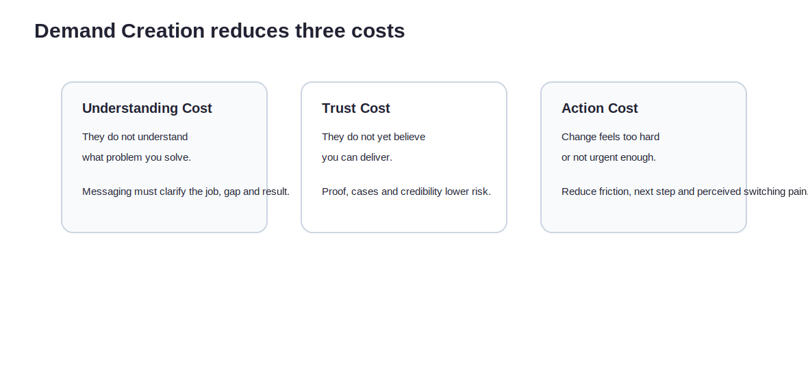
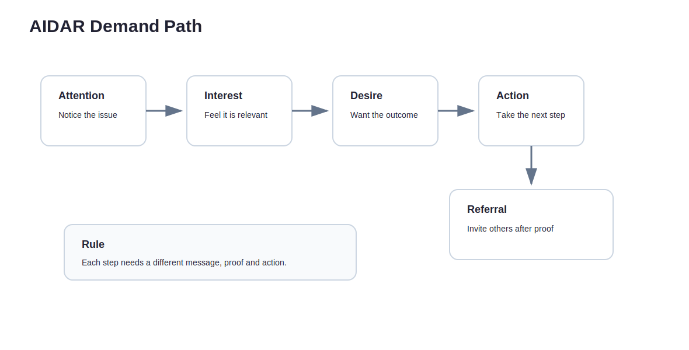
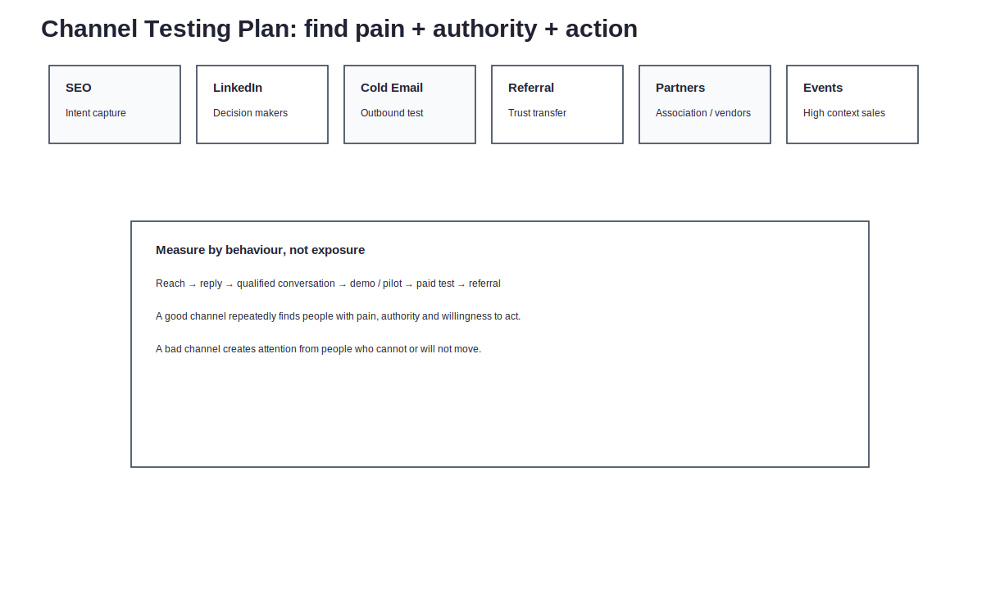

Many products do not die because they have no value.

They die because nobody understands the value, nobody believes the value, or nobody is willing to act right now.

Those are three different problems.

If customers do not understand what you solve, that is understanding cost.  
If they do not believe you can deliver, that is trust cost.  
If change feels too troublesome, that is action cost.

Demand creation is not aggressive selling.

It is the work of reducing these three costs.

A finished product only means you may have something valuable. Whether the market understands, believes, and adopts it is a different fight.

---

## A good product does not mean the market will understand it.

Builders often assume that if something is genuinely valuable, the market will eventually get it.

Sometimes it will.

Usually, it will not.

The market is busy.  
Customers are busy.  
Buyers are busy.  
Users are busy.

Nobody is obliged to understand your product on your behalf.

So the first job of GTM, marketing, and demand creation is not to make the product sound cleverer. It is to fill the gap in the customer’s mind:

> Why should I care?

If an independent hotel loyalty alliance says only:

> We are a cross-hotel points platform,

many hotels may think:

> I already have OTAs.  
> I have no time to run a membership.  
> Points sound complicated.  
> Will this upset the OTA relationship?  
> Will my guests actually use it?

That does not mean the customer is stupid.

It means the message has not yet clarified the problem, value, risk, and next step.

---

## Demand creation reduces three costs.

Demand creation can be viewed through three costs.

| Cost | Meaning | What needs to happen |
|---|---|---|
| Understanding cost | Customers do not understand what you solve | Explain clearly: who, what problem, why it matters |
| Trust cost | Customers do not believe you can deliver | Use cases, proof, credible signals, and low-risk pilots |
| Action cost | Customers feel change is too difficult | Make the next step small; reduce integration, workflow, and decision friction |

Many marketing efforts fail not because reach is too low.

They fail because these costs are too high.

Customers see you, but do not understand.  
They understand, but do not believe.  
They believe, but action feels too hard.

So they do nothing.

---

## Demand creation is not inventing demand from nothing.

The phrase can sound manipulative, as though the job is to persuade people into wanting something they did not need.

That is not the useful version.

Healthier demand creation connects the earlier parts of the work:

- the pain from Part04: the customer has an important, unmet Gap;
- the value proposition from Part08: your solution creates a specific value;
- the positioning from Part09: compared with alternatives, you occupy a clear place.

You are not creating demand from thin air.

You are helping customers see:

> The problem I have been tolerating can be understood differently.  
> There may be a way closer to the result I actually want.  
> The next step does not need to be heavy; it can be tested.

That is demand creation worth doing.

---

## Dare to Market: before launch, ask whether the market will move.

Before entering the market, do not only ask, “Can we sell this?”

Ask:

> Does this market have enough reason, trust, and low enough action cost for customers to move?

A Dare to Market checklist makes the uncomfortable questions visible.

| Question | Why it matters |
|---|---|
| Who is the new venture’s customer? | Without a clear customer, messaging and channels blur |
| What are the unmet needs? | Without unmet needs, there is no switching reason |
| How does the customer make decisions and buy this product or service? | If the buying process is unknown, sales motion will be weak |
| To what degree is the product / service compelling for the customer? | Value must be strong enough to matter |
| How will the product / service be priced? | Pricing is part of the business model, not a final label |
| How will the venture reach all identified customer segments? | A market can exist and still be unreachable |
| How much does it cost to acquire a customer? | CAC determines whether the channel can last |
| How much does it cost to produce and deliver the product or service? | Delivery cost determines margin and scalability |
| How much does it cost to support a customer? | Support, training, and onboarding can consume profit |
| How easy is it to retain a customer? | Without retention, the business keeps rebuying demand |

This table is really asking one thing:

> Will customers move from awareness to adoption, and can you afford the path?

If the answer is vague, do not simply increase exposure.

Clarify whether the market can move.

---

## AIDA / AIDAR: each stage has a different job.

AIDA is an old marketing model, but it still helps because customers rarely act after seeing one message once.

A useful extension is AIDAR:

| Stage | Question |
|---|---|
| Attention | How do customers notice? |
| Interest | How do they feel it is relevant? |
| Desire | How do they start wanting the outcome? |
| Action | How do they take the next step? |
| Referral | How do they recommend it? |

In the independent hospitality case:

### Attention

Make the problem visible:

> OTA dependency is not only a commission problem. It is also a guest relationship problem.

### Interest

Make it feel relevant:

> If returning guests, regulars, and guest preferences are not retained systematically, every season starts with buying attention again.

### Desire

Make the desired future concrete:

> An independent hotel does not have to become a global chain to begin building direct guest relationships.

### Action

Lower the next step:

> Run a 30-day pilot to test whether guests scan a QR code and join a benefits network, without PMS integration.

### Referral

After proof, ask for expansion:

> If this flow helps collect contactable guest data, would you introduce another hotel facing similar low-season pressure?

Each stage needs a different message.

One pitch will not do all five jobs.

---

## Five demand-creation questions: every step needs a reason to move.

AIDAR is not only a funnel label. Each stage should return to a practical question:

> What action will we take, and why would that action move the customer one step forward?

Ask:

1. What will we do to make them notice us? Why would that action make them notice?
2. What will we do to make them interested? Why would that action create interest?
3. What will we do to make them desire the outcome? Why would that action create desire?
4. What will we do to make them convert or take action? Why would that action lead to conversion?
5. What will we do to make them refer? Why would that action create referral behaviour?

These questions are plain, but useful.

They prevent vague plans such as “we will do content marketing”, “we will send cold email”, or “we will build community”. Those are activities.

The real issue is whether each activity lowers understanding cost, trust cost, or action cost.

For independent hotels:

| Stage | Action | Why it might work |
|---|---|---|
| Attention | Publish an article reframing OTA dependency as loss of guest relationship | It names a pain hotels may feel but not yet articulate |
| Interest | Offer a direct guest relationship checklist | It helps hotels map the issue to their own situation |
| Desire | Show a low-friction 30-day pilot flow | It makes the future state concrete and imaginable |
| Action | Offer a small pilot without PMS integration | It lowers adoption pressure and decision cost |
| Referral | Use a result report to invite introduction to similar properties | It makes the story understandable and shareable |

Demand creation is not pushing customers down a funnel.

It is giving each step enough reason to continue.

---

## Messaging: connect pain, value proposition, and positioning.

A good value message should answer six questions:

1. Who are you helping?
2. What problem are you solving?
3. Where do current methods fall short?
4. What is different about your approach?
5. What result will customers get?
6. How low-risk is the next step?

A useful structure:

> For【target customer】,  
> when they face【pain / Gap】in【situation】,  
> current methods usually【fall short】.  
> We provide【solution】,  
> helping them achieve【result】,  
> with【low-risk next step】.

Independent hospitality version:

> For independent hotels that want to reduce OTA dependency but cannot run a heavy membership system, when they approach low season and need steadier returning guests and direct bookings, current methods are often too fragmented, too labour-intensive, or too dependent on platform traffic. We provide a lightweight cross-hotel benefits pilot that helps hotels test whether guests will leave contactable data with low friction, without needing PMS integration at the start.

This may not be the exact homepage copy.

It is the message skeleton.

The website, LinkedIn post, cold email, pitch deck, event talk, and partner outreach can all be rewritten from here.

---

## Messaging has to handle both what to do and what outcome to create.

Positioning and messaging design can be split into two layers: what you do, and what result you want to create in the customer’s mind.

### What to do

- Find the proper location in the mind of the target customer.
- Design the firm’s offer and image to occupy the proper place in the target customer’s mind.

### What outcomes

- Occupy a distinct and valued place in the target customer’s mind.
- Make the target customer think about the offering in a logical and desired way.
- Clarify what the brand is about, how it is unique, how it is similar to competing brands, and why customers should purchase and use it.
- Guide the business and marketing activities of the brand.

In plain terms:

> Messaging is not only explaining the product.  
> It is giving the product a useful place in the customer’s mind.

If customers do not know what you are, they will not buy.  
If they know what you are but not why you are different, they will not buy.  
If they know the difference but not why they should act now, they still will not buy.

Messaging must connect to positioning.

Not only to features.

---

## Channel Testing: channels are not places to get exposure.

Many teams ask:

> Where should we get exposure?

That question is too shallow.

A better question is:

> Which channel can repeatedly find people with pain, authority, and willingness to act?

Channels worth testing may include:

- SEO;
- LinkedIn;
- communities;
- cold email;
- referrals;
- partner channels;
- offline events;
- community building;
- paid ads;
- marketplaces;
- newsletters;
- webinars;
- founder-led sales.

But do not judge a channel by exposure.

Judge it by behaviour.

| Channel | First test | Good signal | Bad signal |
|---|---|---|---|
| SEO | Whether direct-booking / OTA-dependency content brings intent traffic | Visitors have a clear problem and download tools or book calls | Traffic exists but does not match ICP |
| LinkedIn | Whether hotel operators or travel professionals respond | Decision-makers reply and discuss pilot | Only vague likes |
| Cold email | Whether a clear pain message opens conversations | Replies, bookings, introductions | Opens but low response |
| Referral | Whether trust transfers | Conversion rises after introduction | Introduced people do not match ICP |
| Partner channel | Whether associations, CRM vendors, or booking engines cooperate | Access to a cluster of hotels | Partner has list but will not promote |
| Offline events | Whether high-context settings build trust faster | Meaningful follow-up conversations | Only business-card exchange |
| Founder-led sales | Whether direct founder conversations reveal objections | Objections become clear quickly | Too founder-dependent to scale yet |

A good channel is not the one that makes you visible to many people.

It is the one that repeatedly brings the right people.

---

## Sales Motion: B2B has more than one way to sell.

In B2B, demand creation cannot be only marketing.

It also needs sales motion: does the customer buy on their own, through the product, through education, through partners, through community, or through the founder?

Different sales motions reduce different costs.

| Sales Motion | Best when | Mainly reduces |
|---|---|---|
| Self-serve | Customers can understand, sign up, and start alone | Action cost, with low understanding cost |
| Product-led growth | The product itself drives adoption, spread, and upgrade | Action cost and expansion cost |
| Sales-led | Education, diagnosis, negotiation, and onboarding are required | Understanding cost and trust cost |
| Partner-led | Partners create access and trust | Trust cost and reach cost |
| Community-led | Long-term education and trust are needed | Understanding cost and trust cost over time |
| Founder-led sales | Early market learning is still critical | Learning cost, especially around what the market does not understand |

An early independent hotel venture is likely to need founder-led + partner-led + community-led motion.

Why?

- Decision-makers are hard to reach.
- Trust matters.
- Hotels are wary of being sold another tool.
- The problem needs some education.
- Pilots may need co-creation.
- Proof has to accumulate slowly.

Later, once messaging, process, case studies, and pricing mature, the motion may shift towards a more repeatable sales-led or partner-led model.

---

## Founder-led sales is not low-status. It is the fastest learning loop.

Many founders dislike selling.

But in early B2B, founder-led sales is not a fallback because there is no sales team. It is how you learn how the market buys.

You need to hear directly:

- why customers do not understand;
- why they do not believe;
- why change feels troublesome;
- who they compare you with;
- who the real decision-maker is;
- what proof is missing before payment.

These things should not be outsourced too early.

They feed back into positioning, messaging, pricing, product, and onboarding.

Early sales is not only sales.

It is discovery with consequences.

---

## Demand path: from attention to action.

Finally, write the conversion path from attention to action.

For independent hotels:

| Stage | Message | Channel | Action |
|---|---|---|---|
| Attention | OTA dependency is not only commission pressure; it is guest relationship leakage | LinkedIn, article, community, event | Reads article / shows interest |
| Interest | Independent hotels can start building direct guest relationships with low friction | Webinar, case study, toolkit | Downloads checklist / books a conversation |
| Desire | A 30-day pilot can test QR + benefits without PMS integration | Demo, founder call, partner intro | Agrees to review pilot proposal |
| Action | Small implementation testing guest scans, registration, hotel cooperation, and return-visit signals | Founder-led sales | Signs pilot / provides benefits |
| Referral | Early results used to invite similar properties | Performance report, co-marketing case | Introduces another hotel |

This table turns demand creation from vague “marketing” into a testable path.

Each step has a message, a channel, and a next action.

---

## What this part should leave behind

By the end, three outputs should be clear.

### 1. A value message

It should answer:

- who you help;
- what problem you solve;
- where current methods fall short;
- how you are different;
- what result customers get;
- how low-risk the next step is.

### 2. A channel testing plan

Do not only list channels.

Write what each channel tests, what signal matters, and how you decide whether to continue.

### 3. A path from attention to action

Connect Attention, Interest, Desire, Action, and Referral into one measurable path.

A finished product is only the beginning.

Demand creation helps the market understand, believe, and take the next step.

---
