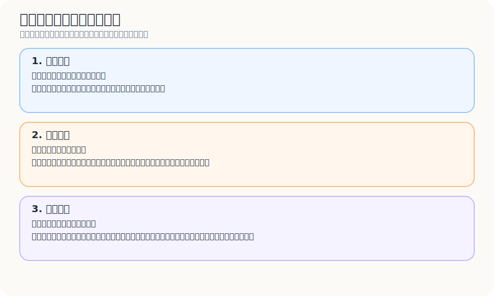
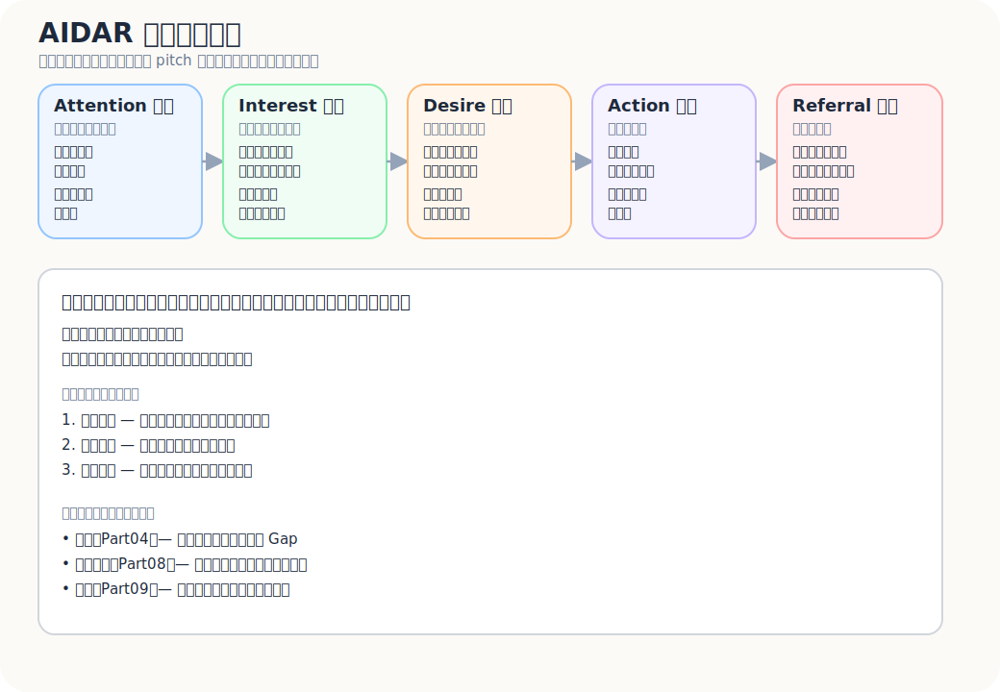
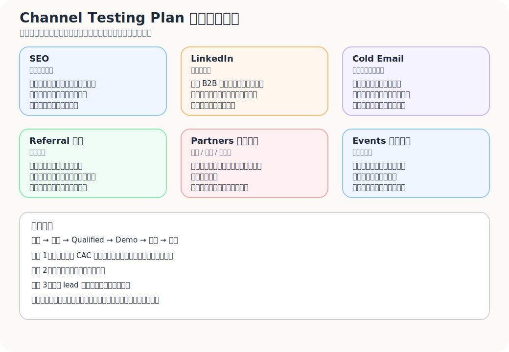
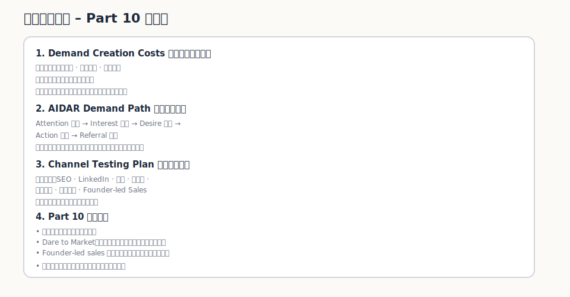

很多產品不是死於沒有價值。

而是死於沒有人理解價值,沒有人相信價值,沒有人此刻願意行動。

這三件事差很多。

顧客看不懂你在解什麼,叫理解成本。
顧客不相信你能做到,叫信任成本。
顧客覺得改變太麻煩,叫行動成本。

需求創造不是硬推銷。
需求創造是降低這三種成本。

產品做好,只代表你有一個可能有價值的東西。市場會不會理解、相信、採用,是另一場戰役。

---

## 產品做好,不代表市場會理解

做產品的人很容易以為,只要東西真的有價值,市場就會慢慢懂。

有時候會。

但大多數時候不會。

市場很忙。
顧客很忙。
採購者很忙。
使用者也很忙。

沒有人有義務替你理解你的產品。

所以 GTM / marketing / demand creation 的第一個工作,不是把產品說得更炫,而是把顧客腦中那段「我為什麼要在乎」補上。

獨立旅宿 loyalty alliance 如果只說:

> 我們是一個跨旅宿點數平台。

很多旅宿可能會想:

> 我已經有 OTA 了。
> 我也沒有時間做會員。
> 點數聽起來很麻煩。
> 這會不會得罪 OTA?
> 我的旅客真的會用嗎?

這不是顧客笨。

是你的訊息還沒有把問題、價值、風險、下一步講清楚。

---

## Demand Creation 的任務:降低三種成本

需求創造可以先拆成三種成本。

| 成本 | 意思 | 需要做什麼 |
|---|---|---|
| 理解成本 | 顧客看不懂你在解什麼 | 用清楚語言說明:誰、什麼問題、為什麼重要 |
| 信任成本 | 顧客不相信你能做到 | 用案例、證據、可信背書、低風險試點降低疑慮 |
| 行動成本 | 顧客覺得改變太麻煩 | 把下一步變小,降低導入成本、流程摩擦與決策壓力 |

很多行銷失敗,不是因為曝光不夠。

是這三種成本太高。

你讓顧客看見了,但他看不懂。
他看懂了,但不相信。
他相信了,但覺得太麻煩。

結果就是不動。

---

## Demand Creation 不是製造不存在的需求

需求創造這個詞很容易讓人誤解,好像是要把沒有需求的人說服到有需求。

這不是好的方向。

比較健康的 demand creation,是把前面幾篇已經找到的東西串起來:

- Part04 的痛點:他真的有重要且未滿足的 Gap
- Part08 的價值主張:你的解法能創造什麼價值
- Part09 的定位:你和替代方案相比,站在哪裡

也就是說,你不是憑空創造需求。

你是在幫顧客看見:

> 原來我一直忍受的問題,可以被重新理解。
> 原來有一種方式,比我現在的 workaround 更接近我想要的結果。
> 原來下一步不一定很重,可以先小規模測。

這才是需求創造。

---

## Dare to Market:上市前不是問能不能賣,而是問市場會不會動

進入市場前,不能只問「這個東西能不能賣」。更好的問法是:

> 這個市場有沒有足夠理由、足夠信任、足夠低的行動成本,讓顧客真的動起來?

可以用一張 Dare to Market 檢查表,把上市前最容易被跳過的問題攤開。

| 問題 | 為什麼重要 |
|---|---|
| Who is the new venture's customer? | 如果顧客不清楚,訊息和通路都會失焦 |
| What are the unmet needs? | 沒有未滿足需求,就沒有轉換理由 |
| How does the customer make decisions and buy this product or service? | 不懂決策流程,就很難設計 sales motion |
| To what degree is the product / service compelling for the customer? | 有價值不夠,還要足夠有吸引力 |
| How will the product / service be priced? | 價格是商業模式,不是最後貼標籤 |
| How will the venture reach all the identified customer segments? | 市場存在,不代表你碰得到 |
| How much does it cost to acquire a customer? | CAC 決定通路是否可持續 |
| How much does it cost to produce and deliver the product or service? | 交付成本會決定毛利與規模化 |
| How much does it cost to support a customer? | 客服、教育、導入會吃掉利潤 |
| How easy is it to retain a customer? | 留不住,就只能一直重新買顧客 |

這張表其實是在問同一件事:

> 顧客會不會真的從「知道」走到「採用」,而且你能不能承受這條路上的成本?

如果答案很模糊,先不要急著加大曝光。

先把市場會不會動這件事弄清楚。

---

## AIDA / AIDAR:每一段都要有不同任務

AIDA 是很老的行銷模型,但仍然有用,因為它提醒你:顧客不是看到一次訊息就行動。

可以把它延伸成 AIDAR:

| 階段 | 問題 |
|---|---|
| Attention | 如何讓顧客注意到? |
| Interest | 如何讓顧客覺得相關? |
| Desire | 如何讓顧客想要? |
| Action | 如何讓顧客行動? |
| Referral | 如何讓顧客推薦? |

獨立旅宿案例可以這樣看:

### Attention

先讓旅宿注意到問題:

> OTA 不只是抽成問題,也是顧客關係被平台留住的問題。

### Interest

讓他覺得相關:

> 如果你的回訪客、熟客、旅客偏好都沒有被系統性留下,你每一季都在重新買流量。

### Desire

讓他想要未來狀態:

> 你不一定要變成大型連鎖飯店,也可以用輕量方式開始累積自己的 direct guest relationship。

### Action

讓下一步很低成本:

> 先用 30 天 pilot,測旅客是否願意掃 QR 加入 benefits network,不需要 PMS integration。

### Referral

當他真的看到成效,再讓他推薦:

> 如果這套流程幫你收集到可觸達旅客名單,是否願意介紹一間同樣有淡季壓力的旅宿一起試?

每一段訊息不同。

不要用同一段 pitch 打所有階段。

---

## Demand Creation 五問:每一步都要問「為什麼會動」

AIDAR 不是只把顧客旅程切成五段。每一段都要回到一個更實際的問題:

> 我們要採取什麼作為?為什麼這個作為會讓顧客往下一步走?

可以這樣問:

1. 你要採取什麼作為,讓他注意到你?為什麼這個作為會讓人注意到你?
2. 你要採取什麼作為,讓他對你有興趣?為什麼這個作為會讓他對你有興趣?
3. 你要採取什麼作為,讓他對你產生渴望?為什麼這個作為會讓他產生渴望?
4. 你要採取什麼作為,讓他產生轉換行動?為什麼這個作為會讓他產生轉換行動?
5. 你要採取什麼作為,讓他產生推薦行為?為什麼這個作為會讓他產生推薦行為?

這五問很樸素,但很有用。

因為它會逼你不要只寫「我們要做內容行銷」「我們要做 cold email」「我們要經營社群」。那些只是作為。

真正要說清楚的是:這個作為為什麼能降低理解成本、信任成本或行動成本。

以獨立旅宿為例:

| 階段 | 作為 | 為什麼可能有效 |
|---|---|---|
| 注意 | 發一篇「OTA 依賴其實是顧客關係流失問題」的文章 | 它重新命名旅宿已經感受到但未必說清楚的痛 |
| 興趣 | 提供 direct guest relationship checklist | 讓旅宿把問題套回自己現況 |
| 渴望 | 展示 30 天 pilot 的低摩擦流程 | 讓未來狀態變得具體且可想像 |
| 行動 | 提供不用 PMS integration 的小規模試點 | 降低導入壓力與決策成本 |
| 推薦 | 用成效報告邀請旅宿介紹同類夥伴 | 讓推薦變成可理解、可轉述的故事 |

Demand creation 不是把顧客推下漏斗。

是讓每一步都有足夠理由往前。

---

## Messaging:把痛點、價值主張、定位接起來

一組好的 value message 至少要回答六件事:

1. 你在幫誰?
2. 解決什麼問題?
3. 現有方式哪裡不夠?
4. 你有什麼不同?
5. 顧客會得到什麼結果?
6. 採取下一步的成本有多低?

可以用這個結構:

> 對於【目標顧客】,
> 當他們在【情境】下遇到【痛點 / Gap】,
> 現有方式通常【不足之處】,
> 我們提供【解法】,
> 幫助他們得到【結果】,
> 而且可以先用【低風險下一步】驗證。

獨立旅宿版本:

> 對於想降低 OTA 依賴、但沒有能力導入大型會員系統的獨立旅宿,當他們在淡季前想建立更穩定的回訪與直訂來源時,現有方式通常不是太重、太碎,就是只能靠平台流量。我們提供一個輕量的跨旅宿 benefits pilot,幫助旅宿用低摩擦方式測試旅客是否願意留下可持續互動的資料,而且不需要一開始串 PMS。

這段不一定要直接放在官網。

但它是訊息骨架。

官網、LinkedIn、cold email、pitch deck、活動簡報,都可以從這裡改寫。

---

## 訊息要同時處理 What to do 和 What outcomes

定位與訊息設計可以拆成兩層:一層是你要做什麼,另一層是你希望在顧客心中產生什麼結果。

### What to do 做什麼

- 在目標顧客的心智中找到一個適當的位置。
- 設計公司的產品和形象，在目標顧客心智中占據那個適當的位置。

### 期望什麼結果

- 在目標顧客心中占據一個清楚、可辨識、而且有價值的位置。
- 讓目標顧客以一種合乎邏輯、也是你希望的方式去理解這個 offering。
- 說清楚這個品牌到底是什麼、它獨特在哪裡、它和競品有哪些相似與差異，以及顧客為什麼應該購買與使用。
- 引導品牌的商業與行銷活動 / 計畫往同一個方向收斂。

換成比較直白的說法:

> 訊息不是把產品介紹清楚而已。
> 訊息要替產品在顧客腦中找到一個有價值的位置。

如果顧客不知道你是什麼,他不會買。
如果顧客知道你是什麼,但不知道你和替代方案差在哪,他也不會買。
如果顧客知道差異,但不知道為什麼現在要動,他還是不會買。

訊息要連到定位。

不是只連到功能。

---

## Channel Testing:通路不是你在哪裡曝光

很多人做通路測試,會問:

> 我要在哪裡曝光?

這個問題太淺。

更好的問法是:

> 哪個通路能穩定找到有痛點、有決策權、有行動意願的人?

可以測的通路很多:

- SEO
- LinkedIn
- 社群
- 冷信
- 轉介紹
- 夥伴通路
- 線下活動
- 社群經營
- paid ads
- marketplace
- newsletter
- webinar
- founder-led sales

但不要用曝光量判斷通路。

要用行為漏斗判斷:

| 通路 | 先測什麼 | 好訊號 | 壞訊號 |
|---|---|---|---|
| SEO | 直訂 / OTA 依賴內容是否帶來搜尋流量 | 來的人有明確問題,願意下載工具或預約 | 流量有,但不符合 ICP |
| LinkedIn | 旅宿經營者 / 旅遊業者是否回應 | 有決策者回覆、願意聊 pilot | 只有泛泛按讚 |
| 冷信 | 清楚痛點訊息是否能打開對話 | 回覆、預約、轉介紹 | 開信有,回覆低 |
| 轉介紹 | 信任是否能被轉移 | 介紹後 conversion 明顯變高 | 介紹對象不符合 ICP |
| 夥伴通路 | 協會、CRM vendor、booking engine 是否願意合作 | 能接觸一群旅宿 | 夥伴有名單但不願推 |
| 線下活動 | 高脈絡場合是否更容易建立信任 | 活動後有深度對話 | 只有交換名片 |
| Founder-led sales | 創辦人親自溝通是否能學到訊號 | 快速理解 objection | 太依賴創辦人,難複製 |

好通路不是讓你看起來很多人知道。

好通路是能穩定帶來對的人。

---

## Sales Motion:B2B 不一定只有一種賣法

尤其 B2B,需求創造不能只看 marketing。

還要看 sales motion:顧客到底是自己買、被產品帶動、被業務教育、被夥伴轉介,還是先被社群長期建立信任?

不同 sales motion,其實是在處理不同成本。

| Sales Motion | 適合情境 | 主要降低什麼成本 |
|---|---|---|
| Self-serve | 顧客能自己理解、自己註冊、自己開始用 | 行動成本低,理解成本也低 |
| Product-led growth | 產品本身能驅動採用、擴散、升級 | 行動成本與擴散成本 |
| Sales-led | 需要業務教育、診斷、談判、導入 | 理解成本與信任成本 |
| Partner-led | 透過合作夥伴接觸與轉換顧客 | 信任成本與觸達成本 |
| Community-led | 透過社群、內容、信任累積帶動採用 | 長期理解成本與信任成本 |
| Founder-led sales | 早期由創辦人親自賣,以學習 objection 和決策邏輯 | 學習成本,尤其是市場不理解的地方 |

獨立旅宿 early stage 很可能要 founder-led + partner-led + community-led。

因為:

- 決策者不好找
- 信任很重要
- 旅宿怕被賣工具
- 需要先教育問題
- pilot 需要共創
- 案例需要慢慢累積

等訊息、流程、案例、pricing 比較成熟後,才可能逐步轉向更可複製的 sales-led 或 partner-led model。

---

## Founder-led sales 不是低級,是早期學習最快的方式

很多創辦人不喜歡賣。

但早期 B2B,創辦人親自賣不是因為沒有業務,而是因為你還不知道市場怎麼買。

你要親耳聽到:

- 顧客為什麼不懂
- 顧客為什麼不信
- 顧客為什麼覺得麻煩
- 顧客拿誰來比較
- 顧客真正的決策者是誰
- 顧客願意付錢前,還缺什麼證據

這些東西不能太早外包。

因為這些 objection 會回頭修正你的 positioning、messaging、pricing、product 和 onboarding。

早期 sales 不只是賣。

早期 sales 是另一種 discovery。

---

## 需求創造漏斗:從注意到行動

最後,把一條從 attention 到 action 的轉換路徑寫出來。

獨立旅宿案例可以是:

| 階段 | 訊息 | 通路 | 行動 |
|---|---|---|---|
| Attention | OTA 依賴不是抽成問題,而是顧客關係流失問題 | LinkedIn、文章、社群、活動 | 閱讀文章 / 留下興趣 |
| Interest | 獨立旅宿也可以用低摩擦方式開始累積 direct guest relationship | Webinar、案例、工具包 | 下載 checklist / 預約交流 |
| Desire | 30 天 pilot 可以不串 PMS,先測 QR + benefits 是否有效 | Demo、founder call、夥伴介紹 | 願意看 pilot proposal |
| Action | 小規模導入,測旅客掃碼、註冊、旅宿配合、回訪訊號 | Founder-led sales | 簽 pilot / 提供 benefits |
| Referral | 有初步結果後,邀請同類旅宿加入 | 成效報告、案例共同行銷 | 介紹其他旅宿 |

這張表的好處是,它讓 demand creation 不再是一團模糊的「行銷」。

每一段都有訊息、通路與下一步。

---

## 這一篇真正要留下來的東西

讀到這裡,至少要留下三個成果:

### 1. 一組 value message

回答:

- 幫誰?
- 解什麼問題?
- 現有方式哪裡不夠?
- 你有什麼不同?
- 顧客得到什麼結果?
- 下一步有多低風險?

### 2. 一張 channel testing plan

不要只列通路。

要寫清楚每個通路測什麼、看什麼訊號、如何判斷要不要繼續。

### 3. 一條從 attention 到 action 的轉換路徑

把 Attention、Interest、Desire、Action、Referral 串成一條能被測量的路。

產品做好只是開始。

需求創造真正要做的,是讓市場看懂、相信,並願意跨出下一步。

---
