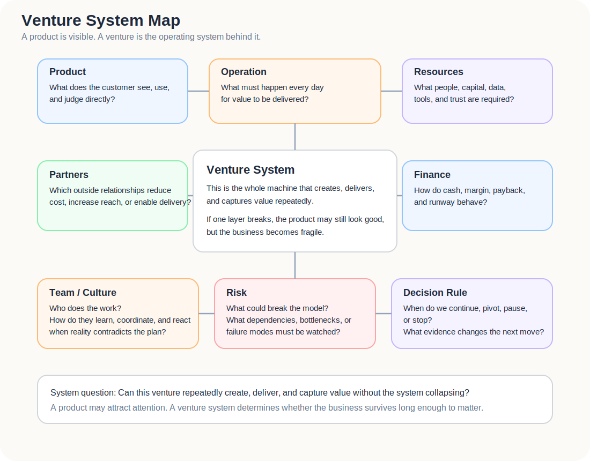
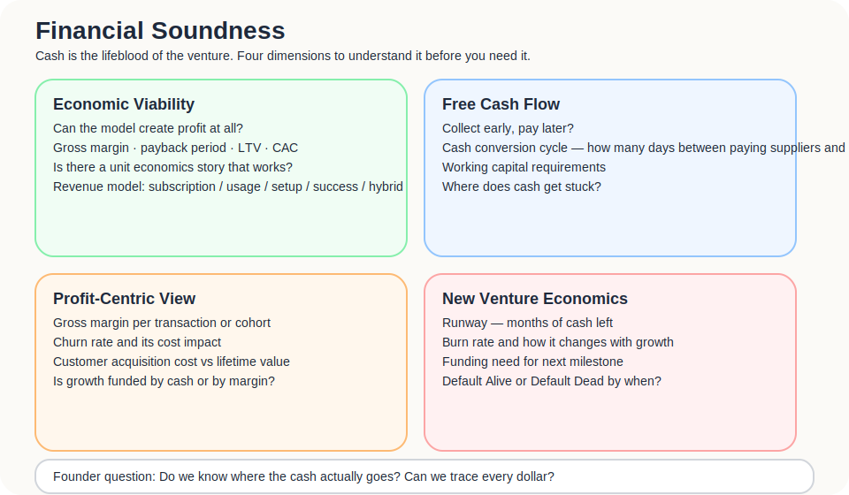
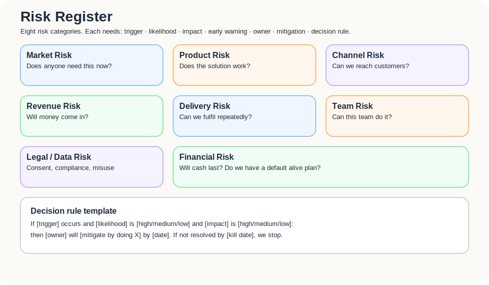
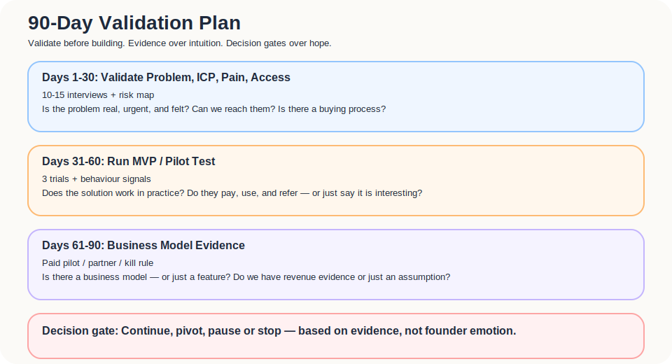

The product is the part customers see.

The venture is the system behind it that keeps the product alive.

A product can look beautiful.  
An MVP can show signal.  
A pitch can make people interested.

But if there is no system that can repeatedly create, deliver, and capture value, it is not yet a business. It is only something that may have a market.

This is where the series closes.

From Part01 to Part10, we moved through pain, situation, JTBD, Gap, early markets, MVPs, business models, positioning, and demand creation. The final question is not “what feature should we add?”

It is:

> Can this become a venture system that runs, survives, absorbs risk, and keeps learning?

This part pulls together operations, production system, resources, partners, team, culture, finance, risk, and kill criteria.

Not to make things heavier.

But because, in a real business, the product is only one component.

---

## A product is not a venture. A venture is a system.

The Business Model Canvas breaks a business model into nine building blocks, including key resources, key activities, key partners, revenue streams, and cost structure. At its core, it describes how an organisation creates, delivers, and captures value.

That matters.

It reminds us that a real venture is not a single product. It is a repeatable value system.

A simple distinction helps:

| Layer | Question |
|---|---|
| Product | What does the customer see and use? |
| Operation | What must happen every day for value to be delivered? |
| Resources | What assets are needed to support those activities? |
| Partners | Which external relationships make the model work? |
| Team / Culture | Who does the work, and how do they coordinate? |
| Finance | How do cash, cost, margin, payback, and runway behave? |
| Risk | What could break the system? |
| Decision Rule | When do we continue, pivot, pause, or stop? |

Talking only about the product makes everything feel cleaner.

Talking about the system shows the weight of the work.

---

## Key Activities: what must you do well every day?

The first question is: to deliver the value you claim, which key activities must keep happening?

These are not presentation verbs. They are the muscles of the venture.

They may include:

- sales;
- delivery;
- customer support;
- content;
- supplier management;
- data analysis;
- product development;
- quality control;
- compliance;
- partner management;
- brand building;
- supply chain management;
- community operations;
- performance reporting.

For an independent hotel loyalty alliance, key activities may include:

| Activity | Why it matters |
|---|---|
| Recruiting hotels | Without supply, traveller-side value is weak |
| Partner onboarding | Hotels must understand the process, and the front desk must be able to execute |
| Benefit design | Weak benefits will not move travellers |
| QR / registration flow maintenance | This is the low-friction data entry point |
| Guest data organisation | Dirty data cannot become useful follow-up |
| Performance reporting | Hotels need to see value before renewal or payment |
| Brand and trust building | Travellers and hotels need to believe the alliance |
| Compliance and consent management | Personal data, marketing permission, and data-use rights matter |

The test is simple:

> If nobody does this consistently, does the value proposition break?

If yes, it is a key activity.

---

## Key Resources: what must you have to deliver the value?

The second question is: to create and sustain the value you promise, which key resources must be secured?

Resources can be grouped like this:

| Resource type | Examples |
|---|---|
| Technical resources | Systems, product, database, tracking tools, AI / automation |
| Physical resources | Equipment, venue, hardware, logistics, display material |
| Data resources | Guest preferences, behaviour, hotel partner data, performance data |
| Intellectual resources | Brand, patents, copyright, know-how, content, process design |
| Human resources | Product, engineering, BD, operations, support, legal, data analysis |
| Financial resources | Runway, working capital, marketing budget, pilot cost |
| Distribution resources | Community, partners, associations, platforms, media, relationships |
| Trust resources | Case studies, endorsements, reviews, partner brands, founder credibility |
| Regulatory resources | Compliance readiness, licences, authorisations |
| Community resources | Early adopters, hotel networks, traveller community, partner ecosystem |

The handwritten notes split resources into physical resources, intellectual resources, and human resources. That is a useful foundation.

For early ventures, the most underestimated resources are often data, trust, distribution, and people.

Technology may not be the scarce resource.

Scarcity may be:

- who lets you enter their workflow;
- who allows you to handle their data;
- who introduces the next customer;
- who tries the product before it is polished.

---

## Key Partners: what should not be done alone?

The third question is: to secure key resources and execute key activities, which partners are required?

Ask:

- What kind of partnership is important for this venture?
- Who are the main suppliers?
- Who can provide specific resources or activities?
- Who can become a strategic ally or co-development partner?
- Which activities would be too slow, costly, or specialised to do alone?
- Which partners are so important that the model struggles without them?

For the independent hospitality case:

| Partner | What they may provide |
|---|---|
| Independent hotels | Supply, benefits, guest touchpoints, case studies |
| Booking engine / PMS / CRM vendors | Integration path, data flow, channel partnerships |
| Travel communities / media | Traveller-side reach, trust, content distribution |
| Local experience providers | Benefits, trip value, cross-referral |
| Accelerators / associations | Credibility, introductions, partner referrals |
| Legal / data protection advisers | Consent, data policy, risk control |
| BD or local-market partners | Market entry, language, local relationships |

A key partner is not simply a friendly connection.

The real question is:

> Does this partner reduce the cost of acquiring resources, building trust, reaching customers, or delivering value?

If not, it may be a good relationship, but not a key partnership.

---

## Production System: turning the value proposition into a deliverable process

Product development, design, manufacturing, supply chain, brand building. These may sound like manufacturing terms.

But SaaS, platforms, AI products, and travel services all have production systems.

They may not produce physical goods. They produce a repeatable result.

For a digital hotel alliance, the production system may include:

1. recruit and screen hotels;
2. build partner profiles;
3. design benefits;
4. generate QR / registration flows;
5. collect traveller consent;
6. organise guest data;
7. trigger communication or offers;
8. track behaviour and return visits;
9. generate performance reports;
10. renew, expand, or revise the partnership.

This can also be turned into a production-system checklist:

| Production System question | What to confirm |
|---|---|
| Product development | How does market learning become product improvement? |
| Design | Can customers and operators understand the flow? |
| Production / delivery | Can delivery be repeated consistently, instead of rescued manually each time? |
| Supply chain / partners | Which external resources would break value delivery if they disappeared? |
| Brand building | Can customers consistently understand and believe the value? |
| Quality control | What standard tells us that delivery was good enough? |
| Feedback loop | How do field problems return to product, process, and training? |

Every step can fail.

If hotel screening is weak, brand trust breaks.  
If benefits are weak, travellers will not join.  
If the front-desk flow is heavy, staff will not execute.  
If the data is messy, hotels will not trust the result.  
If reporting is unclear, the revenue model weakens.

A production system is not about doing the work once.

It asks:

> Can the work be done consistently enough that the value proposition becomes reality rather than story?

---

## Team / Culture: who can actually build this?

Startup conversations often obsess over “Why you?”

The question can become mystical, as though the founder has to prove they are the only person in the world who could do it.

A better question is:

> Why is this team closer than most people to the problem, better able to understand the customer, and more willing to endure this market’s long-term friction?

That is Founder-Market Fit.

Founder-Market Fit is not a shiny CV.

It includes:

- personal proximity to the problem;
- fluency in customer language;
- understanding of the industry;
- credible access to the market;
- ability to connect product, business, and operations;
- willingness to stay in a slow, messy, fragmented early market.

The team checklist is worth keeping blunt:

| Question | What it reveals |
|---|---|
| Where are the founders from? | Whether background connects to the opportunity |
| Where have they been educated? | Relevant training and thinking models |
| Where have they worked, and for whom? | Exposure to similar markets, customers, or systems |
| What have they accomplished professionally and personally? | Evidence of completing hard things |
| What is their reputation within the business community? | Trust and network base |
| What relevant experience do they have? | True proximity to the opportunity |
| What skills, abilities and knowledge do they have? | Whether the capability mix is enough |
| How realistic are they about success and tribulations? | Whether they see difficulty, not only vision |
| What else is needed on the team? | The missing pieces |
| Are they prepared to recruit high-quality people? | Willingness to strengthen, not merely endure |
| How will they respond to adversity? | Defensiveness or adjustment |
| Do they have the mettle to make hard choices? | Capacity for difficult decisions |
| How committed are they to this venture? | Whether commitment can survive friction |
| What are their motivations? | Whether the motive can sustain the long game |

Beyond the founders, the team also needs to ask who is missing, how to find them, and how they will work together.

| Question | What to examine |
|---|---|
| Core traits | What abilities and temperament does the venture need, based on its competitive logic? |
| Missing capabilities | Does the team lack product, engineering, sales, operations, legal, data, or industry relationships? |
| How to recognise them | What observable traits exist before training, such as learning speed, judgement, resilience, and communication style? |
| Recruiting actions | Should they be found through relationships, communities, advisors, partnerships, or early contractor work? |
| Working method | Once they join, how will ownership, reporting, decisions, and challenge happen? |
| Collaborative culture | What culture helps these people work together rather than in parallel? |

The early team does not need to be perfect.

It needs to know what it lacks and have a culture honest enough to address it.

---

## Culture is not a slogan. It is what happens when bad news arrives.

Culture is not the values written on the wall.

Culture is how the team reacts when evidence turns against it.

If market signals are weak, does the team make excuses or revise the hypothesis?  
If customers will not pay, does the team blame the customer or revisit the value proposition?  
If the front-desk workflow fails, does the team blame users or admit that action cost is too high?  
If someone is not the right fit, does the team delay or deal with it?

A venture-system culture needs:

- sensitivity to facts;
- humility towards assumptions;
- honesty about customers;
- refusal to dodge data;
- explicit risk ownership;
- clear responsibility;
- willingness to make hard decisions early enough.

This sounds less glamorous than “innovation” and “passion”.

It is more useful.

Startup culture is not about making everyone feel fired up.

It is about helping a team make clear decisions under uncertainty.

---

## Finance: cash is the lifeblood of the venture.

One line from the notes is worth enlarging:

> Cash is the lifeblood of the venture.

Startup finance does not need to become an accounting lecture. But founders cannot look only at revenue. They need to understand cash flow, cost structure, gross margin, payback, runway, and capital efficiency.

At minimum, ask:

1. What elements might affect the financial structure?
2. What is the revenue model? What is the cost structure?
3. How much initial investment is required? When can break-even be reached? When can it be recovered?
4. How much profit can the venture create?
5. When does the business need to buy resources, supplies, tools, or people?
6. When does the business have to pay for them?
7. How long does customer acquisition take?
8. How long before the customer pays?
9. How much capital equipment, system, or people are required to support one unit of sales?
10. Can the venture explain how it will achieve desired cash performance: buy low, sell high, collect early, pay late?

These questions do not make a startup timid.

They prevent the founder from ignoring cash leakage while the market still “feels promising”.

---

## Unit Economics: do not only look at revenue. Look at whether each unit is healthy.

Unit economics does not need to be deep here, but it must exist.

A business cannot only look at revenue.

It also needs to know:

- what it costs to acquire a customer;
- how long the customer stays;
- how much gross margin remains;
- how long payback takes;
- whether the model can be repeated;
- whether one more customer makes the business healthier or heavier.

A simple table is enough:

| Metric | Question |
|---|---|
| CAC | What does it cost to acquire one customer, including time, labour, ads, and BD? |
| LTV | How much gross profit can one customer produce over their lifetime? |
| Gross Margin | After direct delivery cost, how much remains? |
| Payback Period | How long before acquisition cost is recovered? |
| Contribution Margin | Does each additional customer add profit? |
| Churn | Why do customers leave, and when? |
| Retention | Which customers stay, and why? |
| Scalability | If customer count grows tenfold, does cost also grow nearly tenfold? |

In the independent hotel case, the danger is often labour cost.

If every hotel requires bespoke onboarding, manual training, and hand-made reporting, while the monthly fee is low, the business may be closer to consulting than SaaS.

That may be acceptable.

But it has to be known.

You need to know whether you are building a platform, SaaS, service, consultancy, or hybrid model. Their unit economics differ completely.

---

## Runway, Default Alive / Default Dead: cash will make decisions for you.

The basic runway formula is simple:

> cash balance ÷ monthly net burn = months of runway

But the deeper question is not only how many months remain. It is whether, on the current growth, revenue, and cost trajectory, the company reaches break-even before cash runs out.

This is the idea behind Paul Graham’s widely cited default alive / default dead framing:

- **Default alive**: under the current trajectory, the company can reach survival without needing another financing event.
- **Default dead**: without funding, a major customer, radical cost cuts, or some external change, the company runs out of money first.

Cold, but useful.

It forces the founder to ask:

- When must fundraising begin?
- When must costs be reduced?
- When is it dangerous to keep investing in slow product work?
- When does revenue learning matter more than feature roadmap?

Founders do not need to panic every day.

They need to know where cash ends, and what must be true before that date.

---

## Moat / Defensibility: you may not have a moat yet, but you should know where one might come from.

Early startups should not hallucinate a moat too soon.

But they should not ignore defensibility either.

If a model can be copied the moment it is visible, capturing value long-term may be difficult.

Common sources of defensibility include:

| Source | Meaning |
|---|---|
| Data | Proprietary usage, preference, behaviour, or performance data |
| Network effects | More users or suppliers make the whole system more valuable |
| Brand | Trust, emotional association, professional credibility |
| Supply-side relationships | Exclusive or high-trust partner networks |
| Process know-how | Others can see the result but not the operating detail |
| Switching cost | The more customers use it, the harder it becomes to leave |
| Regulatory advantage | Licences, compliance maturity, authorisation barriers |
| Distribution advantage | Lower-cost or higher-trust customer access |
| Community | Participation, identity, and member relationships |

For an independent hotel loyalty alliance, the future moat may not be the technology itself.

It may come from:

- more hotels making traveller benefits more useful;
- more travellers making hotels more willing to join;
- accumulated cross-property preference and behaviour data;
- a trusted independent-stay brand;
- partner onboarding and benefit-design know-how;
- switching cost after hotels embed the workflow;
- trust built through compliance, consent, and data governance.

A moat is not usually a wall that exists on day one.

It is terrain carved over time.

---

## Ethics / Legal / Data Risk: data products cannot only ask whether something is technically possible.

Many products today, especially in AI, travel, finance, health, and data platforms, cannot ignore ethics, legal risk, and data governance.

This is not only a big-company concern.

It should be considered early.

Especially when the product touches:

- personal data;
- consent;
- data ownership;
- compliance;
- platform dependency;
- misleading marketing;
- automated decision-making;
- AI recommendations;
- cross-border data flows;
- third-party data use.

Do not only ask whether the technology can do it.

Ask:

| Risk | Question |
|---|---|
| Personal data | What personal data is collected, and is it necessary? |
| Consent | Do users understand how data is collected, used, and disclosed? |
| Data ownership | Who owns or controls the data: traveller, hotel, or platform? |
| Purpose limitation | Is data used beyond the purpose the user agreed to? |
| Security | How is data stored, accessed, deleted, and backed up? |
| AI / automation | Could recommendations or automated decisions become unfair, misleading, or unexplained? |
| Platform dependency | What happens if an OTA, social platform, or payment platform changes rules? |
| Misleading marketing | Are performance claims over-promised? |

Singapore’s PDPA generally expects organisations to obtain consent and inform individuals of the purpose for collecting, using, or disclosing personal data. GDPR consent principles also emphasise that consent should be freely given, informed, specific, explicit, clear, and withdrawable. AI products can also use frameworks such as the NIST AI Risk Management Framework to consider safety, security, accountability, transparency, privacy, and fairness during design and operation.

The short version:

> If data is a source of value, it is also a source of risk.

Do not wait until the product is large before designing for it.

By then, the fix is usually more expensive.

---

## Risk Register: write risks down rather than feeling them vaguely.

Risk management is not pessimism.

It is saying the dangerous things early.

A basic Risk Register can look like this:

| Risk | Question | Early warning | Mitigation |
|---|---|---|---|
| Market Risk | Does the market truly need this? | Many interviews, but nobody agrees to try | Redefine ICP / pain |
| Product Risk | Does the solution work? | Use does not improve behaviour or outcome | Change MVP, narrow the use case |
| Channel Risk | Can customers be reached? | Exposure exists, but qualified leads are rare | Change channel or messaging |
| Revenue Risk | Can money be collected? | People trial but do not pay | Change pricing or value proposition |
| Delivery Risk | Can delivery be repeated? | Every customer needs high customisation | Standardise process or narrow promise |
| Team Risk | Is the team capable enough? | Key activities have no owner | Hire, outsource, or cut scope |
| Legal / Data Risk | Are there compliance or data issues? | Consent is vague; data purpose unclear | Add policy, DPO, data process |
| Competitive Risk | Can this be replaced easily? | Current tools are good enough | Strengthen differentiation and switching cost |
| Financial Risk | Will cash last? | Runway falls below safe level | Cut costs, increase revenue, fundraise, or stop |

A risk table should not only say “this might happen”.

It should say:

- what signal shows the risk is appearing;
- who owns it;
- what action will be taken;
- when a decision must be made.

---

## Progress, milestones, and a 90-day validation plan

Early ventures should not only write vision.

They should write what must be validated in the next 90 days.

The progress questions are simple:

1. To build the initial foundation, what are the key work points over the next year? What actions will be taken?
2. What actions are required to complete these milestones?
3. What results should be visible in six months? What results should be visible in twelve months?

For execution, compress this into a 90-day validation plan.

### Days 1–30: problem and customer validation

Goals:

- complete 10–15 meaningful interviews;
- confirm ICP;
- identify top 3 pains / bottlenecks;
- create initial risk register;
- draft value proposition.

### Days 31–60: MVP / pilot validation

Goals:

- find 3 trial or pilot candidates;
- run a low-cost MVP;
- record behavioural signals, not only opinions;
- maintain a learning logbook;
- revise solution, onboarding, and messaging.

### Days 61–90: business model and stop-loss decision

Goals:

- secure 1 paid pilot or clear payment commitment;
- validate at least one viable channel;
- estimate early CAC, onboarding cost, and delivery burden;
- update unit economics assumptions;
- make a continue / pivot / stop decision.

The goal of 90 days is not to make the company large.

It is to avoid still saying, three months later, “I think this has potential.”

But 90 days is only the first validation cycle. A venture system also needs a six-month and twelve-month view.

| Timeframe | What should be visible |
|---|---|
| 90 days | Initial evidence on problem, ICP, MVP, and willingness to pay |
| 6 months | Repeatable pilots, an early channel, delivery process, risk list, and early revenue signal |
| 12 months | Revenue model, retention, partners, unit economics, team capability, and a path to scale |

90 days asks: is this hypothesis still worth pursuing?  
Six months asks: can the delivery begin to repeat?  
Twelve months asks: can this become a real venture?

---

## Kill Criteria: a mature method teaches not only persistence, but stopping.

Startup culture often praises persistence.

But persistence without evidence may only be sunk cost wearing a heroic costume.

That is why the final piece is Kill Criteria.

Not to make quitting easy.

To stop the founder from endlessly rationalising a broken hypothesis.

A simple version:

| Type | Continue | Pivot | Stop / Kill |
|---|---|---|---|
| Customer Discovery | 10–15 interviews, with at least 7 describing the same pain clearly | Pain exists, but ICP is different | Many interviews, but pain remains vague and inactive |
| Trial Commitment | 3+ trial / pilot commitments | Willingness exists, but use case or value needs change | Nobody gives data, time, or workflow access |
| Revenue Signal | 1 paid pilot or clear payment commitment | Willingness to pay exists, but pricing or buyer needs change | People like it, but nobody pays |
| Channel Signal | At least one channel produces qualified leads | Traffic exists, but wrong audience | Multiple channels fail to find the right people |
| Delivery Feasibility | MVP can be delivered manually or with lightweight tools | Delivery works but is too heavy; scope must shrink | Each delivery is bespoke and cost is uncontrollable |
| Team Capacity | Key activities have owners and movement | Skills gap can be filled | Key activities remain ownerless |
| Legal / Data | Consent, purpose, storage, and deletion are reasonably clear | Risk exists but can be designed around | Core model depends on high-risk or non-compliant data use |

For example:

> If within three months we cannot secure 10 meaningful interviews, 3 trial commitments, and 1 paid pilot, the current hypothesis must be rewritten.

This is not a declaration of failure.

It is a rule against self-deception.

---

## Sustainability and Influence: what outside forces can change the venture?

Finally, pull the view back out.

A venture is not shaped only by its own effort.

It may be affected by:

- new products;
- new developments;
- new markets;
- new customers;
- new needs;
- new entrants;
- exiting players;
- national policy;
- economic trends;
- platform rules;
- technological change;
- travel behaviour;
- legal and data governance shifts.

The important reminder is:

> identify the factors that could have positive or negative influence on the venture.

Some external changes help you.  
Some hurt you.  
Some make a slow market accelerate.  
Some make a previously sensible business model dangerous overnight.

For independent hotels:

- OTA policy changes may increase hotel anxiety;
- privacy regulations may raise the cost of data handling;
- AI search and travel planning tools may change how travellers discover accommodation;
- payment and cross-border travel shifts may change traveller behaviour;
- labour shortages may make low-friction tools more valuable;
- if a large platform launches a similar feature, the space may narrow.

Strategy is not predicting the future.

It is knowing which external changes deserve monitoring.

---

## Essence: return to the core of the venture

After all the tools, return to the basic questions:

- In what situation does this venture make sense?
- Who is it helping complete what important job?
- Which important Gap does it dissolve?
- What value does it provide?
- Which activities, resources, partners, and capabilities are required?
- Can it be delivered consistently?
- Can it charge reasonably?
- Can it absorb risk?
- Is the team fit enough to face this market for long enough?
- If the evidence does not hold, when should the work stop?

This can become a final Essence checklist:

| Essence check | Question |
|---|---|
| Actor | Who is stuck in a specific situation? |
| Important job | What important job are they trying to complete? |
| Feeling and current state | What do they feel, what is happening, and what are they already doing? |
| Cost and consequence | What cost are they paying because of the problem? |
| Problem essence | What is the real problem beneath the surface issue? |
| Core bottleneck | Which bottleneck keeps the problem alive? |
| Solution direction | What could dissolve that bottleneck? |
| Value creation | What value is created, and what meaning does it open? |
| Venture system | Which activities, resources, partners, team, finance, and processes are required? |
| Sustainability and risk | What keeps it going? What could break it? |
| Decision criteria | What signals mean continue, pivot, or stop? |

From pain to venture is not a journey from idea to product.

It is more like peeling away illusion layer by layer.

At the end, what remains should not be a slogan.

It should be a venture system that can be tested.

## What this part should leave behind

By the end, four outputs should be clear.

### 1. A Venture System Map

Including:

- value proposition;
- key activities;
- key resources;
- key partners;
- team / culture;
- finance;
- risk;
- decision rule.

### 2. A Risk Register

At minimum:

- market risk;
- product risk;
- channel risk;
- revenue risk;
- delivery risk;
- team risk;
- legal / data risk;
- competitive risk;
- financial risk.

### 3. A 90-day validation plan

Split into:

- Days 1–30: problem and customer validation;
- Days 31–60: MVP / pilot validation;
- Days 61–90: business model and stop-loss decision.

### 4. Continue / Pivot / Stop criteria

Define what counts as worth continuing, what requires a pivot, and what should be stopped.

Do not let emotion interpret the evidence on Day 90.

Startups need belief.

But belief should be protected by systems and constrained by evidence.

Otherwise it becomes self-hypnosis.
