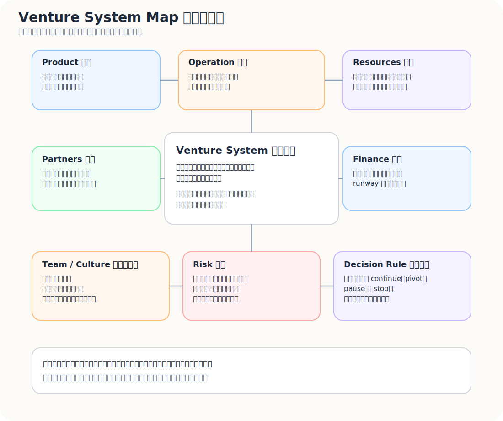
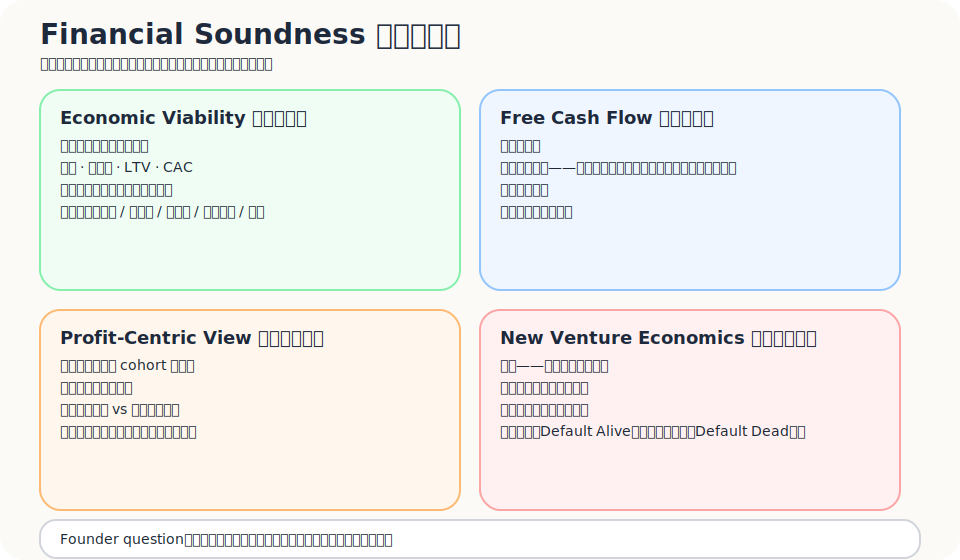
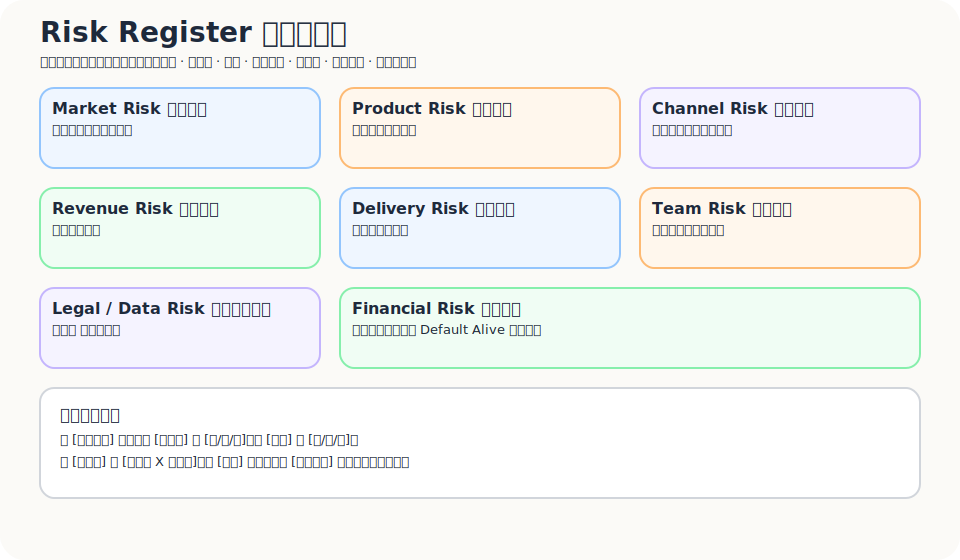
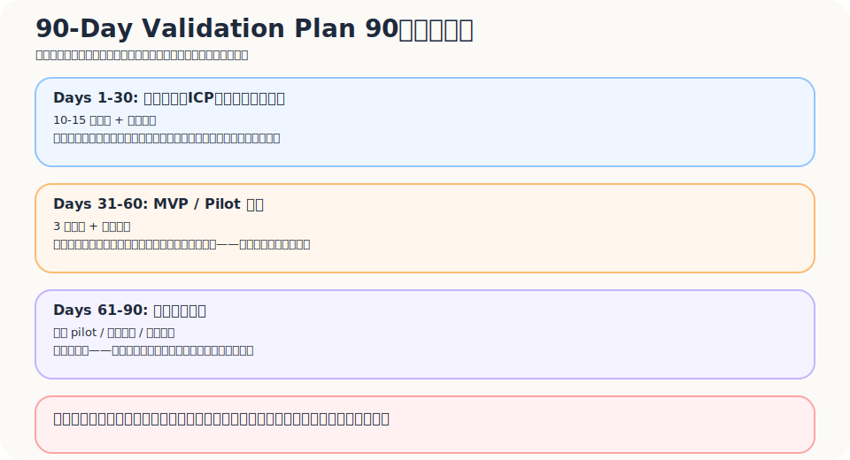
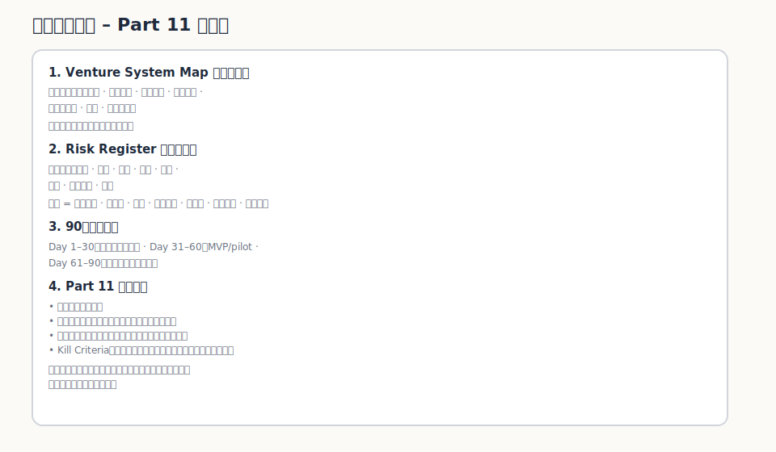

產品是顧客看見的部分。

事業是顧客看不見、但每天都在撐住產品的那套系統。

一個產品可以很漂亮。  
一個 MVP 可以有訊號。  
一段 pitch 可以讓人興奮。  

但如果背後沒有穩定創造、交付、捕獲價值的系統，它就還不是一個事業。它只是「一個可能有市場的東西」。

這是整個系列最後要收束的地方。

從 Part01 到 Part10，我們一路從痛點、情境、JTBD、Gap、早期市場、MVP、商業模式、市場定位、需求創造走到這裡。最後一題不是「產品還可以加什麼功能」，而是：

> 這件事能不能成為一套跑得動、活得下去、承受得住風險，而且能持續學習的事業系統？

這一篇會把 operation、production system、resources、partners、team、culture、finance、risk、kill criteria 全部收在一起。

不是為了把事情弄得更沉重。

而是因為創業到最後，產品只是其中一個零件。

---

## 產品不是事業，事業是一套系統

Business Model Canvas 把商業模式拆成九個 building blocks，其中包含 key resources、key activities、key partners、revenue streams、cost structure 等元素；它本質上是在描述一個組織如何創造、交付並捕獲價值。

這句話很重要。

因為它提醒你：真正的事業不是單一產品，而是一套可以重複運作的價值系統。

可以先用一個簡單區分：

| 層次 | 問題 |
|---|---|
| Product | 顧客看見什麼？使用什麼？ |
| Operation | 每天要做哪些事，才交付得出來？ |
| Resources | 需要哪些資源，才撐得起這些事？ |
| Partners | 哪些外部合作讓模式跑得動？ |
| Team / Culture | 誰來做？用什麼方式協同？ |
| Finance | 現金、成本、毛利、回本怎麼運作？ |
| Risk | 哪些東西會讓整套系統斷掉？ |
| Decision Rule | 什麼時候 continue、pivot、pause、stop？ |

只談產品，容易樂觀。  
談系統，才會看見重量。

---

## Key Activities：你每天必須做好哪些事？

第一個問題是：為了傳遞你主張的價值，必須持續進行哪些關鍵活動？

這些活動不是簡報上的動詞，而是事業每天要付出的肌肉。

可能包括：

- 銷售
- 交付
- 客服
- 內容
- 供應商管理
- 資料分析
- 產品開發
- 品質控管
- 合規
- 合作夥伴維護
- 品牌營造
- 供應鏈管理
- 社群經營
- 成效回報

用獨立旅宿 loyalty alliance 來看，key activities 可能是：

| 活動 | 為什麼重要 |
|---|---|
| 旅宿招募 | 沒有足夠供給，旅客端價值不足 |
| Partner onboarding | 旅宿要理解流程，前台要做得到 |
| Benefits 設計 | benefits 太弱，旅客不會加入 |
| QR / 註冊流程維護 | 這是低摩擦資料收集的入口 |
| 旅客資料整理 | 資料不乾淨，就無法形成後續互動 |
| 成效報告 | 旅宿要看到價值，才會續約或付費 |
| 品牌與信任建立 | 旅客與旅宿都需要相信這個 alliance |
| 合規與 consent 管理 | 牽涉個資、行銷同意、資料使用權 |

Key Activities 的檢查方式很簡單：

> 如果這件事沒有人每天穩定做，價值主張會不會斷掉？

如果會，它就是 key activity。

---

## Key Resources：你需要什麼資源才能交付價值？

第二個問題是：為了取得並維持你主張的價值，必須取得哪些關鍵資源？

資源可以分成幾類。

| 資源類型 | 例子 |
|---|---|
| 技術資源 | 系統、產品、資料庫、追蹤工具、AI / automation |
| 實體資源 | 設備、場地、硬體、物流、展示材料 |
| 資料資源 | 旅客偏好、行為資料、合作旅宿資料、成效資料 |
| 智慧資源 | 品牌、專利、版權、know-how、內容、流程設計 |
| 人力資源 | 產品、工程、BD、營運、客服、法務、資料分析 |
| 資金資源 | runway、營運現金、行銷預算、pilot 成本 |
| 通路資源 | 社群、合作夥伴、協會、平台、媒體、人脈 |
| 信任資源 | 案例、背書、評價、合作品牌、創辦人信用 |
| 法規資格 | 個資合規、授權、產業必要資格 |
| 社群資源 | early adopters、旅宿圈、旅人社群、合作網絡 |

資源可以再拆得更直接：

- 實體資源：製造設備、建築物、系統、配銷通路等
- 智慧資源：品牌、專利、智慧財產權、版權等
- 人力資源：人才

對早期創業來說，最常被低估的是資料、信任、通路與人力。

技術有時候不是最稀缺的資源。

最稀缺的可能是：

- 誰願意讓你進入他的工作流程
- 誰願意把資料交給你處理
- 誰願意介紹下一個顧客
- 誰願意在你還不完整時先試

---

## Key Partners：哪些事不該自己做？

第三個問題是：為了穩定取得關鍵資源、執行關鍵活動，需要哪些合作夥伴？

這裡有幾個很實際的問題：

- 什麼樣的合作夥伴關係對這個事業很重要？
- 誰是你的主要供應商？
- 誰可能提供你特定資源或執行特定活動？
- 誰可能成為你的合作夥伴，和你形成策略聯盟共同開發？
- 哪些事情自己做太慢、太貴、太不專業？
- 哪些伙伴如果不合作，模式就跑不起來？

獨立旅宿案例可以這樣拆：

| 合作對象 | 可能提供什麼 |
|---|---|
| 獨立旅宿 | 供給端、benefits、旅客接觸點、案例 |
| Booking engine / PMS / CRM vendor | 整合入口、資料流、通路合作 |
| 旅遊社群 / 媒體 | 旅客端觸達、信任、內容分發 |
| 在地體驗商家 | benefits、旅程價值、交叉推薦 |
| 加速器 / 協會 | 背書、導入機會、partner referral |
| 法務 / 資料保護顧問 | consent、data policy、風險控管 |
| 顧問 / BD 合作方 | 市場進入、語言與在地關係 |

Key Partners 的重點不是「能合作就好」。

而是要問：

> 這個伙伴能不能降低我們取得資源、建立信任、打開通路、完成交付的成本？

如果不能，它可能只是友好關係，不是關鍵合作。

---

## Production System：把價值主張變成可交付流程

產品開發、設計、生產、供應鏈、品牌營造，聽起來像傳統製造業語言。

但 SaaS、平台、AI 產品、旅遊服務一樣有 production system。

只是生產的不是一個實體商品，而是一種被穩定交付的結果。

對一個數位旅宿 alliance 來說，production system 可能包含：

1. 招募與審核旅宿
2. 建立 partner profile
3. 設計 benefits
4. 產生 QR / registration flow
5. 收集旅客 consent
6. 整理旅客資料
7. 觸發溝通或優惠
8. 追蹤行為與回訪
9. 產生成效報告
10. 進行續約或擴張

也可以把 production system 拆成一張檢核表：

| Production System 問題 | 要確認什麼 |
|---|---|
| 產品開發 | 我們如何持續把市場學習轉成產品改進？ |
| 設計 | 使用流程是否讓顧客與操作人員都能理解？ |
| 生產 / 交付 | 每次交付是否能穩定重複，而不是靠臨場補救？ |
| 供應鏈 / 伙伴 | 哪些外部資源如果斷掉，價值就交付不出來？ |
| 品牌營造 | 顧客是否能穩定理解並相信我們的價值？ |
| 品質控管 | 什麼標準代表「這次交付是合格的」？ |
| 回饋迴路 | 現場學到的問題，如何回到產品、流程與訓練裡？ |

每一步都可能出錯。

如果旅宿審核不穩，品牌信任會壞。  
如果 benefits 設計太弱，旅客不會加入。  
如果前台流程太重，現場不會執行。  
如果資料整理不好，旅宿不會相信成效。  
如果報告說不清楚，收入模式會斷。

Production System 的問題不是「能不能做一次」。

而是：

> 能不能每次都做得夠穩，讓價值主張不只是故事，而是被交付的現實？

---

## Team / Culture：誰能把這件事做成？

很多創業討論很愛問：Why you?

這題容易被講得很玄。

好像創辦人要證明自己是全世界唯一能做的人。

其實更好的問法不是「為什麼只有我能做」，而是：

> 為什麼這個團隊比多數人更接近這個問題、更理解這群人、更願意承受這個市場的長期摩擦？

這就是 Founder-Market Fit。

Founder-Market Fit 不是履歷漂亮而已。

它包含：

- 是否親身接近這個問題
- 是否懂顧客語言
- 是否理解產業運作
- 是否擁有可信切入點
- 是否有能力把產品、商業、營運串起來
- 是否願意在很慢、很髒、很碎的早期市場裡待夠久

創業團隊檢查可以很直接，不必只看頭銜或履歷：

| 問題 | 要看什麼 |
|---|---|
| Where are the founders from? | 背景是否和機會有關 |
| Where have they been educated? | 是否有相關訓練與思考框架 |
| Where have they worked, and for whom? | 是否接觸過類似市場、顧客或系統 |
| What have they accomplished professionally and personally? | 是否有完成困難任務的紀錄 |
| What is their reputation within the business community? | 是否有信任與人脈基礎 |
| What relevant experience do they have? | 是否真的接近這個機會 |
| What skills, abilities and knowledge do they have? | 能力組合是否足夠 |
| How realistic are they about success and tribulations? | 是否看得見困難，而不是只看願景 |
| What else is needed on the team? | 缺口是什麼 |
| Are they prepared to recruit high-quality people? | 是否願意補強，而不是硬撐 |
| How will they respond to adversity? | 遇到壞訊號時會防衛還是調整 |
| Do they have the mettle to make hard choices? | 是否有做艱難決策的韌性 |
| How committed are they to this venture? | 承諾是否足以撐過摩擦 |
| What are their motivations? | 動機是否能支撐長期 |

除了看創辦人，也要看「缺誰、怎麼找、怎麼讓他們一起工作」。

| 問題 | 要看什麼 |
|---|---|
| 核心特質 | 從競爭力推回來，團隊最需要什麼能力與性格？ |
| 必要缺口 | 現有團隊缺產品、技術、銷售、營運、法務、資料，還是產業人脈？ |
| 辨識方式 | 這些人訓練前會有哪些可觀察的特質？例如學習速度、判斷力、抗壓性、溝通方式 |
| 招募作為 | 要透過人脈、社群、顧問、合作案，還是早期 advisor 找？ |
| 合作方式 | 這些人加入後，如何分工、回報、決策、互相挑戰？ |
| 協同文化 | 需要什麼文化讓這些人能一起工作，而不是各做各的？ |

早期團隊最重要的，不是每個能力都滿分。

而是知道自己缺什麼，並且有誠實面對缺口的文化。

---

## 組織文化不是口號，是決策時會發生的事

文化不是牆上的價值觀。

文化是壞消息出現時，團隊怎麼反應。

如果市場訊號不好，團隊會找藉口，還是改假設？  
如果客戶不付錢，團隊會說客戶不懂，還是重看 value proposition？  
如果前台流程跑不起來，團隊會怪使用者，還是承認 action cost 太高？  
如果某個人能力不合適，團隊會拖延，還是處理？

一個能跑事業系統的文化，至少需要：

- 對事實敏感
- 對假設謙卑
- 對顧客誠實
- 對數據不逃避
- 對風險先講清楚
- 對責任有 owner
- 對困難決策不拖太久

這聽起來沒有「創新」「熱情」那麼漂亮。

但它比較有用。

創業文化不是讓大家感覺很燃。

創業文化是讓團隊在不確定裡還能做出清楚決策。

---

## Finance：Cash is the lifeblood of the venture

有一句話很適合放在創業財務最前面：

> Cash is the lifeblood of the venture.

這句話值得放大。

創業財務不用一開始就寫成會計課，但創辦人不能只看 revenue。還要看現金流、成本結構、毛利、回本、runway、資金使用效率。

最基本要問：

1. 可能涉及財務結構的因素有哪些？
2. 收入模式是什麼？成本結構是什麼？
3. 初期投資要多少錢？什麼時候 break-even？什麼時候回收？
4. 整個事業能創造多大利潤？
5. 什麼時候要買資源、人力、原料、工具？
6. 什麼時候要付錢？
7. 取得顧客要多久？
8. 顧客多久後才會付款？
9. 支撐一塊錢 sales，需要多少設備、系統、人力或資本？
10. 能否說清楚如何達到想要的現金表現：buy low, sell high, collect early, pay late？

這些問題不是為了讓創業變保守。

是為了避免在「感覺有市場」的時候，忽略現金早就漏光。

---

## Unit Economics：不要只看 revenue，要看每一單是不是健康

Unit Economics 不用在這篇講得很深，但一定要有。

因為一個事業不能只看收入。

還要看：

- 取得一個客戶要多少錢
- 客戶留住多久
- 毛利多少
- 多久回本
- 能不能複製
- 每多服務一個顧客，是更賺還是更累

可以用這張簡表：

| 指標 | 問題 |
|---|---|
| CAC | 取得一個客戶要多少成本？包含時間、人力、廣告、BD |
| LTV | 一個客戶整個生命週期能帶來多少毛利？ |
| Gross Margin | 扣掉直接交付成本後，還剩多少？ |
| Payback Period | 取得客戶成本多久能回收？ |
| Contribution Margin | 每多一個顧客是否真的增加利潤？ |
| Churn | 顧客為什麼流失？什麼時候流失？ |
| Retention | 哪些顧客留下？留下的原因是什麼？ |
| Scalability | 多服務十倍顧客時，成本會不會也接近十倍？ |

獨立旅宿案例裡，最容易出問題的地方是人工成本。

如果每簽一間旅宿都需要大量客製化 onboarding、人工教學、手動報告，月費又收不高，那 business 可能不是 SaaS，而是服務型顧問。

這不一定錯。

但要誠實。

你要知道自己做的是平台、SaaS、服務、顧問，還是 hybrid。不同模型的 unit economics 完全不同。

---

## Runway、Default Alive / Default Dead：現金會替你做決定

Runway 的基本算法很簡單：

> Cash balance ÷ monthly net burn = months of runway

但真正要看的不只是還能活幾個月，而是：按照現在的成長、收入與成本曲線，你會不會在現金耗盡前走到 break-even。

這就是 Paul Graham 常被引用的 default alive / default dead 概念：

- **Default alive**：照目前趨勢，不靠下一輪募資也能走到能活下去的位置。
- **Default dead**：如果沒有募資、重大客戶、劇烈成本削減或其他外部變化，公司會先沒錢。

這個概念很冷。

但很有用。

因為它會逼你看清楚：

- 什麼時候必須 fundraising？
- 什麼時候必須降成本？
- 什麼時候不能再做大而慢的產品投資？
- 什麼時候 revenue learning 比 feature roadmap 更重要？

創業者不需要每天恐慌。

但需要知道現金會在哪裡結束，以及在那之前要完成什麼。

---

## Moat / Defensibility：早期不一定有護城河，但要知道未來可能從哪裡來

早期創業不要太早幻想護城河。

但也不能完全不想。

因為如果一個模式只要被看見就能被複製，那它可能很難長期捕獲價值。

常見的 defensibility 來源包括：

| 來源 | 說明 |
|---|---|
| 資料 | 隨使用累積的專有資料、偏好、行為、成效紀錄 |
| 網路效應 | 使用者或供給方增加時，整體價值提高 |
| 品牌 | 顧客信任、情感連結、專業形象 |
| 供應端關係 | 獨家或高信任合作網絡 |
| 流程 know-how | 別人看得見結果，但複製不了細節 |
| Switching cost | 顧客越用越難換 |
| Regulatory advantage | 法規資格、合規能力、授權門檻 |
| Distribution advantage | 更低成本、更高信任的顧客觸達 |
| Community | 社群關係、參與感、共同身份 |

獨立旅宿 loyalty alliance 的未來護城河可能不是技術本身。

而是：

- 越多旅宿加入，旅客 benefits 越有感
- 越多旅客加入，旅宿越有理由加入
- 累積跨旅宿偏好與行為資料
- 建立獨立旅宿可信品牌
- 形成 partner onboarding 與 benefits 設計 know-how
- 讓旅宿投入流程後產生 switching cost
- 透過合規、consent、data governance 建立信任

護城河不是一開始就有的牆。

比較像慢慢挖出的地形。

---

## Ethics / Legal / Data Risk：資料產品不能只問能不能做

現在很多產品，尤其 AI、旅遊、金融、健康、資料平台，都不能忽略倫理、法律與資料風險。

這不是大公司才需要想。

早期就要想。

尤其當你的產品涉及：

- 個資
- consent
- data ownership
- 合規
- 平台依賴
- 誤導性行銷
- 自動化決策
- AI 推薦
- 跨境資料流
- 第三方合作資料使用

就不能只問「技術上能不能做」。

還要問：

| 風險 | 要問什麼 |
|---|---|
| 個資 | 我們收集了哪些個人資料？是否必要？ |
| Consent | 使用者是否清楚知道資料會被如何收集、使用、揭露？ |
| Data ownership | 資料屬於誰？旅宿、旅客、平台之間權利怎麼界定？ |
| 用途限制 | 資料是否被拿去做使用者未同意的用途？ |
| 安全 | 資料如何保存、限制存取、刪除、備份？ |
| AI / 自動化 | 推薦或自動化決策是否可能造成不公平、誤導或不可解釋結果？ |
| 平台依賴 | 如果 OTA、社群平台、支付平台改規則，模式是否會受傷？ |
| 誤導性行銷 | 對顧客承諾的成效是否過度包裝？ |

以新加坡 PDPA 的精神來看，組織通常需要在收集、使用或揭露個人資料前取得同意並告知目的；GDPR 對 consent 也強調自由給予、知情、特定目的、明確積極行為與可撤回。AI 產品則可以參考 NIST AI RMF 這類風險管理框架，把安全、可解釋、隱私、公平、問責等因素放進設計與營運流程。

簡單講：

> 如果資料是你的價值來源，它同時也是你的風險來源。

不要等到產品長大才補。

那時候補，通常比較貴。

---

## Risk Register：把風險寫下來，不要只靠感覺

風險管理不是悲觀。

它是把「可能會殺死這件事的東西」提早說出來。

一張基本 Risk Register 可以這樣做：

| 風險 | 問題 | Early Warning | 降低風險方式 |
|---|---|---|---|
| Market Risk | 市場是否真的需要？ | 訪談很多但沒人願意試 | 重新定義 ICP / pain |
| Product Risk | 解法是否真的有效？ | 使用後沒有改善行為或結果 | 改 MVP、縮小場景 |
| Channel Risk | 是否找得到顧客？ | 曝光有但 qualified leads 很少 | 換通路或調整訊息 |
| Revenue Risk | 是否收得到錢？ | 願意試但不願付費 | 改 pricing 或價值主張 |
| Delivery Risk | 是否交付得出來？ | 每個客戶都高度客製化 | 標準化流程或縮小承諾 |
| Team Risk | 團隊能力是否足夠？ | 關鍵活動沒 owner | 補人、外包、砍範圍 |
| Legal / Data Risk | 是否有法規或資料問題？ | consent 模糊、資料用途不清 | 補 policy、DPO、資料流程 |
| Competitive Risk | 是否容易被替代？ | 顧客用現有工具就夠 | 強化差異與 switching cost |
| Financial Risk | 現金是否撐得住？ | runway 低於安全線 | 降成本、加收入、募資或停損 |

風險表不應該只寫「可能會怎樣」。

還要寫：

- 什麼訊號代表風險正在發生？
- 誰是 owner？
- 要採取什麼行動？
- 什麼時候要做決策？

---

## 進度、里程碑與 90 天驗證計畫

創業早期不適合只寫願景。

要寫接下來 90 天要驗證什麼。

進度管理可以從三個問題開始：

1. 為建立初期基礎，接下來一年工作的要點是什麼？要採取什麼行動？
2. 將採取什麼樣的行動，這些要點才能完成？
3. 未來 6 個月可以達成的成果是什麼？第 12 個月可以看見的成果又是什麼？

可以把它縮成 90 天驗證計畫。

### Days 1–30：問題與顧客驗證

目標：

- 完成 10–15 個有效訪談
- 確認 ICP
- 找出 top 3 pain / bottleneck
- 建立初版 risk register
- 完成初版 value proposition

### Days 31–60：MVP / Pilot 驗證

目標：

- 找到 3 個願意試用或 pilot 的對象
- 跑一個低成本 MVP
- 記錄行為訊號，不只記錄意見
- 建立 learning logbook
- 修正 solution / onboarding / messaging

### Days 61–90：商業模式與停損判斷

目標：

- 嘗試取得 1 個 paid pilot 或明確付費承諾
- 驗證至少一條有效通路
- 看出初步 CAC / onboarding cost / delivery burden
- 更新 unit economics 假設
- 做 continue / pivot / stop 決策

90 天不是要把公司做大。

是要讓你不要在三個月後還停在「我覺得這有機會」。

但 90 天只是第一個驗證週期。事業系統還需要 6 個月與 12 個月視角。

| 時間 | 要看見什麼 |
|---|---|
| 90 天 | 問題、ICP、MVP、付費訊號是否初步成立 |
| 6 個月 | 是否有可重複 pilot、初步通路、交付流程、風險清單與初步收入訊號 |
| 12 個月 | 是否能看見收入模式、留存、合作伙伴、unit economics、團隊能力與規模化路徑 |

90 天回答「這個假設還值不值得追」。  
6 個月回答「這套交付是否開始能重複」。  
12 個月回答「這件事是否真的有機會長成事業」。

---

## Kill Criteria：成熟的方法論不只教人堅持，也教人停損

創業圈太常歌頌堅持。

但堅持如果沒有證據，可能只是把沉沒成本包裝成信念。

所以最後一定要有 Kill Criteria。

不是為了讓自己輕易放棄。

而是避免自己無止境地替錯假設找理由。

可以這樣設定：

| 類型 | Continue | Pivot | Stop / Kill |
|---|---|---|---|
| Customer Discovery | 10–15 個訪談中，至少 7 個具體描述相同痛點 | 痛點存在，但 ICP 不同 | 訪談很多但痛點模糊、無行動 |
| Trial Commitment | 3 個以上願意試用 / pilot | 願意試，但場景或價值要改 | 沒人願意給資料、時間或流程入口 |
| Revenue Signal | 1 個 paid pilot 或明確付費承諾 | 願付意願有，但 pricing / buyer 要改 | 大家喜歡但沒人願意付 |
| Channel Signal | 至少一條通路帶來 qualified leads | 有流量但客群錯 | 多通路測試後都找不到對的人 |
| Delivery Feasibility | MVP 可用人工或輕工具交付 | 可交付但太重，需要縮小 | 每次交付都高度客製，成本不可控 |
| Team Capacity | 關鍵活動有 owner 且能推進 | 缺人但可補 | 關鍵活動長期無人能做 |
| Legal / Data | consent、資料用途、保存和刪除基本清楚 | 有風險但可設計補救 | 核心模式依賴高風險或不合規資料使用 |

例如：

> 如果三個月內無法取得 10 個有效訪談、3 個試用承諾、1 個付費 pilot，就代表目前假設需要重寫。

這句話不是宣判失敗。

它只是把「不要再騙自己」寫成規則。

---

## Sustainability and Influence：什麼外部力量會改變這個事業？

最後，要把視角拉到外部環境。

一個事業不是只受自己努力影響。

還會受到：

- 新產品
- 新發展
- 新市場
- 新客戶
- 新需求
- 新進入者
- 退出者
- 國家政策
- 經濟趨勢
- 平台規則
- 技術變化
- 旅遊行為改變
- 法規與資料治理

這裡有一個很重要的提醒：

> 確認可能對事業帶來正面或負面影響的因素。

這件事很重要。

因為有些外部變化會幫你。  
有些會傷你。  
有些會讓原本慢慢長的市場突然加速。  
有些會讓原本合理的 business model 一夜之間變危險。

對獨立旅宿來說：

- OTA 政策變化可能提高旅宿焦慮
- 個資規範可能提高資料處理門檻
- AI 搜尋與旅遊規劃工具可能改變旅客發現住宿的方式
- 支付與跨境旅遊變化可能影響旅客行為
- 旅宿人力短缺可能讓低摩擦工具更重要
- 大型平台若推出類似功能，可能壓縮空間

策略不是預測未來。

策略是知道哪些外部變化值得被監控。

---

## Essence：最後回到事業本質

所有工具走到最後，都要回到幾個最基本的問題：

- 這個事業在什麼情境下成立？
- 它幫誰完成什麼重大任務？
- 它化解哪個重要 Gap？
- 它提供什麼價值？
- 它需要哪些活動、資源、伙伴與能力？
- 它能否穩定交付？
- 它能否合理收費？
- 它能否承受風險？
- 它的團隊是否足以長期面對這個市場？
- 如果訊號不成立，什麼時候要停？

這也可以整理成一張最後的 Essence 檢核表：

| Essence 檢核 | 要回答什麼 |
|---|---|
| 當事人 | 是誰在特定情境下卡住？ |
| 重大任務 | 他想完成什麼重要事情？ |
| 感受與現況 | 他目前的感受、現況、作為是什麼？ |
| 代價與後果 | 他因為這個問題付出什麼成本？ |
| 問題本質 | 這不是表面問題，那真正的本質是什麼？ |
| 關鍵罩門 | 哪個 bottleneck 讓問題一直存在？ |
| 解法方向 | 什麼解法能化解罩門？ |
| 價值創造 | 從此創造什麼價值？帶來什麼意義？ |
| 事業系統 | 需要哪些活動、資源、伙伴、團隊、財務與流程？ |
| 永續與風險 | 什麼會讓它持續？什麼會讓它斷掉？ |
| 決策標準 | 什麼訊號代表 continue、pivot、stop？ |

從痛點到事業，不是從 idea 到產品的路。

它比較像一層一層把幻覺剝掉。

剝到最後，留下的應該不是一句口號，而是一套可以被檢驗的事業系統。

---

## 這一篇真正要留下來的東西

讀完這篇，至少要完成四個輸出物。

### 1. 一張 Venture System Map

包含：

- value proposition
- key activities
- key resources
- key partners
- team / culture
- finance
- risk
- decision rule

### 2. 一張 Risk Register

至少包含：

- market risk
- product risk
- channel risk
- revenue risk
- delivery risk
- team risk
- legal / data risk
- competitive risk
- financial risk

### 3. 一份 90 天驗證計畫

拆成：

- Days 1–30：問題與顧客驗證
- Days 31–60：MVP / pilot 驗證
- Days 61–90：商業模式與停損判斷

### 4. 一組 Continue / Pivot / Stop 標準

把什麼叫做「值得繼續」、什麼叫做「需要轉向」、什麼叫做「要停損」先寫清楚。

不要讓情緒在第 90 天才開始解釋資料。

創業需要信念。

但信念要被系統保護，也要被證據約束。

這樣它才不會變成自我催眠。

---
