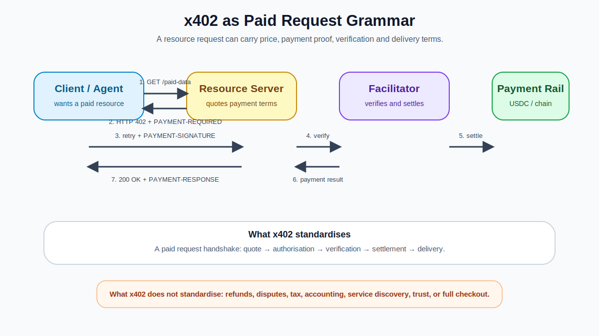
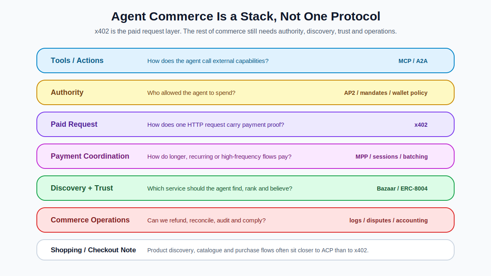

我不太喜歡「x402 是 AI Agent 的 Stripe」這個說法。

它很好懂，也很容易傳播。但它會偷走一部分精準度。Stripe 不只是付款，它是商戶入駐、付款方式、風控、退款、爭議處理、dashboard、對帳、收單、合規、稅務邏輯、全球 payout 與企業級支付營運的一整套系統。

x402 不是這個東西。

x402 比較像一套 **Paid Request Grammar**：它讓一個 HTTP request 不只是在說「我要這個資源」，也可以開始說：

> 這個資源要多少錢。  
> 我接受哪些付款方式。  
> 你怎麼證明你願意付。  
> 我怎麼驗證這筆付款。  
> 付完之後，我怎麼把資源交給你。

這個差異很重要。如果我們把 x402 說成「AI Agent 的 Stripe」，很容易讓人誤以為支付協議一通，整個 agent commerce 就通了。但真正做過產品的人都知道，付款只是商業流程裡的一個節點。後面還有授權、發現、風控、驗收、退款、帳務、稽核、合規與客訴。

這篇想把邊界切清楚。

## 這篇在解什麼，不解什麼

上一篇談的是 Invisible Web3：成熟的 Web3 可能不再要求使用者每天看見鏈、錢包與 gas。

這篇往下鑽一層：x402 到底是什麼責任邊界？

我不會把這篇寫成安裝教學，也不會教你如何在 Next.js、Express 或 Cloudflare Workers 裡加 middleware。這篇要解的是架構語義：

> x402 標準化的是 paid request 的語法，而不是完整支付公司、完整 commerce stack 或完整信任系統。

搞清楚這件事，後面才有辦法判斷它該被用在哪裡、不該被吹到哪裡。

## 先把 x402 放在桌上：它到底是什麼？

x402 是一個把付款放進 HTTP request / response lifecycle 裡的開放支付協議。

最小流程可以這樣理解：

1. client 或 AI agent 向 server 請求一個付費資源。
2. server 回 `HTTP 402 Payment Required`，並附上機器可讀的付款條件，例如價格、資產、網路、收款地址、facilitator endpoint。
3. client 讀懂條件後，用錢包簽署付款授權或付款 payload。
4. client 帶著付款證明重送 request。
5. server 或 facilitator 驗證付款，確認條件吻合。
6. server 回 `200 OK`，交付原本的資源，並附上付款結果或 receipt。

所以 x402 不是一個新的幣，不是一條新的鏈，也不是一個完整 checkout 產品。它更像是把「這個 request 要付多少錢，以及你怎麼證明你付了」變成一套共同語法。

我會把它想成 HTTP 世界裡的付費請求句型。

以前 request 只會說：

> 給我這個資料。

x402 之後，它可以說：

> 給我這個資料；如果要付款，請告訴我條件；我會用你能驗證的方式付款；你驗完後把資料交給我。

這不是給 Web3 初學者看的「什麼是 HTTP」教學，而是要讓已經懂 AI / Web3 / API 的讀者快速站穩：x402 的重點不是「用穩定幣付款」而已，而是讓 **request 本身開始具有商業語意**。

## x402 的最小心智模型：request 變成商業動作

傳統 HTTP request 通常像這樣：

client 問：「我要 `/premium-data`。」  
server 回：「200 OK，這是資料。」  
或回：「401 / 403，你沒權限。」  
或回：「404，找不到。」

x402 復活的是另一種回覆：

server 回：「402 Payment Required。這個資源要付款，條件如下。」

然後 client 可以用機器可讀的方式解析付款條件，簽署付款 payload，再重送請求。server 或 facilitator 驗證付款後，回傳資源與付款回應。

這件事真正重要的地方，不是多了一個狀態碼，而是 request 的性質變了。它不再只是技術請求，它開始變成一個小型商業動作。

這個動作裡至少包含五件事：

1. **Quote**：server 對某個資源報價。
2. **Intent**：client 表示願意支付。
3. **Proof**：client 帶付款證明或授權。
4. **Verification**：server / facilitator 驗證付款條件。
5. **Fulfilment**：server 交付資源。

這就是我為什麼把它叫 Paid Request Grammar。不是因為這個詞比較潮，而是因為它比「支付工具」更準。

<figure>
  
  <figcaption>x402 比較像 paid request 的語法：它定義 client、server、facilitator 和 payment rail 如何在同一次資源請求裡協調付款。</figcaption>
</figure>

## x402 真正標準化的是什麼？

很多介紹會說 x402 讓 AI agent 可以用 stablecoin 付錢。這句沒錯，但太薄。

更準確地說，x402 標準化的是：

- server 如何宣告某個 endpoint 需要付款
- client 如何理解付款條件
- client 如何附上付款證明或授權
- server 如何確認付款
- server 如何在成功後交付資源
- 這些資訊如何透過 HTTP headers / response flow 來交換

也就是說，它把付款從「外部 checkout 流程」拉回「request lifecycle」。

這對 API、data provider、AI inference service 很重要，因為它們本來就是透過 request 被呼叫。付款如果也可以用 request 的語法處理，就不用每次都掉出流程，跑去帳號、訂閱、發票、credit package 的世界。

但這裡有一個關鍵限制：

> x402 標準化 payment handshake，不標準化整個商業關係。

它不自動幫你解使用者身份、KYC / KYB、退款、爭議處理、稅務文件、會計科目、發票、SLA、交付品質、服務排名、agent 授權邊界或企業採購流程。

所以如果說 x402 很重要，我同意。如果說 x402 單獨就是 AI commerce 的完整答案，我不同意。

## 為什麼這對 AI agent 特別重要？

因為 AI agent 的工作方式和人類不一樣。

人類可以忍受很多商業流程的荒謬：註冊帳號、收驗證信、綁卡、買 credits、手動升級方案、下載 invoice、打開 dashboard 查用量。

AI agent 不適合這樣工作。

一個 agent 如果要完成研究、交易監控、旅遊規劃、資料分析、程式產生、供應商比較，它可能需要臨時呼叫十幾個外部服務。每一個服務都要求先開帳號、談合約或預付 credits，agent workflow 就不再是 workflow，而是一串卡住的櫃台。

x402 的想像是讓服務變成可被即時購買的 resource。agent 不需要先和每個 API provider 建立長期關係。它只要能讀懂價格、確認支援的資產與網路、判斷是否在預算內、簽署付款、拿到結果。

這會讓某些服務從「訂閱制產品」變成「可被機器按次購買的能力」。

我覺得這裡才是 x402 真正迷人的地方。它不是把信用卡塞給 AI，而是讓 API、資料、模型推理、爬蟲、研究工具、MCP tool 這些原本需要人類帳號流程的東西，開始變成 agent 能即時採購的能力單位。

## 比較表：傳統付款流程、x402、Google AP2、Stripe MPP

x402 不應該孤立理解。現在 agent payment 相關協議開始變多，最容易犯的錯，就是把所有東西都塞進「AI 可以付款」這個籃子裡。

我的拆法比較簡單：先問它到底在解哪一層問題。

| 比較項目 | 傳統付款流程 | x402 | Google AP2 | Stripe MPP |
|---|---|---|---|---|
| 核心問題 | 人類如何完成付款 | HTTP request 如何帶付款條件與付款證明 | Agent 是否被授權代表使用者付款 | Agent / service 如何程式化協調付款 |
| 典型場景 | Checkout、訂閱、卡片付款、invoice、企業採購 | 付費 API、資料、內容、MCP tool、單次資源請求 | Agent 代購、跨平台商務、需要明確使用者授權的交易 | 高頻機器付款、microtransactions、recurring payments、session-based service access |
| 付款語法 | 表單、checkout page、payment gateway、合約與帳單 | HTTP 402 + payment requirements + retry with payment authorization | Mandates / user intent / delegated authority | HTTP 402-like flow + programmable payment coordination |
| 適合對象 | 人類使用者、商戶、SaaS、企業財務部門 | API、data provider、agent、backend service、tool provider | 需要證明「這是使用者授權」的 agent commerce | 需要更完整付款協調、持續付款或 recurring 的 agent workflow |
| 最強之處 | 成熟、合規、退款、消費者保護、會計流程完整 | 輕量、HTTP-native、適合按次資源請求 | 解決「誰授權 agent 花錢」與可稽核意圖 | 更接近 production payment rail，支援更廣泛付款協調 |
| 不解決什麼 | 不適合機器高頻小額請求 | 不解決授權、信任、退款、會計、履約 | 不直接等於底層資金 rail 或每個 API 的收費語法 | 不等於 agent discovery、reputation、validation |
| 我的判斷 | 人類 commerce 的舊主幹 | **Paid Request Grammar** | **Agent Authorization Layer** | **Machine Payment Coordination Layer** |

這張表不是要說誰會贏。比較成熟的看法是：它們可能不是同一層。

x402 很適合描述「一個 HTTP request 如何付錢」。AP2 更像是在處理「agent 花這筆錢時，是否有可驗證的使用者意圖與授權」。MPP 則更靠近 machine payment coordination，特別是更高頻、連續、recurring 或 session-based 的付款場景。

如果硬要用一句話：

> x402 解 request 怎麼付。AP2 解 agent 憑什麼付。MPP 解長時間或高頻互動怎麼協調付款。

傳統付款流程沒有消失。它仍然適合人類 checkout、較大金額交易、退款需求高、監管要求重、企業流程複雜的場景。真正的問題不是「x402 取代誰」，而是「哪一種商業動作，終於不必再被塞進人類 checkout 的模具裡」。

## ACP 要放在哪裡？

另外還有 OpenAI / Stripe 推出的 Agentic Commerce Protocol，ACP。

我不會把它放進上面主表，是因為 ACP 更像 buyer、AI agent、business 之間完成購買流程的 interaction model，尤其適合商品、catalog、checkout、merchant relationship 這類 e-commerce 場景。

這跟 x402 的 paid request grammar 不是同一層。x402 可以很適合 API、資料與工具呼叫；ACP 更像是讓 AI 介面中的購物、商品發現與商戶交易有共同流程。

如果你在做的是「AI 幫使用者買商品」，ACP / AP2 這類協議會非常關鍵。如果你在做的是「agent 按次購買 API / data / inference / MCP tool」，x402 或 MPP 的位置會更前面。

這也是為什麼我一直不想把 x402 寫成「AI Agent 的 Stripe」。agent commerce 的地圖正在拆層，任何一句太順的比喻都容易把層級壓扁。

## x402 不是 agent commerce stack

真正的 agent commerce 不只需要付款。

假設一個 AI agent 要幫你做一份投資研究，它想購買三個外部服務：鏈上分析 API、市場資料、深度研究模型，也許還有一個瀏覽器 session 或爬蟲工具。

x402 可以處理「這次 API request 怎麼付錢」。但完整流程還會問更多問題：

- agent 怎麼發現哪些服務可以用？
- 它怎麼比較價格與品質？
- 誰授權它可以買這些東西？
- 如果花費超過預算怎麼辦？
- 付款後資料錯了怎麼辦？
- 服務沒交付怎麼辦？
- 哪些交易需要人工確認？
- 發票與會計怎麼處理？
- 付款 metadata 會不會洩漏使用者意圖？
- 這些服務的排名是否被商業贊助污染？

這些都不是 x402 單獨能解的問題。

所以更完整的理解會是：

- **MCP / tools**：agent 怎麼調外部工具
- **A2A / agent communication**：agent 和 agent 怎麼溝通
- **AP2 / mandates**：誰授權 agent 支付
- **x402**：HTTP request 裡如何執行可程式付款
- **MPP / session payment**：高頻、連續或 session-based 的付款如何處理
- **ACP / checkout interaction**：agent、buyer、business 如何完成商品購買
- **ERC-8004**：agent / service 如何被發現、被評價、被驗證
- **wallet policy**：agent 能花多少、能買什麼、何時要人工批准
- **discovery / marketplace**：agent 看見哪些服務、如何排序
- **accounting / compliance**：怎麼對帳、報稅、稽核、處理爭議

這不是一個協議可以吃掉的地圖。它是一個 stack。

<figure>
  
  <figcaption>x402 在 agent commerce stack 裡很重要，但它只佔 paid request / payment execution 這一層。完整商業流程還需要授權、發現、信任、驗收與營運治理。</figcaption>
</figure>

## ERC-8004：付款之外，agent 還需要信任語法

x402 可以告訴 agent：這個 endpoint 要多少錢、怎麼付、怎麼驗證付款。

但它沒有回答另一個問題：

> 這個 agent 或 service 是誰？它過去表現如何？它完成任務後，有沒有第三方可以驗證？

這就是 ERC-8004 值得放進同一張地圖裡的原因。

ERC-8004 的標題是 Trustless Agents。它想處理的是 agent economy 裡的 discovery、reputation、validation：讓 agent 能跨組織發現彼此、建立聲譽、驗證互動結果，而不是每一次都從零開始信任一個陌生服務。

我會這樣切：

| 層 | 它回答的問題 | 可能相關協議 |
|---|---|---|
| Payment | 這次 request 怎麼付錢？ | x402 / MPP |
| Authority | 誰授權 agent 花這筆錢？ | AP2 / mandates / wallet policy |
| Discovery | agent 去哪裡找服務？ | Bazaar / marketplace / registry |
| Trust | 這個服務以前表現如何？ | ERC-8004 reputation |
| Validation | 事情到底有沒有做完？ | ERC-8004 validation / receipts / external verifier |

所以 x402 和 ERC-8004 不是互相替代。它們更像兩種語法：

> x402 是付款語法。  
> ERC-8004 是信任語法。

真正的 agent commerce 需要兩者，不是其中一個單打獨鬥。

這也是第二篇為什麼要補 ERC-8004。因為如果只講 x402，文章會像只畫了收銀台，卻沒畫商店、貨架、監視器、客服、評價系統和倉庫。

## MCP tool payment 可能是最早落地的場景之一

我越看越覺得，x402 的早期 PMF 未必會先發生在一般人用 stablecoin 買文章。

更可能先發生在 **agent 調工具的那一刻**。

原因很簡單：MCP tool call 本來就是 machine-readable action。如果一個 tool call 可以被 pricing、payment requirement、receipt 包住，那工具就不只是工具，而是可被 agent 即時採購的服務。

Cloudflare 的 agentic payments 文件已經把 x402 放在 Agents SDK 和 MCP server 的語境裡，甚至有 paid tool 的方向。這很合理。因為 agent 不是在「瀏覽網頁」時最需要付款，而是在「完成任務需要外部能力」時最需要付款。

例如：

- 爬一個需要付費的資料源
- 呼叫一個高品質 search / scraping tool
- 付費取得一份 blockchain risk report
- 付費使用一個 specialized model
- 用小額費用叫另一個 agent 做一個子任務
- 為一次瀏覽器 render session 付款

這些都比「人類讀一篇文章要不要付 0.05 USDC」更接近早期真實使用。

我不是說內容微支付不會發生，而是說它不應該成為唯一故事。x402 真正更像是讓 agent workflow 裡的外部能力可以被採購。

## Gas 沒有消失，只是被藏起來了

看不見的 Web3 有一個常見陷阱：我們太容易把「使用者看不見」誤解成「成本不存在」。

x402 常被描述成 gasless 或 frictionless。這在體驗上是對的，但在系統上要小心。

gas 沒有消失。它通常是被 facilitator、token standard、Permit / authorization model、gas sponsorship、network choice 藏到使用者看不見的地方。

例如在 EVM 生態裡，USDC / EURC 這類支援 EIP-3009 的 token 可以讓 buyer 簽署 off-chain authorization，由 facilitator 提交 transfer；其他 ERC-20 則可能透過 Permit2 或其他授權方式來處理。這些設計讓 buyer 不需要自己持有 native token 付 gas，也不用每一次都跳出來做 on-chain approval。

這是好的 UX。

但它不是沒有成本。只是成本被重新分配了：

- facilitator 可能吸收或轉嫁 gas
- network 擁塞時成本會回來敲門
- 支援的 token standard 會影響體驗
- Permit / authorization 的安全設計會變重要
- 失敗重試、nonce、過期時間、request binding 都要處理

所以我會把這件事寫成一句話：

> x402 的目標不是讓鏈消失，而是讓鏈從使用者的注意力裡消失。

這是好的產品方向，但工程師和產品人不能跟著失憶。

## x402 現在也不只是 Coinbase 自家敘事

這點也該補進來。

如果 x402 只是 Coinbase Developer Platform 的一個產品，它的想像空間會小很多。真正有意思的是，它被貢獻到 Linux Foundation 旗下的 x402 Foundation，開始走向更中立的 open standard governance。

這讓問題從「Coinbase 能不能推一個支付產品」變成：

> x402 這套 paid request grammar 能不能被 infra provider、wallet、agent framework、payment company、cloud platform、API provider 接成共同語言？

標準化政治通常比技術本身更慢，也更髒。但它很重要。因為支付語法如果要進入網路底層，就不能只是一家公司的 proprietary rail。

這也是我對 x402 稍微提高興趣的原因。不是因為它被包裝成下一個敘事，而是因為它開始從產品敘事往標準治理移動。

## 什麼時候 x402 很適合？

我會把 x402 的強項放在這幾類。

### 1. Long-tail API monetization

小型 API、資料服務、分析工具、模型服務，不一定有能力建完整訂閱與付款後台。x402 讓它們可以把某個 endpoint 變成 paid resource，而不是先做一整套 SaaS billing 系統。

### 2. Agent-friendly pay-per-use

agent 不想登入 dashboard，也不想估用量買套餐。它更適合在任務中按需購買。x402 的 request-based flow 很適合這個方向。

### 3. Accountless trials

有些服務不值得要求使用者先註冊。一次資料、一篇文章、一個 report、一個工具呼叫，如果可以直接付費取得，就能降低試用摩擦。

### 4. Machine-readable pricing

對人類來說價格頁可以是 UI；對 agent 來說，價格必須能被解析。x402 讓 price / asset / network / recipient 這些條件變成可以被程式讀取的內容。

### 5. Paid MCP tools

如果 MCP server 裡有些 tools 免費、有些 tools 要付費，x402 很自然。它可以讓 tool call 變成 paid action，而不是要求使用者先去另一個 dashboard 買 credits。

## 什麼時候不要急著用 x402？

也有很多情境不該硬套。

如果你的產品需要大量人工信任、複雜退款、長期合約、企業採購、發票流程、seat-based pricing、或高度監管，那 x402 不會替你省掉真正麻煩的事。

如果使用者主要是一般消費者，而且交易金額較大、需要熟悉的付款體驗、信用卡保障與退款機制，那傳統 checkout 仍然更合理。

如果你需要的是連續的高頻微支付，比如每秒大量推理、streaming telemetry、長時間 agent collaboration，request-based x402 可能太碎。這時候 session / batch / deferred payment 會更像正解。

如果你的服務交付難以驗收，比如「這份研究到底有沒有價值」「這個 AI 回答品質是否合格」，那付款成功不代表商業完成。你還需要 reputation、validation、refund 或 escrow-like 機制。

x402 不是魔法。它只是把付款語法塞回 HTTP request。這件事很重要，但不代表所有付款問題都被降維打擊。

## 真正的產品問題：付款成功之後呢？

很多 x402 敘事會停在「agent 可以付錢」這一步。但我覺得真正的產品問題是：

> 付完錢之後，誰負責確認這次交易真的有價值？

對一個 API call，可能很簡單。回傳資料就是交付。對一份研究報告，就沒那麼簡單。對一個 agent 幫你做的子任務，更複雜。對一個旅遊規劃服務、供應商報價、風險分析、法律摘要，付款和交付之間的距離更遠。

x402 可以幫忙讓 request 帶錢，但它不會自動讓服務變好。它可以讓付款可程式化，但不會讓信任可程式化。它可以讓微支付變可行，但不會自動創造付費意願。它可以降低 checkout friction，但不會消滅商業風險。

如果一個服務本身沒有價值，x402 只會讓它更快收不到第二次錢。

## 對 Web3 產品人的判準

如果你在評估 x402，我會建議不要只問「能不能接」。

你應該問：

1. 我的服務是否適合被按次購買？
2. 每次 request 的價值是否清楚？
3. 付款成功是否幾乎等於交付成功？
4. 失敗時能不能自動重試、退款或補償？
5. 我的使用者是人、agent，還是 backend service？
6. 我是否需要 discovery layer，讓 agent 找得到我？
7. 我是否有對帳、稽核、紀錄、錯誤處理？
8. 我是否接受 facilitator 或支付 rail 的依賴？
9. 我是否需要 AP2 / ACP 這類授權或 checkout layer？
10. 我是否需要 ERC-8004 這類身份、聲譽與驗收 layer？
11. 這個模式是否真的提升任務完成率，而不只是創造交易量？

最後一點最重要。

x402 的 PMF 不該只看交易筆數。交易量可能來自測試、噪音、投機或機器互刷。更重要的是：

> agent 因為 x402 多完成了多少原本會卡住的任務？

這才是 paid request grammar 的真正價值。

## 收尾：不要把付款語法誤認成商業制度

所以我會把第二篇的主張收成這樣：

> x402 不是 AI Agent 的 Stripe。它更像 agent commerce stack 裡的「付費請求語法」：讓 HTTP request 可以報價、授權、付款、驗證與交付。  
> 但真正的機器商業，不只需要付款語法，還需要 AP2 的授權語法、ERC-8004 的信任語法、MPP 的高頻付款語法、ACP 的購買流程語法，以及產品層的退款、對帳、風控與驗收。

這樣看，x402 的重要性反而更清楚。

不是因為它什麼都能解，而是因為它把一個長期缺席的東西放回了網路語法裡：

> 一個 request，可以自己帶著價格、付款證明與交付條件前進。

這很小，也很大。

小到它只是一個 handshake。大到如果它真的被採用，API、資料、模型、工具、內容、agent service 都可能被重新切成可即時採購的能力單位。

但我會一直保留一點懷疑。

看不見的 Web3，不代表沒有成本。Invisible infrastructure 最容易犯的錯，就是把複雜度藏起來之後，假裝它消失了。

x402 最好的樣子，不是讓人類終於學會鏈上付款。它最好的樣子，可能是 agent 在背後安靜完成採購，而使用者只感覺任務完成了。

但在那之前，我們要先把語法、授權、信任、風控、驗收、會計都拆清楚。

不然它就不是看不見的 Web3。

它只是看不見的混亂。

## 下一篇

下一篇會談這個系列裡最容易被忽略的一面：

> 當 Web3 看不見，風險也可能看不見。

Invisible Web3 很迷人，但如果使用者不知道自己用了 Web3，產品方就更不能把授權、預算、metadata、facilitator、discovery、退款、對帳與合規全部含糊帶過。

真正成熟的 invisible infrastructure，不只是看起來順。它要在看不見的地方，把控制權留下來。

---

參考資料放在 `resource/references.md`。  
圖片規格放在 `resource/image-asset-plan.md`。
