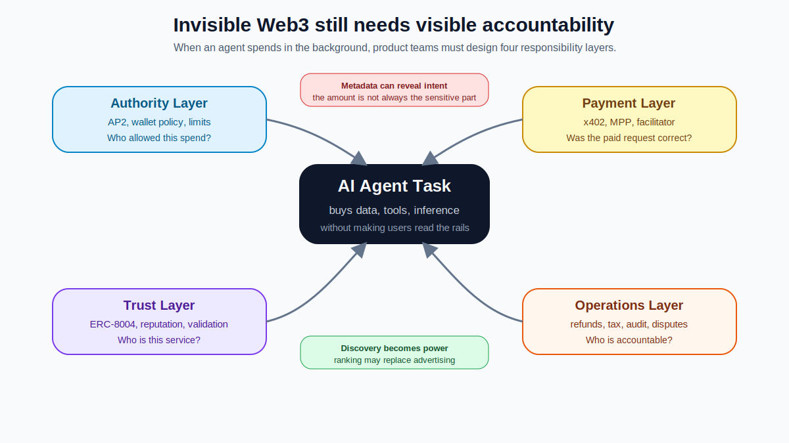

前兩篇我一直在說：Web3 最成熟的樣子，可能是使用者不再需要一直看見它。

但這篇要補另一半。

如果 Web3 退到背景裡，它的風險也可能一起退到背景裡。如果 AI agent 在背後用穩定幣買資料、呼叫 API、購買推理、租用瀏覽器 session，使用者不一定會看到鏈、gas、facilitator、metadata、request binding、付款重試、或結算失敗。

這是好事，也是壞事。

好事是體驗變順。壞事是風險變安靜。

我認為 Invisible Web3 最重要的設計問題不是「怎麼讓使用者完全不用知道」，而是：

> 怎麼讓使用者不必理解底層技術，也仍然被清楚授權、清楚保護、清楚記帳。

這篇不是要否定 x402。剛好相反。x402 很值得寫，正因為它把一個新的產品問題推到我們面前：當 HTTP request 開始帶錢，API 就不再只是 API，它變成一個小型商業合約。

商業合約不只需要付款。它還需要控制權。

## 先把風險分層：四個看不見的責任面

第二篇把 x402、AP2、MPP、ACP、ERC-8004 放進同一張 agent commerce 地圖裡。這篇要做的，是把那張地圖轉成風險治理問題。

我會先把 Invisible Web3 的風險分成四層：

| 風險層 | 核心問題 | 可能對應機制 |
|---|---|---|
| 授權層 | Agent 到底有沒有被允許花這筆錢？授權範圍多大？ | AP2、wallet policy、spending limit、approval boundary |
| 付款層 | 付款條件、付款證明、結算與重試是否正確？ | x402、MPP、facilitator、idempotency、request binding |
| 信任層 | 服務方是誰？過去表現如何？結果能不能被驗證？ | ERC-8004、reputation、validation、service registry |
| 營運層 | 退款、稅務、對帳、爭議、合規怎麼辦？ | product ops、accounting、compliance、audit trail |

這張表很重要，因為它把「看不見」拆開了。x402 可以讓付款變得不顯眼，但授權、信任、履約、營運不能一起變成霧。

換句話說，Invisible Web3 不能只有 invisible payment。它還需要 **visible accountability**。

使用者不必看見每條鏈，但產品必須讓責任可見.

## 這篇在解什麼，不解什麼

第一篇談 Invisible Web3 的產品哲學。第二篇把 x402 定位成 Paid Request Grammar，而不是 AI Agent 的 Stripe。

這篇處理最後一層：如果 Web3 和支付都退到 agent workflow 背後，我們該怎麼設計風險治理？

我不會把這篇寫成資安 checklist。更準確地說，這是一篇產品治理框架。它想回答：

- AI agent 可以花錢時，產品應該限制什麼？
- facilitator 會不會成為新的中介？
- payment metadata 會不會洩漏使用者意圖？
- discovery layer 會不會變成下一代廣告層？
- 付款成功是否等於服務完成？
- 如果全部都「無感」，使用者還剩下什麼控制權？

## Invisible does not mean ungoverned

我最怕的 invisible Web3，是把所有東西都藏起來，然後說這就是好 UX。

這不是好 UX。這只是把風險收進地毯底下。

好的 invisible infrastructure 應該是這樣：

使用者不需要懂每條鏈，但要知道自己授權了什麼。使用者不需要看 gas，但要知道預算與上限。使用者不需要管 facilitator，但要知道付款紀錄與錯誤處理。使用者不需要讀每個 HTTP header，但產品要處理 replay、double charge、request binding。使用者不需要看 metadata，但系統要避免把敏感任務內容送出去。

看不見不是沒有治理。看不見代表治理要更早進入產品設計，而不是等事故發生再補。

<figure>
  
  <figcaption>Invisible Web3 的風險不只在鏈上。授權、付款、信任與營運，會一起變成 agent payment 的控制點。</figcaption>
</figure>

## 第一個控制點：錢包防火牆

AI agent 可以花錢，聽起來很酷，但我覺得更重要的是：它不能亂花錢。

我會把這層叫 **Wallet Firewall**。

它不是單純的錢包 UI，而是一套 agent spending policy。比如：

- 單筆上限
- 每日上限
- 每個任務上限
- 每個 service provider 上限
- API allowlist / blocklist
- 高風險支出人工確認
- 價格異常攔截
- 重複付款偵測
- prompt injection 防護
- spending log 與審計紀錄
- session key 與短期授權
- 任務完成後自動撤銷權限

這一層如果沒有設計好，x402 的流暢反而會變成危險。

傳統 checkout 的麻煩至少有一個副作用：每次付款都會讓人類停一下。Agent payment 把這個停頓移除，所以產品必須用政策邊界取代人類遲疑。

我會用一句話判斷 agent wallet 是否成熟：

> 不是看它能不能付款，而是看它能不能拒絕付款。

能拒絕，才有治理。

## 第二個控制點：facilitator 悖論

x402 敘事常講「去中介化」或「不用傳統支付閘道」。這方向沒錯，但要小心一個悖論：

> 當你把傳統 payment processor 移走，很可能會長出新的 facilitator processor。

facilitator 的角色很實用。它可以幫 server 驗證付款 payload、處理鏈上互動、確認 settlement、抽象 network / token 差異，讓一般 SaaS team 不用自己變成 blockchain infra team。

但只要 facilitator 開始處理大量交易，它就不只是配角。

它可能掌握哪些交易被驗證、哪些交易被拒絕、支援哪些鏈、支援哪些 token、gas 或 settlement 成本如何轉嫁、付款 metadata、KYT / OFAC / 合規檢查、merchant onboarding、routing priority、錯誤與退款流程。

這些都是權力。

所以 x402 不一定消滅中介。它可能只是把中介從 card network / payment gateway 的形狀，換成 facilitator / wallet provider / agent marketplace 的形狀。

如果 facilitator 是關鍵信任元件，就要問：

- 是否有多家 facilitator 可以替代？
- metadata 是否最小化？
- 是否有 self-host option？
- 是否有明確失敗模式？
- 是否有 audit log？
- 是否有費用透明度？
- 是否有合規責任邊界？

去中介化不是沒有中介。它應該是讓中介可以被替換、被審查、被約束。

## 第三個控制點：metadata 比金額更敏感

很多人談 x402 風險時會直覺想到錢：agent 會不會亂付？錢會不會被偷？交易會不會失敗？

這些當然重要。

但我覺得更細也更危險的是 metadata。

當 agent 為了完成任務而付款時，它可能在 payment request 或相關控制流程裡帶上 resource URL、description、reason string、任務上下文、使用者意圖、內部專案名稱、客戶資料、研究主題、醫療、法律、財務或旅遊偏好、公司情報或私人計畫。

錢包地址和交易金額可能只說「花了多少」。metadata 可能說「為什麼花」。

這個差異非常大。

如果一個 agent 替使用者查醫療資料、買法律摘要、抓競品價格、調查投資標的、規劃私人旅行，付款 metadata 可能比鏈上交易本身更敏感。更麻煩的是，這些資料不一定只上鏈，它可能先經過 server、facilitator、log pipeline、monitoring、analytics、或第三方工具。

所以 Invisible Web3 的隱私設計不能只問「鏈上是否匿名」。它要問：

> 付款前後的 control plane 看到了什麼？

這會變成 agent payment 很重要的一層安全設計。

## 第四個控制點：discovery 可能是下一代廣告層

如果 x402 讓 agent 可以付錢，下一個問題不是「能不能付」，而是「要付給誰」。

這會把我們帶到 discovery。

人類時代，廣告買的是注意力。搜尋排名、推薦排序、sponsored listing、app store ranking，都是商業戰場。

Agent 時代，廣告不會消失。它可能只是改變形狀。

AI agent 不一定會被 banner ad 說服。但它會受這些東西影響：tool marketplace 排名、API registry 排序、provider reputation score、default facilitator、sponsored endpoint、preferred partner、recommended data source、agent SDK 裡的預設服務、benchmark 與 rating 的設計方式。

所以我不相信「AI agent 會殺死廣告」這種太直線的說法。

比較可能的是：廣告會從人類注意力市場，移到 agent decision market。

未來真正有權力的，可能不是誰能讓 agent 付款，而是誰能讓 agent 看見自己、相信自己、優先選自己。

這會讓 discovery layer 變成新的平台權力。

如果不處理這層，x402 可能讓付費變得開放，但 discovery 又把市場重新收回幾個入口手上。

## 第五個控制點：信任層不能只靠付款

如果 x402 解的是 paid request，那 ERC-8004 更像是在問另一個問題：agent 和 service 之間到底憑什麼互相信任？

付款本身不能回答這件事。

一個 service 可以正確收款，但品質很差。一個 agent 可以成功付款，但它可能是惡意的、自動化濫用的、或沒有被使用者授權的。一個 API 可以回傳資料，但資料來源、更新頻率、準確率、過去履約紀錄都可能不透明。

這就是為什麼我覺得 ERC-8004 應該被放進同一個討論裡。它試圖處理 agent discovery、reputation、validation 這三個問題：誰可以被發現、過去表現如何、結果能不能被驗證。

這不是 x402 的替代品。比較像 x402 的鄰居。

> x402 讓 request 可以付款。ERC-8004 讓 agent / service 有機會被發現、被評價、被驗證。

如果未來 agent 真的要自動購買資料、模型、工具與服務，付款語法只會解一半。另一半是信任語法。

沒有信任層，agent payment 很容易變成一個高速付款機制，接到一堆品質不可知、排序不可查、履約不可驗的服務上。

這樣不是機器經濟。這比較像自動化踩雷。

## 第六個控制點：付款成功不是履約成功

這是 x402 最容易被過度樂觀解讀的地方。

付款成功，不代表服務真的完成。服務完成，不代表結果有價值。結果有價值，也不代表使用者知道為什麼付這筆錢。

對簡單 API，問題不大。比如你花 0.01 USDC 買一次天氣資料，server 回傳資料，大致就算完成。

但 agent commerce 很快會碰到更模糊的交易：一份研究報告、一段程式碼生成、一次資料清洗、一個旅遊推薦、一個投資風險摘要、一個供應商比較、一個多 agent 協作任務。

這些事情不是付款後回一段 JSON 就一定算完成。

所以 x402 解決的是 payment handshake，不是 fulfilment guarantee。

如果這個問題要往前走，就需要更多設計：receipt、result hash、quality score、reputation registry、third-party validation、dispute resolution、escrow / delayed settlement、atomic service channel、SLA-aware pricing、human review for high-value work。

我覺得這會是下一波 agent payment 的真正戰場。

不是誰能讓 agent 付錢。而是誰能證明「付錢換來的工作真的被完成」。

## 第七個控制點：帳務、稅務與退款是產品，不是雜務

很多技術文章會把 accounting、tax、refund 放到最後，像是掃地才會碰到的灰塵。

但在真實產品裡，這些不是灰塵。它們是採用門檻。

尤其是企業場景。

如果一家公司讓 agent 自動購買 API、資料、推理、爬蟲、瀏覽器 session，它會需要每筆交易紀錄、成本歸屬到任務或專案、可下載 receipt、月度對帳、稅務分類、供應商清單、異常支出提醒、退款與 credit note、internal approval trail、財務系統整合。

這些事情不酷，但它們決定產品能不能進公司。

Web3 產品很常低估這一點。因為鏈上透明會讓人誤以為「有 transaction hash 就夠了」。但對企業來說，transaction hash 不是會計答案，只是原始事件。

真正的問題是：

> 這筆支出在公司帳上是什麼？誰批准？買了什麼？為哪個任務？可以報稅嗎？可以稽核嗎？供應商是誰？出了問題找誰？

Invisible Web3 如果想進入主流工作流，這些東西不能被視為「之後再說」。

它們就是產品的一部分。

## Agent Payment Control Plane

如果要把前面這些收束成一個框架，我會叫它：

> **Agent Payment Control Plane**

它不一定是一個單一產品，而是一組產品責任：

| 控制面 | 要回答的問題 |
|---|---|
| Authority | 誰授權 agent 花錢？授權範圍多大？ |
| Budget | 單筆、每日、任務、供應商上限是多少？ |
| Discovery | agent 看見哪些服務？排序是否可信？ |
| Trust | 服務方是誰？聲譽、履約與驗收如何被驗證？ |
| Payment | request 如何報價、付款、驗證、交付？ |
| Metadata | 付款上下文是否洩漏敏感資訊？ |
| Fulfilment | 服務是否真的完成？品質如何驗證？ |
| Recovery | 失敗時如何重試、退款、補償？ |
| Accounting | 如何對帳、分類、稽核、報表？ |
| Compliance | 哪些交易需要身份、制裁、稅務或法規檢查？ |

x402 很適合放在 Payment 這層。但如果其他層不存在，agent payment 仍然不成熟。

這也是我一直說不要把 x402 寫成完整答案的原因。它是很重要的積木，但不是整棟房子。

## 結尾：看不見的東西，更需要設計

我仍然相信這個系列第一篇的主張：

> Web3 最成功的樣子，可能是使用者不知道自己用了 Web3。

但寫到第三篇，我想把這句補完整：

> Web3 最成功的樣子，可能是使用者不必知道自己用了 Web3，但仍然清楚知道自己授權了什麼、花了多少、買了什麼、出了問題誰負責。

這才是成熟。

x402 讓 HTTP request 有機會開始帶錢。這件事很重要。它可能讓 AI agent、API、資料、推理、工具和內容進入一種新的可程式商業關係。

但當 request 開始帶錢，它就不再只是 request。它是報價、授權、支付、驗收、紀錄，也是責任。

Invisible Web3 的終點，不是把這些都藏掉。

而是讓底層技術退到背景，讓產品責任站到前面。

這樣，使用者不用變成 Web3 專家，也不會變成看不見風險的乘客。

這大概是我現在最相信的版本：Web3 可以看不見，但控制權不能看不見。

---

參考資料放在 `resource/references.md`。  
圖片規格放在 `resource/image-asset-plan.md`。
