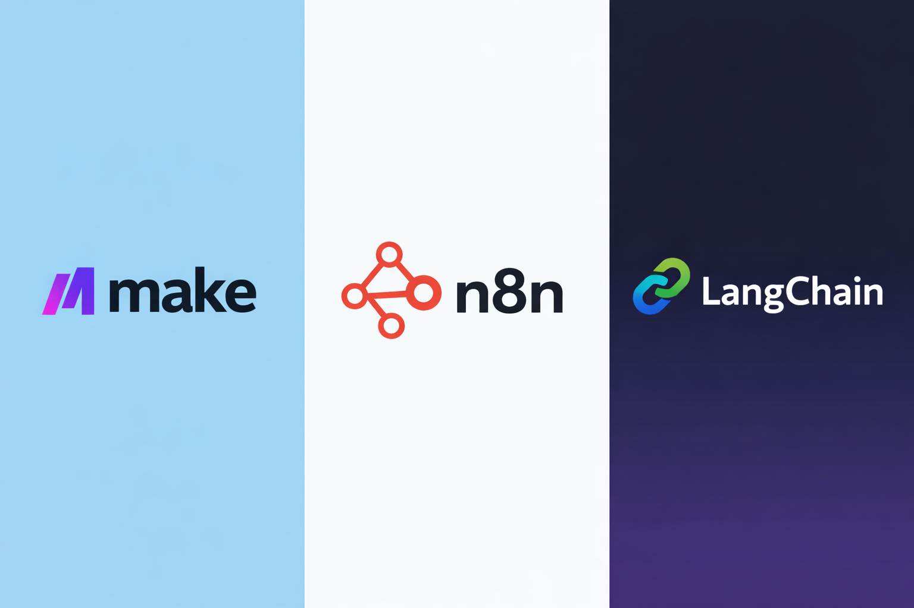

Updated: 2026-03-30

If you have been looking at agentic workflow tools lately, you have probably already hit comparison fatigue.

Everyone is asking the same questions:
- Can it connect to LLMs?
- Can it run agents?
- Can it loop?
- Can it call APIs?
- Can it support human-in-the-loop?

The more of these comparisons I read, though, the more I felt that many of them start from the wrong question.

Because **LangGraph, n8n, and Make do not really live at the same layer**. Of course they overlap. But the thing that usually decides the choice is not “can all of them do it?”, but this:

> **Is the main complexity in front of me workflow integration, or agent runtime governance?**

I do lean towards **Make** in the end.

But this is not a team-colours piece, and it is not a final technical evaluation either. A more accurate description is that it is a selection guide for PMs, builders, and automation practitioners. If, like me, you are trying to insert AI into existing business processes, automation layers, and data flows, where should you start?

---

## How I am comparing them: separating fact from preference

This time I did not rely only on the nine source files Daniel had collected. I also went back through official docs, pricing pages, and a few relevant Make Community discussions. In this draft, I am deliberately separating **fact** from **view**.

### Here is what I am treating as factual ground

- **LangGraph** documentation does in fact place persistence, durable execution, interrupts, resume, and human-in-the-loop near the centre of its model.
- **n8n** publicly lists Cloud pricing where the Starter and Pro entry points sit noticeably above Make’s entry pricing, while still clearly maintaining a self-hosted route.
- **Make** documentation confirms a few important things:
  - If-else / Merge launched in **open beta on 2026-03-10**
  - after an If-else flow, you **cannot add a Router or another If-else**
  - Make has already placed **MCP server, MCP toolboxes, and AI agent tools** inside its formal documentation structure
- **Make Community** also contains recurring complaints about the formula editor, mapping, auto pop-ups, and awkward handling of certain characters.

### Here is what I am treating as judgement

- whether my current work looks more like business automation or a long-running agent system
- how much engineering complexity I am willing to absorb in exchange for more control
- whether I care more, right now, about lower-friction delivery or a higher-ceiling runtime abstraction

So the more accurate claim is this: **this is Daniel’s choice under Daniel’s current task shape, not the one true answer for every team.**

---

## First, the same-layer view: what each tool is naturally built to handle

| Tool | What it is natively solving for | Its more natural home ground | What I would not reach for it first to do |
|---|---|---|---|
| LangGraph | Stateful agent orchestration / runtime governance | Long-running tasks, multi-agent systems, checkpoints, interrupt / resume, human approval | Straightforward SaaS integration and ordinary operations automation |
| n8n | Visual workflow automation with a stronger engineering extension surface | Self-hosted workflows, technical process automation, AI + APIs + conditional control | Teams that do not want to touch engineering detail and only want fast business flows |
| Make | Visual-first business automation, with AI / MCP / agents added on top in recent years | SaaS integration, operations workflows, inserting AI judgement into existing flows, fast delivery | Deeply stateful, long-lived agent systems that need runtime-level governance |

Put simply:
- **LangGraph** is handling the lifecycle of agents
- **n8n** is handling workflows that technical teams are still happy to maintain
- **Make** is handling how business processes can land faster, with AI layered in

---

## Once I compare three concrete workloads, the picture gets much clearer

### 1. A job-radar workflow

This is a very typical shape:

- collect job postings on a schedule
- clean the data
- score them at a basic level
- send the stronger matches into a deeper AI / RAG pass
- notify me or write the result back into a sheet or store

There is AI in this workflow, but the skeleton is still a workflow. The main problem is not “how does the agent preserve state?”, but “how does the data move, how do services connect, and how does the flow stay stable?”.

In that workload:

- **Make** feels natural, because it is already strong at event-driven flows, SaaS integration, visual orchestration, and operations automation.
- **n8n** can also do it, and if I care more about self-hosting, code extensibility, or more flexible control flow, it may even become more attractive.
- **LangGraph** is not impossible here, but it feels a bit like taking an off-road vehicle on my daily commute.

If all I need is to get that workflow running, I would choose Make first.

### 2. CRM lead enrichment + LLM scoring + Slack notification

Now we step a level up.

For example:
- a lead enters the CRM
- I enrich it using external services
- I let an LLM classify or score it
- some cases need human review
- then I write the result back into the CRM, Slack, email, or another internal system

This is where the difference between **Make and n8n** starts to become genuinely interesting.

Because this is no longer just about wiring services together. It also brings in questions like:
- how natural is the branching?
- how do we handle failure?
- do we need self-hosting?
- how much engineering complexity is the team willing to absorb?

In this workload, I would not say Make wins by default. The fairer version is:

- if I want to **assemble it faster, connect the existing services cleanly, and ship a usable version first**, I am more likely to choose Make
- if I care deeply about **self-hosting, environmental control, workflow flexibility, and deeper customisation**, I will look much more seriously at n8n

This is hard to compare in a perfectly fair way, because the two tools are not trading the same thing. Make is lowering friction; n8n is increasing freedom, but that cost tends to drift more towards the engineering side.

### 3. A long-running research agent

This is a different world.

Suppose I am building a system like this:

- the task runs for a long time
- it needs to look up many sources
- it may pause for human approval
- it must preserve state and recover later
- I need to know which checkpoint it is at, why it stopped there, and how to replay it

At that point, the real question is no longer “can it call APIs?”, but this:

> **What exactly am I using to govern the execution lifecycle of the agent?**

At that level, LangGraph’s advantage becomes very natural. It is not just handling “more steps”; it is handling runtime semantics themselves: state, persistence, interrupts, resume, durable execution, and human-in-the-loop.

That is why I do not claim that Make or n8n are design-equivalent to LangGraph in this class of workload. You can assemble something usable in several ways. That does not mean the underlying abstraction is the same.

---

## So why am I still choosing Make first, for now?

I am not leaning towards Make because it is fashionable, and not because I think it wins across the board.

I am leaning towards it because, once I bring the problem back to the kind of work I most often do right now, it gives me the fastest practical return.

### First reason: it matches the main complexity I am actually dealing with

Most of the work in front of me still looks like this:

- an event comes in
- data gets transformed
- conditions are evaluated
- AI or an external API is called
- the result gets pushed downstream

The pain point here is not the state machine. It is integration friction.

What Make gives me in this setting is fairly direct:
- mature visual workflows
- lots of common integrations already available
- scenarios that are quick to assemble
- a way for non-engineering-heavy flows to get running without becoming ugly too quickly

So this is the more careful way I would phrase it:

> **For the kind of AI-enhanced business workflows I am mostly building right now, Make gives me the highest delivery return per unit of effort.**

That is a more defensible claim than saying it is simply “the most honest answer”.

### Second reason: its entry threshold is friendlier for the kind of start I need

I am deliberately being careful here, because these platforms do not share the same pricing model.

- **Make** currently presents a public entry structure that broadly shows Core, Pro, and Teams tiers, displayed around a **10k credits / mo** reference point
- **n8n** currently publishes Cloud entry pricing around **Starter €20 / month** and **Pro €50 / month** when billed annually
- **LangGraph** can look inexpensive on the surface because the open-source side is so accessible, but the real cost often appears as engineering time, deployment, infrastructure, observability, testing, and maintenance

So I am not pretending I can turn all three into one neat “cheapest tool” table. That would be false precision.

But if the question is simply: **which public entry ticket feels lighter when I want to get started now?**  
Make does feel easier to enter.

### Third reason: its ceiling is higher than many people assume on first contact

After going back through the official docs, I feel more confident about this point.

Make is obviously not LangGraph, and it is obviously not n8n. But it is no longer just the old style of automation tool that only knows how to move A to B and B to C.

It has now clearly brought these into its formal capability map:
- AI Agents
- MCP server
- MCP toolboxes
- MCP tools inside AI agent tooling
- If-else / Merge, which is a more complete control-flow layer than its earlier Router-heavy phase
- Code / API escape hatches when the visual layer stops being enough

So my position is not “Make can replace everything”. It is this:

> **Before I hit genuine runtime limits, it can probably carry a surprising amount of real-world work.**

And for me, that value — getting a large share of real work done before I hit the ceiling — arrives earlier than abstraction purity does.

---

## But I do not want to hide Make’s sharp edges

I am not going to smooth Make out just because I currently lean towards it.

### The formula / mapping / operator experience is genuinely not great

Make feels fine when the mapping is simple. But once I move into thicker formulas, conditions, string handling, and operator-heavy logic, the experience becomes noticeably more irritating.

Looking back through Make Community, the pain points are fairly consistent:
- formula pop-ups interrupt typing
- certain characters get interpreted by the editor automatically
- for example, a semicolon may be treated as a function-argument delimiter rather than the literal character I want to enter
- complex expressions often push people into editing externally and pasting back in

None of that makes the platform unusable overnight. But it does erode the tactile experience over time. Worse, it is not the sort of issue where “if you do it correctly, the problem disappears”. The editor itself begins to push back.

So my practical rule is simple:
- simple logic stays in the visual mapping layer
- once the logic turns ugly, I move to Code or API

At that point, it is better to admit the tool boundary early than to wrestle the editor for longer than I need to.

### Its control flow only recently became more complete

This is one of those details that is easy to miss if you never check the official release notes.

Make’s **If-else / Merge** arrived in **open beta on 2026-03-10**. Before that, a lot of conditional branching depended more heavily on Router.

Router is useful, of course. But it does not solve quite the same problem:
- Router is closer to multi-path distribution
- If-else / Merge is closer to choosing one path conditionally and then rejoining naturally

That difference may not matter much in a small scenario. Once the flow grows, it matters more.

### Even now, If-else / Merge still does not turn Make into an arbitrarily deep control-flow system

The documentation is very explicit here: inside an **If-else flow**, you **cannot add a Router or another If-else**.

That is not a tiny bug. It is a structural reminder that **Make is still designed around manageable, visual scenarios — not around letting me build a deeply nested control-flow runtime without limit.**

So if the main problem in front of me is:
- deep branching
- state governance in long-running tasks
- pause / resume in the middle of execution
- agent-to-agent shared state
- checkpointing, replay, or audit-heavy behaviour

then I would not recommend pretending that If-else / Merge suddenly makes Make a LangGraph substitute. That would be far too optimistic.

---

## When does my conclusion stop holding?

### If the team is already code-first

Then Make’s lower friction may not be the most valuable thing in the room. If the team is already comfortable owning infrastructure, logic, and deployment governance, the pull of n8n or LangGraph gets stronger very quickly.

### If self-hosting, data control, or internal deployment is non-negotiable

Then n8n’s weight rises immediately. At that point the question is no longer about assembly speed, but about environmental control.

### If the core problem is not integration, but runtime semantics

In other words, if the real pain is:
- how state is preserved
- how a task pauses and resumes
- how human approval enters the execution model
- how long-running agents are governed

then my conclusion tilts towards LangGraph.

Put differently, I am not leaning towards Make because it is always right.  
I am leaning towards it because **the main complexity in most of my current work has not yet moved up into the runtime layer.**

---

## Final thought

I am choosing Make first not because I think it is more advanced.

I am choosing it because, when I bring the question back to the ground, I realise that most of the problems I am actually solving still look like this:
- how an event enters the system
- how the flow stays clean
- how AI gets inserted into the existing stack
- how the result moves downstream
- where human checkpoints still belong
- where overdesign is simply not worth it

For those problems, Make is not giving me a perfect answer.  
What it is giving me is **the fastest path to a useful result, with a lighter starting threshold, and enough headroom to stay useful for longer than many people assume.**

That will not suit every team.  
But for the shape of work I am doing right now, it fits best.
