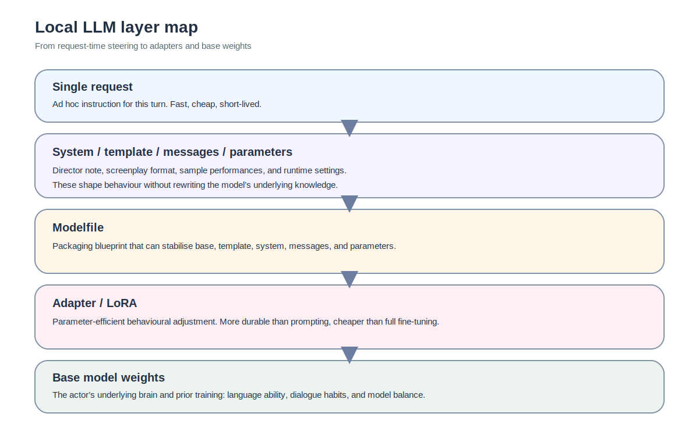

For a while, I translated almost everything into the same question: should I fine-tune the model?

If the answer was too wordy, I thought about LoRA. If the tone was not quite close enough to a technical assistant, I thought about another layer of training. Only after I had actually gone through Modelfiles, LoRA, partial fine-tuning, merging, quantisation, and Ollama end to end did I accept something rather plain: most people are not confused about “the model”. They are confused because they keep calling different floors of the building by the same name.

So this piece is not really about commands yet. It is about the map. Because once the floors blur together, every later decision becomes harder than it needs to be. You may only want a cleaner tone, and somehow end up applying for gated access on Hugging Face. You may only want shorter answers, and end up nudging a fairly capable instruct model into something odd.

## Start with the film set, not the benchmark table

The most useful mental model I ended up with was not “a model as a giant smart book”. It was a film set.

A single request is a fresh line handed to the actor on the day. The system prompt is the director’s note slipped in just before the scene. The template is the screenplay format, deciding who speaks first, how roles are marked, and where the model is expected to pick up the line. Messages or few-shot examples are sample performances: they show how this production usually sounds. Parameters are closer to shooting settings. Do we want it restrained, or a little freer? Should repetition be suppressed? Once these are bundled into something reusable, you are in Modelfile territory.

Only after that do you arrive at LoRA or adapters. That layer is less like rewriting the script and more like altering the actor’s muscle memory. At the bottom sit the base model weights, which are as close as this metaphor gets to the actor’s underlying brain and prior training.

This is not just a cute analogy. It changes the questions you ask. Instead of asking whether you should “change the model”, you start asking which layer is actually responsible for the problem in front of you.

## Layer one: the single request

A single prompt is the easiest thing to understand and the easiest thing to overestimate.

If you tell the model, in that one turn, to start with the conclusion and then break the answer into principles, risks, and implementation, it may comply beautifully. Add “be concise and do not sound preachy”, and the feel shifts again.

The advantages are obvious: it is cheap, fast, and reversible. The disadvantages are just as obvious: it is usually unstable and almost never durable. The next session, the next client, or the next tool call may simply lose that steering.

So a single request is excellent for local control. It is a poor place to claim that the model has truly learned something.

## Layer two: the system prompt

A system prompt is not just “a stronger prompt”. That description is technically tolerable and practically misleading.

Its real value is that it acts more like default character direction than a one-off line edit. This is where you might place language preferences, answering habits, stylistic defaults, or explicit behavioural boundaries. For example:

- prefer Traditional Chinese;
- begin technical answers with the conclusion;
- do not produce code unless it is actually asked for;
- do not invent terms when confidence is low.

These are not usually task-specific instructions. They are closer to a standing role description.

Still, it remains an outer layer. It can be diluted by long context, disturbed by poor formatting, and pulled around by the base model’s own habits.

## Layer three: templates and chat templates

This layer gets underestimated far too often.

A template looks like formatting, which makes it tempting to treat it as decoration. For instruct models, it is not decoration at all. It is part of the input contract. Meta provides prompt format guidance for Llama 3.1, and the Hugging Face model card positions the 8B Instruct variant explicitly as an instruction-tuned dialogue model. That matters because the model was trained to expect a certain style of structured input.

In other words, the model does not “just know” it is in a chat. What it actually sees is a token sequence assembled by the tokenizer and the chat template. Role markers, turn boundaries, and generation prompts all matter.

This is why a model can feel wrong without obviously failing. It may not be LoRA. It may not be quantisation. It may simply be that the screenplay format is off.

## Layer four: messages and few-shot examples

Some things are not best expressed as rules. You do not want to tell the model what to do in abstract terms. You want to show it the shape of a good answer.

That is where message examples or few-shot prompting become useful. They are not as declarative as a system prompt, and they are nowhere near as deep as parameter updates. They are closer to showing an actor a few good takes before asking for another one.

They are especially useful when the target is stylistic rather than factual: shorter answers, clearer structure, less fluff, or a more sober technical tone.

Their limitation is the same as their appeal. They are external and local. They can guide behaviour, but they are not a long-term memory system.

## Layer five: parameters

Temperature, top-p, repetition penalties, context length. These settings can change the feel of the model quite a lot, which is why they are often given more causal credit than they deserve.

They are closer to shooting settings than brain surgery. Lowering temperature can reduce drift. Increasing repetition penalties can make answers less sticky. All of that matters. But if the model has already been pulled into an odd region by poor training data, parameter tweaks will not restore the original balance.

Parameters are important. They simply answer a different question: how the model runs, not what it has actually learned.

## Layer six: the Modelfile

My view of the Modelfile changed quite dramatically once I had done enough damage in the lower layers.

At first it is tempting to treat it as merely a longer system prompt. That is too shallow. In Ollama, a Modelfile can touch the base model, the template, the system message, example messages, runtime parameters, and in some cases an adapter as well. It is not a note. It is a packaging blueprint.

That becomes very important if your actual goal is to preserve the strength of an instruct model while pushing the feel towards something more specific. In that situation, the Modelfile often deserves attention before LoRA does.

That is not caution for its own sake. It is often a better match to the job.

## Layer seven: LoRA and adapters

This is the point at which you begin touching something deeper than presentation.

The PEFT documentation describes LoRA as a parameter-efficient fine-tuning method that inserts low-rank trainable matrices so that only a small fraction of the total parameters needs to be updated. The attraction is obvious: compared with full fine-tuning, the compute and storage burden is far lower.

In the film-set metaphor, LoRA is closer to altering muscle memory than rewriting the screenplay. It lets you preserve the actor’s underlying brain while training a narrower behavioural adjustment.

The trap is that LoRA looks like a wonderfully balanced middle path: cheap enough to try, deep enough to matter, safe enough not to ruin much. In practice, that optimism needs qualifying. If the data is too small, too narrow, or too poorly validated, LoRA can still push a model into a strange register.

So the real question is not whether LoRA is good. It is whether the thing you want to change actually belongs at this layer.

## Layer eight: base model weights

At the bottom sit the base weights.

That includes linguistic ability, knowledge distribution, reasoning tendencies, instruction-following behaviour, and a great deal of difficult-to-name balance that you only really notice once you disturb it.

This matters particularly for models like Llama 3.1 8B Instruct. Meta explicitly distinguishes the pretrained and instruction-tuned variants, and the Hugging Face card describes the instruct models as optimised for multilingual dialogue use cases. You are not starting from raw material. You are modifying something that already has an intended operating balance.

That is why one of the plainest lessons from this whole process stayed with me the longest: if you want to preserve the intelligence feel of a strong instruct model, the first instinct should usually be to leave the deepest layer alone for as long as possible.

## So which layer should you touch first?

If I compress the whole piece into a working decision rule, it looks something like this:

- If you want to try a format, tone, or answer length quickly, start with the **single request**.
- If you want a more stable default role or answer style, work on the **system prompt**.
- If you want to preserve the base model while shifting the overall user experience, reach for **templates, few-shot examples, and the Modelfile** first.
- If you need a deeper, more durable behavioural preference and you actually have disciplined data, then consider **LoRA or adapters**.
- If the thing you want to change is dynamic factual knowledge, think **external memory** before weights.
- Touch the **base weights** only when you know why the lower floors are insufficient, and you are willing to pay the cost.

That is not a universal law. It is simply a better question than “should I fine-tune the model?”

## When not to reach for LoRA

A map without a counterexample usually turns into decoration.

The most common counterexample here is surprisingly ordinary: you only want the model to stop rambling, start with the conclusion, and hold a cleaner format. If you jump straight to LoRA for that, you are often paying too much too early. A better order is usually:

1. align the template and chat format;
2. refine the system prompt and message examples;
3. package the behaviour in a Modelfile;
4. only then consider an adapter.

LoRA is not wrong. It is just frequently asked to solve a problem that belongs on an upper floor.

## Where the series goes next

A layer map is only the beginning. The next question is harder and more useful: if these floors are different, what kind of memory does each one resemble? What belongs in context, what belongs outside the model, and what is actually worth writing into an adapter or into parameters at all?

That is the next piece.

#