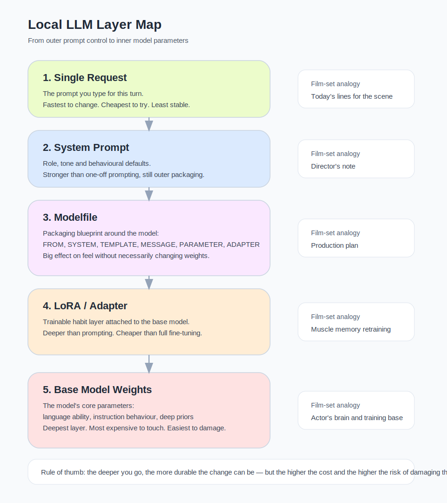

我一開始只是想抄一條看起來比較省力的路。

那時候我盯上的，是 Lexi。  
同樣是 Llama 3.1 8B，速度跟原版差不多，手感也沒散掉，但整體回答就是比較直接。這種差別很怪。你很難拿一句 benchmark 說清楚，可是用過幾輪之後，你會知道它不是同一種口氣。

我原本以為這件事不深。  
改一點 prompt，掛一層 LoRA，再不然做個小微調，應該差不多就到了。

後來真的一路跑下去，我才發現自己一開始連題目都切錯了。

我以為我在做一件事，叫做「改模型」。  
實際上，我是在不同樓層之間來回亂跑，卻一直把它們當成同一層。

有時候我只是換了台詞。  
有時候是在改導演給演員的角色小紙條。  
有時候是在重寫劇本格式。  
再往下，我開始碰演員的肌肉記憶。  
最底下那層，才是演員原本的大腦。

它們最後看起來都像「模型變了」。  
但那根本不是同一種變。

這篇是整個系列真正的起點。  
不是先教你打指令，也不是先上 LoRA 數學，而是先把地圖攤開。因為後來我學到一件很實際的事：如果你連自己到底改到哪一層都還沒分清楚，後面每一步都會花雙倍力氣，還不一定走對方向。

## 這不是平面問題，是一整棟樓

我後來找到一個最順手的理解方式。  
把整個本地 LLM 系統想成一個拍片現場。

單次請求，像演員今天臨時拿到的新台詞。  
System Prompt，像導演開拍前塞給演員的角色小紙條。  
TEMPLATE，是劇本格式，決定台詞、角色標籤、場記怎麼排。  
MESSAGE，像幾段示範演出，讓演員知道這齣戲平常怎麼講話。  
PARAMETER，比較像拍攝風格設定，節奏要保守一點，還是放一點，重複要不要壓住。  
把這些東西綁成一整份可重複使用的包裝藍圖，就是 Modelfile。

再往下，才輪到 LoRA / Adapter。  
這一層比較像改演員的肌肉記憶。不是重養一個人，而是針對某些反應方式，再做一層附加訓練。

最底下那層，是 base model weights。  
也就是演員原本的大腦與受訓底子。

這張圖一立起來，很多事情突然就不糊了。  
因為你真正該問的，不再是「我要不要改模型」，而是：

**我這次想改的，到底是哪一層？**

## 最外面那層，最容易讓人誤判

最淺的一層，其實就是你每次打進去的 prompt。

這一層非常好用。  
你今天想讓它短答，可以直接講。  
你想讓它先給結論，也可以當場要求。  
它像臨時台詞，來得快，也退得快。

它的好處很直白：便宜、快、壞了也最好收。  
問題也很直白：它不穩，而且不留下來。

今天你這樣寫，它今天配合你。  
明天你換一輪對話，或者自己忘了補那句要求，它就又回到原本那個樣子。

所以單次請求很適合做局部控制，  
不適合被誤認成「模型真的學到了」。

這是我一開始最常犯的錯。  
某次 prompt 效果很好，我就會高估它，覺得方向對了。其實很多時候只是那一次問法剛好踩中。

## System Prompt 比單次請求穩，但還是在外面

System Prompt 強很多。  
差別不在於它比較神，而在於它比較像預設角色設定，而不是臨時加台詞。

你可以把這一層拿來放：
- 語氣
- 語言偏好
- 回答習慣
- 預設角色
- 明確不要做的事

像是：
- 優先用繁體中文
- 技術問題先給結論
- 沒被要求時不要主動貼程式碼
- 不要亂補不確定的名詞

這些東西放在 system，比每次重打一遍合理得多。

但它還是外層。  
它會被上下文稀釋，會被模板包裝影響，也會被模型本身的慣性頂回來一些。  
所以它很有力量，但它還不是深層記憶。

## Modelfile 比很多人想的重

我一開始也把它看得太淺。

那時候我覺得 Modelfile 差不多就是 system prompt 的大一點版本。  
後來才知道，這樣看會把它看扁。

Modelfile 比較像整份拍片企劃書。  
它不是只放一張角色小紙條，而是把底模、模板、示範、參數、甚至 adapter 的接法都收進來。

也因為這樣，我後來對它的看法整個反過來。

如果你的目標是：
- 保住原版模型的聰明程度
- 保住速度
- 只改手感
- 讓它更像你想要的助理

那最先值得碰的，常常不是 LoRA。  
反而是 Modelfile。

這不是因為它比較高級。  
剛好相反。  
是因為它很有力量，但還沒開始動到底模的大腦。

## TEMPLATE 和 tokenizer，常常是那種不會叫的問題

如果 System Prompt 是導演紙條，TEMPLATE 就是劇本格式。

這一層最煩的地方在於，它很多時候不會直接報錯。  
你只是會慢慢覺得：怎麼變笨了？怎麼手感怪怪的？怎麼回答不順了？

後來我才真的意識到，很多看起來像底模不行、LoRA 不好、量化太重的問題，最後其實只是輸入格式根本沒對齊。

所以 tokenizer 和 chat template 雖然不在權重層，卻也絕對不是邊角設定。  
它們更像輸入協議。你平常不一定會一直想到它們，但一旦弄錯，整個系統會安靜地歪掉。

## MESSAGE 和 few-shot，不是規則，是示範

這一層我後來越用越喜歡。

有些風格你不一定想寫成硬規矩。  
你可能不想在 system prompt 裡列十條要求，只想讓模型看兩三段像樣的例子，自己抓到節奏。

這就是 MESSAGE 或 few-shot 最好用的地方。

它不像 system 那麼像明文規定，  
也不像 LoRA 那樣開始動肌肉記憶。  
它更像開拍前先給演員看幾段 sample，讓他知道這齣戲平常怎麼收、怎麼轉、怎麼講人話。

很多時候你只是想讓模型少一點空話、先講結論、別每次都展開成講義。  
這種東西，先補幾組示範，比急著去訓一輪 LoRA 更划算。

## PARAMETER 解的是手感，不是知識

temperature、top_p、repeat_penalty、num_ctx 這些東西很重要，  
但它們改的是表現方式，不是模型到底懂不懂什麼。

模型太發散，調低 temperature 有用。  
模型太愛重複，加一點 repeat penalty 也有用。  
但如果模型本身已經被訓歪了，這些參數救不回原廠狀態。它們頂多是在歪掉的表面上修修邊。

## LoRA 真正開始往裡走

LoRA 迷人的地方就在這裡。  
它不像 prompt 那麼淺，也不像 full fine-tune 那麼重。  
它很容易讓人以為自己終於找到一條兩全的中間路。

我後來最喜歡的理解方式，不是把 LoRA 當成「小模型」，而是把它當成一層附加在原模型上的習慣層。  
你保留演員原本的大腦，只針對某些出手習慣、某些反應口氣，再做一層訓練。

這聽起來很美。  
問題是，它不會因為叫 PEFT 就自動安全。

我後來真的跑過幾輪之後才知道，更深不等於更高級。  
如果資料太少、方向太偏、驗收又不夠，LoRA 很可能不是把模型拉向你要的穩定風格，而是把它拉進一種很奇怪的口音。

這是我自己親手踩過的坑。  
流程都成功了，訓練跑完了，merge 也成功了，量化也成功了，結果模型一開口還是整個跑掉。那時候我才真正把一件事學進去：

**會跑，不等於好用。**

## 最底下那層，才是原本的大腦

base model weights 是最深的一層。  
這裡放的是語言能力、知識分佈、對指令的反應習慣，還有很多你平常說不太清楚，但真的存在的底子。

也是最貴、最難碰、最容易把事情做壞的一層。

特別是當你的底模本來就是 instruction-tuned 模型時，這層很多東西其實已經被調得相對平衡。你不是在空白畫布上作畫。你是在一個本來就畫得不錯的作品上改筆觸。

所以我後來慢慢換回來的一個工作判準是：

**想保住原版模型的聰明程度，第一優先通常不是更深，而是先少碰權重。**

## 所以到底該先改哪一層

如果硬要把這篇壓成一個能拿來做決策的版本，我現在會這樣分。

你只是想試語氣、試格式、試回答長短，先從單次請求開始。  
你想讓整個模型預設比較直接、比較穩，先改 System Prompt / Modelfile。  
你想讓模型帶著比較長期的固定風格，而且手上也真的有夠乾淨的資料，再考慮 LoRA / Adapter。  
你想改的是會變動的事實與文件內容，不要急著往權重塞，先想外部記憶。  
只有當你真的知道自己在做什麼，而且也接受成本和風險，才去碰更深的 base weights。

這不是宇宙真理。  
但它至少比把所有事情都叫做「改模型」好多了。

## 我最後真的學到的是什麼

我一開始會一路鑽進 LoRA、merge、量化，說到底還是因為我太快把目標定成「我要做出一個像 Lexi 的東西」。

後來回頭看，才發現真正值得先學的根本不是某個 recipe。  
而是這張地圖。

因為很多時候，你不是不會改模型。  
你只是先把改動層級搞混了。

而一旦這件事先混掉，後面每一步都會變得又重又不準。

## 下一篇要回答的，不是更深，而是更準

地圖先畫到這裡。

但只知道樓層還不夠。  
接下來真正麻煩的問題才會出現：

如果不同樓層適合裝不同東西，那模型的「記憶」到底該放在哪一層？  
哪些東西該放在上下文，哪些該放在外部記憶，哪些才值得寫進 LoRA 或權重？

那就是下一篇。
