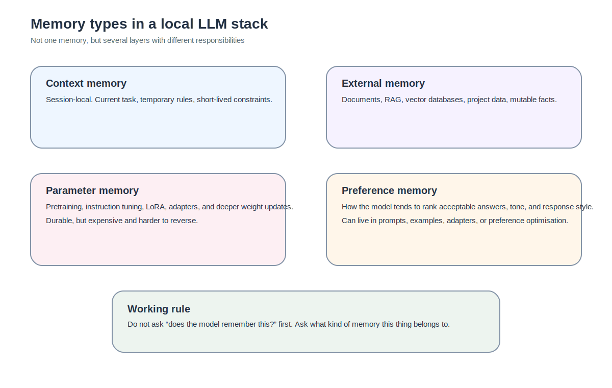

The first time I genuinely sorted out “memory” in AI, it was not because I had just finished a paper. It was because I had already mixed several layers together and paid for it.

At the time, my mental model was very flat. Either something was written into the model, or it lived outside the model. That split feels tidy. It is also not good enough. Once you actually work with local LLMs, the outer layers differ sharply from one another, and the inner layers do as well. Context windows, knowledge stores, system prompts, Modelfiles, LoRA, adapters: they can all look like ways of making a model “remember”, but they are not the same memory at all.

So this piece is not really about terminology management. It is about responsibility boundaries. Because if you do not know where memory is supposed to live, you will end up translating every problem into “should I fine-tune another layer?” Quite often, that is the wrong translation.

## AI does not lack memory. It has too many kinds of it.

I understand why people say that AI memory is fake. A great deal of what looks like memory is really just active context or external retrieval. But if you turn that observation into the whole story, you start making poor decisions very quickly.

Models clearly do learn things in parameters. Pretraining depends on that. Instruction tuning depends on that. LoRA depends on that. The real question has never been whether the model learns. It is what kind of thing is being stored in what kind of memory.

That is why I no longer find the simple inside/outside split particularly useful. A more workable breakdown, at least for this series, is: context memory, external memory, parameter memory, and preference memory.

## Context memory

This is the shallowest form, and the one most often mistaken for genuine long-term learning.

You tell the model, within a session, to begin with the conclusion and then divide the answer into principles, risks, and implementation. It complies. You add “be concise and direct, without sounding preachy”, and it complies again. That feels like memory.

What it really resembles is the actor still holding the pages for the current scene. It is local, immediate, and usually short-lived. Once the session ends, the context is truncated, or the instruction is no longer carried into the next interface, the behaviour can vanish.

That makes context memory extremely useful for local control, and poor as a place to rely on durable behaviour.

## External memory

This is the category that most closely resembles the “external notebook” metaphor.

Documents, retrieval systems, vector databases, external knowledge sources: all of these belong here. Their defining property is that the knowledge is not directly baked into the base weights. It is fetched at inference time and pulled back into the answer.

Its great virtue is mutability. Outdated data can be replaced. Incorrect data can be deleted. Documents can be re-indexed. That is a very different operating model from parameter updates, where rollback is far more expensive.

So whenever the thing you want to store is dynamic, revisable, or tied to living documents, external memory is usually the cleaner first choice.

## Parameter memory

This is closer to what people normally mean when they say the model has learned something.

It includes:

- the general linguistic and factual competence gained during pretraining;
- the dialogue habits gained during instruction tuning;
- behavioural tendencies introduced through adapters or LoRA;
- deeper changes introduced through partial or full fine-tuning.

Parameter memory is powerful because it is durable. It does not need to be restated every time. But it is expensive and hard to undo. Once something is written into parameters, you are no longer in the realm of light steering. You are altering the system at a deeper level.

That is why poorly scoped fine-tuning hurts so much. It is not that nothing happened. It is that something did happen, and it happened in the wrong place.

## Preference memory

This category is worth separating because it sits somewhere between pure knowledge and pure presentation.

It is not mainly about facts. It is not quite the same as long-term world knowledge. It is more about how the model tends to rank valid answers, how it speaks, and which style of response it leans towards when several answers could be considered acceptable.

Sometimes that is sufficiently handled by a system prompt. Sometimes a few-shot scaffold is enough. If not, you may need SFT, LoRA, or DPO. That is why preference memory is one of the easiest kinds of memory to place on the wrong floor. Too shallow, and it will not hold. Too deep, and you pay far more than you needed to.

## So where do system prompts, Modelfiles, and LoRA belong?

Saying that they are “all memory” is true in a way that is not operationally helpful.

A system prompt is best thought of as an outer-layer preference memory: more stable than a one-off request, but still firmly outside the parameter core.

A Modelfile is not one memory type so much as a packaging blueprint. It stabilises several outer layers at once: system messages, templates, example messages, runtime settings, and sometimes an adapter.

LoRA and adapters belong much more clearly to parameter memory. They do not rewrite the entire base model, but they do introduce trainable parameter changes that persist.

That distinction matters because all three can make a model feel “more stable”, while belonging to entirely different layers of the stack.

## Why continual learning is difficult

Continual learning is not difficult because researchers forgot that models may need to keep learning. It is difficult because new learning tends to interfere with prior competence.

That is the core of catastrophic forgetting: as a model absorbs new tasks, new preferences, or new data, its prior balance can erode.

This is precisely why Google Research’s Nested Learning work is interesting in this context. Their framing treats models as systems of nested optimisation problems rather than flat learners. The argument is not merely that forgetting is bad. It is that our usual way of thinking about learning and memory may already be too flattened to reason well about continual learning in the first place. I do not bring Nested Learning in as the hero of this series. I bring it in because it is a useful lens. It reminds us that memory is not a single switch. It is bound up with multi-level update rules, multi-level contexts, and multi-level optimisation.

## Catastrophic forgetting deserves more than one sentence

It is often reduced to “the model learns something new and forgets something old”. That is not wrong. It is also much too soft.

What actually happens in practice is that a fairly balanced model can be pulled into a narrower behavioural region by a small and concentrated dataset. That is why small-data LoRA and narrow partial fine-tuning can feel so promising and then so disappointing. They are not doing nothing. They are doing exactly what they were trained to do, just in a way that is often too narrow for the surrounding system.

A more honest metaphor is this: you are not gently tinting a canvas. You are pouring a cup of highly concentrated dye into a large bucket of water that was already balanced.

## Why Nested Learning belongs here, but not at the centre

I do not want Nested Learning to dominate this series, and I do not want to drop it into the text like a fashionable theory reference.

It belongs here because this piece is already about four related claims:

- memory comes in several forms;
- updates do not occur on a single flat plane;
- external memory and parameter memory are not interchangeable;
- continual learning fails because new and old competence interfere with one another.

Nested Learning gives those claims a broader theoretical frame. Google Research describes it as a way of viewing models as nested, multi-level optimisation processes, precisely to address catastrophic forgetting and continual learning limitations. That is useful here because it reinforces the idea that “memory” is not one thing. ## What belongs in which memory?

If I compress the whole piece into a working cheat sheet, it looks roughly like this:

### Context memory is good for
- the current task;
- temporary rules;
- short-lived format requests;
- constraints that matter only in this session.

### External memory is good for
- documents;
- knowledge bases;
- project-specific information;
- user data;
- facts that change over time.

### Parameter memory is good for
- linguistic ability;
- stable behavioural tendencies;
- deeper task style adjustments;
- things you do not want to reattach from the outside every time.

### Preference memory is good for
- ranking styles of answers;
- tone preferences;
- response ordering;
- the kinds of shifts DPO is trying to optimise.

The important part is not memorising the four boxes. It is avoiding the habit of pushing things into deeper memory before you have proved they belong there.

## When not to turn the problem into continual learning

A good counterexample keeps the map honest.

If all you want is for the model to default to Traditional Chinese, begin with the conclusion, and sound less windy, you are not necessarily facing a continual learning problem. You may just have a template mismatch, a weak system prompt, or a Modelfile you have not properly used yet.

In other words, not every desire for “more memory” is a call for deeper learning. Sometimes the thing is simply on the wrong floor.

## Where the series goes next

Once the memory question is cut more cleanly, the next practical question follows naturally: which tools actually touch which layers? Hugging Face, Transformers, PEFT, TRL, and Ollama all live somewhere in this landscape, but they are not the same kind of tool at all.

That is the next piece.
