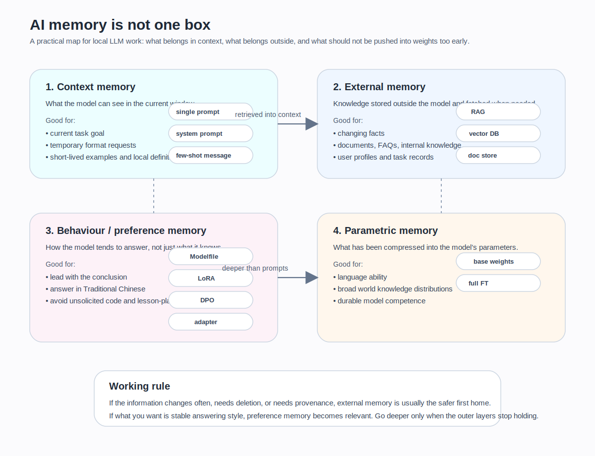

一開始有人跟我講那句話的時候，我其實有被打到。

他說，AI 的記憶都是假的。  
說穿了只是外掛筆記本。模型參數根本沒在學。

這句話不是完全錯。  
真正麻煩的地方，是它只對了一半。

因為如果你把它當成全部真相，後面幾乎所有判斷都會慢慢走偏。  
你會開始把：
- prompt
- 向量資料庫
- RAG
- LoRA
- system prompt
- 甚至 base weights

全部壓成同一團模糊的「記憶」。

而我後來真的動手跑過一輪之後，最想先講清楚的一件事反而是：

**AI 不是沒有記憶。麻煩在於，它根本不只一種記憶。**

## 我原本把它想得太二元了

我一開始很自然地把問題切成兩半。

不是寫進模型裡，  
就是放在模型外面。

這種切法很順。  
也很不夠用。

因為真的跑到工程現場之後，你會發現「外面」裡面其實差很多，「裡面」裡面也差很多。  
有些東西只是這輪對話暫時帶著。  
有些是掛在外部的可更新資料。  
有些則真的開始進到參數習慣。  
還有一些看起來像記住了，其實只是因為你在外層包裝得夠穩。

所以我後來比較願意用另一種分法。  
不是只分內外，而是至少先分四種。

## 第一種：上下文記憶

這是最淺、也最常被誤認成「模型記住了」的一種。

你在這輪對話裡告訴它：
- 之後請先給結論
- 我現在在談的是 LoRA
- 先不要講 DPO
- 用繁體中文

它接下來幾輪都照做。  
這當然很像記住了。

但它其實更像這場戲還沒演完，所以演員手上還拿著前面那幾頁劇本。

上下文記憶的特點就是：
- 來得快
- 很方便
- 一旦脫離這個 context，就未必還在

它不是假的。  
只是時效很短。

## 第二種：外部記憶

這一層就是很多人說的「外掛筆記本」比較接近的地方。

像：
- 文件庫
- RAG
- vector database
- 你額外掛進來的知識來源

這些東西都不直接寫進 base weights。  
它們比較像是模型在回答前，先去翻資料。

我後來很喜歡把它想成：  
不是演員真的背熟了，而是舞台邊放著一個超快的提詞機。

它的優點也很明顯：
- 好更新
- 好刪除
- 好追版本
- 不會每改一條資料就重訓整顆模型

所以只要你要存的是：
- 會變的事實
- 文件知識
- 組織內部資料
- 一段時間後可能要撤掉的資訊

外部記憶幾乎都比往權重裡寫來得健康。

## 第三種：參數記憶

這一層才比較接近大部分人直覺上講的「模型真的學到了」。

新資訊、新習慣、新偏好，開始真的反映在參數分佈上。  
這裡面又可以分深淺。LoRA 比較像一層附加習慣，full fine-tune 則更接近直接改大腦本體。

這種記憶一旦進去，好處是穩。  
壞處也是穩。

它不像外部記憶那麼好改、好刪、好追。  
你今天寫錯了，補救成本會高很多。

很多東西不是不能訓進去。  
是訓進去以後，代價未必值得。

## 第四種：行為或偏好記憶

這一層很容易被忽略，因為它看起來不像知識。

像是：
- 優先用繁體中文
- 技術問題先講結論
- 少一點空話
- 回答不要太像講義
- 口氣更像技術助理

這些東西不是世界知識。  
但它們也不只是這一輪上下文。

它們比較像模型長期的回答習慣。  
所以它可以落在幾個不同層：
- system / Modelfile
- few-shot
- LoRA
- 甚至更深的 preference tuning

這也是為什麼「記憶」這個詞一旦不拆開，後面很多討論都會混線。

## 所以 AI 記憶到底是不是假的

我現在比較願意這樣回答：

如果你把「記憶」只限定成「寫進 base weights 的東西」，  
那大部分你日常看到的 AI 記憶，當然都不算那種深記憶。

但如果你願意承認：
- 上下文也算一種短時記憶
- 外部可檢索資料也算一種工作記憶
- system / template / few-shot 也會穩定塑形
- LoRA / fine-tune 會改參數習慣

那說「AI 沒有記憶」就太粗了。  
它比較像是：

**AI 有很多種記憶，只是它們的時效、成本、可修改性和風險完全不同。**

## continual learning 真正難的地方，不是一直學，而是學了還不要忘

持續學習最難的從來都不是「讓模型再多吃一點新東西」。  
真正難的是，**你怎麼讓它學了新的，舊的又不要掉一地。**

這就是 catastrophic forgetting 會一直被提的原因。

你如果把所有東西都往參數裡塞，  
模型的確可能學到新的東西。  
問題是，你同時也可能把原本好好的東西洗掉。

這種風險在 base 已經很強、很平衡的 instruct model 上尤其值得怕。  
因為你不是在生肉上加知識。  
你是在一個已經調得還不錯的系統上，一邊補，一邊擾動。

## 真正該記住的，不是口號，而是分層

我後來真正被修正的，不是「參數記憶沒用」這種極端結論。  
而是另一件更實際的事：

**不要把所有記憶需求都用同一種機制解。**

有些東西本來就該留在外部。  
有些適合只放在當前上下文。  
有些其實只要 system / Modelfile 先處理。  
真的要動到參數，也得先想清楚你到底要的是穩定知識、行為習慣，還是偏好排序。

## 如果我現在要給一個真的能用的判準

我現在會這樣分。

你這一輪才需要的任務資訊，放上下文。  
會更新的事實、文件、產品資訊，放外部記憶。  
想穩定控制風格與角色，先試 system / Modelfile / few-shot。  
只有當你真的需要比較深、比較持久的行為傾向，才去想 LoRA 或更深的參數記憶。

這樣分的好處不是理論漂亮。  
是它比較接近工程成本。

因為你一旦把東西分對層，  
很多原本很重的問題，會突然不用訓練就能解。

## 反例也要先留著

這個分法很實用，但不是說外部記憶永遠最好，也不是說 LoRA 都不值得碰。

有些偏好真的會跨 session，而且你不想每次都靠 few-shot 壓。  
像這種比較穩定的回答習慣，往參數層走一點，可能就很合理。

所以真正該避免的不是深度本身。  
是還沒想清楚要存什麼，就急著往最深那層塞。

## 我後來換回來的一句話

如果把這篇只留一句，我現在會留這句：

**AI 不是沒有記憶。真正麻煩的是，它有很多種記憶，而你得先分清楚自己到底想讓它記住什麼。**

這句話聽起來很普通。  
但我其實是一路把模型、RAG、LoRA、system prompt 這些東西全混過一次之後，才真的把它想清楚。

## 下一篇就不是記憶，而是工具鏈

當記憶的層次先分開，下一個問題就會變得很現實：

好，就算我知道不同東西該放不同層。  
那我手上的工具，到底能碰到哪些層？

也就是說：
- Hugging Face 在哪裡
- Transformers 在哪裡
- PEFT、TRL、Ollama 各自又在幹嘛

這就是下一篇。
