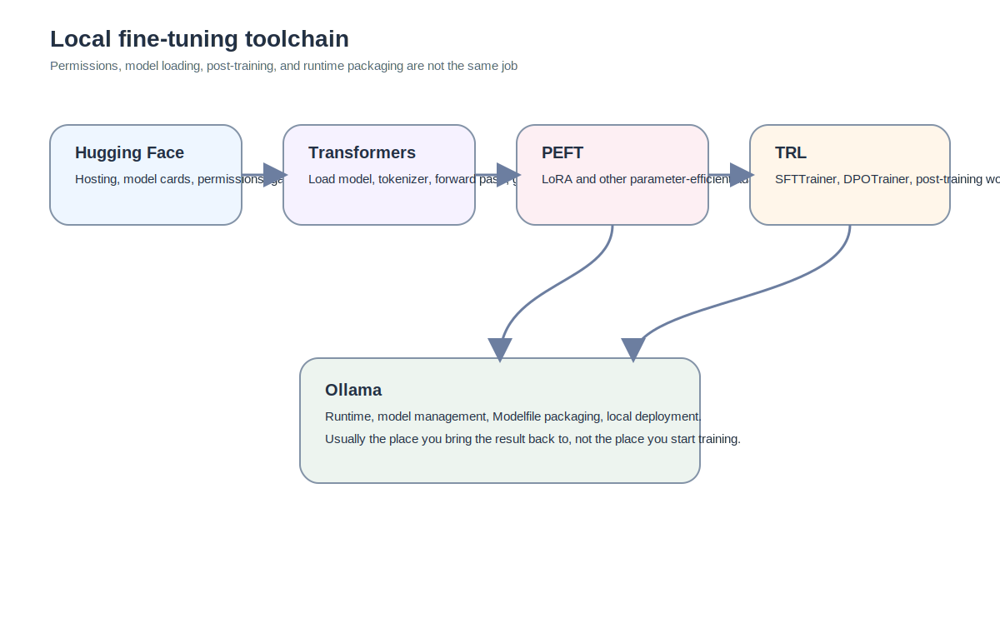

The first time I reached `python train_lora.py`, I did not fail on the GPU, and I did not fail on the loss curve. I failed on the toolchain.

It felt like arriving at a construction site only to realise I had not even picked up the helmet. The weights were not truly accessible yet. The package versions were not necessarily aligned. A logged-in Hugging Face account was not the same thing as actual gated access. That was the point at which I finally understood that local LLM fine-tuning is not a neat line of “get model, get data, write script, train”. First you negotiate with the toolchain. Only then do you earn the right to touch the model itself.

This piece is about drawing those boundaries properly. Because once everything that feels “model-related” is treated as the same class of tool, an astonishing amount of time gets wasted in the wrong places.

## Start with the most boring and most necessary thing: an isolated environment

If you only run the occasional notebook, installing a few packages into the system Python may not explode immediately. But once you begin proper local fine-tuning experiments, I treat environment isolation as the first step rather than an afterthought.

The reason is plain. You do not want one project’s dependencies quietly breaking another project. One directory needs a certain `transformers` version. Another expects a different `trl` release. You upgrade `peft` today, and a script that worked yesterday stops working in another folder tomorrow.

There is nothing romantic about `python -m venv .venv`. It simply gives a project its own experimental box. You know where the environment is, what belongs to it, where the boundary lies, and how to rebuild it if necessary.

It is dull, which is exactly why it gets skipped.

## Logging in is not the same as having the model

The first genuine wall I hit was a gated repository on Hugging Face.

People often think of Hugging Face as a model download site. That is not wrong, but it is too thin. It is also a permissions layer, a hosting layer, a model-card layer, and a point of integration for a wider ecosystem.

Once a model is gated, being logged in is not enough. Meta states this quite clearly on its Hugging Face Llama pages: access is tied to licence acceptance and approval, not merely to authentication. citeturn743259search16turn743259search4

That is why `from_pretrained()` can still return a 403 even when you are convinced you have already “logged in correctly”. The issue may not be the code at all. It may simply be that you do not yet have the right to load the model.

This sounds administrative. In practice it changes the entire pace of the project.

## What Hugging Face actually is in this pipeline

Hugging Face is best understood as a repository, an access point, and an ecosystem hub.

It provides:

- model hosting;
- dataset hosting;
- licences and permissions;
- model cards and metadata;
- integration with the wider stack, including `transformers`, `datasets`, `trl`, and `peft`.

It is not the trainer. But in many open-source workflows, it is still the entry gate. That is particularly true if you begin with `meta-llama/Llama-3.1-8B-Instruct`. Meta’s model card matters here because it does not just give branding language; it tells you that the 8B Instruct variant is instruction-tuned and intended for dialogue-oriented use cases. That affects your assumptions about prompting, formatting, and how much of the conversational behaviour already lives in the base. citeturn743259search0

## Transformers: the main toolkit for touching the model itself

Once access is sorted, `transformers` becomes the main resident of the workflow.

Its job is more straightforward:

- loading models;
- loading tokenizers;
- doing forward passes and generation;
- providing the general training skeleton;
- handling configuration and generation configuration.

People new to the stack often mistake `transformers` for the entire fine-tuning framework. It is better seen as the base toolkit for interacting with the model object itself. Many higher-level operations, including those in TRL and PEFT, are layered on top of it.

That is why apparent TRL problems often turn out to be tokenizer, template, or model-loading problems further down.

## Tokenizers and chat templates belong to the toolchain too

This is one of the most underestimated layers in practice.

A tokenizer is not merely a string splitter. For chat models, it often works together with the chat template to define the input contract. Meta provides prompt format guidance for Llama 3.1, and many parts of the Hugging Face stack implicitly expect you to respect the base model’s input format. citeturn743259search8turn743259search0

That means prompt-completion data and conversational data are not merely visual variants of the same thing. They are different representational choices. Both can be used for supervised training, but only if the trainer, tokenizer, and chat template agree on the shape of the input.

This is why a model can feel wrong without visibly failing. It may not be a LoRA problem. It may not be quantisation. It may just be the wrong script format.

## PEFT: not another model, but a way of adapting one cheaply

PEFT stands for Parameter-Efficient Fine-Tuning. The official documentation is very clear about the role of the library: it exists to adapt large pretrained models efficiently without updating all parameters. LoRA is one of the best-known techniques within that family. citeturn743259search10turn743259search2

So PEFT is not a new model and not a trainer. It is better thought of as a toolkit for altering parameters without paying the cost of full fine-tuning.

That also helps keep the concepts separate. LoRA does not tell you what the model should learn. It tells you how you plan to update parameters while trying to spend less.

## TRL: the post-training toolkit

Once you reach TRL, the question is no longer just “how do I load the model?” It becomes “what kind of post-training am I doing?”

The TRL documentation positions it as a library for post-training foundation models, with support for methods including SFT and DPO. In other words, it is not merely an RL tool, and not only for preference optimisation. It is a broader toolkit for post-training workflows. citeturn743259search9turn743259search13

That is why both of these live there:

- `SFTTrainer`
- `DPOTrainer`

TRL is the layer that answers questions about training method, data format, training logs, and post-training behaviour. It is not the layer that decides how the raw model object is loaded.

## SFTTrainer and DPOTrainer are not just different APIs

It is tempting to treat them as minor interface variants. They are not.

- **SFTTrainer** works with demonstration-style data and teaches the model how to answer.
- **DPOTrainer** works with preference pairs and teaches the model to favour one answer over another.

That means both belong to the method layer of post-training. They are not prompt layers, and they are not adapter layers. Once that is clear, you stop asking muddled questions such as whether LoRA or DPO is “deeper”.

## Ollama: not the training world, but the place where the result becomes usable

My view of Ollama became much cleaner over time.

At first it feels natural to think: if I run models in Ollama already, perhaps I should train them there too. In practice, that is rarely the cleanest route.

Ollama is excellent at:

- running models locally;
- managing models;
- packaging configurations through Modelfiles;
- importing already prepared artefacts.

It is not the natural place for the earlier construction work:

- loading raw HF weights and wiring trainers;
- attaching LoRA;
- running SFT or DPO;
- controlling training internals.

So the steadier workflow is often:

1. train in the Hugging Face ecosystem;
2. produce an adapter or merged output;
3. bring the result back into Ollama.

Once you accept that division, the whole stack becomes less confusing.

## Adapters, Safetensors, and GGUF: get their positions right first

These names tend to blur together when you first encounter them, so it is useful to separate them by role.

- **adapter / fine-tuned adapter**: the behavioural delta you trained, often via LoRA;
- **Safetensors**: a weight-file format commonly used in the HF ecosystem for adapters and merged models;
- **GGUF**: a model container format more commonly associated with local quantised inference.

These are not the same category of thing. An adapter is closer to content. Safetensors and GGUF are closer to containers or packaging formats.

That distinction matters later, when you reach merging, quantisation, and re-entry into Ollama.

## When not to wake up the whole toolchain

A counterexample keeps the tool story honest.

If your actual goal is simply to make the model shorter, more direct, and less fluffy, and you do not intend to alter parameters at all, you may not need to activate `transformers + peft + trl` in the first place. You may only need:

- a suitable instruct base;
- a sensible Modelfile;
- a few clean examples;
- some runtime parameter adjustments.

So the toolchain matters enormously. It just does not always need to be run to its deepest extent.

## Where the series goes next

Once the tooling is separated properly, the next question becomes much easier to ask cleanly: what exactly do SFT, LoRA, and full fine-tuning each change? Which are teaching methods, which are construction methods, and which actually reach the original base weights?

That is the next piece.
