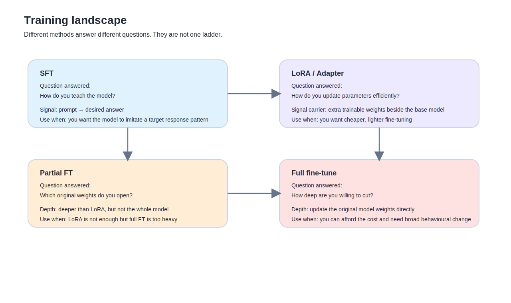

這一篇想先把一個很容易越用越糊的地方切開。

只要真的開始動手，這幾個詞很快就會在腦中攪成一鍋：

- SFT
- LoRA
- adapter
- full fine-tune
- partial FT

表面上它們都像在講「微調」。  
但如果把它們都壓成同一種事，後面幾乎一定會走偏。

最常見的偏法不是完全不懂，反而是懂一半。  
像是把 LoRA 當成一種訓練目標，把 SFT 當成一種模型形態，或者把 full fine-tune 理解成「LoRA 再深一點」。這些說法都不算完全離譜，但都不夠準。

我現在比較願意用一個很工地、也很老實的分法：

**SFT 回答的是你打算怎麼教。LoRA 回答的是你打算怎麼改。full fine-tune 回答的是你打算改多深。**

## 先把三條問題拆開

如果硬要濃縮，這一篇其實在處理三條不同問題。

第一條是：**你拿什麼訊號教模型。**  
第二條是：**你怎麼把可訓練參數接進去。**  
第三條是：**你到底動到多少原始權重。**

很多混亂都來自於這三條線被說成同一條。

### 第一條：教法
這裡講的是 SFT，還有下一篇要講的 DPO。

### 第二條：施工方式
這裡講的是 LoRA、adapter 這類 PEFT 路線。

### 第三條：手術深度
這裡講的是 partial FT 與 full fine-tune。

先切成這樣，後面很多名詞就不會互相撞車。

## SFT 是什麼

SFT 是 Supervised Fine-Tuning。

如果完全不走學術口吻，它做的事情其實很樸素：

你先給模型一批示範答案，  
再讓它學會看到類似題目時，往這種答案靠近。

所以它的核心不是「模型換了一種形態」，  
而是：

**你有一份示範資料，模型在模仿這份資料。**

資料最常見會長成兩種：

### 1. prompt-completion
- prompt
- completion

### 2. conversational
- messages
- assistant response

前面你一路做的 LoRA 小實驗，本質上就是在做 SFT。  
不是 DPO，也不是 RLHF。

## SFT 真正厲害的地方，不是它很複雜，而是它很直接

SFT 的優點就在這裡。  
它沒有太多花樣。你想讓模型學什麼，就直接給它長得像那樣的答案。

如果你的目標是：

- 先給結論
- 再分成原理 / 風險 / 做法
- 少一點說教
- 更像技術助理
- 繁體中文口吻更穩

那 SFT 很自然。

但它也有邊界。  
如果你要教的是很模糊、很偏排序感的偏好，例如：

- 同一題有兩個都不算錯的答案
- 但你就是更偏好 A，不喜歡 B

這時候 SFT 就不是最貼的工具。  
那是下一篇 DPO 的地盤。

## LoRA 是什麼

LoRA 是 Low-Rank Adaptation。PEFT 官方文件把它定義成一種用低秩矩陣分解來減少可訓練參數的方式，核心目標就是讓你不用打開整顆模型，也能有效微調大模型。

但如果你用工程語言來理解，LoRA 沒有那麼神祕。  
它更像是：

**在原本模型旁邊，接上一層可訓練的小義肢。**

所以前面那個「改演員肌肉記憶」的比喻是成立的。  
你不是重養一個演員，也不是只在外面塞一張角色小紙條，而是在不大動原本大腦的前提下，改一部分反應方式。

### LoRA 不是教法
LoRA 不是在回答：
- 你要拿什麼資料教模型
- 你在做 SFT 還是 DPO

LoRA 回答的是：
- 你要不要省參數
- 你要不要避免全量打開原始權重
- 你想把訓練成本壓到哪裡

所以說「LoRA 訓練」其實不夠準。  
更準的說法通常是：

- LoRA SFT
- LoRA DPO

也就是說，LoRA 是承載訓練的一種方式。

## adapter 是什麼

在你這整條路上，adapter 幾乎可以先用這樣的方式理解：

**它是掛在 base model 上的一層額外可訓練權重。**

LoRA 通常就是 adapter 類方法的一種具體實現。  
所以前面你一直訓出來的那些：

- `adapter_config.json`
- `adapter_model.safetensors`

本質上就是一組被 fine-tune 過的 adapter。

也因此，fine-tuned adapter 不是另一種模型。  
它比較像是：

- 基底還是原本那顆模型
- 你另外訓出一層可套上去的增量

這也是為什麼 adapter 可以不 merge。  
因為從設計上，它本來就可以跟 base model 分開存。

## LoRA SFT 是什麼

LoRA SFT 的意思就是：

**用 LoRA 這種 PEFT 路線，去做 supervised fine-tuning。**

你前面一路做的 baseline-small、qkvo-small、all-linear-small，本質上都是 LoRA SFT 實驗。

## full fine-tune 是什麼

full fine-tune 比較直接。

它不是在模型旁邊再掛一層小義肢。  
它是在回答：

**我這次就直接改原始權重。**

也就是說：

- 不是 base model 凍住
- 不是只加 adapter
- 而是直接打開底模本體來訓

這麼做的好處很直白：  
你真的能更全面地改模型行為。

代價也很直白：

- 更吃記憶體
- 更吃儲存
- 更吃訓練時間
- 更容易把原本底模的平衡整個拉動

## partial FT 是什麼

如果 LoRA 是一條保守路線，full fine-tune 是直接進深水區，  
那 partial FT 就是中間那段水。

它的意思不是整顆全開，  
而是只打開：

- 最後幾層
- 某些特定 block
- 或者像 `model.model.norm`、`lm_head` 這種比較靠近輸出的部分

它比 LoRA 深，因為它真的開始改原始權重。  
但它又比 full fine-tune 保守，因為你沒有全開。

## base model 到底是什麼

最白話的說法就是：

**它是你一切客製化行為的起點。**

如果你拿的是純 base 模型，它通常還比較像預訓練後的大腦底子。  
如果你拿的是 instruct 模型，它已經是經過 instruction tuning 的版本，會更適合對話與任務跟隨。

這也是為什麼你整條路都拿 `Llama-3.1-8B-Instruct` 來玩，而不是隨便換成另一顆 base。  
你要保住的，正是它那個 instruction-tuned 的平衡感。

## instruct 跟 base 有什麼不一樣

### base
比較像模型原始的大腦底子。

### instruct
比較像已經做過一輪「你應該怎麼跟人互動、怎麼遵循指令」的版本。

所以在實務上：

- base 比較像 raw material
- instruct 比較像已經磨過一輪的成品底座

## LoRA 訓完後，模型到底有沒有「學到」

有，但要講準。

如果你問的是：

> 模型有沒有因為 LoRA 微調而改變行為？

有。  
不然 adapter 根本沒有存在意義。

但如果你問的是：

> 這種學到，和 full fine-tune 那種直接改原始權重，是不是同一種深度？

不是。

LoRA 的「學到」比較像：
- 在 base model 外再加一層可學的增量
- 行為變了
- 但 base model 本體沒有被整顆改寫

## 已客製化的 Llama 能不能再疊一層 LoRA

可以，概念上是可行的。  
但工程上要注意兩件事：

### 1. 疊得上，不等於值得疊
多一層 adapter，代表：
- 更複雜的驗收
- 更難判讀到底是哪層在造成怪結果

### 2. 先把主力版本做穩，比一直往上堆更重要
這個判準你前面已經用實作證明過了。  
流程很容易越堆越花，品質卻不一定更好。

## 為什麼很多人會想先用 LoRA

因為它剛好卡在一個很誘惑的位置。

- 比 prompt 深
- 比 full fine-tune 輕
- 在本地上也比較有機會跑得動

所以它看起來像一條漂亮的中間路。  
問題只是，中間路不代表安全路。

LoRA 很有用，但它不會自動幫你保住原版模型的平衡。  
資料窄、資料少、驗收晚、掛載範圍太大時，  
它照樣能把模型往奇怪的方向推。

## 什麼時候不要急著用 LoRA

如果你的目標只是：

- 保住原版能力
- 回答更直接
- 少一點廢話
- 格式更穩
- 不想碰太深的權重層

那很多時候你該先碰的，其實不是 LoRA，  
而是：

- system prompt
- few-shot
- Modelfile
- runtime parameters

## 這篇最後該留下來的一句話

**SFT 回答的是你怎麼教，LoRA 回答的是你怎麼改，full fine-tune 回答的是你改多深。**

這三件事一拆開，  
後面整條路會乾淨很多。
