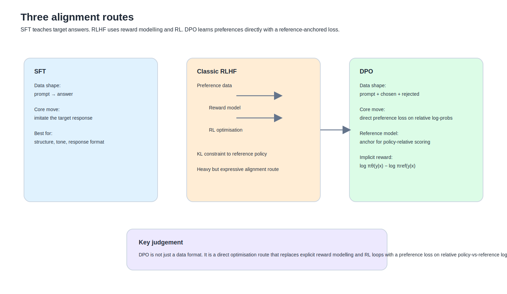

如果前一篇是在切開 SFT、LoRA、partial FT 與 full fine-tune 各自回答什麼問題，那這一篇要接著處理另一條很容易被講扁的線：

這就是 DPO 進來的地方。

很多文章會先給你一句很好記的定義：

- SFT 是教模型怎麼回答
- DPO 是教模型更偏向哪個回答

這句話沒有錯，而且很好用。
但如果整篇只停在這裡，DPO 其實會被講得太薄。

因為 DPO 真正厲害的地方，不只是它用 `chosen / rejected`。
它真正厲害的地方是：

**它把原本 RLHF 那條又長又重的路，改寫成一個可以直接在離線偏好資料上最佳化的 loss。**

也就是說，它不是比較潮的資料格式。
它是一條訓練目標和推導方式都不一樣的路。

---

## 先用最白話的方式講一次

如果先不碰公式，最白話的差別還是這句：

### SFT
你給模型一份你覺得理想的答案。
模型學會往那個答案靠近。

### DPO
你給模型兩份答案：
- `chosen`
- `rejected`

模型學的不是「把 chosen 背起來」，
而是：

**在同一個 prompt 底下，讓 chosen 的相對位置高於 rejected。**

這裡的關鍵字不是「正確答案」，
而是「偏好排序」。

這也是為什麼 DPO 特別適合處理這種問題：

- 兩個答案都不算完全錯
- 但你就是偏好其中一種風格
- 例如更直接、少說教、更有結構、比較不像在講課

如果你硬用 SFT 去做，
你可以做到一部分。
但 DPO 會更貼那種「排序感」本身。

---

## 為什麼 DPO 會一直跟 RLHF 綁在一起講

因為 DPO 不是憑空冒出來的。
它是在回答 RLHF 世界裡一個很老、也很重的問題。

傳統的 RLHF 路線，粗略看通常像這樣：

1. 先收集人類偏好資料
2. 用這些偏好資料訓一個 reward model
3. 再用 RL 方法，例如 PPO，去更新 policy model
4. 同時還要控制模型不要漂離 reference policy 太遠

這條路不是不能走。
但它有幾個現場上非常真實的痛點：

- 工程鏈很長
- reward model 本身就要另外訓
- RL 階段不穩定
- 超參數調整不友善
- 訓練與取樣成本都不輕

DPO 論文最核心的主張，就是它不是只說「我們有個簡化版」。
它更強的說法是：

**帶 KL 約束的 RLHF 目標，可以被重新參數化成一個直接在偏好資料上最佳化的目標，而不需要顯式 reward model，也不需要再跑 RL 迴圈。**

這就是它和「只是比較方便的 ranking loss」最大的差別。

---

## RLHF 在數學上原本想做什麼

主文不需要把整條 RLHF 推導搬完，
但至少應該讓讀者知道原始任務長什麼樣。

可以先把它很粗地理解成：

> 找一個模型策略 $\pi$，讓它平均來說更常產生高 reward 的回答，
> 但同時不要偏離原本的 reference model $\pi_{ref}$ 太遠。

如果你想看數學形式，它大致長這樣：

$$\max_{\pi} \; \mathbb{E}_{x \sim D,\; y \sim \pi(\cdot|x)} \left[r(x,y)\right] - \beta \, D_{KL}\big(\pi(\cdot|x)\;||\;\pi_{ref}(\cdot|x)\big)$$

先不要被符號嚇到。
這一行其實只是在說兩件事：

### 第一件事
你想讓模型產生高 reward 的回答。
也就是更符合人類偏好的回答。

### 第二件事
你又不希望它為了追那個 reward，
整顆模型漂離原本 reference model 太遠。

所以這個目標其實是：
- 一手拉高偏好品質
- 一手壓住漂移

DPO 的厲害之處，就在於它不是把這個問題丟掉，
而是把它換了一種更能直接訓的寫法。

---

## Bradley–Terry 是什麼，為什麼 DPO 會提到它

這裡是很多 DPO 文章真正開始變硬的地方，
也是這篇不能再閃過去的地方。

如果你要處理「A 比 B 更好」這種偏好對，
最常見的一種統計模型就是 **Bradley–Terry model**。

它的核心很直覺：

如果你給每個候選答案一個 reward，
那麼「chosen 比 rejected 更被偏好」的機率，可以寫成一個 pairwise probability。

用最常見的寫法，可以想成：

$$P(y^+ \succ y^- \mid x) = \sigma\big(r(x,y^+) - r(x,y^-)\big)$$
意思是：

- $x$ 是 prompt
- $y^+$ 是 chosen
- $y^-$ 是 rejected
- $r(x,y)$ 是某種 reward
- $\sigma$ 是 sigmoid

這個式子很重要，因為它把「偏好」這件很感性的事，
變成一個可以最大化 likelihood 的東西。

也就是說：

**偏好不是只能靠直覺講。它可以被寫成 pairwise preference probability。**

Cameron 那篇對這段講得很好，因為它把 Bradley–Terry 擺回「偏好不是口號，而是可訓的機率模型」這個位置。

---

## 傳統 reward model 在這裡本來扮演什麼角色

在 RLHF 裡，最常見的做法是：

- 先訓一個 reward model
- 讓它學會對 completion 打分
- 再把這個打分拿去推 policy

也就是說，在 Bradley–Terry 寫法裡，
那個 $r(x,y)$ 通常是顯式 reward model 給的。

DPO 最有意思的地方就在這裡。

它說：

**不一定要真的再訓一顆 standalone reward model。你可以把 reward 重新參數化成 policy 和 reference policy 的相對 log-prob 結構。**

這就是論文標題那句「Your Language Model is Secretly a Reward Model」真正要表達的意思。
不是說 policy model 真的變成另一顆 reward head。
而是說：

**在這個推導下，policy 的相對機率可以扮演 implicit reward 的角色。**

---

## DPO 怎麼把 reward 改寫成 implicit reward

這一段如果不補，part 05 永遠不會真的站穩。

原論文的關鍵推導之一，是從帶 KL 約束的 RLHF 最優 policy 形式出發，把 reward 重寫成與 policy / reference policy 有關的形式。

你可以先用概念版記住：

$$r(x,y) \propto \log \pi_{\theta}(y|x) - \log \pi_{ref}(y|x)$$
更精準一點地說，
它還會帶到 $\beta$ 與某些對 $x$ 有關、最後在 pairwise 比較裡會消掉的項。

但對主文最重要的理解是：

**DPO 把原本需要由 reward model 顯式預測的 reward，改寫成 policy 與 reference policy 的相對 log-prob 差。**

也就是說，
你不再需要先另外訓一顆 reward model，
因為這個「誰該比較高」的訊號，可以直接從目前 policy 和 reference policy 的相對機率裡被取出來。

這就是所謂 **implicit reward**。

---

## DPO loss 最小可懂公式

這一段我認為是新版 part 05 必須留下來的骨架。

TRL 文件直接把 DPO loss 寫成：

$$\mathcal{L}_{DPO}(\theta) = - \mathbb{E}_{(x,y^+,y^-)}\left[\log \sigma\left(\beta\left[\log \frac{\pi_{\theta}(y^+|x)}{\pi_{ref}(y^+|x)}-\log \frac{\pi_{\theta}(y^-|x)}{\pi_{ref}(y^-|x)}\right]\right)\right]$$

先逐個拆開：

- $x$：prompt
- $y^+$：chosen completion
- $y^-$：rejected completion
- $\pi_{\theta}$：你正在訓的 policy model
- $\pi_{ref}$：reference model
- $\sigma$：sigmoid
- $\beta$：偏好壓力強度的超參數

這個式子表面上像很多數學。
但它其實只是在做一件很直白的事：

### 它在比較兩個相對分數

第一個是：
- chosen 在當前 policy 裡的 log-prob
- 相對於 reference model 的位置

第二個是：
- rejected 在當前 policy 裡的 log-prob
- 相對於 reference model 的位置

如果 chosen 這邊的相對分數更高，
loss 就更小。
如果 rejected 的相對位置還太高，
loss 就會逼你把它壓下去。

所以更白話地講：

**DPO 不是把 chosen 背起來，而是在訓模型：讓 chosen 相對 reference 的位置，贏過 rejected 相對 reference 的位置。**

---

## 為什麼很多人會說它像 binary classification 或 binary cross-entropy

因為它真的有那個味道。

你可以把它想成：

- 我現在有一組 pair
- 目標是讓 chosen 勝過 rejected
- 然後我用 sigmoid + log loss 去最大化這件事

所以很多教學文會說：
DPO 可以被理解成一種偏好對上的 binary classification 目標。

這樣講是有幫助的，因為它讓新手能先抓住：

- 不是 RL sampling loop
- 不是 PPO
- 比較像離線資料上的 pairwise logistic objective

但它又**不只是普通 BCE**。

因為這個分類不是直接對 raw logits 打 label，
而是建立在：

- policy vs reference 的相對 log-prob
- chosen vs rejected 的 pairwise 比較
- implicit reward 的重參數化

這就是為什麼「它像 binary cross-entropy」是好的入口，
但如果只停在這裡，又會太薄。
Cameron 和 SuperAnnotate 都有提到這層教學直覺，但如果要寫成更耐看的技術專欄，這裡一定要再往前一步。

---

## reference model 到底在幹嘛

前一版我只把它寫成「錨」，那個說法不算錯，但太軟。

更精準的說法是：

**reference model 提供了一個基準分布，讓 DPO 比較的不是單純的 policy log-prob，而是相對於原始基準後的偏移量。**

這有兩個後果。

### 第一個後果
它幫你保留了「不要漂太遠」這件事。
因為你不是只看 policy 自己有多喜歡 chosen，
你是在看 policy 相對 reference 後，到底往哪邊偏。

### 第二個後果
它讓 implicit reward 變得可定義。
也就是前面那個：
$$\log \pi_{\theta}(y|x) - \log \pi_{ref}(y|x)$$
這不是裝飾性的差分。
它就是整個 DPO loss 的核心骨架之一。

TRL 文件裡那些 log 指標，也正是沿著這個思路定義的。它直接把：

- `rewards/chosen`
- `rewards/rejected`
- `rewards/margins`

都寫成由 policy 與 reference 的相對 log-prob 推出的 implicit reward 指標。

---

## β 在這裡不是 learning rate，而是偏好壓力旋鈕

這個地方如果只寫「β 控制偏好強度」還是不夠。

更完整一點的理解是：

- $\beta$ 越大，模型對 chosen / rejected 的相對差距會被放大得更兇
- $\beta$ 越小，這種偏好壓力會更保守

所以它不像 learning rate 那樣直接控制每一步走多大。
它比較像是在控制：

**這個 preference margin 被看得有多重。**

也因此，
$\beta$ 的作用不是「調快調慢」，
而是「讓模型對偏好差異有多敏感」。

---

## DPO 屬於哪一層

這題你前面問得非常好，而且我覺得值得在新版繼續留著。

### DPO 不屬於 LoRA 層
LoRA 是參數更新方式。

### DPO 也不是 base weights 的名字
它不是某個模型形態。

### DPO 真正屬於訓練方法層
它回答的是：
- 你拿什麼訊號教模型
- 你怎麼用偏好資料最佳化 policy

所以你這次真正在做的事情，不是模糊的「訓了一顆 DPO 模型」，
而是：

**用 LoRA 承載的 DPO。**

這句話之所以重要，是因為它讓：

- SFT / DPO
- LoRA / adapter
- partial FT / full FT

這三條線重新站回各自的位置。

---

## SFTTrainer 和 DPOTrainer 差在哪裡

如果只說「API 不一樣」，那等於什麼都沒說。

### SFTTrainer
它比較像在處理：
- prompt
- answer
- conversational demonstration

它的核心問題是：

**模型能不能學會模仿你示範的答案。**

### DPOTrainer
它在處理：
- prompt
- chosen
- rejected

它的核心問題則是：

**模型能不能把 chosen 的相對位置推到 rejected 之上。**

也就是說，
SFTTrainer 和 DPOTrainer 不是同一台機器換個名字。
它們在吃的資料、最小 loss 結構、log 指標，全部都不一樣。

---

## 什麼時候用 SFT，什麼時候用 DPO

這裡我現在會講得比舊版更乾淨。

### 比較適合 SFT 的時候
當你要教的是：
- 答案骨架
- 口氣
- 結構
- 格式
- 「一個理想答案看起來長什麼樣」

例如：
- 先給結論
- 再分成原理 / 風險 / 做法
- 技術問題少點說教
- 繁體中文更穩

這些都很像示範資料問題。

### 比較適合 DPO 的時候
當你要教的是：
- 偏好
- 排序
- 「兩個都不完全錯，但我更喜歡這個」

例如：
- 都答對了，但你比較喜歡更直接的
- 都合理，但你不喜歡 lecture 味太重的
- 都有資訊，但你更偏好先講結論、少繞路的版本

這時候 DPO 會比 SFT 更貼。

---

## 我前面做的事情，哪些是 DPO，哪些不是

這裡新版要講得更清楚。

### 不是 DPO 的部分
前面很長一段：
- baseline-small
- qkvo-small
- all-linear-small
- all-linear-last-half-small
- partial FT

這些都還是：
- LoRA SFT
- 或 partial FT

也就是說，它們還在示範式監督微調的世界裡，
只是參數更新方式不同、深度不同。

### 真正進到 DPO 的部分
是你後面開始：

- 寫 `dpo_train.jsonl`
- 準備 `prompt / chosen / rejected`
- 換成 `DPOTrainer`
- 再用 base vs DPO 的 chosen/rejected margin 去驗收

從那一刻開始，
你才真的進到 preference optimization 的世界。

---

## 你兩輪 DPO 實驗，怎麼對上理論

我覺得這是新版 part 05 最值錢的地方。
因為這不是引用別人的結論，這是你真的跑過之後，理論和現場接上的地方。

### 第一輪
- 4 筆資料
- 1 epoch
- 非常保守的 LoRA 設定
- 結果：流程通了，但 margin 幾乎只小幅移動

### 第二輪
- 擴到 12 筆資料
- 2 epochs
- 偏好更集中
- 結果：還是通了，但 margin 仍然只小幅變動

如果只用「感覺」來看，
有人可能會說：

> 那 DPO 沒什麼用啊。

但如果你現在回頭用理論來看，
這個結果其實非常合理。

### 為什麼合理

#### 1. 你的 base 本來就不差
你用的是 `Llama-3.1-8B-Instruct`。
它不是一顆沒打磨過的 raw base。
所以很多 chosen 方向，它本來就不會完全排斥。

#### 2. 你的資料量非常小
12 筆對 smoke test 很夠，
對 8B 模型要產生明顯偏好位移，其實還是很有限。

#### 3. 你的 LoRA scope 很保守
- `r=4`
- `lora_alpha=8`
- 常常只掛比較核心但有限的模組

這種設計很安全，但自然不會讓偏好暴衝。

#### 4. 你用的驗收方式很誠實
你不是只問它一題「感覺變好了沒」。
你是直接看 chosen / rejected 的相對 log-prob margin。

而這恰恰就是 DPO 本質上最該看的東西。

所以你這兩輪實驗真正證明的不是：
- DPO 沒用

而是：

**在小資料、保守 LoRA scope、強底模的條件下，DPO 造成的是可觀察但有限的 preference shift。**

這個結論非常真實，而且比那種「DPO 超神」的寫法成熟得多。

---

## 這一輪實驗算成功嗎

我現在還是維持那個判斷，但新版可以講得更準：

**這是一個成功的 DPO 實作驗證，也是一個很誠實的效果驗證，但還不是最終成品驗證。**

### 成功的是
- 你真的跑通了 DPOTrainer
- 你真的準備了 preference pairs
- 你真的把 adapter 掛回 base model
- 你真的用 DPO 該看的 margin 去驗收

### 還沒做到的是
- 資料量還不足以讓偏好大幅位移
- LoRA scope 仍偏保守
- 距離「可部署的 DPO 成品」還有距離

這個判斷比簡單說成功或失敗都更準。

---

## part 05 最後真正該留下來的幾句話

如果只留一條最白話的：

**SFT 教模型怎麼答，DPO 教模型更偏向哪個答案。**

如果留一條比較技術版的：

**DPO 不是只是 chosen / rejected 的資料格式，它是把帶 KL 約束的 RLHF 目標，重寫成能直接在離線偏好資料上最佳化的 loss。**

如果留一條最像這整個 session 真正學到的：

**DPO 能把偏好往你要的方向推，但它不會憑空把模型變成另一個人；它推多遠，取決於資料規模、偏好一致性、base model 底子、LoRA scope，以及你怎麼驗收。**

我覺得這三句放在一起，才是這篇真正完整的收尾。
