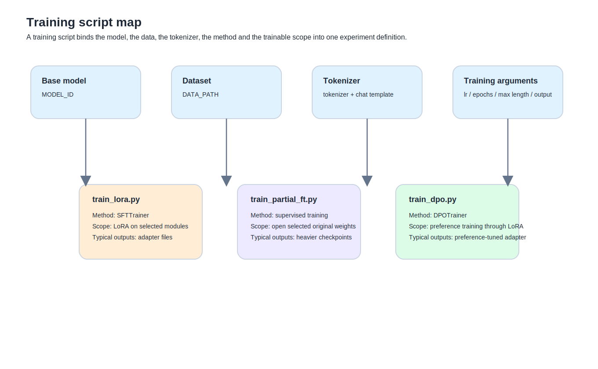

The first time I opened `train_lora.py`, I did not think I was looking at anything especially important.

At that point it felt more like a messy construction list.  
Load the model here, read the data there, set a few parameters, hand everything to a trainer and let Python do the rest. It looked like a pile of settings.

It was only after walking through baseline, qkvo, all-linear, last-half, then `train_partial_ft.py`, and eventually `train_dpo.py`, that I started to correct that view.

A training script is not a command memo.  
It is much closer to this:

## What a training script is actually doing

If I had to compress it into one line:

**a training script turns all the prerequisites of a fine-tuning experiment into something executable, repeatable and comparable**

That means a script is usually binding together at least these threads:

- which base model you begin from
- what data you use to teach
- how the tokenizer turns text into something the model can consume
- whether the method is SFT or DPO
- whether LoRA is involved
- where LoRA is attached
- how many original weights are opened
- how fast, how long and how wide the run is allowed to be

## Why writing a script is enough to drive training

Training is not a ritual. It just needs all of its conditions stated explicitly:
- which model
- which data
- which tokenizer
- which trainable parameters
- which objective
- which trainer
- where outputs should go

Once those choices are written down in Python, the libraries do the rest:
- Transformers
- PEFT
- TRL
- datasets

## What a minimal LoRA SFT script usually contains

### 1. `MODEL_ID`
This is not just a string.  
It decides which brain you are starting from.

### 2. `DATA_PATH`
Not just a path.  
It decides what curriculum you are teaching from.

### 3. Tokenizer setup
The tokenizer is not decorative.  
It turns human language into tokens, and with chat models it often participates in applying the chat format itself.

### 4. Model loading
This section tells the runtime:
- which model
- which precision
- which device

### 5. `LoraConfig`
This is where the script starts deciding how the adapter will be attached.

### 6. Trainer choice
If you are doing SFT, this is often `SFTTrainer`.  
If you are doing DPO, this becomes `DPOTrainer`.

### 7. Training arguments
This section controls:
- learning rate
- epochs
- batch size
- gradient accumulation
- max length
- output path

## What `MODEL_ID` is really deciding

It is doing something much more structural:

**every later adaptation will be measured as a deviation from this starting brain**

That is why access to `meta-llama/Llama-3.1-8B-Instruct` mattered so much in your workflow.

## Why `DATA_PATH` is more than file location

It is deciding:
- whether this is demonstration training or preference training
- whether you are teaching structure or preference
- whether the whole run is grounded on clean or fragile supervision

## Why tokenizer and chat template keep appearing together

Tokenizers are often mistaken for glorified word splitters.

In chat models they are doing something more important:

**they help turn dialogue into the exact sequence format the model expects**

That is why chat templates matter.

## Why `LoraConfig` matters so much

This is the point where the script begins to define the update route rather than merely setting the stage.

### `r`
A key capacity knob for LoRA.

### `lora_alpha`
A scaling factor for LoRA influence.

### `lora_dropout`
A regularisation term.

### `bias`
Whether bias terms are included in training.

### `task_type`
Tells PEFT what kind of model task you are dealing with.

### `target_modules`
It answers:

**where exactly inside the model LoRA is being attached**

## What `q_proj / k_proj / v_proj / o_proj` actually are

They are key projection layers in the transformer attention stack.

Your own route:
- `q_proj + v_proj`
- then `qkvo`
- then `all-linear`

was really exploring one question:

**how wide should the LoRA attachment scope be?**

## Who defines the “all-linear seven modules”

PEFT can expose a shorthand like `"all-linear"`, but the concrete modules that get matched still depend on the model architecture.

## What `layers_to_transform` and `layers_pattern` are for

### `layers_to_transform`
Answers:
- on which layers should the target modules be modified?

### `layers_pattern`
Answers:
- how should the model’s layer structure be matched correctly?

## Why you moved from baseline to qkvo to all-linear to last-half

Because you were really exploring two variables at once.

### 1. Attachment width
From:
- a small attention subset
- to a broader attention subset
- to a wider linear scope

### 2. Attachment depth
From:
- all layers
- to only the later half

## What `train_partial_ft.py` is doing

It is no longer only attaching an adapter.  
It is starting to open original weights.

It is deciding things like:
- which layer blocks become trainable
- whether to open `model.model.norm`
- whether to open `lm_head`

## Why `model.model.norm` and `lm_head` show up

### `model.model.norm`
The normalisation layer near the output end of the model.

### `lm_head`
The output head that maps hidden states to vocabulary logits.

They sit close to final output behaviour.  
That is why opening them can be behaviourally noticeable. It is also why they are expensive.

## Why `for block in model.model.layers[-4:]` uses four layers

You opened the final four layers not because four is theoretically privileged, but because it was a practical compromise:
- more expressive than opening just one
- safer than opening everything
- still somewhat survivable on the machine you had

## What `learning_rate=5e-6` really means

`5e-6` means:
- 5 × 10^-6
- or 0.000005

It controls how large the parameter update step is during training.

## What `num_train_epochs=2` means

An epoch is simple:

**one full pass through the dataset**

## What `max_length`, `gradient_accumulation_steps` and `dataloader_pin_memory=False` are doing

### `max_length`
How much text each training example is allowed to occupy.

### `gradient_accumulation_steps`
A way of accumulating gradients across multiple smaller steps before an update.

### `dataloader_pin_memory=False`
In your MPS runs it often just added clutter or warnings rather than helping much, so disabling it kept things cleaner.

## Were you training an adapter or doing LoRA?

The most precise answer is:

- you were training a **LoRA adapter**
- the output was a **fine-tuned adapter**
- the route was **PEFT**

## What `compare_lora.py` is for

It is a sanity-check tool:
- same base model
- different adapters
- same prompts
- compare behavioural outputs

Training logs do not tell you everything.  
Loss alone will not tell you when a model starts hallucinating terminology, or when the intelligence feel drops.

## Is comparison necessary?

If your only question is whether the pipeline ran, no.

If your question is which version should actually survive, yes.

## The one thing this piece should leave behind

**a training script is not just a pile of settings. It is the document that binds the model, the data, the tokenizer, the method, the trainable scope and the training rhythm into one experiment definition.**

#