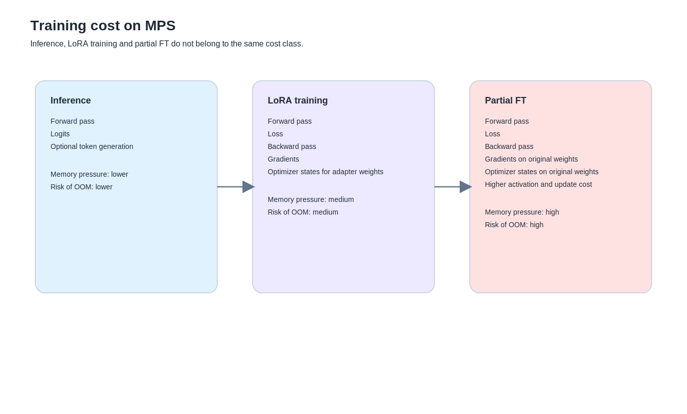

到了這裡，事情終於開始有點像真正的工地。

因為前面幾篇還能靠地圖、框架、分層把世界整理乾淨。
這一篇不行。
這一篇要處理的，是你真的開始跑訓練之後，最容易讓人懷疑人生的那些問題：

- 為什麼這麼慢
- 為什麼看起來像卡住
- 為什麼有些 warning 不致命，有些卻是大坑
- 為什麼 LoRA 還勉強能跑，partial FT 一開就開始爆
- 為什麼明明只是 2.7% 的權重，機器還是被拖進泥巴
- 為什麼 generate 常常像死掉，結果只是慢得很誠實

這一篇如果只留一個總結，我會先把它講在最前面：

## 為什麼訓練比推理重這麼多

這件事如果只說「因為模型很大」，不算錯，但不夠用。

你前面真正碰到的痛，不只是模型大。
而是**訓練在做的事，比推理多太多**。

### 推理在做什麼
最核心的是：
- forward pass
- 算 logits
- 再往後生成下一個 token

如果只是單次 forward，成本其實還算單純。
你前面用 DPO adapter 做 `forward pass only`，就是很典型的例子。
模型不是完全不重，但至少可以跑完、吐出 logits。

### 訓練在做什麼
訓練除了 forward，還要多扛幾件事：

- loss 計算
- backward
- 梯度保存
- optimizer state
- 權重更新

也就是說，訓練不是「把推理做很多次」。
它是把整個計算圖留住，然後再往回推、再更新。

這也是為什麼一樣是 8B：
- 推理你可能覺得「還能忍」
- 訓練卻很快變成「這台機器是不是在恨我」

---

## loss 是什麼，為什麼會有

這個問題很新手，但其實很重要。

最白話的講法就是：

**loss 是模型這一輪答得有多偏離你想要的答案的數值化版本。**

訓練需要一個可以往下優化的目標。
模型不能只知道「差不多吧」，它得把差距壓成一個數字，這樣 backward 才知道往哪裡推。

### 在 SFT 裡
loss 比較像：
- 你的答案跟示範答案差多遠

### 在 DPO 裡
雖然表現形式不同，但本質上也還是：
- 你的偏好目標和目前模型偏好之間差多遠

所以 loss 不是裝飾性的 dashboard 數字。
它是訓練流程裡真的會驅動參數更新的那個核心指標。

---

## 但 training loss 為什麼不能直接等於品質

這件事你前面其實已經自己證明過。

有些 LoRA 版本：
- loss 跑得出來
- 訓練也完整結束
- 檔也成功存了

結果部署回去之後，模型還是：
- 變笨
- 亂補名詞
- 口氣怪掉
- 整體智力感往下掉

這就是為什麼我一直不想把 loss 寫成主角。

loss 很重要，但它只是在說：

**模型對這份訓練資料，擬合得怎麼樣。**

它沒有保證：
- 外推仍然穩
- 部署後還像原版
- 用在真實 prompt 上依然好用

所以真正穩的做法永遠是：
- 看 loss
- 也做 compare
- 也做部署後驗收

---

## 為什麼 LoRA 訓練那麼久

你前面在 Mac 上跑 LoRA，體感非常誠實。
那種慢不是幻覺。

原因通常至少有這幾個：

### 1. 你不是只做 forward
這是大宗原因。
只要進到 backward 和 optimizer step，成本就不再像推理。

### 2. 你用的是 MPS
MPS 可以跑，這件事本身已經很重要。
但它不是高階 CUDA 訓練環境的平替。
很多本地訓練在 MPS 上能做，但不代表會很舒服。PyTorch 也持續維護 MPS 後端與專屬記憶體環境變數，這表示它是正式路線，但不代表它對大模型訓練就很輕盈。

### 3. 你很多設定本來就偏保守
像：
- batch size 很小
- gradient accumulation 幾乎沒幫你撐大有效 batch
- max length 也不算極低

這些都會讓「一步很重，總步數也不算太少」的感覺更明顯。

### 4. 存檔本身也很重
很多人第一次以為最慢的一定是訓練。
其實不一定。

你前面就多次看到：
- checkpoint 寫出很久
- merged model 寫 shard 很久

所以不是每次卡住都是卡在訓練本體。
有時候只是寫檔在用很慢的方式搬整顆東西。

---

## generate 為什麼老是像卡住

這一題你真的踩得很完整。

你前面做過幾種很典型的事：

- 比較腳本一進 `generate()` 就像死掉
- 但 `forward pass only` 可以成功
- 把 `max_new_tokens` 降得更短，還是很慢
- 最後才發現：不是模型壞，是 8B + MPS + adapter + generate 真的很重

這裡最重要的判斷是：

**卡住不一定是壞掉。**

有時候它真的只是：
- 第一個 token 很慢
- MPS 在 generate 上特別拖
- 模型和 adapter 都沒壞，只是你要求它做的那件事，在這台機器上很不友善

所以後來我們改用：
- `forward pass only`
- logits smoke test
- chosen / rejected 的 logprob 比較

這不只是 workaround。
它其實是更貼 DPO 本質的驗法。

---

## `temperature` 警告跟 `do_sample` 的關係

你前面一直看到這個：

> The following generation flags are not valid and may be ignored: ['temperature', 'top_p']

這不是主因，也不是壞掉。

它的意思比較像：
- 你現在 `do_sample=False`
- 所以 `temperature` / `top_p` 這類 sampling 參數不會生效
- transformers 只是提醒你：這些值被忽略了

這種 warning 很煩，但通常不致命。
它跟 OOM 不是一個等級的問題。

---

## `torch_dtype` 警告在說什麼

你前面也多次看到：

> `torch_dtype` is deprecated! Use `dtype` instead!

這種警告比較像 API 演進訊號。
它不是說你的模型不能跑，
而是在說：

- 某個參數名稱未來會被淘汰
- 現在還能用，但建議改成新寫法

這種警告值得修，
但它不是你當下最該怕的坑。

---

## MPS 是什麼

如果要非常白話地說，MPS 就是 Apple 生態裡讓 PyTorch 能把計算丟給 GPU 的那條路。

對你來說，它的意義不是教科書定義，
而是：

- 讓 Mac 本地訓練至少變成可談
- 但也讓你很快知道它的邊界在哪裡

PyTorch 官方對 MPS 提供了專門文件與環境變數說明，代表這不是旁門左道，而是正式支援的一條路。

---

## MPS 水位線是什麼

這就是你碰到 `PYTORCH_MPS_HIGH_WATERMARK_RATIO` 時最值得理解的事。

簡單講，它是在幫 allocator 設一條保護線。
不是讓你無限吃記憶體。

所以當你看到類似：

- MPS allocated ...
- max allowed ...
- tried to allocate ...

那通常代表：
**這個配置，對當下這台機器來說，不成立。**

### `PYTORCH_MPS_HIGH_WATERMARK_RATIO` 是什麼
這是 PyTorch 給 MPS 的記憶體上限控制環境變數。官方文件有列出這些 MPS memory knobs，但它們比較像調整 allocator 行為，不是幫你把大模型魔法縮小。

所以把它設得更鬆，不代表問題真的解決。
很多時候只是把警報器拆掉。

---

## 為什麼會 OOM

你前面那次 partial FT 爆得很漂亮，也很有代表性。

原因很直接：

### 1. 你不是只載模型
你還要：
- 保存梯度
- 保存 optimizer states
- 保存 activation
- 再做更新

### 2. partial FT 真的在開原始權重
這點跟 LoRA 差很多。

LoRA 比較像：
- base 大多凍住
- 訓少量 adapter

partial FT 則是：
- 真正開 base model 本體的一部分
- 所以原始權重、梯度、optimizer state 全都跟著長

### 3. `exp_avg` / `exp_avg_sq` 不是免費的
這兩個是 Adam 類 optimizer 會額外保存的狀態。
也就是說，你不是只在扛參數本身，
你還在扛每個可訓練參數旁邊那兩坨狀態。

這也是為什麼很多時候不是 forward 爆，
而是 optimizer step 爆。

---

## `trainable params` / `trainable %` 到底在講什麼

這兩個數字其實非常值得講清楚。

### `trainable params`
你這次真正會被更新的參數總數。

### `trainable %`
它佔整顆模型總參數的比例。

所以當你看到：
- 17.4%
- 或 2.7%

直覺很容易以為「2.7% 很少吧」。
但放在 8B 模型上，2.7% 一點都不小。

### 開了大約 2.7% 的原始權重，是很多嗎
對本地 8B + MPS 來說，算多。
至少多到足以讓你很認真地感受到：
- 這已經不是 LoRA 那種輕量級別
- 這真的是開始改 base model 本體

---

## 2.7% 到底是什麼概念

最簡單的理解方式是：

你不是開了一小撮 symbolic flag。
你是開了**數以億計**的原始權重。

所以「比例小」不代表「成本小」。
這一點在大模型世界裡特別重要。

---

## 為什麼 partial FT 比 LoRA 更容易把人逼瘋

因為它剛好卡在最危險的中間地帶：

- 比 LoRA 深很多
- 但又沒有 full fine-tune 那麼直接讓你一開始就知道「這一定很重」

所以很多人會誤以為：
- 我只開最後幾層而已
- 應該不會差太多吧

結果一跑就知道，差很多。

---

## 各種「卡住」要怎麼判讀

這裡我覺得可以留一個你前面親手踩出來的判讀表。

### 類型 1：其實只是慢
特徵：
- 沒報錯
- GPU / MPS 還有在動
- generate 很久沒反應

可能原因：
- 第一個 token 很慢
- MPS generate 很重
- 模型很大、adapter 也掛著

### 類型 2：真正不相容
特徵：
- 直接 TypeError
- Trainer init 參數不吃
- 某個 API 不認識

可能原因：
- TRL / PEFT / Transformers 版本差異

### 類型 3：資源爆掉
特徵：
- OOM
- allocator / MPS memory 訊息
- optimizer.step 爆

可能原因：
- 可訓練範圍太大
- partial FT 太重
- sequence 太長
- optimizer state 爆開

### 類型 4：純文字 / shell 層踩坑
特徵：
- `kimport`
- `SyntaxError`
- shell heredoc 殘留
- 在錯的資料夾執行

這類問題不高深，但超常見。

---

## 為什麼 compare 跟 train 的成本也差很多

這點你前面其實也驗證得很完整。

### train
雖然重，但 trainer 幫你把流程包好了。
你知道自己在跑：
- loss
- backward
- update

### compare
看起來只是「做個比較」。
但你一旦真的做：
- 8B base
- 再掛 adapter
- 再 generate
- 或再算整段長答案的 logprob

它一樣可以很重。

這就是為什麼你後來不得不把 compare 砍成：
- 只留 1 個 sample
- answer 變短
- 甚至改成 disable_adapter + margin 比較

這不是偷吃步。
這是認真尊重機器現實。

---

## 這篇最後該留下來的一句話

如果這一篇只留一句，我會留這句：

**訓練不是慢版推理，而是把 forward、loss、backward、梯度、optimizer states 和更新一起塞進同一個空間裡。**

這句話一旦真的進腦，
後面很多事情會突然變得合理：

- 為什麼 LoRA 還能忍
- 為什麼 partial FT 一下就爆
- 為什麼 MPS 常常像在磨人
- 為什麼 generate 卡住不一定是壞掉
- 為什麼 compare 有時也能比訓練更煩

#