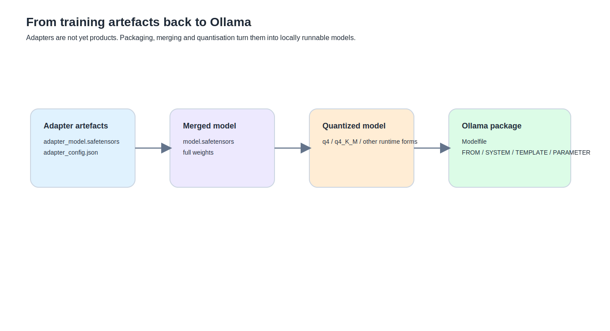

你前面真正走到這一步時，會很明顯感覺到一件事：


很多人第一次做本地微調，腦中會有一個很直覺的想像：

- 訓練完成
- 檔案存出來
- 模型應該就好了吧

現實沒有那麼短。

因為你訓練完拿到的，常常不是「成品」，而是一種半成品。
它可能是：
- adapter
- checkpoint
- safetensors 權重
- merge 前的中間產物

而要把這些東西帶回本地使用，特別是帶回 Ollama，通常還要經過另一條完全不同的工程線。



## adapter 為什麼可以不 merge

這件事很值得先講，因為很多人一開始會以為 merge 是義務。

其實不是。

adapter 本來就可以被設計成：
- 跟 base model 分開存
- 需要時再掛上去
- 讓同一顆 base 可以切不同風格的增量

這也是為什麼 LoRA 在工程上很香。
你不是每做一個版本，就要複製一整顆 base model。
你只需要存那一層增量。

所以 adapter 不 merge，並不代表不完整。
它只是代表：

**你的部署路線還容許 base model 和增量分開存在。**

---

## adapter 跟 merge 差在哪裡

這兩個的差別要講得很乾淨。

### adapter 路線
- base model 還是 base model
- adapter 是另外一層增量
- 使用時把兩者疊起來

### merge 路線
- 把 adapter 學到的增量折回 base model
- 最後得到一份新的完整模型權重

所以 merge 不是訓練方法。
它是部署或封裝階段的一個動作。

這個差別很重要，因為它直接影響：
- 檔案大小
- 切版本的彈性
- 後面能不能被某些工具吃進去

---

## 為什麼 adapter 比較省空間

因為 adapter 只存增量。

你前面一路看到的：
- `adapter_model.safetensors`
- `adapter_config.json`

這種組合，本質上就是：
- 不把整顆 base model 再複製一份
- 只存可訓練那一小塊

所以它當然比 merge 後的完整模型小很多。

這也是為什麼：
- adapter 適合實驗與切版本
- merge 比較像成品化前的最後一步

---

## merge 到底在做什麼

最白話的說法就是：

**把 adapter 學到的增量，真正折進 base model 的權重裡。**

所以 merge 後你拿到的，不再是：
- base + adapter 的雙件組

而是：
- 一份完整的新權重

這就是為什麼 merge 後檔案通常會變大。
因為你不再只存增量，而是存整顆完整模型。

---

## Safetensors 是什麼

Safetensors 不是模型類型。
它比較像是權重檔格式。

所以像你前面會看到：

- `adapter_model.safetensors`
- `model.safetensors`

差別不在於一個比較高級。
差別在於它們裝的是不同東西：

- 前者通常是 adapter
- 後者通常是完整模型權重

Safetensors 之所以常出現，是因為它剛好很適合這條線：
- Hugging Face 生態
- merge 前後的交換
- 往本地部署搬運

---

## GGUF 又在哪裡

GGUF 也不是另一種模型人格。
它比較像另一種本地推理生態常見的權重容器。

最實用的理解方式是：

- Safetensors：訓練 / merge / 中間交換
- GGUF：本地量化推理生態常見格式

所以它們都不是模型本體。
它們是容器。

---

## 為什麼 merge 後通常還要量化

這一點你前面體感非常深。

你前面把 merge 後的模型帶回 Ollama 時，最直接的現象就是：

- 未量化版能跑
- 但慢得很可怕

然後一做 q4 量化，體感速度就大幅改善。

這裡最重要的判斷是：

**量化不是為了讓模型更聰明。量化是為了讓模型更能跑。**

---

## quantization 是什麼

最白話的說法：

**把高精度、比較重的權重表示，換成更省空間、更省帶寬的表示。**

你可以把它想成：
- 同一顆模型
- 換成比較輕的行李箱
- 內容還是差不多那套
- 但搬運和展開方式變了

### 為什麼要量化
因為本地部署最痛的通常不是理論，
而是：
- 記憶體
- 載入成本
- 推理速度

量化就是在跟這幾件事打架。

---

## q4_0、q4_K_M、fp16、fp32 是什麼

不用一開始就把自己丟進量化理論深水區。
先抓大方向最重要。

### fp32
比較高精度，也比較重。

### fp16
比 fp32 輕一些，但還算高精度。

### q4_0
4-bit 量化家族的一種常見表示。

### q4_K_M
也是 4-bit 量化家族裡常見的本地推理格式之一。
你前面最後真正跑順的版本，就是這一型。

這些名字不是在說不同人格。
它們是在說：
**同一顆模型，用不同重量級的表示方式存在。**

---

## 量化的好處是什麼

### 1. 更省空間
這最直觀。

### 2. 更容易塞進本地記憶體
這對你尤其重要。

### 3. 推理體感通常更好
尤其像你前面那種 merge 後未量化版，速度慢到難以忍受。
量化後至少會回到可用範圍。

---

## 量化的代價是什麼

這也不能不講。

### 1. 可能犧牲一點精度
有些模型、某些量化形式下，品質會有差異。

### 2. 它救不了訓練歪掉
這是你整條路最應該保留的判斷。

量化可以解：
- 慢
- 大
- 難跑

量化解不了：
- 小資料把模型訓歪
- adapter 本來就怪
- 底模平衡已經被拉壞

所以「量化後還很笨」並不矛盾。
因為量化本來就不是品質修復器。

---

## 為什麼有些版本很慢，有些版本很笨

這句話前面一直反覆出現，因為它值得成為主線判準。

### 很慢
通常在說：
- 模型太大
- 還沒量化
- 載入與推理成本太高

### 很笨
通常在說：
- 訓練資料太少
- recipe 不穩
- adapter 把模型拉歪
- 驗收太晚

這兩個病可以同時發生，
但它們不是同一個病。

---

## Modelfile 是什麼，為什麼它跟 system prompt 不一樣

這個問題你前面已經摸得很有感。

### system prompt
比較像一張角色小紙條。
它在告訴模型：
- 你現在是什麼角色
- 應該怎麼說話
- 不該做什麼

### Modelfile
更像整份拍片企劃書。
它不只可以碰 prompt，還能定義：
- FROM 哪顆模型
- SYSTEM
- TEMPLATE
- PARAMETER
- MESSAGE
- 必要時也能指定 adapter / model 路線

所以 Modelfile 不是比較長的 system prompt。
它比 system prompt 大一層。

---

## Modelfile 怎麼建

你前面其實已經實際走過最重要的兩條路：

### 路線 1：從現有 Ollama 模型出發
像：

```text
FROM llama3.1:8b
SYSTEM ...
PARAMETER ...
TEMPLATE ...
```

### 路線 2：從 merge 後的本地模型資料夾出發
像：

```text
FROM /Users/daniel/llama31-lora-lab/out/merged-qkvo-full
```

這兩條的差別在於：
- 前者比較像在現有 Ollama 模型外包一層設定
- 後者比較像從你自己的完整模型產物重新封裝

---

## 為什麼 `ollama create` 沒有正確吃到你的 Modelfile

你前面踩到的坑也很經典。

它不是單純「Ollama 壞掉」。
更常見的原因是：

- 工作目錄不對
- `-f` 路徑沒指定好
- `FROM` 指向的東西不是 Ollama 預期能吃的形式
- adapter 路線與完整模型路線混在一起

這也是為什麼你最後是：
- 先 merge
- 再量化
- 再用完整模型重新 create

這條路才真正走通。

---

## 回到 Ollama，本質上在做什麼

這件事值得被講成一句很清楚的話：

**你不是在把訓練檔案搬回 Ollama，你是在把訓練世界裡的 artifact，轉成部署世界裡能用的模型成品。**

這樣很多事情就會突然合理：
- 為什麼 adapter 不一定能直接吃
- 為什麼 merge 有時候反而比較順
- 為什麼量化幾乎是本地部署的現實需求
- 為什麼 Modelfile 是最後包裝層，不是訓練層

---

## 這篇最後該留下來的一句話

如果這篇最後只留一句，我會留這句：

**訓練產生的通常不是成品，而是 artifact。你還要經過 adapter 管理、merge、格式轉換、量化與 Modelfile 包裝，才會真正得到可用的本地模型。**

這句話是整條路裡很重要的一個轉折。
因為它把「訓練成功」和「能用」這兩件事切開了。

#