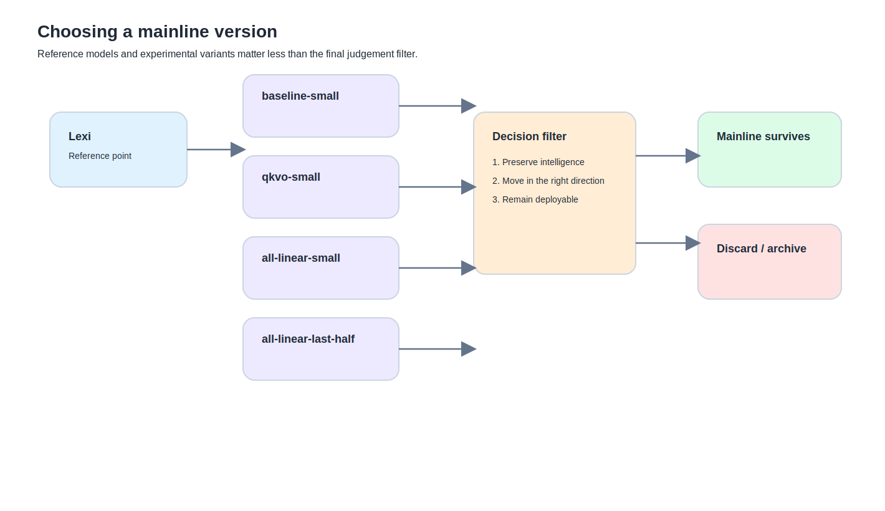

By this point, the real question is no longer “what else could I try?”

It is:

**what should I actually keep?**

This whole path makes it very easy to keep adding things:

- one more LoRA version
- a wider target-module set
- a deeper layer opening
- another DPO round
- another Modelfile
- another quantisation variant

There is always more that could be done.  
The harder question is:

**which versions deserve to survive as the mainline**

## Why Lexi became a reference point

You did not start chasing Lexi because the name was interesting.  
You started because it represented a very specific temptation:

- still Llama 3.1 8B
- speed did not collapse
- intelligence did not obviously collapse
- but the guardrails and style clearly felt different

The first instinct such a model triggers is:

> could I make something similar?

After actually going through the whole process, Lexi starts to function less like a recipe and more like a contrast object.

Its real lesson is not:
- you must modify the model deeply

It is closer to:
- **can you change the user-facing feel without destroying the base model in the process**

That is a very different question.

---

## Why the Lexi route appears more stable

This part has to stay modest, because you do not have the full recipe.

But based on the path you investigated, the engineering feel it projects is something like:
- preserve a strong base
- avoid overtraining the base into damage
- use careful outer-layer packaging, prompting, runtime and quantisation decisions
- push the final experience through those layers

That forms a very useful contrast with your own earlier instinct to keep digging deeper into small-data LoRA variants.

So Lexi’s real value was not that you should copy every step.  
Its value was that it forced a better question:

**if you want to preserve intelligence, perhaps the right move is not to modify more deeply, but to modify more carefully**

---

## Why you produced so many variants in the first place

Seen in hindsight, the number of variants was actually reasonable.

You were exploring three things at once.

### 1. Attachment width
From:
- `q_proj + v_proj`
- to `qkvo`
- to `all-linear`

### 2. Attachment depth
From:
- all layers
- to later-half-only routes

### 3. Intervention depth
From:
- LoRA
- to partial FT
- to a different teaching method such as DPO

So the proliferation of variants was not random restlessness.  
It was a real exploration of:
- stability
- cost
- drift risk
- which forms of depth were actually worth the bill

---

## What the main LoRA variants were actually testing

It helps to keep a very plain reading of them.

### baseline-small
- `q_proj`
- `v_proj`
- all layers

This is the cautious opening move.  
Its role is to let you feel LoRA in a minimal construction zone.

### qkvo-small
- `q_proj`
- `k_proj`
- `v_proj`
- `o_proj`
- all layers

This opens the attention block more broadly.  
More chance of noticeable change. More chance of trouble.

### all-linear-small
- wider linear scope
- all layers

This is not a natural upgrade. It is a real increase in construction width.

### all-linear-last-half-small
- wider linear scope
- but only on the later half of the network

Its value is not that it is “more advanced”.  
Its value is that it explores the interaction between:
- module width
- layer depth

That is a more serious experiment.

---

## Why the difference between qkvo and all-linear matters

Because this is not a tiny naming distinction.

### qkvo
You are mostly still operating within attention.

### all-linear
You are pushing out beyond attention into a wider structural region.

So the practical summary is:
- qkvo: deepen work inside a core region
- all-linear: widen the construction zone itself

And the lived lesson from your experiments is:

**a wider construction zone does not automatically produce a better model**

That is not a theory line. You tested it.

---

## Why `model.model.norm` and `lm_head` became important names

Because both sit close to output behaviour.

### `model.model.norm`
A late-stage normalisation layer that helps shape output behaviour.

### `lm_head`
The final projection into vocabulary logits.

Opening them can produce more noticeable behavioural change.  
It also raises the cost and the risk.

That is why they showed up most meaningfully in the partial FT stage, not as your first move.

---

## Why `for block in model.model.layers[-4:]` ended up meaning four layers

Not because four is sacred.  
Because it was a compromise that made sense under your hardware and cost constraints.

### Fewer
Could easily become too weak to notice.

### More
Could easily push the machine into failure.

So “the final four layers” was not a universal answer.  
It was the most survivable and meaningful compromise in that local context.

That sort of compromise is worth preserving. It sounds more like real work than like a sterilised best practice.

---

## What erratic results really are

This is a term worth keeping because it matches your actual experience.

The plain version is:

**erratic results mean the model is not just worse; it is unstable**

That instability can look like:
- normal on one prompt, bizarre on the next
- terminology drifting unpredictably
- tone, format and knowledge feel all wobbling together
- the same model feeling inconsistent across close prompts

This is often more frustrating than simple degradation, because diagnosis becomes harder.

---

## Why some versions felt slow and others felt stupid

This deserves to remain one of the core judgements of the whole series.

### Slow
Usually points to deployment shape and runtime cost:
- too large
- not quantised
- expensive to load
- expensive to run locally

### Stupid
Usually points to training and recipe problems:
- too little data
- unstable adaptation route
- distorted adapter behaviour
- poor or late evaluation

Those two failures can absolutely coexist.  
They are still not the same problem.

So the most valuable skill you are left with is not “how to make more variants”.  
It is being able to tell:

**is this a speed disease or a quality disease?**

---

## How to choose a mainline version

Doing this by intuition alone is how things drift into chaos.

I would now frame it with three layers of judgement.

### Layer 1: did the base survive?
- does it still feel like the original model
- did the intelligence feel drop
- has it begun to invent strange things

### Layer 2: did the customisation actually land?
- is the formatting more stable
- is the tone closer to the target
- is the intended behaviour actually present

### Layer 3: is it usable in the real world?
- does it run
- is it unbearably slow
- is the quantised version still acceptable
- is it a lab curiosity or something you could actually keep using

If a version:
- changes a lot
- but destroys the base feel

it should not survive as the mainline.

If another version:
- changes less
- but stays stable, runs well, deploys cleanly and leans in the right direction

that one is a much better candidate.

---

## What a mainline version actually is

Not the flashiest one.  
Not the deepest one.  
Not the one that sounds most impressive in a tweet.

A mainline version is closer to this:

**the version you would actually keep using, trust enough to iterate on, and not feel you are gambling with every time you open it**

That definition is unglamorous.  
It is also the right one.

Engineering mainlines should be selected by stability, not spectacle.

---

## What remains at the end of this path

If you zoom out, what you really gained was not just a toolset.

You gained a judgement framework:
- what belongs in outer layers
- what might be worth writing into LoRA
- what is not worth touching at the weight layer at all
- when to stop and preserve the base
- when the problem is deployment, not training
- when the problem is recipe, not runtime

That framework is more valuable than any single file format or trainer choice.

---

## The one sentence worth keeping

If this final piece leaves one sentence behind, it should be this:

**the best mainline is not the one that changes the model the most, but the one that preserves the base, moves in the right direction, and still runs in the real world**

That feels like the right sentence to end the main series on, because it compresses all of this:
- layers
- memory
- tooling
- SFT / LoRA / DPO
- scripts
- MPS pain
- merge / quantisation / Ollama

back into one genuinely useful criterion.
