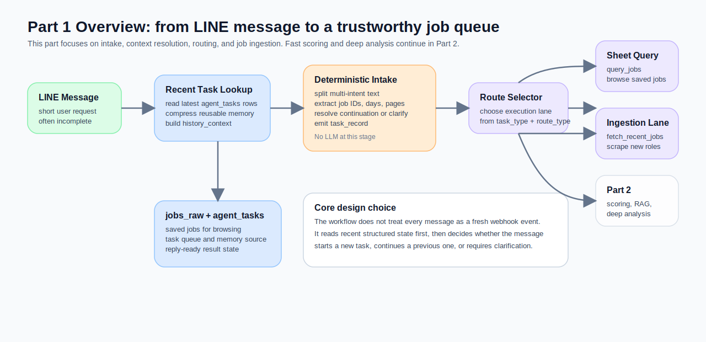
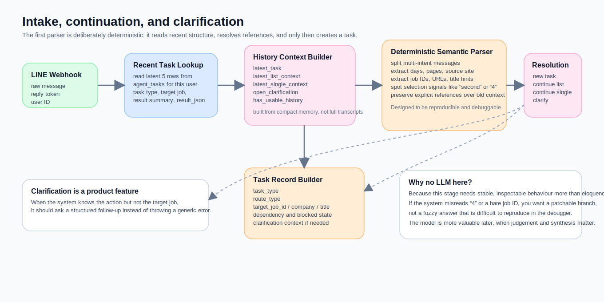
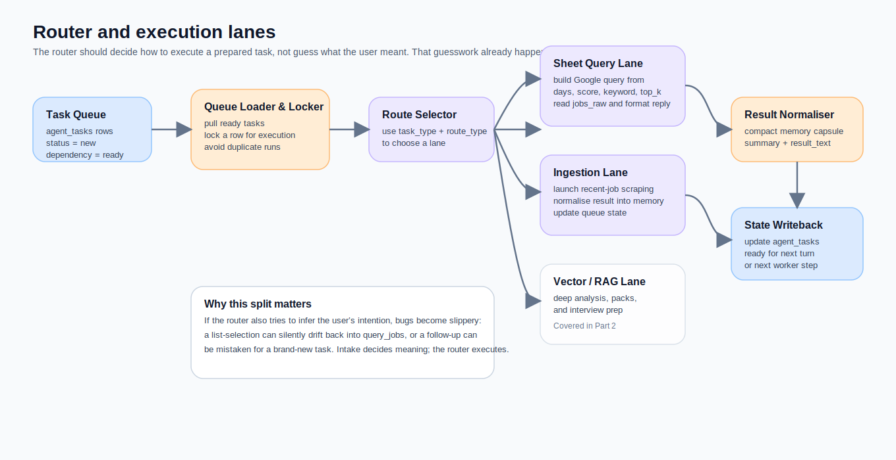
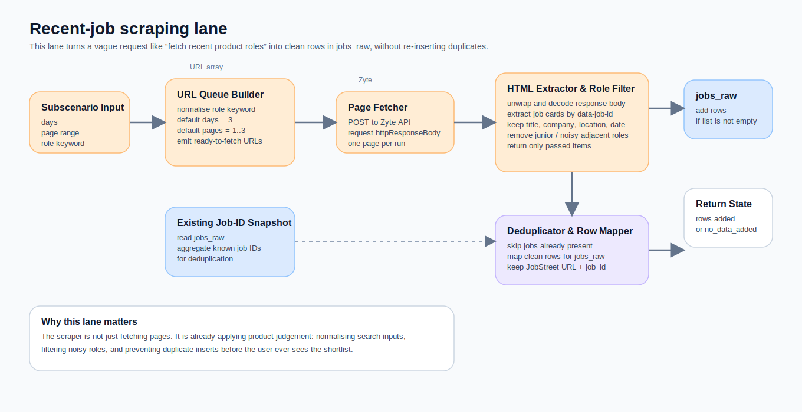

我決定放下創業，重新開始找工作之後，很快就遇到一個很現實的問題。

市場上的職缺很多，但真正值得我花時間深入研究的公司，其實沒有那麼多。你可以一篇一篇打開職缺、看 JD、查公司、翻產品、比市場位置。只是這樣做久了，很容易發現自己把大量時間花在「先把不適合的篩掉」這件事上，而不是花在真正值得投入的機會上。

所以我想做的，不是一個會到處亂投履歷的機器，而是一個能先幫我**快速縮小搜尋範圍**的 job agent。

更精確地說，我想要的是一套可以讓我在 LINE 裡直接講人話的工作流。像是：

- 幫我抓最近三天的 product manager 職缺
- 只看 80 分以上
- 那第二個呢
- 幫我研究這份

真正麻煩的地方，不是爬蟲，也不是接 API，而是**使用者根本不會用 workflow designer 的方式說話**。如果系統每次都把訊息當成一個全新的 webhook event，它看起來像自動化，但用起來就不像工具。

這也是我把這整套設計拆成兩篇的原因。

- **Part 1**：先把前門做好。這篇只談 LINE intake、文字語意判斷、orchestration、router，還有 recent jobs scraping。
- **Part 2**：再把後段做好。下一篇才會談快速評分、RAG 型深度分析、以及錯誤處理與格式化。

如果你是第一次看這個系列，建議先從 Part 1 開始。因為後面那些分析、評分、生成能力，全部都建立在一件更基本的事上：**系統能不能先把「這句話到底接在哪裡」判對。**

## 先說清楚：我這裡講的不是完全自治的 agent

我刻意把這個系統叫做 **job agent**，但如果要講得更準，它比較像是一條**長出 agent 感的 workflow**。

原因很簡單。這套系統仍然有很多預先定義好的執行路徑。它不是那種讓模型自由決定整段 tool usage 的 fully autonomous agent。它比較像是在明確的 workflow 上，補進三個以前典型 Make scenario 很薄弱的能力：

1. 它會看前文
2. 它會在不確定時澄清
3. 它會把上一輪的結果存成下一輪真的能重用的形狀

這種邊界我覺得反而很重要。因為它讓整篇文章不會掉進另一種常見陷阱：只要加了 LLM，就什麼都叫 agent。

## 這篇文章實際要解的問題

我當時真正想解的，不是「怎麼用 Make 做聊天機器人」，而是這個更具體的 workload：

> 我想用聊天介面快速收斂值得研究的職缺，再把後續的高成本分析留給少數真正值得深挖的公司。

這個 workload 有三個特性：

- 使用者輸入很短，而且常常省略主詞
- 很多 follow-up 都依賴上一輪結果，例如「第二個」、「那幫我研究」
- 真正有價值的不是把資料抓進來，而是**先把不值得看的東西排到後面**

也因為這樣，Part 1 的任務不是「把資料抓多一點」，而是**讓系統先長出可信的 intake 與 routing 前段**。

## 系列共用的元件命名方式

這個系列我不用 Make 原本的 module ID，而是改用一套按閱讀順序整理過的命名。這樣兩篇文章講起來比較像一套系統，而不是一串編號。

這篇 Part 1 會用到 `JA-01` 到 `JA-21`。Part 2 會從 `JA-22` 接著往下講，所以兩篇不會撞號。

### Part 1 component map

| ID | 元件名稱 | 作用 |
|---|---|---|
| JA-01 | LINE Webhook Gateway | 接住 LINE 訊息、reply token、user ID。 |
| JA-02 | Recent Task Lookup | 從 `agent_tasks` 讀同一位使用者最近可用的 task rows。 |
| JA-03 | History Context Builder | 把最近 task 壓成結構化 `history_context`。 |
| JA-04 | Deterministic Semantic Parser | 拆句、抽參數、抓 job id、辨識選擇訊號。 |
| JA-05 | Continuation Resolver | 判斷這句是新題、承接 list、承接單一 job，還是需要澄清。 |
| JA-06 | Task Record Builder | 產生真正可執行的 `task_record`。 |
| JA-07 | Clarification Composer | 在目標不明時，產生結構化澄清狀態與對使用者的追問。 |
| JA-08 | Task Queue Writer | 把新 task 寫回 `agent_tasks`。 |
| JA-09 | Queue Loader | 從 `agent_tasks` 把 ready 的 task 拉出來。 |
| JA-10 | Task Locker | 在執行前先鎖住 task 狀態。 |
| JA-11 | Route Selector | 依 `task_type / route_type` 分流。 |
| JA-12 | Query Spec Builder | 把自然語言條件轉成查 `jobs_raw` 的結構化 query。 |
| JA-13 | Query Result Formatter | 把查詢結果整理成可回覆、也可重用的記憶。 |
| JA-14 | Scraping Lane Launcher | 從 router 啟動 recent jobs ingestion lane。 |
| JA-15 | URL Queue Builder | 正規化 role keyword，產生可抓取的 JobStreet URL queue。 |
| JA-16 | Existing Job-ID Snapshot | 先讀現有 `jobs_raw`，準備 dedup。 |
| JA-17 | Page Fetcher | 透過 Zyte 抓每個 search result page。 |
| JA-18 | HTML Extractor & Role Filter | 從 HTML 抽 job cards，並先排掉明顯不相關的職缺。 |
| JA-19 | Deduplicator & Sheet Writer | 避免重複寫入，只把新職缺加進 `jobs_raw`。 |
| JA-20 | Reply Composer | 把結果整理成 LINE 可讀的回覆。 |
| JA-21 | LINE Messenger | 把訊息真正送回 LINE。 |

## 為什麼 intake 這一層，我刻意先不用 LLM

這篇最容易被誤會的地方，反而是這一段。

很多人第一反應會是：既然是聊天介面，為什麼不一開始就把文字語意判斷交給 LLM？

我的答案不是「LLM 不好」，而是**這一層最怕的不是不夠聰明，而是不夠可控**。

在這個系統裡，intake 的任務不是寫漂亮答案，而是把短短一句話穩定地轉成可以執行的狀態。它至少要做到幾件事：

- 看得出來 `4` 可能是「第 4 筆」
- 看得出來 `90680721` 可能是在回答上一輪的澄清題，不是新的查詢
- 看得出來「那幫我研究」缺的是 target job，不是 task type
- 看得出來「幫我抓最近三天的 PM 職缺，然後只看 80 分以上」其實是多步需求

這些判斷一旦出錯，你後面接再強的分析器都救不回來。因為系統一開始就把任務掛錯欄了。

而 deterministic parser 在這裡有一個很實際的優勢：**你知道它為什麼判成這樣。**

如果它沒把裸數字視為 ordinal selection，你可以補分支。  
如果它沒把 explicit job ID 視為比舊上下文更強的訊號，你可以改 precedence。  
如果它把 follow-up 誤判成 `query_jobs`，你可以沿著 `history_context` 一層一層追。

這也是我後來很確定的一個工作判準：

> **越靠近任務入口，越應該優先追求可重現、可觀測、可修補。**

模型不是不能用，而是更適合留到 Part 2 那種真的需要判斷、比較、濃縮、分析的地方。

## `agent_tasks` 在這套系統裡，不只是 task queue

如果只把 `agent_tasks` 想成任務表，這個設計其實看不太懂。

在這套 workflow 裡，`agent_tasks` 有兩個身份：

1. 它是 task queue
2. 它也是下一輪的記憶來源

這兩件事一旦疊在一起，前段設計的重點就不再只是「把上一輪記下來」，而是：

> 下一輪到底需要從上一輪帶走什麼？

我的答案不是完整 transcript，也不是所有欄位全存。真正有用的是足以支撐 reference resolution 的結構化資訊，例如：

- 這上一輪是一個 list 還是 single reference
- 目前 candidate jobs 有哪些 `job_ids`
- `primary_job_id` 是哪一筆
- 這輪預期下一步應該接哪個 task type
- 是否還有一個 open clarification 等待回答

這就是為什麼 JA-03 的重點不是壓縮聊天紀錄，而是壓成一個**可承接的 history context**。

## Intake 真正要做的事，不是 classification，而是 reference resolution

這點也是我在實作過程中最有感的一個轉彎。

一開始你會以為核心問題是 intent classification。可是只要把系統放進真實聊天情境，就會發現更常見的麻煩其實是這種句子：

> 那幫我研究

這句話的任務類型其實不難猜。真正難的是：**你指的是哪一筆？**

所以 JA-04 到 JA-07 真正做的，不是單純把句子分成 `query_jobs`、`analyze_job`、`generate_application_pack` 那麼簡單，而是先檢查：

- 這句有沒有明確 job id
- 這句是不是在回答上一輪的 clarification
- 這句是不是從上一輪 list 裡選一筆
- 這句是不是在承接上一輪單一 job
- 如果目標 job 仍不夠明確，是不是該進 clarification，而不是直接報錯

這也是為什麼我後來會把 clarification 當成產品能力，而不是 error handling。

如果系統知道你要做什麼，只是不知道你指的是哪一筆，那它其實不該失敗。它應該追問，而且要用下一輪還能接得回來的方式追問。

## Router 的職責要切乾淨，不要又猜一次使用者想做什麼

當 JA-06 已經把 `task_record` 建好之後，後面的 router 才開始變簡單。

因為這時候它的工作應該只剩下：**怎麼執行**。

不是：

- 再猜一次這句是不是 continuation
- 再補一次 target job
- 再拗一次這句到底是不是新的 query

我很刻意把這些都留在 intake 前段處理，因為如果路由器也參與語意猜測，bug 會變得很滑。你前面以為 resolve 好了，後面又悄悄掉回另一條 lane，debug 起來非常痛苦。

在 Part 1 這裡，JA-11 主要把 task 導到兩種會在本文展開的 lane：

- **Sheet Query Lane**：查 `jobs_raw` 裡已經存好的職缺
- **Ingestion Lane**：去外部來源抓最近的新職缺

還有一條更重的 **Vector / RAG Lane**，它會留到 Part 2 再講。

## Sheet query 這條 lane，解的是「怎麼用聊天方式查本地 shortlist」

很多人看到 job agent 會先想到 scraper，但其實本地 shortlist 的查詢體驗也很重要。

JA-12 做的是一件很實用的事：把自然語言中的條件，整理成查 `jobs_raw` 的結構化 query。例如：

- 最近幾天
- score 門檻
- keyword bucket
- top_k
- sort_by / sort_order

然後 JA-13 再把查到的結果排好、整理好，並且同時做兩件事：

1. 產出給人看的 reply text
2. 產出給下一輪承接用的 compact memory

這個 dual output 很重要。因為對人看的格式，和對機器下一輪最好用的格式，通常不是同一份資料。

## Ingestion lane 才是這篇最像「求職工具」的地方

如果說 intake 解的是「承先啟後」，那 ingestion lane 解的就是「先不要浪費我的時間」。

它的目標不是把頁面抓得越多越好，而是把 recent jobs 用一個**可維護、可去重、可承接後續評分**的方式先收進來。

這條 lane 我把它拆成幾個閱讀上比較好懂的元件：

- **JA-15 URL Queue Builder**  
  把 role keyword 正規化，補好預設 `days` 與 `page_from/page_to`，生成可抓取的 search result URLs。

- **JA-16 Existing Job-ID Snapshot**  
  在真的去抓新頁面之前，先讀現有 `jobs_raw`，把既有 `job_id` 聚起來。這樣後面 dedup 不需要再去猜。

- **JA-17 Page Fetcher**  
  透過 Zyte 抓每一頁的回應 body。這條路線選得比較務實，因為它要的是穩定、可重現的 page retrieval，不是花俏的 browser automation。

- **JA-18 HTML Extractor & Role Filter**  
  這一層不是把頁面原封不動抄進資料表，而是會先把 job cards 抽出來，再把明顯不相關的噪音角色排掉，例如 entry-level 或過度偏 sales / marketing 的職缺。

- **JA-19 Deduplicator & Sheet Writer**  
  最後再把真正新的 rows 寫進 `jobs_raw`，而不是每次重掃一次就灌一批重複資料進去。

這裡我很喜歡的一點是：這條 lane 其實已經不只是 scraper，而是**前置篩選器**。它會先幫我把一些明顯不值得後續處理的角色擋在門外，讓 Part 2 的評分和分析可以花在比較值得看的 shortlist 上。

## 一個很重要的反例：不是所有求職工作流都需要這麼重

這種架構不是萬用解。

如果你的需求只是：

- 每天固定抓一次職缺
- 沒有聊天式 follow-up
- 使用者每次都願意給完整條件
- 不在乎上一輪的短期記憶

那這套做法通常就太重了。

你不一定需要 history context，也不一定需要 clarification state，更不一定需要把 `agent_tasks` 同時當 queue 跟 memory source。這些設計只有在**使用者真的會用短句承接上一輪**時，效益才會明顯浮出來。

換句話說，這篇文章裡的判準大致成立，但它有前提：

> 你的前門真的是聊天式 intake，而不是單純表單或排程型 ingestion。

如果沒有這個前提，先做簡單版通常更划算。

## 我希望這篇留下的核心判斷

如果要把 Part 1 濃縮成一句話，我會寫成這樣：

> **讓 Make workflow 長出承先啟後能力，不是先塞更多 LLM，而是先把 context、reference resolution、routing 與 ingestion 前段做對。**

這個順序我覺得不能倒。

因為如果 intake 沒做好，後面的 scoring 會評錯 job；  
如果 routing 沒切乾淨，後面的 lane 會跑錯；  
如果 ingestion 太髒，後面的分析只是在高成本處理噪音。

Part 2 會接著往後走，專門處理那些真正花腦力、也真正值得交給模型的部分：

- 怎麼幫新職缺做快速評分
- 怎麼對單一職缺做 RAG 型深度分析
- 怎麼把錯誤處理做成結構化產品能力，而不是 generic fallback

但如果你是從 Part 2 倒著看回來，最後通常還是會回到這篇的同一個結論：

**後面能不能做深，取決於前面有沒有先做穩。**
