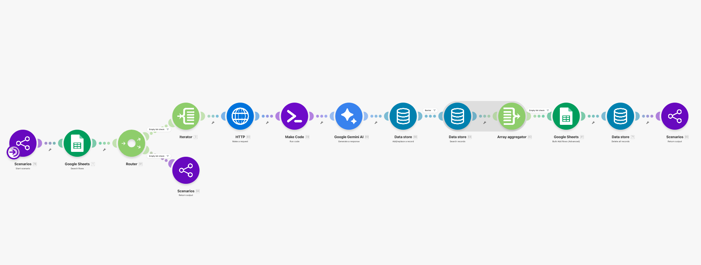
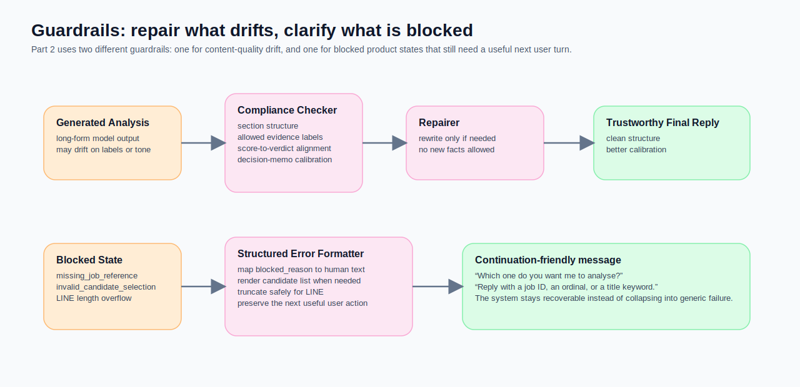

如果 Part 1 解的是「系統到底聽懂你在指哪一筆職缺」，那 Part 2 解的就是另一個更現實的問題：**這筆職缺值不值得你投入時間。**

我把前門做好之後，新的瓶頸很快就跑出來了。

就算系統已經能接住「第二個」、「那幫我研究」這種短句，我還是不想把整個晚上花在十幾個看起來都還行的職缺上。真正昂貴的不是抓資料，而是每一份都打開來讀、查公司、對照自己的履歷、再判斷到底值不值得投。

這也是為什麼這個系列最後一定要拆成兩篇。

- **Part 1** 解的是：訊息進來之後，系統要怎麼知道你說的是哪一筆。
- **Part 2** 解的是：當 target job 已經被 resolve 之後，系統要怎麼幫你先快篩，再把少數真正值得看的職缺做成可判斷、可投遞、可準備面試的材料。

如果你還沒看 Part 1，建議先從那篇開始。因為這篇所有分析、評分與生成，都建立在前一篇已經把 `task_type`、`target_job_id`、`route_type` 與澄清狀態處理乾淨的前提上。

## Part 2 真正想解的 workload

我在找工作時，最不想浪費的不是送出履歷的那五分鐘，而是**對錯的公司做對的努力**。

很多職缺第一眼都不難看。title 很像、產業也有興趣、品牌甚至不錯。但只要你真的開始看 JD、查產品、對能力、想履歷怎麼改，很快就會發現真正稀缺的不是資訊，而是你的注意力。

所以 Part 2 不是在做一個「會幫我自動投遞」的黑盒代理人。它做的是更務實的兩段式工作：

1. **先用快速評分把大海縮成池塘**
2. **再用 RAG 深度分析，把少數值得研究的職缺拆成真正可判斷的證據包**

這個設計背後有一個我後來越來越確信的原則：

> **不是每一筆 job 都值得上重型分析。**
>
> 先用一個便宜、保守、邊界清楚的快篩器，把明顯不對的職缺排到後面，才是把模型成本和注意力花在刀口上的做法。[^anthropic-effective-agents][^openai-practical-agents]

## Part 2 component map

這篇沿用 Part 1 的系列編號，直接從 `JA-22` 接下去。

| ID | 元件名稱 | 作用 |
|---|---|---|
| JA-22 | Unscored Job Scanner | 從 `jobs_raw` 找出還沒評分的職缺。 |
| JA-23 | Scoring Batch Gate | 如果目前沒有新職缺需要評分，就乾淨地結束。 |
| JA-24 | JD Fetcher | 逐筆抓取職缺 detail page。 |
| JA-25 | JD Text Extractor | 從 HTML 抽出乾淨的 JD 文字，並做後續檢索用摘要。 |
| JA-26 | Fast Scoring Prompt Runner | 用邊界很硬的 LLM prompt 做快速 fit scoring。 |
| JA-27 | Score Staging Store | 先把評分結果暫存，再集中寫回。 |
| JA-28 | Bulk Score Sheet Updater | 批次把 score / relevant / reason 寫回 `jobs_raw`。 |
| JA-29 | Analysis Request Resolver | 先 resolve 這次要分析的是哪一筆 job。 |
| JA-30 | Single-Job Dependency Gate | 如果 target job 還不夠明確，就先 block，不進重分析。 |
| JA-31 | Job Detail Fetcher | 抓單一職缺 detail page 給深度分析用。 |
| JA-32 | JD & Context Normalizer | 把 HTML 轉成可用的 JD 文字與 query context。 |
| JA-33 | CV Query Embedder | 把 JD 轉成向量查詢。 |
| JA-34 | CV Evidence Retriever | 從 Qdrant 拉回最相關的 CV 證據片段。 |
| JA-35 | Analysis Prompt Composer | 把 JD、CV evidence、使用者需求與任務規則組成分析 prompt。 |
| JA-36 | Company Research Briefer | 先產生一份外部公司研究摘要，並明確區分 facts 與 inference。 |
| JA-37 | Final Analysis Generator | 產出 `analyze_job`、cover letter pack、或 interview brief。 |
| JA-38 | Output Compliance Checker | 檢查輸出格式、label 規則與 score / verdict 校準是否對齊。 |
| JA-39 | Output Repairer | 若輸出不合規，用第二道修復器補正，但不允許捏造新事實。 |
| JA-40 | Structured Error Formatter | 把 blocked state 轉成 LINE 可讀、可續接的自然語言訊息。 |

## 先講清楚：為什麼這一段反而適合讓 LLM 出手

Part 1 我很刻意不用 LLM 當 intake 主邏輯，因為那一層最重要的是可重現、可觀測、可 debug。

Part 2 則剛好相反。

到了這裡，系統不再是在猜「你現在指的是哪一筆」，而是在做另一種更適合模型的工作：**在邊界明確的證據集合裡做判斷與濃縮。**

這也是我願意讓 LLM 在這一段出手的原因。因為現在的問題已經不是 state resolution，而是下面這種任務：

- 這份 JD 跟我的長期方向到底有多對齊
- 這份工作是 title 好看，還是內容真的對
- 哪些 gap 是可學習，哪些其實是 shortlist risk
- 如果真的要投，應該怎麼把自己的經驗對上去

這類工作如果只靠 rule-based flow 做，常常會很硬，很碎，也很難把多個訊號一起看。反而是模型在**有證據邊界、有輸出規範、有 guardrails** 的前提下，能把這種「需要判斷，但又不該自由發揮」的任務做得相對自然。[^anthropic-effective-agents][^rag-paper]

## 第一段：LLM 快速評分不是最後答案，而是省時間的快篩器

如果要我用一句話總結 JA-22 到 JA-28，它做的不是 final judgment，而是：

> **先用一個保守的、輸入受限的、可批次運行的評分器，讓 shortlist 先長出優先順序。**

這條 lane 的起點非常務實。它不是從聊天訊息開始，而是直接從 `jobs_raw` 找出還沒評分的 rows。也就是說，Part 1 先把最新職缺抓進來，Part 2 再把這批原始職缺做成「比較像 shortlist」的東西。

### 快速評分的幾個原則

我最喜歡這條藍圖的一點，是它沒有把「快」理解成「隨便」。相反地，它把快篩這件事做得很克制。

第一，它把證據邊界切得很硬。

JA-26 的 scoring prompt 明確限制模型只能使用三種輸入：候選人的固定定位、`COMPANY_NAME`、以及清理過的 `JOB_TEXT`。它**不能用 web search、不能用公司名氣、不能用外部印象、不能腦補 reputation**。如果 JD 沒寫，就要偏保守。

第二，它把「不知道」預設成 neutral，而不是 optimism。

這條 prompt 的精神不是想盡辦法幫我找理由加分，而是：如果證據不足，就先不要過度樂觀。像 company quality、culture、visa support、compensation 這些欄位，只要 JD 沒有明示，就預設中性，而不是把品牌想像成加分項。

第三，它不是看 title，而是看 role content。

這裡有一條我非常認同的 guardrail：**product-sounding title 不等於 product role**。如果職稱看起來像產品，但實際工作內容偏 sales、BD、KAM，分數就不該被 title 撐起來。這一點在求職市場裡特別重要，因為很多職缺最容易誤導人的就是名字。

第四，它的輸出刻意很窄。

JA-26 不輸出一篇 essay，只輸出四個欄位：`score`、`is_relevant`、`relevant_reason`、`status`。這種設計很對。因為快篩器的目標不是把每份工作都解釋到天荒地老，而是先把順序拉出來。

第五，它把寫回做成 batch，而不是每筆職缺查完就立刻打一次表格。

這條 lane 會先把 per-job scoring result 暫存在 datastore，等整批都處理完再聚合起來，最後一次性寫回 `jobs_raw`。這讓資料表更新比較乾淨，也比較像真正的批次處理，而不是一路邊跑邊把表格敲得叮噹響。

### 為什麼我只講到原則層，不把快篩包裝成真理機器

你前面有特別交代，這段講到原則層就好。我覺得這個判斷是對的。

因為快速評分真正重要的，不是某個分數公式本身，而是它的**判斷姿態**：

- 它是保守的，不是熱情的
- 它優先做 downside protection，不是替每一份工作找理由說服自己去投
- 它是拿來排優先順序，不是拿來代替人做最終決定

這種快篩器最怕的，其實不是偶爾少看一份好工作，而是把太多只是「看起來像」的職缺推進後段。因為一旦進到深度分析，後面每一步都會開始花比較貴的計算成本，也會花掉我自己的注意力。

所以從產品角度看，快速評分真正值錢的地方，不是它能不能看起來很聰明，而是它能不能幫我**少做一些其實不值得做的深挖**。

## 第二段：RAG 深度分析不是把更多資料塞給模型，而是把證據整理成可判斷的形狀

如果快速評分解的是「先不要在錯的工作上浪費一個晚上」，那 RAG 深度分析解的就是：

> **當某一筆 job 真的值得看時，怎麼把判斷所需的證據組成一個更可靠的 analysis packet。**

這條 lane 其實比很多人想像中更像「三段式 orchestration」，而不是單純的模型問答。

### 第一段，不要急著分析，先把 target job resolve 到唯一

JA-29 和 JA-30 做的事非常重要，而且很容易被低估。

它們先用 `target_job_id` 或 `target_company + target_title` 去 `jobs_raw` 中 resolve 出唯一 job row。如果找不到，或根本沒有足夠輸入，就直接 block，丟出 `missing_job_reference`。也就是說，深度分析 lane 不接受模糊目標。

這個設計和 Part 1 是連起來的。Part 1 負責把聊天上下文 resolve 乾淨，Part 2 則在真正進入重任務前，再做一次 dependency gate。這聽起來像重複，其實是很健康的防呆。因為越昂貴的 lane，越不應該建立在「大概是這一筆吧」的猜測上。

### 第二段，先把 JD 與 CV evidence 準備好，再談分析

JA-31 到 JA-34 是這條 lane 最像 RAG 的地方。

先是抓 detail page，再把 HTML 轉成比較乾淨的 JD 文字。接著系統不直接把整份 JD 原封不動丟給模型，而是先把 JD 壓成一段 retrieval query，再交給 embedding model 轉成向量，最後用這個向量去 Qdrant 查回最相關的 CV chunks。Blueprint 還刻意在 query 時加上 payload filter，只拉 `source_type = cv` 的證據片段。

這裡我最喜歡的，不是「用了向量資料庫」這件事本身，而是它很清楚地回答了一個產品問題：

> 深度分析真正需要的，不是整份履歷，而是**和這一份 JD 最相關的履歷證據**。

這就是 RAG 真正有價值的地方。Lewis 等人在提出 RAG 時，強調的也不是「把更多上下文塞給模型」，而是透過顯式 retrieval 去補足 parametric memory 的限制，讓生成過程建立在更可更新、也更可追溯的外部記憶上。[^rag-paper]

### 第三段，把 company research 和 final judgment 拆成兩步

這是整套 Part 2 我覺得最值得學的一個地方。

JA-36 並不是直接叫模型去做最後判斷，而是先產出一份**緊湊的 company research brief**。這一步開了 search grounding，但它的 prompt 非常克制：

- source priority 有明確順序
- review evidence 必須保守使用
- absence of evidence 不能當 positive evidence
- verified facts 和 unverified inference 要分開
- 如果找不到可靠 review signal，就要明講找不到，不可以亂補樂觀敘述

換句話說，這一層不是在「做一篇公司介紹」，而是在做一份給下游模型吃的證據摘要。

而到了 JA-37，final model 反而被明確禁止再去搜尋網路。它只能使用三類輸入：

- JD
- CV evidence excerpts
- company research brief

這個切法很漂亮。因為它把「找資料」跟「做判斷」拆開來了。

如果你把這兩件事丟給同一個步驟，模型很容易一邊搜、一邊猜、一邊寫，最後輸出看起來很完整，但很難知道哪一句是事實、哪一句是推測。現在這樣拆開後，系統就比較容易維持一條乾淨的證據鏈。[^openai-practical-agents]

### 深度分析真正值錢的，不是多，而是對齊

JA-37 支援三種下游任務：

- `analyze_job`
- `generate_application_pack`
- `prepare_interview_brief`

我覺得這三種任務放在同一條 RAG 主幹上，非常合理。因為它們共享的不是最後輸出形式，而是共享一個更前面的東西：

> **同一份「已 resolve 的 target job + 已整理的 JD + 已挑過的 CV evidence + 已壓過的 company signals」。**

這也是我會把它叫做「analysis packet」的原因。對模型來說，真正昂貴的不是最後寫出分析文，昂貴的是前面那段把上下文組乾淨的工作。只要那個 packet 做得好，後面要寫 go / no-go 分析、cover letter、還是 interview brief，其實只是不同任務模板而已。

## 為什麼這條 RAG lane 還要再加一層 output checker

很多人做到這裡會停。拿到分析結果，看起來有條有理，就直接回給使用者。

但這條藍圖多做了一步，我覺得很值得。

JA-38 不是在看內容漂不漂亮，而是在檢查一件更產品化的事：**輸出有沒有遵守它自己宣告的格式與校準規則。**

例如：

- `analyze_job` 的 score 跟 verdict 有沒有對齊
- source label 有沒有亂混
- 55–69 分時，語氣是不是太樂觀
- section 6 是否只使用允許的 company research labels

如果沒有通過，JA-39 不會去找新資料，也不會重新上網，而是做一個很窄的 repair pass：允許改寫、拆 bullet、補 label、修正 calibration，但**不允許新增外部事實**。

這個設計很像把 generative step 後面再接一個 QA fixture。它承認了一件很現實的事：

> 即使 prompt 已經很嚴，生成式輸出仍然會偶爾在格式與校準上飄掉。

與其假裝模型一次就會永遠寫對，不如把這種不穩定當成系統設計的一部分，主動在後面補一條修復軌道。這比單純在 prompt 上越寫越長，通常更實際。[^anthropic-effective-agents]

## 第三段我刻意壓短：錯誤處理不是主戲，但它決定工具是不是能天天用

你前面有特別說，Part 2 的重點放在快速評分和 RAG 深度分析。這我同意，所以 error handling 我只放一節。

但它雖然不是主戲，卻很像舞台地板。平常看不太到，踩空一次就知道它的重要。

JA-40 做的不是把例外訊息原封不動丟回 LINE，而是把 `blocked_reason`、`error_message`、`clarification_context` 這些結構化狀態，整理成真正可以被使用者接下去的訊息。

例如：

- `missing_job_reference` → 請直接回 job id
- `invalid_candidate_selection` → 把候選職缺清單列出來，接受 job id / 序號 / 職稱關鍵字
- 超過 LINE 字數限制 → 自動截斷並保留提示

這點很重要，因為它把「出錯」重新定義成一件更產品化的事。

在這種聊天式 workflow 裡，很多失敗其實不是 system failure，而是**state still needs one more user turn**。錯誤層如果能把這件事講清楚，整個工具的手感會差非常多。

## 一個反例：不是每一份看起來有趣的職缺都值得進 RAG

這篇如果只寫到這裡，很容易變成另一種口號文：

> 看吧，先快評分，再 RAG 深分析，最後就能做出更好的求職判斷。

但更真實的說法其實是：**不是每一份工作都值得進這條重路徑。**

如果一份職缺在快篩階段就已經很清楚地偏掉，例如：

- title 好看，但實際是偏 sales / BD
- 缺的是很硬的 domain proof，不是可以靠文案補掉的 gap
- visa / location / eligibility 有明顯 blocker
- JD 本身就很薄，連角色輪廓都不清楚

那有時候最好的系統行為，不是更深挖，而是更早停下來。

這也是為什麼我把 Part 2 的主論點定成：

> **Part 1 解決的是理解你在說哪一筆職缺，Part 2 解決的是這筆職缺值不值得你投入時間。**

這句話的重點不是「分析更深」，而是「投入更準」。

## 這篇文章最想留下的一句話

如果要把 Part 2 再濃縮成一句話，我會留這句：

> **好的 job agent，不是把每一份職缺都做成長報告，而是先用便宜、保守的快篩，替你爭取把深度分析留給真正值得看的機會。**

Part 1 把前門做好，讓 workflow 不會把每句話都當成新的 webhook event。

Part 2 則把後段做好，讓系統不是只會抓資料，而是真的開始幫你做一件更接近決策的事：

- 先排優先順序
- 再整理證據
- 最後才生成對你真的有用的輸出

對我來說，這才是這套工具最像 agent 的地方。

不是它會說很多話，而是它終於開始幫我**省下那些原本很貴、但其實不該先花掉的時間**。

## 註腳

[^anthropic-effective-agents]: Anthropic, *Building Effective AI Agents*.
[^openai-practical-agents]: OpenAI, *A practical guide to building AI agents*.
[^rag-paper]: Lewis et al., *Retrieval-Augmented Generation for Knowledge-Intensive NLP Tasks*.
