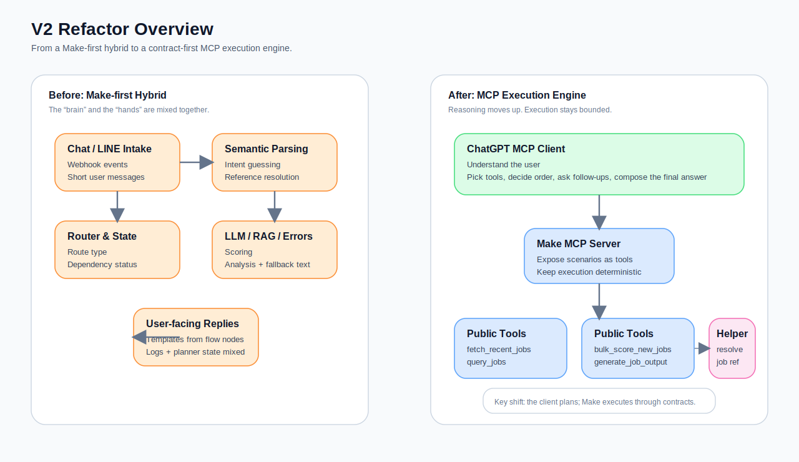

My earlier job agent was a very typical Make-first design.

Start with a workflow that runs.  
Then add intake.  
Then add a router.  
Then bolt on scoring, RAG, and error formatting.  
Eventually it starts to look like an agent, and to be fair, it does work.

But the longer I lived with it, the clearer one thing became: **the problem was not missing features. The problem was that the “brain” was sitting in the wrong place.**

The moment you want to upgrade the whole thing into **ChatGPT as the planner, with a Make MCP server as the execution layer**, all the fuzzy assumptions that were tolerable in v1 suddenly show their teeth:

- Who is supposed to understand what the user is asking for?
- Who decides whether to query first, score first, or analyse first?
- Who is meant to speak to the user?
- Who is meant to read and write data, run batches, score jobs, and produce outputs?
- Which fields are run logs, and which ones are really planner state?

So this article is not merely about “hooking Make up to MCP”.  
The real subject is this: **how to take a system that was using flowcharts to fake orchestration and refactor it into a set of tools with clear boundaries and stable contracts that ChatGPT can call reliably.**

If I had to compress the migration into a single line, it would be this:

> **Exposing scenarios as tools does not mean you have finished an MCP migration. The real migration is moving from flow-driven design to contract-driven design.**

## What problem this article is actually solving

I did not build this v2 because v1 was unusable.  
I built it because v1 eventually hit a very obvious “hybrid creature” ceiling.

In v1, Make was doing too many jobs at once:

- transport adapter  
- intake / semantic parser  
- router / orchestration layer  
- tool executor  
- user-facing reply formatter  
- state machine  
- run logger

That is perfectly reasonable when the workflow is still small.  
Once ChatGPT enters the picture, though, the design starts fighting itself.

Because ChatGPT is naturally better at:

- understanding natural language
- choosing tools
- deciding tool order
- asking clarifying questions when needed
- integrating tool results into a final reply

Whereas Make is better at:

- deterministic execution
- integrating with data sources
- running batch jobs
- structured transformation
- logging / persistence
- background work

So the core of v2 is not “more features”.  
It is **cleaner responsibility boundaries**.

## The decision rule I am keeping from this migration

If the first two articles were about making a workflow feel more agentic, the most useful original contribution in this article is a much more practical migration rule:

> **If a step is mainly about understanding the user, deciding the next move, or composing the final reply, it should move upwards to the client side.**  
> **If a step can be described as a stable input-output transformation, a deterministic side effect, or a bounded integration, it should stay in Make.**

That rule ended up being my main knife for separating v1 from v2.

It also saved me from a lot of unnecessary abstract debates, such as:

- “Does this scenario count as an agent?”
- “Should the router itself become a tool?”
- “Should every helper be public?”

Most of those questions become much easier once you rephrase them as:

> Is this step doing reasoning, or is it doing bounded execution?

## The old world: where v1 actually started to hurt

v1 was not bad. In fact, it already had quite a few good ideas:

- `history_context` for continuation resolution
- `result_json` as a compact memory capsule
- separate lanes for `query_jobs`, `analyze_job`, and `generate_application_pack`
- structured clarification instead of generic fallback

But as soon as ChatGPT became part of the system, three structural bottlenecks became hard to ignore.

### 1. Reasoning was still trapped inside the flowchart

v1 cared deeply about intake, but semantic parsing, continuation logic, route selection, and bits of fallback logic still lived in Make.

That means the real planner was not ChatGPT. It was a combination of scenario filters, task tables, and router branches.

The system could still be useful, but it came with a cost:  
**on the surface you had an LLM “brain”, but in reality the flowchart was still quietly making the important decisions.**

### 2. User-facing language was still inside the execution layer

The error formatter in v1 had a lot of product sense, but it was still Make speaking directly to the user.

That creates an awkward experience:  
ChatGPT is supposedly the planner, yet the user often ends up reading sentences produced by workflow nodes rather than replies integrated by the model.

### 3. Planner state and run logs were mixed together

In v1, a table like `agent_tasks` made sense because it doubled as a queue and a memory source.

In an MCP world, those two ideas need to be separated:

- what the tool run did
- what the system believes should happen next

The first is a **run log**.  
The second is **client-side reasoning**.

If those remain blended in Make, you end up with logs that are verbose but not very reusable, tools that run but do not compose well, and helpers that exist without truly becoming dependencies.

## What v2 really changes is not the entry point, but the responsibility model

I did not rewrite the whole system into some other framework.  
What I did was more restrained, but also more painful: **I moved the “brain” out of the old system and left execution behind.**

The split now looks much more like this:

### ChatGPT / MCP client is responsible for

- understanding user intent
- selecting public tools
- deciding call order
- deciding whether to query first, then generate
- deciding whether a clarification is needed
- integrating tool outputs into a final answer

### Make MCP server + scenarios are responsible for

- providing discoverable tools
- deterministic execution
- scraping, querying, scoring, retrieval, generation
- integrating with Google Sheets, Qdrant, Zyte, and Gemini
- returning structured results with clear contracts
- writing run logs and persistence

The most important change is this:

> **Make is no longer pretending to be the planner.**  
> **It is only responsible for turning each execution capability into a tool with a stable contract.**

## The tool map I ended up keeping in v2

This time I did not keep the old scenario IDs, nor did I use raw Make module numbers. I renamed things in the order a reader can actually understand them.

### v2 tool map

| ID | Tool name | Type | Purpose |
|---|---|---|---|
| V2-01 | MCP Client Planner | architecture role | ChatGPT understands the request, picks tools, and integrates the answer. |
| V2-02 | Make MCP Server Bridge | architecture role | Exposes active + on-demand scenarios as MCP tools. |
| V2-03 | Recent Job Fetch Tool | public tool | Fetches recent jobs, parses them, deduplicates, and writes them into `jobs_raw`. |
| V2-04 | Job Query Tool | public tool | Queries the local job pool using days / score / keyword / sorting controls. |
| V2-05 | Bulk Scoring Tool | public tool | Runs fast scoring in batch for newly fetched jobs. |
| V2-06 | Resolve Job Reference Helper | helper tool | Resolves a job reference into a unique target job. |
| V2-07 | Generate Job Output Tool | public tool | Performs deep analysis, cover-letter generation, or interview-brief generation after resolution succeeds. |
| V2-08 | Tool Run Logger | internal pattern | Records standardised run metadata, outputs, and errors. |

The full naming map is in `./resource/component-index.md`.

## Phase 1: do not start with toolisation. Start with the contract.

The most important first step in this migration was not renaming scenarios.  
It was designing a shared contract.

If you inspect the five v2 blueprints, you will notice that almost all of them begin with a very similar pre-processing layer:

- validate `request_id`
- validate `session_id`
- validate `trace_id`
- normalise `source_channel`
- normalise `actor_id`
- keep `parent_run_id`
- create a `run_id`
- stamp `tool_name`
- stamp `tool_version`
- stamp `schema_version`
- stamp `started_at`
- standardise `context_error_code` / `context_error_message`

That sounds dull, but it is the foundation of the whole migration.

Without that layer, you quickly end up with:

- each tool speaking a different dialect
- the client struggling to classify failures consistently
- traces breaking across calls
- helper tools and public tools becoming difficult to compose

### The minimum contract I kept

#### Request layer

- `request_id`
- `session_id`
- `trace_id`
- `source_channel`
- `actor_id`
- `parent_run_id`

#### Execution layer

- `tool_name`
- `tool_version`
- `schema_version`
- `run_id`
- `started_at`

#### Response layer

- `ok`
- `status`
- `summary`
- `data`
- `error`
- `meta`

#### Traceability layer

- `response_json`
- `response_size_bytes`
- `result_preview`
- `result_ref`
- `finished_at`
- `duration_ms`

That is why I call this migration “from toolisation to contracts”.  
Only once every tool agrees to the same basic contract can the MCP client treat them as a coherent capability surface rather than five unrelated mini-workflows.

## Phase 2: separate public tools from helpers, or the architecture will grow crooked

In v2 I deliberately made `v2_helper_resolve_job_reference` a **helper**, not a public tool. It validates request context, attempts to extract a job reference from `target_job_id` or `user_message_raw`, or falls back to `target_company + target_title`, and then returns a `completed`, `blocked`, or `failed` result. It is explicitly marked `is_public_tool: false`.

That distinction matters because it avoids a very common trap:

> **Just because a helper exists as a callable unit does not mean the architecture is correctly wired.**

If `generate_job_output` merely “might call” the helper, correctness still depends on whether the client happened to choose the right call order.

That is not stable enough.

What matters is that the **main tool truly depends on the helper internally**.

And that is exactly what `v2_tool_generate_job_output` does. It normalises `task_type`, restricts execution to `analyze_job`, `generate_application_pack`, and `prepare_interview_brief`, and then calls the `v2_helper_resolve_job_reference` subscenario before doing anything expensive. Only after resolution succeeds does it continue to JD fetch, Qdrant retrieval, company research, and generation.

One practical rule I am keeping from that mistake is:

> **A helper should either be a genuine dependency of the main path, or it is merely a debugging tool.**  
> **The most dangerous state is when it exists, but the main flow does not actually depend on it.**

## What the main tools actually do

### V2-03 Recent Job Fetch Tool

This tool brings recent jobs into the local pool, but it is not merely a scraper.

It normalises parameters such as:

- `source_site`
- `role_keyword`
- `days`
- `page_from`
- `page_to`

Then it generates JobStreet search URLs, fetches the result pages, extracts job cards, filters out obviously bad rows, deduplicates against `jobs_raw`, and returns inserted jobs and diagnostics. It also generates a **lite response**, keeping only summary fields and previews so that no single spreadsheet cell becomes absurdly large.

This is exactly the sort of job Make should keep doing:

- deterministic scraping
- bounded parsing
- write side effects
- summarised outputs

It does not need the client to “think” for it.

### V2-04 Job Query Tool

This tool turns local shortlist querying into a genuinely useful MCP tool rather than an old router lane with a new label.

It supports:

- `days`
- `job_status_filter`
- `min_score`
- `keyword_query`
- `top_k`
- `sort_by`
- `sort_order`

And it is not rigid about parameter names. Aliases such as `topK`, `sortBy`, and `score_threshold` are normalised into the same query specification. It also chooses sensible default ordering based on the presence of ranking signals: if you are clearly ranking, it prefers score; otherwise it leans towards recency. The response is structured rather than chatty, containing `jobs`, `count`, `relevant_count`, `primary_job_id`, and `job_ids`.

That matters in an MCP setting because the job of a query tool is not to “sound clever”. Its job is to return results that the client can compose reliably.

### V2-05 Bulk Scoring Tool

This tool inherits the fast-scoring logic from Part 2, but it is no longer a hidden lane inside a chat workflow. It is now a clearly surfaced public tool.

It first builds a Google Sheets query using `target_job_id` and `force_rescore`. Without a target job, it defaults to all rows that still have a `detail_url` and no score. Then it fetches detail pages one by one, extracts JD text, and even prepares a retrieval query string so that the scoring prompt can look at more than just the job title.

What I like most is that the response remains intentionally narrow:

- `scored_count`
- `primary_job_id`
- `jobs`
- `summary`

That makes it feel like a real execution tool rather than a pseudo-agent trying to narrate the whole decision.

### V2-06 Resolve Job Reference Helper

I have already mentioned this helper, but it has another teaching value:

it shows what it means to treat **reference resolution as its own capability** rather than a side effect of chat logic.

Whether you give it:

- `target_job_id`
- `user_message_raw`
- `target_company + target_title`

it turns the input into a bounded lookup against `jobs_raw`. If context is incomplete, it returns explicit failures such as `INVALID_REQUEST_CONTEXT` or `MISSING_JOB_REFERENCE` rather than trying to improvise.

That gives the client a clean answer to a very important question:  
did this fail because the reference was unresolved, or because the downstream generator failed?

### V2-07 Generate Job Output Tool

This is the most substantial tool in v2.

It wraps an entire expensive pipeline into one high-value public interface:

1. validate request context  
2. normalise task aliases  
3. call the resolution helper internally  
4. return blocked / failed if resolution does not succeed  
5. fetch the JD  
6. extract clean JD text  
7. retrieve CV evidence  
8. generate a company research brief  
9. compose the final prompt  
10. produce `analyze_job`, a cover-letter pack, or an interview brief  
11. validate formatting and score calibration  
12. repair the output if needed  
13. return `output_markdown`, `analysis_structured`, `must_preserve`, and `final_user_answer_markdown`

What is worth learning from this tool is not that it does many things. It is that it knows **which things must be separated into stages**:

- resolution must be separate from generation
- company research must be separate from final judgement
- raw markdown must coexist with structured extraction
- final generation must be separate from the repair layer

That separation is what makes the output much easier for the client to trust and reuse.

## The eight migration pitfalls that are worth writing down

I am writing this section very directly because these mistakes are painfully easy to repeat.

### Pitfall 1: scenario-as-tool is not the same as architecture-as-tools

Renaming an old scenario and exposing it through MCP is only step one.  
If the underlying responsibility model has not changed, what you really have is an “MCP shell with an old router brain”.

### Pitfall 2: a helper being called once does not mean dependency is established

If the main path does not **internally require** reference resolution, correctness still depends on whether the client happened to choose the right order. That is fragile.

### Pitfall 3: returning only long prose starves the client

If a tool returns nothing but a long markdown block, the client quickly loses the ability to compose reliably. That is why I now insist that important tools always return at least:

- `summary`
- `data`
- `error`
- `meta`

rather than only body text.

### Pitfall 4: inconsistent context fields will break tracing very quickly

`request_id`, `session_id`, and `trace_id` look tedious at first. The moment one of them is missing, cross-tool tracing, subscenario debugging, and failure diagnosis all become messier than they should be. That is why v2 validates them almost everywhere.

### Pitfall 5: Google Sheets is convenient, but it is not a long-form content store

I had already felt this in v1, and in v2 I formalised the workaround.  
`fetch_recent_jobs` explicitly generates a lite response rather than stuffing the full payload back into one huge cell.

### Pitfall 6: enums should not pretend to be free-form strings

If a field will be consumed by downstream state logic, the model should not be allowed to invent new variants. `generate_job_output` handles this by normalising aliases before collapsing them into an allowed set.

### Pitfall 7: mixing company research with final judgement muddies the evidence chain

If the same step is searching, summarising, and judging all at once, facts and inferences begin to blur. Splitting the company brief from the final generation step keeps the evidence trail far cleaner.

### Pitfall 8: you cannot assume one generation pass will always be compliant

The compliance checker and repair layer after `generate_job_output` are not over-engineering. They are simply an honest response to the fact that generative outputs will occasionally drift in structure and calibration even when the prompt is already strict.

## When you should not rush into this kind of v2

I also want to add a counterexample section, because not every Make workflow deserves this sort of MCP migration.

### Cases where v2 may be overkill

- your flow has only one fixed path
- there is no meaningful tool-choice problem
- the model does not need to decide execution order
- there is no multi-turn reference resolution
- the user is clicking buttons rather than having natural dialogue
- your biggest bottleneck is data quality rather than orchestration

In those situations, a simpler Make scenario, perhaps with a modest LLM step, may already be enough. If you force MCP into the system too early, you may end up with more contracts, more logs, and more maintenance without gaining corresponding value.

So my practical rule now is this:

> **Ask first whether you need more tools, or clearer boundaries.**  
> **If the boundaries are still fuzzy, do not rush into MCP.**

## If you are migrating from Make-first to MCP, I would do it in this order

### Step 1. Separate “thinking” steps from “doing” steps

Do not begin by cutting along scenario names.  
Cut along responsibility boundaries.

### Step 2. Define a common contract before defining public tools

Without a shared contract, every tool becomes a bespoke adapter.

### Step 3. Separate helpers from public tools

Helpers are fine, but always ask:  
is this a genuinely independent capability, or a mandatory dependency inside the main path?

### Step 4. Make public tools return structured results, not just prose

At minimum: `summary`, `data`, `error`, `meta`.

### Step 5. Move user-facing reasoning back up to the client

Let Make execute.  
Let ChatGPT speak, ask, integrate, and decide.

### Step 6. Solve the boring production problems early

Response size, traceability, retries, and stable logging feel unglamorous. In practice, they are the things that will bite you every week.

## The one line I most want to keep from this migration

If the first two articles were about giving a Make workflow an agentic feel, this v2 article is really about something else:

> **Once ChatGPT becomes the planner, Make is most valuable not as a fake “brain”, but as a stable execution layer made of tools with explicit contracts and clear boundaries.**

That, to me, is the most worthwhile part of the whole refactor.

The system did not become better because the number of scenarios increased.  
It became better because from this point on:

- the planner and the executor are separate
- helpers and public tools are distinct
- run logs and user replies are no longer blended
- results can be composed reliably instead of being trapped inside one old flow

That is the moment the system starts to feel less like a growing flowchart maze and more like an execution layer that can actually evolve.

---
