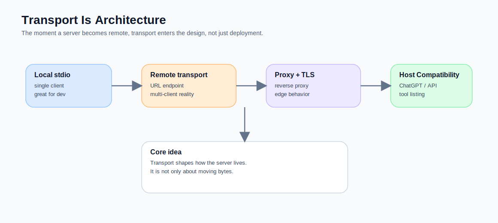
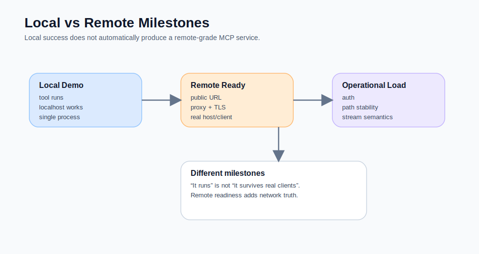
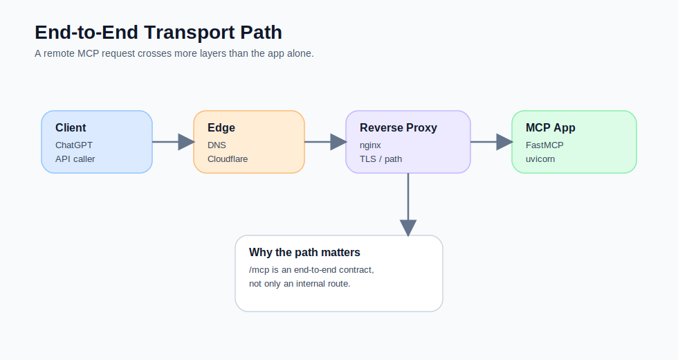
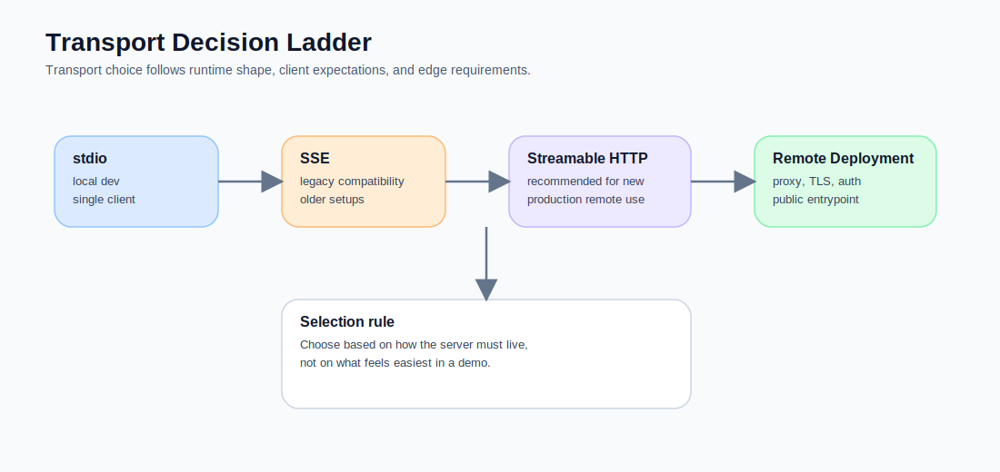

**副標：如果你把 transport 當成最後一哩，MCP 專案通常會在最醜的地方出問題。真正成熟的 remote server，從一開始就應該把 transport、proxy、session、client compatibility 一起想進去。**

很多人第一次接觸 MCP 時，最容易把 transport 想成這樣：

- 本地可以跑就好
- 之後再想怎麼對外
- 反正都是 HTTP
- 不行就加一層 proxy
- 最後接上 ChatGPT 就好了

這種想法非常自然，也非常危險。

因為 MCP 的 remote deployment 不是把本地 demo 多包一層網址而已。  
它真正改變的是：

- 誰在維持 session
- client 和 server 怎麼談 transport
- 哪些 header、path、auth、streaming 行為必須對齊
- reverse proxy 對整條連線語義的影響
- server 是不是已經準備好被**多個 client、跨網路、長時間地**存取

也就是說，**transport 不是最後一哩，它是一部分的協定設計。**



## 先講結論：如果你的 server 最後要給 ChatGPT、API client、或跨網路 host 用，就不要把 transport 想成附錄

MCP 官方文件本來就不是只把 transport 當成附帶選項。  
MCP 2025-03-26 的 changelog 明確把早期的 HTTP+SSE transport 演進成更彈性的 **Streamable HTTP transport**；FastMCP 現在也把 HTTP transport 視為 production remote deployment 的推薦路徑，而 SSE 則主要保留作 backward compatibility。OpenAI 這邊也很清楚：不論是在 ChatGPT Developer Mode 還是 Responses API，remote MCP server 目前都需要支援 **SSE 或 streaming/streamable HTTP** 其中之一。citeturn677151view5turn677151view4turn677151view3turn677151view1turn677151view2

這幾件事放在一起，其實已經告訴你一個工程現實：

> **只要你的 MCP server 目標不是本地 stdio，而是 remote URL，你就應該在一開始把 transport 當成第一等設計。**

## 先把三種情境分清楚，不然討論 transport 很容易混線

### 1. 本地 stdio server
這種 server 最適合：
- 本地開發
- 單一 client
- 本機 agent / CLI
- 不需要公開 URL

它的優點是快、簡單、少網路層。  
缺點是它根本不是 public remote service。

### 2. Remote server over Streamable HTTP
這是現在比較適合新部署的方向。

適合：
- 多 client
- 公開或受控的 URL 存取
- cloud-based host
- reverse proxy 與 auth 可以一起治理

FastMCP 的文件直接把 HTTP transport 描述成 production 部署推薦，因為 server 會作為獨立 web service 運行，自己管理 lifecycle。citeturn677151view4turn677151view3

### 3. SSE transport
SSE 並不是不能用。  
但如果你今天是新系統、可自己控制基礎設施，而且沒有特殊相容性包袱，我不會把它當成第一選擇。  
FastMCP 目前對 SSE 的定位已經很清楚：保留給 backward compatibility。citeturn677151view4

## 這也是為什麼「本機有跑」和「remote 已就緒」是兩個完全不同的里程碑

這是我很想寫進文章裡的一件事。

很多工程師在第一版會很自然地把 milestone 寫成這樣：

1. `@tool` 寫好了
2. 本地跑起來了
3. 接下來就是 deployment

但對 MCP 來說，這個思路太樂觀。  
因為「本地跑起來」頂多證明：

- Python code 沒死
- tool 註冊成功
- 某個 transport 在本機可用

它**完全沒有保證**：

- reverse proxy 不會破壞 path
- auth header 會被正確轉發
- host/client transport expectation 對得上
- session / connection 行為適合跨網路
- Cloudflare、nginx、TLS、origin 設定不會扭曲結果

也就是說，remote MCP server 的第一個真正里程碑，不該只是：

> **it runs**

而應該是：

> **it survives a real client over a real transport through a real network edge**



## 為什麼 remote deployment 會把原本看不見的問題放大

一台本地 stdio server，可以逃過很多現實。

例如：
- 沒有 DNS
- 沒有 TLS
- 沒有 reverse proxy
- 沒有跨網路 latency
- 沒有 edge/CDN
- 沒有 session persistence 的壓力
- 沒有來自不同 host / client 的 compatibility 差異

但一旦你變成 remote deployment，這些問題會全部浮上來。

### 問題 1：path 不再只是 path
在本地，你可能只管 `localhost:8000`。  
remote server 之後，path 可能變成：

```text
https://mcp.example.com/mcp
```

中間還多了：
- Cloudflare
- nginx
- path rewriting
- trailing slash 差異

所以 path 不再只是 app 內部 route，而是端到端 contract 的一部分。

### 問題 2：header 與 auth 真的會穿過很多層
到了 remote 世界，request headers 不再是「app 自己收到什麼」這麼簡單。  
它還取決於：
- edge 有沒有改
- proxy 有沒有帶
- auth scheme 是 bearer、OAuth，還是 mixed auth
- 某些 header 會不會不小心 leak 到 downstream APIs

這也是為什麼我很認同 FastMCP 後來在 auth / header handling 上持續補 production features。因為這真的不是小事。citeturn677151view10turn677151view11

### 問題 3：session 與 streaming 行為不再是本機假設
只要你是跨網路、長連線、多 client，transport 的 session 與 streaming 行為就會開始影響穩定性。  
MCP 官方 roadmap 甚至已經直接談到 Streamable HTTP 在 horizontal scaling、stateless operation、middleware patterns 這些面向還在持續補強，這本身就代表 transport 不是旁枝末節。citeturn635383search0

## 我現在的判準：Transport 選擇，本質上是「你想讓 server 怎麼活著」

這句話我覺得比「SSE 還是 HTTP 哪個比較新」有用得多。

### 如果你要的是：
- 本機開發
- 單 client
- 快速驗證
- 幾乎沒有邊界網路

那 stdio 很合理。

### 如果你要的是：
- 真正給 ChatGPT 或 API host 連
- 一個公開或半公開 URL
- 可經 reverse proxy、TLS、auth 管理
- 多 client / 多環境可重用

那 remote HTTP transport 應該從一開始就進設計。

這也是為什麼我對 transport 的理解，現在比較像是：

> **它不是連線方式而已，它是 server 的生存方式。**

## 一個最小但比較像 production 的 FastMCP 形狀

如果我要做一個比較健康的 remote server，我現在會傾向讓形狀長這樣：

```python
from fastmcp import FastMCP
from fastmcp.server.http import create_streamable_http_app

mcp = FastMCP("Example Gateway")

@mcp.tool
def healthcheck() -> dict:
    return {"ok": True}

app = create_streamable_http_app(
    server=mcp,
    streamable_http_path="/mcp",
)
```

然後用 `uvicorn` 只綁 loopback：

```bash
uvicorn mcp_server.app.server:app --host 127.0.0.1 --port 8000
```

再讓 nginx 對外提供：

```text
https://mcp.example.com/mcp
```

我喜歡這種形狀，不是因為它最炫，而是因為它讓職責很清楚：

- FastMCP：能力 surface
- uvicorn：app process
- nginx：public entry, TLS, reverse proxy
- Cloudflare / DNS：edge 與 name resolution

## reverse proxy 為什麼不是可有可無

很多人會問：  
「為什麼不直接把 app port 開到公網？」

理論上你可以。  
實務上，我越來越不喜歡這樣做。

因為一旦你有 reverse proxy，你就能比較清楚地做這些事：

- TLS termination
- 路徑固定，例如 `/mcp`
- 後續加 health endpoint
- 把 app 綁在 loopback
- 切開 public networking 與 app lifecycle

也就是說，reverse proxy 不是單純多一層，它是在幫你把「協定入口」和「app process」分離。



## 為什麼有些人 transport 沒想清楚，最後會把技能問題誤判成模型問題

這也是我很想提醒的一個點。

只要 transport / deployment 沒想清楚，最後很多問題都會被誤判成：

- 模型沒選對 tool
- skill instructions 不夠強
- description 寫不好
- ChatGPT 不穩定

但實際上，根本原因可能是：

- endpoint 根本沒穩定可達
- path rewrite 錯了
- proxy 沒正確帶 header
- auth 模式不對
- transport compatibility 沒對齊

也就是說，在 MCP 系統裡，**你以為是 prompt 問題的東西，有時候其實是 transport 問題。**

這也是為什麼我會把系列 B 的第一篇就先寫 transport。  
因為只要這個底盤沒想清楚，後面的 security、contracts、skills，都會長在會晃的地板上。

## 這篇最想留下的反例

我也想故意留一個反例，不讓這篇變成「每個人都該立刻 remote 化」。

**不是每一個 MCP server 都值得一開始就做 remote deployment。**

如果你現在還在：
- 驗證 tool surface
- 還沒整理 contract
- 只是在本地開發
- 只有單一 client

那先用 stdio 反而比較聰明。

remote deployment 的價值，不在於它比較進階。  
它的價值在於，當你真的需要：

- public URL
- host integration
- auth
- transport governance
- reverse proxy
- 多客戶端穩定存取

它才會變成正確的工程形狀。

## 我現在的工作判準

如果要把這篇濃縮成一句真的會影響設計決策的話，我會這樣說：

> **只要你目標是 remote MCP，transport 就不是部署附錄，而是 architecture decision。**

它會影響：
- server 入口怎麼設
- path 怎麼固定
- proxy 要不要存在
- auth 放哪一層
- host 相容性怎麼驗
- 你怎麼定義「ready for real clients」

## 下一篇會接著講 security，而不是急著講更多框架

Transport 之後，下一個最自然的題目就是 security / auth / public server hardening。

因為當你的 server 真正開始對外可達時，問題就不再只是：
- 能不能連
- 能不能 stream
- tools 能不能列出來

而是：

- 誰可以連
- 誰可以調哪個 tool
- 哪些 header 與 token 會穿過哪些層
- 怎麼避免把公開入口做成新的風險面

也就是說，transport 讓 server 活下來。  
security 才決定它能不能**安全地**活下來。


